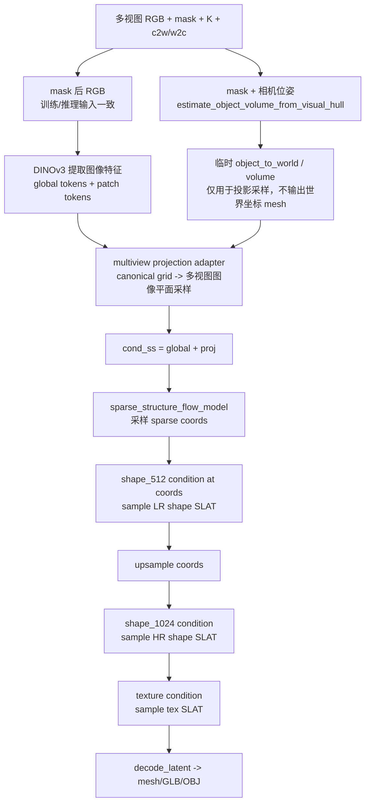

# 多视图稀疏结构五层测试报告

生成时间：2026-06-08  
项目目录：`/home/zjr/Tracker/pixal3d_multiview`  
当前 checkpoint：`/home/zjr/Tracker/pixal3d_multiview/outputs/train_v9/objaverse_5000_v9_select8_proj_only_e6/final.pt`

> Markdown 对字体和字号的支持取决于阅读器，不建议在报告里依赖固定字号。本文用标题层级、表格和 Mermaid 流程图保证可读性。

## 0. 当前目标和 Pipeline 总览

### 0.1 当前目标

当前模型目标不是直接估计 `T_M2W`，也不是替代 CoarseModel 的后续位姿优化。当前目标是：

输入多视图 RGB、mask、相机内参/外参，生成足够稳定的 canonical coarse sparse structure，再进入 Pixal3D/SLAT/mesh 阶段得到粗 mesh。后续真实世界中的 `T_M2W`、scale、pose 和 mesh 细化仍由 CoarseModel 处理。

当前测试重点：

- 数据集、相机、mask、target sparse 是否可靠。
- multiview condition adapter 是否语义合理。
- sparse checkpoint 是否真的学到了 denoising。
- pose、mask、visual hull 是否真的提供有效约束。
- sparse 质量是否足够进入 mesh 阶段。

### 0.2 推理 Pipeline 流程图

对应代码：

- 推理入口：`/home/zjr/Tracker/pixal3d_multiview/run_multiview.py`
- 多视图 pipeline：`/home/zjr/Tracker/pixal3d_multiview/pipeline.py`
- sparse condition：`/home/zjr/Tracker/pixal3d_multiview/sparse_condition.py`
- visual hull / projection：`/home/zjr/Tracker/pixal3d_multiview/multiview_projection.py`



### 0.3 各模块作用

| 模块 | 代码位置 | 作用 | 当前风险 |
|---|---|---|---|
| `load_manifest` | `run_multiview.py` | 读取多视图 RGB、mask、intrinsics、extrinsics | 相机方向、mask、图像裁剪必须和训练一致 |
| `estimate_object_volume_from_visual_hull` | `multiview_projection.py` | 用 mask + pose 临时估计物体所在体积 | 不是最终 `T_M2W`，只是内部投影参考体 |
| `DinoV3ProjFeatureExtractor` | `Pixal3D/.../image_conditioned_proj.py` | 提取 DINO global tokens 和 patch feature | global 正常，但 sparse projection 可能被 adapter 破坏 |
| `SparseMultiviewConditionBuilder` | `sparse_condition.py` | 把多视图特征投影/聚合到 sparse grid | 当前主要瓶颈，zero feature 比例过高 |
| `sample_sparse_structure` | `pipeline.py` / Pixal3D base | 根据 `cond_ss` 采样 sparse coords | 当前 sparse IoU 低，pose 影响弱 |
| `get_multiview_proj_cond_shape` | `pipeline.py` | 在 sparse/SLAT coords 上构建 shape/texture condition | 依赖前面 sparse coords 的质量 |
| `decode_latent` | Pixal3D base pipeline | 将 shape/texture SLAT 解码成 mesh | 目前 sparse 不稳，不建议过早得 mesh 结论 |

### 0.4 训练 Pipeline 只训练哪一段

当前训练脚本是：

`/home/zjr/Tracker/pixal3d_multiview/train_sparse_multiview.py`

它训练的是 sparse stage：

```text
target sparse latent x_0
  + noise, t
  -> x_t
  + cond_ss(global/proj)
  -> sparse_structure_flow_model 预测 velocity
  -> MSE fixed/flow matching loss
```

它没有训练 shape_512、shape_1024、texture，也没有直接训练 mesh。训练目标是让 sparse flow 在当前 multiview adapter condition 下更好地恢复 target sparse latent。

## 1. 第一层：数据和几何先验验收

### 1.1 测试什么

这一层检查训练数据本身是否可用。如果数据、相机、mask 或 target sparse 有系统性错位，后面的训练指标没有意义。

重点检查：

- 每个样本是否有 8 帧 selected views。
- mask 后 RGB 是否和训练/推理一致。
- target sparse coords 是否足够大，不是空或极薄。
- target sparse 投影到多视图 mask 后是否有足够 support。
- visual hull 是否为空，是否和 target 体积尺度相近。
- train/val 低纹理样本比例是否均衡。

### 1.2 使用的数据集

正式 v9 数据集：

`/data/pixal3d_multiview/objaverse_sparse_mv_artraj_pbr_5000_v9_select8`

| split | samples |
|---|---:|
| manifest | 1616 |
| train | 1488 |
| val | 128 |

视图设置：

| 项 | 值 |
|---|---:|
| candidate views | 24 |
| selected views | 8 |
| selection policy | `mask_pose_diverse` |

低纹理样本切分：

| 项 | 数量 |
|---|---:|
| total low_texture | 355 |
| train low_texture | 327 |
| val low_texture | 28 |

说明：train/val 低纹理比例已经用 stratified split 保持一致。

### 1.3 运行命令

```bash
cd /home/zjr/Tracker

/home/zjr/anaconda3/envs/reconviagen/bin/python -u \
  pixal3d_multiview/dataset_tools/check_multiview_sparse_data_quality.py \
  --manifest /data/pixal3d_multiview/objaverse_sparse_mv_artraj_pbr_5000_v9_select8/manifest.json \
  --output /home/zjr/Tracker/pixal3d_multiview/outputs/data_quality_checks/objaverse_5000_v9_select8_all \
  --max_frames 8 \
  --compute_visual_hull

/home/zjr/anaconda3/envs/reconviagen/bin/python -u \
  pixal3d_multiview/dataset_tools/check_multiview_sparse_data_quality.py \
  --manifest /data/pixal3d_multiview/objaverse_sparse_mv_artraj_pbr_5000_v9_select8/train.json \
  --output /home/zjr/Tracker/pixal3d_multiview/outputs/data_quality_checks/objaverse_5000_v9_select8_train \
  --max_frames 8 \
  --compute_visual_hull
```

数据质量报告：

- `/home/zjr/Tracker/pixal3d_multiview/outputs/data_quality_checks/objaverse_5000_v9_select8_all.md`
- `/home/zjr/Tracker/pixal3d_multiview/outputs/data_quality_checks/objaverse_5000_v9_select8_train.md`

### 1.4 当前结果

全体抽样 64 个样本：

| 指标 | mean | median | min | max |
|---|---:|---:|---:|---:|
| target_coords | 8151.86 | 7905.5 | 2520 | 23414 |
| fg_area_ratio_mean | 0.0556 | 0.0552 | 0.0107 | 0.1263 |
| projection_support_ratio_mean | 0.6791 | 0.6739 | 0.5077 | 0.9355 |
| projection_zero_support_ratio | 0.0853 | 0.0646 | 0.0000 | 0.2362 |
| outside_mask_nonzero_ratio_mean | 0.00238 | 0.00172 | 0.00089 | 0.0175 |
| visual_hull_occupied_ratio | 0.1152 | 0.1086 | 0.0193 | 0.3251 |

异常计数：

| 异常 | 数量 |
|---|---:|
| low_texture | 13 |
| flat_gray_blob | 0 |
| low_projection_support_flag | 0 |
| empty_or_tiny_target | 0 |
| bad_latent | 0 |
| tiny_mask | 0 |
| border_touch | 0 |
| visual_hull_empty | 0 |

### 1.5 如何阅读

- `projection_support_ratio_mean` 越高越好，表示 target sparse 投影到 mask 内的比例高。
- `projection_zero_support_ratio` 越低越好，表示几乎没有视图支持的 target 点少。
- `outside_mask_nonzero_ratio_mean` 越接近 0 越好，表示 mask 后图像和训练输入一致。
- `visual_hull_empty=0` 表示 mask + pose 能构建出有效 visual hull。

结论：数据集不是当前主要坏点。数据质量足够用于 sparse stage 微调，但仍有低纹理样本和部分 zero-support 比例偏高样本。

## 2. 第二层：adapter 语义验证

### 2.1 native proj 指什么

`native proj` 指 Pixal3D 原版 `DinoV3ProjFeatureExtractor` 产生的 `z_proj`，也就是 Pixal3D 原生单视图 sparse projection condition。

Pixal3D 原生 sparse condition 的输入是：

```text
单张 image
+ camera_angle_x
+ distance
+ mesh_scale
-> DINO patch features
-> ProjGrid 把 canonical 3D grid 投影到这张图上
-> z_proj: [1, grid_resolution^3, feature_dim]
```

代码在：

`/home/zjr/Tracker/Pixal3D/pixal3d/trainers/flow_matching/mixins/image_conditioned_proj.py`

Pixal3D 原生 pipeline 里调用方式在：

`/home/zjr/Tracker/Pixal3D/pixal3d/pipelines/pixal3d_image_to_3d.py`

关键语义：

```python
z_global, z_proj = image_cond_model(
    image,
    camera_angle_x=cam_angle,
    distance=dist_tensor,
    mesh_scale=scale_tensor,
)
cond = {"global": z_global, "proj": z_proj}
```

这里的 `z_proj` 是 Pixal3D sparse flow 预训练时看到的 projection feature 分布，所以它是当前 multiview adapter 的对照基准。

### 2.2 我们的 multiview proj 指什么

我们的 multiview adapter 不使用 Pixal3D 原生的固定单视图 `camera_angle_x/distance/mesh_scale`。它做的是：

```text
多视图 images + masks + intrinsics + extrinsics
-> visual hull 估计临时 object_to_world
-> canonical sparse grid points
-> 投影到每个视图
-> mask gating
-> front-depth visibility weighting
-> 多视图特征加权平均
-> cond["proj"]
```

对应代码：

- `train_sparse_multiview.py::make_multiview_condition`
- `sparse_condition.py::SparseMultiviewConditionBuilder`
- `multiview_projection.py::sample_features_multi_view`

注意：`object_to_world` 只用于内部投影采样，不是输出 mesh 的 `T_M2W`。pipeline 明确记录：

```text
mesh_output_space = pixal3d_canonical_object_space
object_volume_estimate is only used for internal projection sampling
```

### 2.3 为什么要测 native proj vs multiview proj

当前 sparse flow 的基础权重来自 Pixal3D。它原本适配的是 Pixal3D 原生 `z_proj` 分布。如果我们的 multiview `cond["proj"]` 和 native `z_proj` 分布差异极大，那么：

- 未微调 base 不能代表 Pixal3D 原版性能。
- 微调 checkpoint 即使 loss 降了，也可能只是适配了一个退化 adapter。
- pose 信息可能没有以强几何形式进入 sparse flow。

### 2.4 运行输出

补充测试输出：

`/home/zjr/Tracker/pixal3d_multiview/outputs/eval_v9/five_layer_supplement/condition_adapter_correct/summary.json`

### 2.5 当前结果

| 指标 | 数值 |
|---|---:|
| native global vs multiview first global cosine | 1.000000 |
| native proj vs multiview proj cosine | 0.086529 |
| native proj abs mean | 0.425913 |
| multiview proj abs mean | 0.025309 |
| native proj zero ratio | 0.000000 |
| multiview proj zero ratio | 0.904907 |
| multiview support mean | 0.108696 |
| multiview zero support mean | 3706.5 / 4096 |
| visibility nonzero ratio | 0.044617 |

### 2.6 如何阅读

- global cosine 为 1，说明同一张图的 DINO global tokens 没问题。
- proj cosine 只有 0.0865，说明当前 multiview projection feature 和 Pixal3D 原生 sparse condition 差异非常大。
- multiview proj zero ratio 约 90.5%，说明 16³ sparse grid 中大部分点没有有效投影特征。
- visibility nonzero ratio 只有 4.46%，说明 front-depth visibility 过滤后真正有权重的 grid 点更少。

结论：当前 adapter 的主要问题不是 DINO，而是 sparse grid 上的多视图投影过稀疏。原生 Pixal3D sparse flow 看到的是密集单视图投影特征；我们的 adapter 给它的是大量 zero feature 的多视图聚合特征。因此当前 checkpoint 即使训练后有提升，也很难充分利用 pose。

## 3. 第三层：训练有效性和 fixed loss

### 3.1 fixed loss 是什么意思

`fixed loss` 是一个诊断指标，不是最终生成质量指标。

当前 sparse flow 使用 flow matching 训练。训练时：

```text
target latent x_0
+ random noise
+ time t
-> noisy latent x_t
模型输入: x_t, t, cond
模型目标: 预测 velocity target
loss = MSE(pred_velocity, target_velocity)
```

`fixed loss` 做的是：固定 `t=0.5`，固定随机 seed 和样本集合，比较 base/checkpoint 在同一条件下的 velocity MSE。

它回答的问题是：

```text
checkpoint 是否比 base 更会做当前训练目标下的 denoising？
```

它不能直接回答：

```text
最终 sparse coords 是否好？
mesh 是否好？
pose 是否强约束？
```

这些必须看 sparse sampling 和消融。

### 3.2 训练 checkpoint 信息

| 项 | 值 |
|---|---|
| checkpoint | `/home/zjr/Tracker/pixal3d_multiview/outputs/train_v9/objaverse_5000_v9_select8_proj_only_e6/final.pt` |
| step | 8928 |
| epoch | 6 |
| train_manifest | `/data/pixal3d_multiview/objaverse_sparse_mv_artraj_pbr_5000_v9_select8/train.json` |
| max_frames | 8 |
| lr | 2e-5 |
| trainable | `proj_only` |
| cfg_drop_prob | 0.1 |
| amp_dtype | bf16 |

### 3.3 base vs checkpoint fixed loss

命令：

```bash
CUDA_VISIBLE_DEVICES=1 \
HF_HUB_OFFLINE=1 \
ATTN_BACKEND=flash_attn \
PYTORCH_CUDA_ALLOC_CONF=expandable_segments:True \
MPLCONFIGDIR=/tmp/matplotlib \
NUMBA_CACHE_DIR=/tmp/numba_cache \
/home/zjr/anaconda3/envs/reconviagen/bin/python -u \
  pixal3d_multiview/eval_fixed_train_loss.py \
  --train_manifest /data/pixal3d_multiview/objaverse_sparse_mv_artraj_pbr_5000_v9_select8/val.json \
  --checkpoint /home/zjr/Tracker/pixal3d_multiview/outputs/train_v9/objaverse_5000_v9_select8_proj_only_e6/final.pt \
  --output /home/zjr/Tracker/pixal3d_multiview/outputs/eval_v9/fixed_loss_val_final.json \
  --image_cond_model /home/zjr/Tracker/models/dinov3-vitl16-pretrain-lvd1689m \
  --max_frames 8 \
  --max_samples 128 \
  --fixed_t 0.5 \
  --amp_dtype bf16
```

结果：

| split | base mean | checkpoint mean | 相对变化 | improved |
|---|---:|---:|---:|---:|
| train 128 | 0.21447 | 0.19528 | -8.95% | 128/128 |
| val 128 | 0.21420 | 0.19368 | -9.58% | 128/128 |

如何阅读：

- fixed loss 下降表示 checkpoint 在当前 adapter 条件下确实更会做 denoising。
- train/val 都下降，说明不是纯 train overfit。
- 但 fixed loss 不是最终 sparse/mesh 质量。

### 3.4 fixed loss 几何消融

测试什么：

固定 `t=0.5`、固定 val 前 64 个样本，只评估当前 checkpoint。通过破坏/关闭不同几何条件，看 loss 是否明显变化。

输出：

`/home/zjr/Tracker/pixal3d_multiview/outputs/eval_v9/five_layer_supplement/fixed_loss_ablation`

结果：

| 配置 | checkpoint loss mean | 相对 correct 变化 |
|---|---:|---:|
| correct | 0.210774 | 0.0000 |
| shuffle_pose | 0.210814 | +0.0002 |
| identity_pose | 0.209395 | -0.0065 |
| no_auto_volume | 0.212991 | +0.0105 |
| no_visibility_depth | 0.213996 | +0.0153 |
| no_apply_mask | 0.210781 | +0.0000 |

配置含义：

| 配置 | 含义 |
|---|---|
| `correct` | 图像、mask、pose 都保持正确对应 |
| `shuffle_pose` | 图像/mask 不动，打乱 view 对应的 extrinsics |
| `identity_pose` | 图像/mask 不动，所有 extrinsics 设成单位阵 |
| `no_auto_volume` | 不用 visual hull 自动估计临时 object volume |
| `no_visibility_depth` | 不用 visual-hull front-depth visibility 权重 |
| `no_apply_mask` | 不把 RGB 背景乘 mask 置黑 |

如何阅读：

- 如果 pose 是强约束，`shuffle_pose` 或 `identity_pose` 应该明显变差。
- 实际上 `shuffle_pose` 几乎不变，`identity_pose` 甚至略低。
- `no_auto_volume` 和 `no_visibility_depth` 有 1% 到 1.5% 的 loss 上升，说明 visual hull 体积估计和 visibility 有一点贡献，但贡献很弱。

结论：训练有效，但 fixed-loss 层面不能证明当前 checkpoint 强依赖正确相机位姿。模型目前更像是在利用图像/数据先验和少量 visual-hull 体积约束，而不是强使用多视图 pose 对应。

## 4. 第四层：sparse sampling 消融和 Visual Hull hard filter

### 4.1 sparse sampling 消融在做什么

`sparse sampling` 是把 sparse flow 真正跑一遍采样，得到预测 sparse coords，然后和 target coords 比较。

它回答的问题是：

```text
模型实际生成的 coarse sparse structure 是否接近 target？
正确 pose 是否比错误 pose 更好？
关闭 visual hull / visibility 后 sparse 输出如何变化？
```

它比 fixed loss 更接近真实推理，因为 fixed loss 只测一步 denoising MSE，而 sparse sampling 会经过完整采样过程再 decode 成 coords。

核心指标：

| 指标 | 含义 |
|---|---|
| `IoU` | pred coords 和 target coords 的集合交并比，越高越好 |
| `target_recall` | target 中有多少被 pred 覆盖，越高越好 |
| `pred_precision` | pred 中有多少是真的 target，越高越好 |
| `pred_unique` | 预测 sparse 点数量 |
| `target_unique` | target sparse 点数量 |

可视化说明：

- 蓝色：target sparse coords。
- 黄色：模型预测 sparse coords。
- 三个 panel 是三个坐标平面的投影。
- 黄色越接近蓝色，sparse 结构越好。
- 如果黄色很多但散、外扩、偏移，说明 recall 可能升高但 precision/几何质量仍差。

### 4.2 base vs checkpoint sparse sampling

命令：

```bash
CUDA_VISIBLE_DEVICES=1 \
HF_HUB_OFFLINE=1 \
ATTN_BACKEND=flash_attn \
PYTORCH_CUDA_ALLOC_CONF=expandable_segments:True \
MPLCONFIGDIR=/tmp/matplotlib \
NUMBA_CACHE_DIR=/tmp/numba_cache \
/home/zjr/anaconda3/envs/reconviagen/bin/python -u \
  pixal3d_multiview/eval_sparse_sampling_batch.py \
  --manifest /data/pixal3d_multiview/objaverse_sparse_mv_artraj_pbr_5000_v9_select8/val.json \
  --checkpoint /home/zjr/Tracker/pixal3d_multiview/outputs/train_v9/objaverse_5000_v9_select8_proj_only_e6/final.pt \
  --output_dir /home/zjr/Tracker/pixal3d_multiview/outputs/eval_v9/sparse_sampling_batch_val_32_steps30 \
  --image_cond_model /home/zjr/Tracker/models/dinov3-vitl16-pretrain-lvd1689m \
  --indices 0-31 \
  --max_frames 8 \
  --steps 30 \
  --seed 1234
```

32 个 val 样本，30 steps：

| 指标 | base | checkpoint |
|---|---:|---:|
| mean IoU | 0.0094 | 0.0405 |
| mean target recall | 0.0105 | 0.0657 |
| mean pred precision | 0.1215 | 0.1210 |
| mean pred coords | 654 | 5027 |
| mean target coords | 9109 | 9109 |

逐样本胜率：

| 指标 | checkpoint 胜率 |
|---|---:|
| IoU | 30/32 |
| target recall | 31/32 |
| pred precision | 18/32 |

9 个 val 样本，50 steps：

| 指标 | base | checkpoint |
|---|---:|---:|
| mean IoU | 0.0104 | 0.0532 |
| mean target recall | 0.0159 | 0.1006 |
| mean pred precision | 0.1430 | 0.1362 |
| mean pred coords | 762 | 5935 |

可视化：

- `/home/zjr/Tracker/pixal3d_multiview/outputs/eval_v9/sparse_sampling_batch_val_9/base_vs_checkpoint_sparse_preview_grid.png`
- `/home/zjr/Tracker/pixal3d_multiview/outputs/eval_v9/sparse_sampling_batch_val_32_steps30/base_vs_checkpoint_sparse_preview_grid_compact.png`

结论：checkpoint 比 base 有明显进步，但结果仍不好。它主要从“几乎没有结构”变成“有粗糙结构”，不是稳定物体几何。

### 4.3 pose / visual hull / visibility sparse sampling 消融

测试 indices：

`0,1,5,10,20,30,50,80,100`

每个配置采样 30 steps。

输出：

`/home/zjr/Tracker/pixal3d_multiview/outputs/eval_v9/five_layer_supplement/sparse_sampling_ablation`

结果：

| 配置 | IoU | recall | precision | pred_unique | dIoU vs correct |
|---|---:|---:|---:|---:|---:|
| correct | 0.049622 | 0.093494 | 0.132837 | 5544.9 | 0.000000 |
| shuffle_pose | 0.045545 | 0.087291 | 0.127425 | 5526.6 | -0.004077 |
| no_auto_volume | 0.049579 | 0.120882 | 0.086176 | 11756.4 | -0.000043 |
| no_visibility_depth | 0.049367 | 0.095128 | 0.102925 | 7234.8 | -0.000255 |

如何阅读：

- `shuffle_pose` 比 correct 略差，说明 pose 有一点点影响。
- 但 IoU 只下降约 0.004，不足以说明 pose 是强约束。
- `no_auto_volume` 的 recall 上升、precision 大幅下降、预测点数翻倍，说明 auto volume/visibility 的作用更多是抑制外扩，而不是精确恢复几何。
- `no_visibility_depth` 的 IoU 几乎不变，但 precision 下降，说明 front-depth visibility 有一定去噪作用。

结论：sparse sampling 层面，当前 checkpoint 确实比未微调 base 更好，但正确 pose 相比错误 pose 的优势很弱。当前 sparse 质量仍不足以进入可靠 mesh 结论。

### 4.4 Visual hull hard filter 在代码里的作用是什么

`Visual hull hard filter` 不是训练代码里的默认模块，也不是当前 pipeline 的默认后处理。它是一个诊断脚本：

`/home/zjr/Tracker/pixal3d_multiview/eval_sparse_visual_hull_filter.py`

它做的事情是：

```text
已经采样出的 pred sparse coords
+ mask + pose 构建 visual hull score/support/visible grid
-> 删除不满足 visual hull support 阈值的 pred coords
-> 得到 filtered pred coords
-> 比较 raw vs filtered 的 IoU/recall/precision
```

它回答的问题是：

```text
如果直接用 visual hull 当硬裁剪，能不能修复 sparse 外扩？
```

它和 pipeline 中的 visual hull 不同：

| 位置 | 作用 |
|---|---|
| `pipeline.py` / `train_sparse_multiview.py` 中的 visual hull | 估计临时 object volume，提供投影参考和 visibility weighting |
| `eval_sparse_visual_hull_filter.py` | 评测后处理诊断，硬删除预测 sparse coords |

### 4.5 Visual hull hard filter 结果

旧 50-step 诊断：

| 指标 | raw checkpoint | VH-filtered |
|---|---:|---:|
| mean IoU | 0.0532 | 0.0338 |
| mean target recall | 0.1006 | 0.0416 |
| mean pred precision | 0.1362 | 0.1967 |
| mean pred coords | 5935 | 1585 |

同批补充 30-step 复核：

输出：

- `/home/zjr/Tracker/pixal3d_multiview/outputs/eval_v9/five_layer_supplement/visual_hull_filter_correct/summary.json`
- `/home/zjr/Tracker/pixal3d_multiview/outputs/eval_v9/five_layer_supplement/visual_hull_filter_correct/visual_hull_filter_grid.png`

| 指标 | raw | VH-filtered |
|---|---:|---:|
| mean IoU | 0.049622 | 0.031458 |
| mean target recall | 0.093494 | 0.038026 |
| mean pred precision | 0.132837 | 0.198370 |
| mean keep ratio | 1.000000 | 0.303430 |

逐样本改善：

| 指标 | 变好数量 |
|---|---:|
| IoU | 1/9 |
| precision | 8/9 |
| recall | 0/9 |

结论：visual hull hard filter 确实能提高 precision，但会严重损伤 recall 和 IoU。它适合做 soft prior 或训练输入，不适合直接作为采样后硬裁剪。

## 5. 第五层：mesh 阶段测试

### 5.1 测试什么

第五层应该测试 sparse coords 是否足够进入 SLAT/mesh 阶段，包括：

- sparse coords -> SLAT -> mesh。
- mesh normal preview。
- mesh color preview。
- mesh 与 GT mesh 的 Chamfer/F-score。
- 多视图 mask reprojection IoU。
- 对真实 GOOD_MESH_TEST，检查 silhouette 和 CoarseModel 后续收敛。

### 5.2 当前状态

当前不建议进入正式 mesh 阶段测试。原因：

- adapter projection feature 90.5% 为 zero，说明 sparse condition 本身仍有结构性问题。
- correct pose 和 shuffled pose 差距很小，说明 pose 约束没有变成强几何约束。
- checkpoint sparse IoU 约 0.05，距离稳定 mesh 所需的 sparse 质量仍偏低。
- visual hull hard filter 不能补救 sparse 输出，只能提高 precision、牺牲 recall。

### 5.3 进入 mesh 阶段前的建议门槛

| 指标 | 建议门槛 |
|---|---:|
| val mean IoU | 明显高于 0.10 |
| val recall@2 voxel | 明显高于 0.30 |
| pred coords / target coords | 大致稳定在 0.6 到 1.5 |
| 可视化 | 主轮廓和 target 大致贴合，无大面积外扩 |

当前 v9 还没达到。

## 6. 关键代码和结果文件索引

### 6.1 代码

| 功能 | 文件 |
|---|---|
| 推理入口 | `/home/zjr/Tracker/pixal3d_multiview/run_multiview.py` |
| multiview Pixal3D pipeline | `/home/zjr/Tracker/pixal3d_multiview/pipeline.py` |
| 数据构建 | `/home/zjr/Tracker/pixal3d_multiview/dataset_tools/build_objaverse_multiview_sparse_data.py` |
| PBR 渲染 | `/home/zjr/Tracker/pixal3d_multiview/dataset_tools/blender_pbr_render_multiview.py` |
| 数据质量检查 | `/home/zjr/Tracker/pixal3d_multiview/dataset_tools/check_multiview_sparse_data_quality.py` |
| sparse 训练 | `/home/zjr/Tracker/pixal3d_multiview/train_sparse_multiview.py` |
| multiview condition | `/home/zjr/Tracker/pixal3d_multiview/sparse_condition.py` |
| visual hull / projection | `/home/zjr/Tracker/pixal3d_multiview/multiview_projection.py` |
| adapter 分布测试 | `/home/zjr/Tracker/pixal3d_multiview/eval_condition_adapter_stats.py` |
| fixed loss eval | `/home/zjr/Tracker/pixal3d_multiview/eval_fixed_train_loss.py` |
| sparse sampling batch eval | `/home/zjr/Tracker/pixal3d_multiview/eval_sparse_sampling_batch.py` |
| VH hard filter eval | `/home/zjr/Tracker/pixal3d_multiview/eval_sparse_visual_hull_filter.py` |

### 6.2 结果文件

| 内容 | 路径 |
|---|---|
| 补充测试总汇总 JSON | `/home/zjr/Tracker/pixal3d_multiview/outputs/eval_v9/five_layer_supplement/summary.json` |
| 补充测试总汇总 MD | `/home/zjr/Tracker/pixal3d_multiview/outputs/eval_v9/five_layer_supplement/summary.md` |
| adapter 分布 | `/home/zjr/Tracker/pixal3d_multiview/outputs/eval_v9/five_layer_supplement/condition_adapter_correct/summary.json` |
| fixed loss 消融 | `/home/zjr/Tracker/pixal3d_multiview/outputs/eval_v9/five_layer_supplement/fixed_loss_ablation` |
| sparse sampling 消融 | `/home/zjr/Tracker/pixal3d_multiview/outputs/eval_v9/five_layer_supplement/sparse_sampling_ablation` |
| VH hard filter 复核 | `/home/zjr/Tracker/pixal3d_multiview/outputs/eval_v9/five_layer_supplement/visual_hull_filter_correct/summary.json` |
| VH hard filter 可视化 | `/home/zjr/Tracker/pixal3d_multiview/outputs/eval_v9/five_layer_supplement/visual_hull_filter_correct/visual_hull_filter_grid.png` |

## 7. 当前总判断

v9 checkpoint 不是完全失败。它在当前 multiview adapter 下确实比未微调权重更适配：

- fixed loss 在 train/val 都下降约 9%。
- sparse sampling IoU/recall 对 base 有稳定提升。
- sparse 采样从“几乎没有结构”变成“有粗糙结构”。

但当前结果还不能证明方法已经能生成好的 mesh：

- 当前 base 不是 Pixal3D 原版完整 pipeline baseline。
- adapter projection feature 90.5% 为 zero，说明 condition 结构严重稀疏。
- fixed loss 对 `shuffle_pose` 和 `identity_pose` 不敏感。
- sparse sampling 中 correct pose 只比 shuffle pose 略好。
- visual hull hard filter 不能直接解决 sparse 外扩问题。

最终结论：

**当前 multiview sparse checkpoint 有训练收益，但相机位姿约束仍然偏弱；主要瓶颈是 multiview projection adapter 产生了过多 zero feature，导致 Pixal3D sparse flow 很难把 pose 当作强几何条件使用。**

## 8. 下一步建议

当前更合理的下一步不是直接接 SLAT/mesh，而是先修 sparse condition：

1. 降低 multiview projection 的 zero-support 比例。
2. 不要只把 unsupported grid 点置零；需要引入 `support / visible / vh_score / depth confidence` 作为额外 soft channels 或 gating signal。
3. 区分“真实零特征”和“无观测”，避免 sparse flow 把大量无观测点当成有效特征。
4. 训练时显式加入 pose corruption ablation，让 correct pose 与 wrong pose 在 loss 上拉开差距。
5. 重新评估 `correct / shuffle_pose / identity_pose / no_auto_volume / no_visibility_depth`，直到 correct pose 在 fixed loss 和 sparse sampling 上都明显优于 wrong pose。
6. sparse 可视化达到门槛后，再进入 mesh/SLAT 阶段。

## 9. 修改计划和消融记录

### 9.1 2026-06-08 09:32:29 UTC：建议1，先去掉大量 zero projected feature

本次优先修改 `multiview_projection.sample_features_multi_view()`，目标是让 multi-view projected features 更接近 Pixal3D 原版投影分布。

原问题：

- 原版 Pixal3D 的 `ProjGrid` 使用 `grid_sample(..., padding_mode="border")`，即使 3D query point 投影出图，也会从图像边界采样 feature。
- 当前 multi-view adapter 默认 `empty_policy="zero"`，当一个 3D query point 在所有视角中都没有 mask/visibility support 时，会得到全 0 feature。
- 五层测试中 `multiview_proj_zero_ratio_mean` 约 0.905，说明 sparse flow 输入分布明显偏离原版 Pixal3D。

本次修改策略：

- 保留旧策略 `empty_policy="zero"`，作为严格对照。
- 新增 `empty_policy="soft"`：有 mask/visibility support 时使用 pose/mask 加权特征；support 低或为 0 时回退到 image/border sampled feature，避免直接全 0。
- 新增 `fallback_weight` 控制 fallback feature 强度。
- 新增 `support_confidence_power` 控制 support confidence 的软混合曲线。
- 置信度先作为 soft gating 使用，不直接拼接到 `proj` channel，避免改变 Pixal3D flow 的输入维度。

预期判断：

- `zero_support` 或 projected feature 的 zero ratio 应明显下降。
- `raw_zero_support` 仍记录原始 mask/visibility 的 unsupported 点数，用来判断几何支持本身是否改善。
- 如果 `soft` 只降低 zero feature 但 correct/shuffle 仍无差异，说明还需要下一步改 `z_global` fusion 或加入显式 pose corruption 训练。

本次消融需要至少跑：

- adapter condition 分布测试：验证 zero feature 是否下降。
- fixed loss correct/shuffle 测试：验证 pose 是否更敏感。
- sparse sampling correct/shuffle 测试：验证 sampled coords 是否更贴近 target。

#### 9.1.1 2026-06-09 00:53:16 UTC：建议1结果，`empty_policy=soft`

测试结果目录：

`pixal3d_multiview/outputs/eval_v9/projection_fallback_ablation_001`

本次测试使用 v9 val 数据，当前 checkpoint 为：

`pixal3d_multiview/outputs/train_v9/objaverse_5000_v9_select8_proj_only_e6/final.pt`

**Adapter condition 分布**

| 指标 | `zero` | `soft` | 说明 |
|---|---:|---:|---|
| `multiview_proj_zero_ratio_mean` | 0.9049 | 0.0000 | `soft` 已去掉 projected feature 大面积全 0 |
| `native_first_proj_vs_multiview_proj_cos_mean` | 0.0865 | 0.9210 | `soft` 后 multi-view proj 分布明显接近 Pixal3D 原版单视图投影 |
| `multiview_proj_abs_mean` | 0.0253 | 0.3638 | 特征幅值从接近 0 恢复到正常范围 |
| `raw_zero_support_mean` | 3706.5 | 3706.5 | 原始 mask/visibility 几何支持没有变强 |
| `fallback_points_mean` | 0.0 | 3706.5 | `soft` 主要是在无 support 点使用 fallback feature |
| `support_confidence_mean` | 0.0136 | 0.0136 | 有效几何支持仍然很稀疏 |

解释：

`soft` 成功修复了一个很大的接口分布问题：原版 Pixal3D sparse flow 很少看到整片全 0 的 projected feature，而旧 multi-view adapter 会让约 90% grid point 变成全 0。  
但 `raw_zero_support_mean` 没有下降，说明 mask / pose / visibility 本身覆盖到的 grid point 仍然少。也就是说，第一步只是让 unsupported point 不再以“异常全 0 特征”进入网络，并没有让相机位姿约束天然变强。

**Fixed loss**

| 条件 | `loss_mean` | `loss_median` |
|---|---:|---:|
| `zero + correct` | 0.2108 | 0.1868 |
| `zero + shuffle` | 0.2108 | 0.1857 |
| `zero + identity` | 0.2094 | 0.1867 |
| `soft + correct` | 0.2165 | 0.1894 |
| `soft + shuffle` | 0.2161 | 0.1895 |
| `soft + identity` | 0.2163 | 0.1936 |

解释：

当前 checkpoint 是在旧条件分布上训练的，直接切到 `soft` 后 fixed loss 略升是合理的，属于训练/推理条件不一致。更关键的是：`correct / shuffle / identity` 的 loss 差距仍然很小，说明 sparse denoiser 还没有把 pose 当成强约束。

**Sparse sampling**

| 条件 | checkpoint IoU | target recall | pred precision | pred unique |
|---|---:|---:|---:|---:|
| `zero + correct` | 0.0496 | 0.0935 | 0.1328 | 5544.9 |
| `zero + shuffle` | 0.0455 | 0.0873 | 0.1274 | 5526.6 |
| `soft + correct` | 0.0510 | 0.0828 | 0.1346 | 4524.2 |
| `soft + shuffle` | 0.0523 | 0.0993 | 0.1155 | 5897.3 |

解释：

`soft + correct` 相比 `zero + correct` 的 IoU 和 precision 只有小幅提升，recall 反而下降；同时 `soft + shuffle` 的 IoU 还略高于 `soft + correct`。这说明第一步不能单独证明 pose 约束有效，最多说明 projected feature 的输入分布被修正了。

**结论**

建议1是必要的，因为它解决了 multi-view adapter 与 Pixal3D 原版 sparse flow 之间的明显分布错配；但它不是充分条件。后续需要在 `soft` 条件下重新训练，并继续检查 `z_global` 多视角融合、projection support 置信度、pose corruption 训练目标，直到 correct pose 在 fixed loss 和 sparse sampling 上稳定优于 wrong pose。

### 9.2 2026-06-09 01:20:44 UTC：建议2，修正多视角 `z_global` 融合

测试结果目录：

`pixal3d_multiview/outputs/eval_v9/global_fusion_ablation_001`

本次代码修改位置：

- `pixal3d_multiview/condition_utils.py`
- `pixal3d_multiview/sparse_condition.py`
- `pixal3d_multiview/pipeline.py`
- `pixal3d_multiview/train_sparse_multiview.py`
- `pixal3d_multiview/eval_condition_adapter_stats.py`
- `pixal3d_multiview/eval_fixed_train_loss.py`
- `pixal3d_multiview/eval_sparse_sampling_batch.py`
- `pixal3d_multiview/sample_sparse_checkpoint.py`
- `pixal3d_multiview/run_multiview.py`

原问题：

当前 multi-view adapter 把每个视角的 DINO global token 直接串联：

```python
z_global = torch.cat([z_clstoken, z_regtokens], dim=1).reshape(1, -1, C)
```

如果输入 8 张图，每张图有 1 个 cls token 和 4 个 register token，那么 `z_global` 会从 Pixal3D 原版的 `[1, 5, C]` 变成 `[1, 40, C]`。这不一定错误，但它改变了 sparse flow 的 global condition token 数量。对于原版 Pixal3D 权重或只轻微微调的 checkpoint，这可能是额外分布偏移。

本次新增参数：

```bash
--global_fusion concat  # 旧行为，V 个视角的 global token 直接串联
--global_fusion mean    # 多视角 global token 按视角平均，回到 Pixal3D 原版 token 数
--global_fusion first   # 只使用第一视角 global token，用作对照
```

本轮测试只比较 `concat` 和 `mean`，并固定 `empty_policy=soft`。注意：当前 checkpoint 仍然是在旧 `concat + zero/旧条件` 分布上训练过的，因此这次测试只能判断接口兼容性和短期采样变化，不能代表 `mean + soft` 重新训练后的最终效果。

**Adapter condition 分布**

| 指标 | `soft + concat` | `soft + mean` | 说明 |
|---|---:|---:|---|
| `global_token_count_mean` | 40.0 | 5.0 | `mean` 把 global token 数恢复到 Pixal3D 原版规模 |
| `native_first_global_vs_multiview_first_global_cos_mean` | 1.0000 | 0.9776 | `mean` 是多视角平均，因此不再完全等于第一视角 global token |
| `native_first_proj_vs_multiview_proj_cos_mean` | 0.9210 | 0.9210 | projected feature 不受 global fusion 影响 |
| `multiview_proj_zero_ratio_mean` | 0.0000 | 0.0000 | 仍由 `empty_policy=soft` 负责去除全 0 feature |
| `support_confidence_mean` | 0.0136 | 0.0136 | 几何 support 本身没有变化 |

解释：

`global_fusion=mean` 按预期把 global token 数从 40 降回 5，减少了与 Pixal3D 原版 sparse flow 的 token 数分布差异。它不改变 projected feature、mask support 或 visibility support，所以它不是几何约束本身，只是 global condition 的接口修正。

**Fixed loss，32 个 val 样本**

| 条件 | `loss_mean` | `loss_median` |
|---|---:|---:|
| `concat + correct` | 0.2207 | 0.1947 |
| `concat + shuffle` | 0.2201 | 0.1939 |
| `mean + correct` | 0.2206 | 0.1944 |
| `mean + shuffle` | 0.2200 | 0.1937 |

解释：

fixed loss 下 `correct` 与 `shuffle` 仍然没有拉开；`shuffle` 甚至略低。这说明仅在旧 checkpoint 上切换 global fusion，不足以让 sparse denoiser 立刻对 pose 产生强敏感性。要验证 `mean + soft` 是否真正有效，仍需要用这套新条件重新训练。

**Sparse sampling，5 个 val 样本，20 steps**

| 条件 | checkpoint IoU | target recall | pred precision | pred unique |
|---|---:|---:|---:|---:|
| `concat + correct` | 0.0412 | 0.0616 | 0.1352 | 4801.2 |
| `concat + shuffle` | 0.0342 | 0.0514 | 0.1022 | 5420.2 |
| `mean + correct` | 0.0464 | 0.0682 | 0.1706 | 4717.4 |
| `mean + shuffle` | 0.0360 | 0.0531 | 0.1089 | 5154.2 |

解释：

在这个小样本 sparse sampling 上，`mean + correct` 比 `concat + correct` 略好，并且 `correct` 明显高于 `shuffle`。这是一个正向信号：把 global token 数恢复到 Pixal3D 原版规模后，采样阶段的姿态扰动差距略微变清楚。  
但这个结论还不够强，因为 fixed loss 没有支持同样结论，而且样本数只有 5 个。它更适合作为“下一轮训练配置应优先使用 `soft + mean`”的依据，而不是证明当前模型已经解决 pose 约束问题。

**结论**

建议2是合理的兼容性修正：`global_fusion=mean` 更接近 Pixal3D 原版 sparse flow 的 global token 形状，并在小规模 sparse sampling 中比旧 `concat` 有轻微优势。  
下一轮训练建议使用：

```bash
--empty_policy soft \
--global_fusion mean \
--cfg_drop_prob 0.0 或较小值 \
```

并加入显式 wrong-pose 对照训练/评估。判断是否真正有效，不能只看 fixed MSE loss，还必须看 `correct > shuffle/identity` 是否在 sparse sampling 上稳定成立。

### 9.3 2026-06-09 02:34:10 UTC：`soft + mean` 继续训练结果

训练输出目录：

`pixal3d_multiview/outputs/train_v9/objaverse_5000_v9_select8_soft_mean_from_e6_to_e10`

评估输出目录：

- `pixal3d_multiview/outputs/eval_v9/soft_mean_e10`
- `pixal3d_multiview/outputs/eval_v9/soft_mean_e10_step9000`

训练配置：

```bash
--resume pixal3d_multiview/outputs/train_v9/objaverse_5000_v9_select8_proj_only_e6/final.pt
--lr 1e-5
--trainable proj_only
--cfg_drop_prob 0.0
--empty_policy soft
--global_fusion mean
--fallback_weight 1.0
--support_confidence_power 1.0
```

训练文件：

- `step_9000.pt`
- `step_10000.pt`
- `last.pt`
- `final.pt`

注意：

这次训练不是完整的 e6 到 e10 四个 epoch。旧 checkpoint 的 step 是 8928，训练脚本默认 `--max_steps=10000`，因此实际只继续训练到 step 10000，多训约 1072 step。`final.pt` 里记录的 epoch=10 来自 `--max_epochs 10`，不能理解成真的完成了 10 个 epoch。

**Fixed loss，32 个 val 样本，`final.pt`**

| checkpoint | pose | `loss_mean` | `loss_median` |
|---|---|---:|---:|
| e6，上一轮 `mean + soft` | correct | 0.2206 | 0.1944 |
| e6，上一轮 `mean + soft` | shuffle | 0.2200 | 0.1937 |
| e10 final | correct | 0.2160 | 0.1903 |
| e10 final | shuffle | 0.2156 | 0.1901 |
| e10 final | identity | 0.2170 | 0.1950 |

解释：

继续训练后 fixed loss 有下降，说明模型确实继续适配了 `soft + mean` 条件。但这个指标仍然没有显示出可靠 pose 敏感性：`shuffle` 的 loss 仍略低于 `correct`，`identity` 只略高一点。  
因此 fixed loss 的下降不能直接解释为“相机位姿约束变强”。

**Sparse sampling，5 个 val 样本，20 steps**

| checkpoint | pose | IoU | target recall | pred precision | pred unique |
|---|---|---:|---:|---:|---:|
| e6，上一轮 `mean + soft` | correct | 0.0464 | 0.0682 | 0.1706 | 4717.4 |
| e6，上一轮 `mean + soft` | shuffle | 0.0360 | 0.0531 | 0.1089 | 5154.2 |
| step_9000 | correct | 0.0421 | 0.0583 | 0.1732 | 3928.6 |
| step_9000 | shuffle | 0.0346 | 0.0495 | 0.1134 | 4673.6 |
| final / step_10000 | correct | 0.0225 | 0.0280 | 0.1949 | 2664.8 |
| final / step_10000 | shuffle | 0.0302 | 0.0398 | 0.1240 | 3710.4 |

解释：

`step_9000` 还保留了 `correct > shuffle` 的趋势，但已经没有超过 e6。继续到 `final / step_10000` 后，sparse sampling 明显变差：

- correct IoU 从 e6 的 0.0464 降到 0.0225。
- correct recall 从 0.0682 降到 0.0280。
- pred unique 从 4717.4 降到 2664.8，说明输出 sparse coords 明显收缩。
- final 中 shuffle IoU 反而高于 correct，说明 pose 约束没有稳定变强。

这说明当前继续训练主要优化了 denoising MSE，但没有优化最终 thresholded sparse coords 的几何质量；甚至在 sampling 结果上出现了退化。

**本轮结论**

`soft + mean` 作为条件结构修正仍然合理，但直接从旧 e6 checkpoint 继续训练并没有带来更好的 sparse sampling。当前最重要的结论是：

1. `final.pt` 不建议作为当前 mesh/sparse 生成的首选 checkpoint。
2. 如果只在这次分支里选，`step_9000.pt` 比 `final.pt` 更合理，但它仍不如旧 e6 的 sparse sampling 指标。
3. fixed loss 不能作为主要选点指标；必须以 sparse sampling 的 IoU / recall / correct-vs-shuffle 差距做早停和 checkpoint 选择。
4. 后续训练不能只继续降低 MSE，需要加入更直接的 sparse 结构评价或训练约束。

**下一步建议**

下一步不建议继续盲目把 `final.pt` 往后训练。更合理的是：

- 加入 periodic validation：每隔固定 step 自动跑小规模 sparse sampling，保存 best-by-IoU checkpoint。
- 对 `correct / shuffle / identity` 做显式对照，训练目标或选择标准必须让 correct pose 优于 wrong pose。
- 尝试从 Pixal3D 原始 sparse flow 或更早 checkpoint 直接用 `soft + mean` 训练，而不是从已经适配旧 `zero/concat` 条件的 e6 checkpoint 继续。
- 如果继续从 e6 微调，先用更小学习率和更短 step，例如 `lr=2e-6`、每 200 step 做 sparse sampling 早停。

### 9.4 2026-06-09 02:50:00 UTC：下一轮训练计划和命令

本轮目标不是直接追求更低 train loss，而是回答两个问题：

1. `soft + mean` 条件是否存在一个 sparse sampling 变好的 checkpoint。
2. 如果从旧 e6 checkpoint 迁移会退化，那么从 Pixal3D 原始 sparse flow 开始训练是否更干净。

判断标准：

- 主要看 `sparse sampling`，不是只看 fixed loss。
- 需要 `correct_iou > shuffle_iou`。
- 需要 `correct_recall` 不明显下降。
- 需要 `pred_unique` 不出现明显收缩。
- checkpoint 选择优先级：`correct_iou`、`correct_iou - shuffle_iou`、`correct_recall`。

公共路径：

```bash
cd /home/zjr/Tracker

TRAIN=/data/pixal3d_multiview/objaverse_sparse_mv_artraj_pbr_5000_v9_select8/train.json
VAL=/data/pixal3d_multiview/objaverse_sparse_mv_artraj_pbr_5000_v9_select8/val.json
MODEL=/home/zjr/Tracker/models/dinov3-vitl16-pretrain-lvd1689m
E6=/home/zjr/Tracker/pixal3d_multiview/outputs/train_v9/objaverse_5000_v9_select8_proj_only_e6/final.pt
```

#### 实验 A：从旧 e6 checkpoint 小学习率短程迁移

目的：

验证从旧 e6 迁移到 `soft + mean` 是否只是在较短 step 内有效，以及哪个 step 开始退化。

关键设置：

- 从 e6 的 `step=8928` 继续。
- `--max_steps 9800` 是全局 step，实际多训约 872 step。
- `--save_every 200` 会留下 `step_9000 / 9200 / 9400 / 9600 / 9800` 附近的候选 checkpoint。
- 学习率降到 `2e-6`，避免像上一轮 `1e-5` 那样快速破坏 sampling。

训练命令：

```bash
tmux new -s pixal3d_soft_mean_e6_lr2e6_s9800
```

```bash
cd /home/zjr/Tracker

CUDA_VISIBLE_DEVICES=1 \
HF_HUB_OFFLINE=1 \
ATTN_BACKEND=flash_attn \
PYTORCH_CUDA_ALLOC_CONF=expandable_segments:True \
MPLCONFIGDIR=/tmp/matplotlib \
NUMBA_CACHE_DIR=/tmp/numba_cache \
/home/zjr/anaconda3/envs/reconviagen/bin/python -u \
  pixal3d_multiview/train_sparse_multiview.py \
  --train_manifest /data/pixal3d_multiview/objaverse_sparse_mv_artraj_pbr_5000_v9_select8/train.json \
  --output_dir /home/zjr/Tracker/pixal3d_multiview/outputs/train_v9/soft_mean_from_e6_lr2e6_s9800 \
  --resume /home/zjr/Tracker/pixal3d_multiview/outputs/train_v9/objaverse_5000_v9_select8_proj_only_e6/final.pt \
  --image_cond_model /home/zjr/Tracker/models/dinov3-vitl16-pretrain-lvd1689m \
  --max_frames 8 \
  --batch_size 1 \
  --num_workers 4 \
  --max_epochs 20 \
  --max_steps 9800 \
  --lr 2e-6 \
  --trainable proj_only \
  --cfg_drop_prob 0.0 \
  --empty_policy soft \
  --global_fusion mean \
  --fallback_weight 1.0 \
  --support_confidence_power 1.0 \
  --log_every 20 \
  --save_every 200 \
  --amp_dtype bf16
```

##### 实验 A 结果分析，e6 小学习率迁移（2026-06-09 03:32:00 UTC）

训练输出目录：

`pixal3d_multiview/outputs/train_v9/soft_mean_from_e6_lr2e6_s9800`

评估输出目录：

`pixal3d_multiview/outputs/eval_v9/soft_mean_from_e6_lr2e6_s9800_sweep`

本次补充实现了 sweep 评估脚本：

`pixal3d_multiview/eval_sparse_checkpoint_sweep.py`

它一次加载模型后批量评估多个 checkpoint，避免每个 step / pose 都重复加载 Pixal3D sparse flow、DINOv3 和 decoder。输出文件：

- `sweep_summary.json`
- `sweep_summary.csv`
- `all_metrics.csv`
- `sparse_sampling/*/summary.json`

实验 A 配置：

```bash
--resume pixal3d_multiview/outputs/train_v9/objaverse_5000_v9_select8_proj_only_e6/final.pt
--lr 2e-6
--max_steps 9800
--save_every 200
--empty_policy soft
--global_fusion mean
--cfg_drop_prob 0.0
```

评估设置：

- val indices：`0,1,5,10,20`
- sparse sampling steps：`20`
- pose modes：`correct / shuffle / identity`
- 对比 checkpoint：
  - e6 baseline：旧 `objaverse_5000_v9_select8_proj_only_e6/final.pt`
  - 实验 A：`step_9000 / 9200 / 9400 / 9600 / 9800 / final`

**Sparse sampling 汇总**

| checkpoint | step | correct IoU | shuffle IoU | identity IoU | correct - shuffle | correct - identity | correct recall | correct precision | pred unique |
|---|---:|---:|---:|---:|---:|---:|---:|---:|---:|
| e6 baseline | 8928 | 0.0464 | 0.0360 | 0.0382 | +0.0104 | +0.0082 | 0.0682 | 0.1706 | 4717.4 |
| step_9000 | 9000 | 0.0411 | 0.0350 | 0.0368 | +0.0061 | +0.0043 | 0.0559 | 0.1724 | 3772.0 |
| step_9200 | 9200 | 0.0302 | 0.0318 | 0.0399 | -0.0017 | -0.0097 | 0.0415 | 0.1561 | 3626.0 |
| step_9400 | 9400 | 0.0308 | 0.0345 | 0.0390 | -0.0037 | -0.0082 | 0.0418 | 0.1909 | 3403.8 |
| step_9600 | 9600 | 0.0293 | 0.0343 | 0.0389 | -0.0050 | -0.0096 | 0.0394 | 0.1919 | 3340.4 |
| step_9800 | 9800 | 0.0252 | 0.0351 | 0.0369 | -0.0099 | -0.0117 | 0.0321 | 0.1937 | 2915.6 |
| final_9800 | 9800 | 0.0252 | 0.0351 | 0.0369 | -0.0099 | -0.0117 | 0.0321 | 0.1937 | 2915.6 |

**结果解读**

实验 A 没有改善 e6 baseline。

最好的迁移点是 `step_9000`，但它仍然弱于旧 e6：

- correct IoU：`0.0411 < 0.0464`
- correct recall：`0.0559 < 0.0682`
- pred unique：`3772.0 < 4717.4`
- correct-vs-shuffle gap：`+0.0061 < +0.0104`
- correct-vs-identity gap：`+0.0043 < +0.0082`

从 `step_9200` 开始，wrong pose 反超 correct：

- `step_9200`：identity IoU `0.0399` > correct IoU `0.0302`
- `step_9400`：identity IoU `0.0390` > correct IoU `0.0308`
- `step_9600`：identity IoU `0.0389` > correct IoU `0.0293`
- `step_9800/final`：shuffle/identity 都明显高于 correct

同时，随着继续训练，correct 的 sparse 输出持续收缩：

- e6 pred unique：`4717.4`
- step_9000 pred unique：`3772.0`
- step_9800 pred unique：`2915.6`

precision 上升并不是好事，因为它伴随 recall 和 pred unique 明显下降，更像是模型变得保守，只输出少量更容易命中的 sparse coords，而不是恢复了完整结构。

**结论**

实验 A 说明：从旧 e6 checkpoint 用更小学习率 `2e-6` 迁移到 `soft + mean`，仍然没有带来更好的 sparse sampling。  
这比上一轮 `1e-5` 稳定一些，退化更慢，但方向仍然不对：继续训练会让 sparse coords 收缩，并且 correct pose 不再稳定优于 wrong pose。

因此：

1. 实验 A 不建议继续往后训练。
2. 实验 A 的任何 checkpoint 都不优于旧 e6 baseline。
3. 如果必须从实验 A 中选一个临时 checkpoint，只能选 `step_9000.pt`，但它也只是“退化最少”，不是改进。
4. 当前问题不是学习率单独造成的；旧 e6 到新 `soft + mean` 条件的迁移本身就不理想。

**下一步**

现在应该执行实验 B：从 Pixal3D 原始 sparse flow 直接训练 `soft + mean`。  
如果实验 B 能让 correct 稳定优于 shuffle/identity，说明新 condition 需要从头适配；如果实验 B 也失败，就需要进入更强几何条件设计：

- projection support confidence 作为显式输入或 gating；
- visual hull occupancy / surface prior；
- visibility confidence；
- pose corruption ranking / contrastive objective，而不是只做 denoising MSE。

#### 实验 B：从 Pixal3D 原始 sparse flow 直接训练 `soft + mean`

目的：

验证新 condition 是否需要从一开始就按 `soft + mean` 训练，而不是从旧 `zero + concat` checkpoint 迁移。

关键设置：

- 不使用 `--resume`。
- `--max_steps 1200` 先做短程验证，不做长训。
- `--save_every 200` 保存多个候选点。

训练命令：

```bash
tmux new -s pixal3d_soft_mean_raw_s1200
```

```bash
cd /home/zjr/Tracker

CUDA_VISIBLE_DEVICES=1 \
HF_HUB_OFFLINE=1 \
ATTN_BACKEND=flash_attn \
PYTORCH_CUDA_ALLOC_CONF=expandable_segments:True \
MPLCONFIGDIR=/tmp/matplotlib \
NUMBA_CACHE_DIR=/tmp/numba_cache \
/home/zjr/anaconda3/envs/reconviagen/bin/python -u \
  pixal3d_multiview/train_sparse_multiview.py \
  --train_manifest /data/pixal3d_multiview/objaverse_sparse_mv_artraj_pbr_5000_v9_select8/train.json \
  --output_dir /home/zjr/Tracker/pixal3d_multiview/outputs/train_v9/soft_mean_from_pixal3d_raw_s1200 \
  --image_cond_model /home/zjr/Tracker/models/dinov3-vitl16-pretrain-lvd1689m \
  --max_frames 8 \
  --batch_size 1 \
  --num_workers 4 \
  --max_epochs 20 \
  --max_steps 1200 \
  --lr 2e-5 \
  --trainable proj_only \
  --cfg_drop_prob 0.0 \
  --empty_policy soft \
  --global_fusion mean \
  --fallback_weight 1.0 \
  --support_confidence_power 1.0 \
  --log_every 20 \
  --save_every 200 \
  --amp_dtype bf16
```

##### 实验 B 结果分析，从 Pixal3D 原始 sparse flow 直接训练 `soft + mean`（2026-06-09 05:06:32 UTC）

评估输出：

- `/home/zjr/Tracker/pixal3d_multiview/outputs/eval_v9/soft_mean_from_pixal3d_raw_s1200_sweep/sweep_summary.csv`
- `/home/zjr/Tracker/pixal3d_multiview/outputs/eval_v9/soft_mean_from_pixal3d_raw_s1200_sweep/sweep_summary.json`
- `/home/zjr/Tracker/pixal3d_multiview/outputs/eval_v9/soft_mean_from_pixal3d_raw_s1200_sweep/all_metrics.csv`

评估方式：

- val indices：`0,1,5,10,20`
- sparse sampling steps：`20`
- pose modes：`correct / shuffle / identity`
- condition：`empty_policy=soft`，`global_fusion=mean`
- 判断方式：如果多视角相机位姿条件真的起作用，`correct` 的 sparse IoU 和 target recall 应该稳定高于 `shuffle / identity`。如果 `wrong pose` 反而更高，说明当前条件还没有形成有效的几何约束。

结果表：

| checkpoint | correct IoU | shuffle IoU | identity IoU | correct-shuffle | correct-identity | correct recall | correct precision | pred unique |
|---|---:|---:|---:|---:|---:|---:|---:|---:|
| step_200 | 0.0161 | 0.0230 | 0.0136 | -0.0068 | +0.0025 | 0.0191 | 0.1151 | 1532.0 |
| step_400 | 0.0235 | 0.0217 | 0.0192 | +0.0018 | +0.0043 | 0.0294 | 0.1261 | 2105.6 |
| step_600 | 0.0192 | 0.0233 | 0.0238 | -0.0041 | -0.0046 | 0.0231 | 0.1120 | 2026.0 |
| step_800 | 0.0173 | 0.0268 | 0.0307 | -0.0095 | -0.0134 | 0.0209 | 0.1725 | 2246.8 |
| step_1000 | 0.0243 | 0.0277 | 0.0277 | -0.0034 | -0.0034 | 0.0326 | 0.1324 | 2810.8 |
| step_1200 | 0.0238 | 0.0310 | 0.0213 | -0.0072 | +0.0025 | 0.0327 | 0.1269 | 2914.6 |
| final | 0.0238 | 0.0310 | 0.0213 | -0.0072 | +0.0025 | 0.0327 | 0.1269 | 2914.6 |

对比结论：

- 实验 B 没有通过 sparse pose 消融。只有 `step_400` 同时满足 `correct > shuffle` 和 `correct > identity`，但 margin 很小，`correct IoU=0.0235` 也明显低于旧 e6 baseline 的 `0.0464`。
- `step_800 / step_1000 / step_1200 / final` 都出现了 wrong pose 高于 correct pose 的情况，尤其 `step_1200/final` 中 `shuffle IoU=0.0310` 高于 `correct IoU=0.0238`。
- 从 Pixal3D 原始 sparse flow 直接短程训练 `soft + mean`，没有比“旧 e6 checkpoint 小学习率迁移”更好；它既没有恢复旧 e6 的 sparse 质量，也没有让正确相机位姿成为稳定优势。
- 因此，实验 B 不能作为继续长训的正证据。当前问题更像是 condition 注入和监督目标没有强迫 sparse flow 使用多视角几何，而不是单纯训练步数不够。

当前判断：

1. `soft empty fallback + mean global fusion` 改善了 zero feature 的输入形态，但没有自动解决 sparse flow 忽略/误用 pose 的问题。
2. 继续从 raw Pixal3D sparse flow 长训风险较高，因为 1200 step 内没有看到 correct pose 排序趋势。
3. 下一步更应该把 geometry support 显式变成 sparse stage 的输入或 loss，而不是只靠投影 feature 平均：
   - 把 per-voxel projection support / visibility confidence 作为额外 3D channel 或 sparse token feature；
   - 对 correct / shuffle pose 增加 ranking 或 contrastive loss；
   - 在 sparse logits 或 coords 选择阶段加入 visual hull / projection prior 的软约束；
   - 或先训练一个直接预测 sparse occupancy/logits 的 lightweight geometry head，再把结果接入 sparse flow。

#### 训练后评估命令：sparse sampling 选 checkpoint

先评估实验 A。把 `CKPTS` 改成实际存在的 checkpoint 文件；如果某个 step 不存在就删掉那一项。

```bash
cd /home/zjr/Tracker

OUT=/home/zjr/Tracker/pixal3d_multiview/outputs/eval_v9/soft_mean_from_e6_lr2e6_s9800
VAL=/data/pixal3d_multiview/objaverse_sparse_mv_artraj_pbr_5000_v9_select8/val.json
MODEL=/home/zjr/Tracker/models/dinov3-vitl16-pretrain-lvd1689m
RUN=/home/zjr/Tracker/pixal3d_multiview/outputs/train_v9/soft_mean_from_e6_lr2e6_s9800
CKPTS="$RUN/step_9000.pt $RUN/step_9200.pt $RUN/step_9400.pt $RUN/step_9600.pt $RUN/step_9800.pt $RUN/final.pt"

mkdir -p "$OUT/sparse_sampling"

for CKPT in $CKPTS; do
  [ -f "$CKPT" ] || continue
  TAG=$(basename "$CKPT" .pt)
  for POSE in correct shuffle identity; do
    CUDA_VISIBLE_DEVICES=1 \
    HF_HUB_OFFLINE=1 \
    ATTN_BACKEND=flash_attn \
    PYTORCH_CUDA_ALLOC_CONF=expandable_segments:True \
    MPLCONFIGDIR=/tmp/matplotlib \
    NUMBA_CACHE_DIR=/tmp/numba_cache \
    /home/zjr/anaconda3/envs/reconviagen/bin/python -u \
      pixal3d_multiview/eval_sparse_sampling_batch.py \
      --manifest "$VAL" \
      --checkpoint "$CKPT" \
      --output_dir "$OUT/sparse_sampling/${TAG}_${POSE}" \
      --image_cond_model "$MODEL" \
      --indices 0,1,5,10,20 \
      --max_frames 8 \
      --steps 20 \
      --seed 1234 \
      --pose_mode "$POSE" \
      --empty_policy soft \
      --global_fusion mean \
      --ablation_name "soft_mean_e6_lr2e6_${TAG}_${POSE}" \
      --quiet
  done
done
```

评估实验 B：

```bash
cd /home/zjr/Tracker

OUT=/home/zjr/Tracker/pixal3d_multiview/outputs/eval_v9/soft_mean_from_pixal3d_raw_s1200
VAL=/data/pixal3d_multiview/objaverse_sparse_mv_artraj_pbr_5000_v9_select8/val.json
MODEL=/home/zjr/Tracker/models/dinov3-vitl16-pretrain-lvd1689m
RUN=/home/zjr/Tracker/pixal3d_multiview/outputs/train_v9/soft_mean_from_pixal3d_raw_s1200
CKPTS="$RUN/step_200.pt $RUN/step_400.pt $RUN/step_600.pt $RUN/step_800.pt $RUN/step_1000.pt $RUN/step_1200.pt $RUN/final.pt"

mkdir -p "$OUT/sparse_sampling"

for CKPT in $CKPTS; do
  [ -f "$CKPT" ] || continue
  TAG=$(basename "$CKPT" .pt)
  for POSE in correct shuffle identity; do
    CUDA_VISIBLE_DEVICES=1 \
    HF_HUB_OFFLINE=1 \
    ATTN_BACKEND=flash_attn \
    PYTORCH_CUDA_ALLOC_CONF=expandable_segments:True \
    MPLCONFIGDIR=/tmp/matplotlib \
    NUMBA_CACHE_DIR=/tmp/numba_cache \
    /home/zjr/anaconda3/envs/reconviagen/bin/python -u \
      pixal3d_multiview/eval_sparse_sampling_batch.py \
      --manifest "$VAL" \
      --checkpoint "$CKPT" \
      --output_dir "$OUT/sparse_sampling/${TAG}_${POSE}" \
      --image_cond_model "$MODEL" \
      --indices 0,1,5,10,20 \
      --max_frames 8 \
      --steps 20 \
      --seed 1234 \
      --pose_mode "$POSE" \
      --empty_policy soft \
      --global_fusion mean \
      --ablation_name "soft_mean_raw_${TAG}_${POSE}" \
      --quiet
  done
done
```

#### 汇总查看命令

```bash
cd /home/zjr/Tracker

/home/zjr/anaconda3/envs/reconviagen/bin/python -c "
import json, pathlib
for root in [
    pathlib.Path('/home/zjr/Tracker/pixal3d_multiview/outputs/eval_v9/soft_mean_from_e6_lr2e6_s9800/sparse_sampling'),
    pathlib.Path('/home/zjr/Tracker/pixal3d_multiview/outputs/eval_v9/soft_mean_from_pixal3d_raw_s1200/sparse_sampling'),
]:
    print('\\n==', root, '==')
    rows = {}
    for p in sorted(root.glob('*/summary.json')):
        d = json.load(open(p))
        name = p.parent.name
        tag, pose = name.rsplit('_', 1)
        c = d['checkpoint']
        rows.setdefault(tag, {})[pose] = {
            'iou': c['iou']['mean'],
            'recall': c['target_recall']['mean'],
            'precision': c['pred_precision']['mean'],
            'pred_unique': c['pred_unique']['mean'],
        }
    for tag, poses in rows.items():
        cc = poses.get('correct', {})
        ss = poses.get('shuffle', {})
        ii = poses.get('identity', {})
        gap_s = cc.get('iou', 0) - ss.get('iou', 0)
        gap_i = cc.get('iou', 0) - ii.get('iou', 0)
        print(tag, 'correct_iou=', round(cc.get('iou', -1), 4),
              'shuffle_iou=', round(ss.get('iou', -1), 4),
              'identity_iou=', round(ii.get('iou', -1), 4),
              'gap_shuffle=', round(gap_s, 4),
              'gap_identity=', round(gap_i, 4),
              'recall=', round(cc.get('recall', -1), 4),
              'pred_unique=', round(cc.get('pred_unique', -1), 1))
"
```

#### 如何读结果

优先选满足以下条件的 checkpoint：

1. `correct_iou` 最高。
2. `correct_iou - shuffle_iou > 0`。
3. `correct_iou - identity_iou > 0`。
4. `correct_recall` 不低于旧 e6 的一半，最好接近或超过 0.068。
5. `pred_unique` 不要像上次 final 那样明显收缩到 2000 多。

如果实验 A 仍然退化，而实验 B 有更好的 correct-vs-wrong gap，说明旧 e6 到新条件的迁移不合适，应改为从原始 Pixal3D sparse flow 按新条件训练。  
如果实验 A 和 B 都不能让 correct 稳定优于 wrong pose，下一步就不是继续调学习率，而是需要把 projection support / visual hull occupancy / visibility confidence 作为更强的几何条件接入训练。

## 10. 2026-06-09 05:18:20 UTC：A/B 实验后的下一步方向

### 10.1 当前判断

实验 A 和实验 B 都没有证明当前 `soft + mean` multiview condition 能稳定让 `correct pose` 优于 `shuffle / identity pose`。

这说明当前多视角条件仍然偏软：

- 相机位姿主要隐含在 3D query voxel 反投影到 2D feature 的采样过程里；
- sparse flow 的训练目标仍是 denoising MSE，没有明确要求模型区分正确位姿和错误位姿；
- DINO projected feature 是主输入，但几何 support、可见性、visual hull inside/outside 等信息没有作为显式数值条件进入 sparse stage；
- 因此模型可以部分忽略 pose，甚至在 wrong pose 下得到接近或更高的 sparse IoU。

所以，下一步不应该继续只调 `lr / step / empty_policy / global_fusion`。  
更合理的方向是把显式几何约束接进 sparse stage。

### 10.2 已完成：geometry-only baseline（2026-06-09）

输出目录：

`/home/zjr/Tracker/pixal3d_multiview/outputs/eval_v9/geometry_only_baseline_val_001`

测试内容：

不加载 Pixal3D sparse flow，也不加载 DINO，只用 `mask + camera pose` 生成 visual hull / projection support sparse coords，再和 target sparse coords 比较。

核心结果：

| pred mode | correct IoU | shuffle IoU | identity IoU | correct-shuffle | correct-identity | correct recall | shuffle recall |
|---|---:|---:|---:|---:|---:|---:|---:|
| `topk_score` | 0.0843 | 0.0786 | 0.0260 | +0.0056 | +0.0582 | 0.1510 | 0.1443 |
| `vh_volume` | 0.0896 | 0.0843 | 0.0167 | +0.0053 | +0.0729 | 0.3031 | 0.2640 |
| `vh_surface` | 0.0386 | 0.0428 | 0.0096 | -0.0041 | +0.0290 | 0.0659 | 0.0706 |
| `topk_surface_score` | 0.0388 | 0.0432 | 0.0096 | -0.0044 | +0.0292 | 0.0648 | 0.0706 |

结果解读：

- geometry-only 能明显区分 `identity`，说明 mask + pose 几何信号不是完全无效。
- geometry-only 对 `shuffle` 区分度很弱：`correct` 和 `shuffle` 的 IoU 很接近，surface 类预测里甚至 `shuffle` 更高。
- 这说明当前 visual hull / support 几何只能排除非常错误的相机位姿，不能稳定识别“图像和相机是否一一配对正确”。

原因判断：

1. `shuffle` 使用的是同一物体、同一段轨迹里的相机集合，只是打乱 image-pose 对应。相机仍然围绕同一个物体，因此 silhouette carve 出来的体积仍然可能接近 target。
2. visual hull 只使用 mask/silhouette，不使用纹理对应；它能判断 voxel 是否投影在前景内，但不能判断该 voxel 是否对应当前视角的真实可见表面。
3. object volume 估计会根据错误的 mask+pose 重新自适应，因此 shuffle 不会像 identity 那样直接崩掉。

### 10.3 已完成：显式 geometry support condition 分布检查（2026-06-09）

输出目录：

`/home/zjr/Tracker/pixal3d_multiview/outputs/eval_v9/geometry_condition_stats_add001`

本次实现的显式 geometry feature：

```text
support_ratio
support_fraction
visible_fraction
mask_prob_mean
mask_prob_max
visual_hull_inside
visual_hull_surface
front_visibility_ratio
x
y
z
```

注入方式：

```text
cond["proj"][..., :11] += geometry_feature * geometry_feature_scale
```

也就是 `--geometry_feature_mode add`。该方式不改变 Pixal3D sparse flow 的输入 shape。

condition 分布结果：

| 指标 | 数值 |
|---|---:|
| native first global vs multiview first global cosine | 0.9776 |
| native first proj vs multiview proj cosine | 0.9195 |
| native proj abs mean | 0.4259 |
| multiview proj abs mean | 0.3639 |
| multiview proj zero ratio | 0.0000 |
| support mean | 6.8553 |
| zero support mean | 0.0000 |
| raw zero support mean | 3706.5 / 4096 |
| fallback points mean | 3706.5 / 4096 |
| support confidence mean | 0.0136 |
| visibility nonzero ratio mean | 0.0446 |

补充统计：

| geometry metric | mean | min | max |
|---|---:|---:|---:|
| geometry support ratio | 0.1456 | 0.0890 | 0.1967 |
| visual hull inside ratio | 0.0726 | 0.0281 | 0.1479 |
| visual hull surface ratio | 0.0480 | 0.0273 | 0.0808 |
| front visibility ratio | 0.0241 | 0.0135 | 0.0377 |
| raw support mean | 0.1087 | 0.0620 | 0.1546 |
| effective support mean | 6.8553 | 5.8718 | 7.5176 |

结果解读：

- condition tensor 的数值分布是健康的：没有全零，global/proj token 和 Pixal3D 原生分布接近。
- 但真正来自 mask/pose/visibility 的 raw support 很稀疏：4096 个 sparse grid 点里平均约 3706 个点原始 support 为 0。
- `soft fallback` 让 `cond["proj"]` 不为空，但也会稀释 pose 约束，因为大量 voxel 的 feature 来自 fallback，而不是真实 mask/visibility support。

当前结论：

```text
condition 数值分布健康；
但 geometry-only 对 shuffle 区分度弱；
soft fallback 修复了空特征问题，同时也削弱了 pose 约束。
```

### 10.4 当前第一优先级：更强 pose corruption 验证

当前 `shuffle` 不是足够强的 wrong-pose 对照。  
在继续设计新的训练目标或长训 sparse flow 之前，应该先验证几何信号对更强 pose corruption 是否有明确排序。

已新增 pose modes：

```text
correct
shuffle
reverse
noise
large_noise
identity
```

含义：

- `correct`：原始 image-pose 对应。
- `shuffle`：同一序列内随机打乱相机位姿。
- `reverse`：同一序列内倒序匹配相机位姿。
- `noise`：每个相机加入中等旋转和平移扰动。
- `large_noise`：每个相机加入强旋转和平移扰动。
- `identity`：所有相机置为单位矩阵。

下一步要回答的问题：

1. `correct` 是否明显优于 `noise / large_noise / identity`？
2. `shuffle / reverse` 是否仍然接近 `correct`？
3. 如果只有 `identity / large_noise` 明显差，而 `shuffle / reverse` 仍接近 correct，则说明 visual hull 类几何约束对真实 AR 轨迹里的轻错配仍然太弱。

运行命令：

```bash
cd /home/zjr/Tracker

CUDA_VISIBLE_DEVICES=1 \
/home/zjr/anaconda3/envs/reconviagen/bin/python -u \
  pixal3d_multiview/eval_geometry_only_baseline.py \
  --manifest /data/pixal3d_multiview/objaverse_sparse_mv_artraj_pbr_5000_v9_select8/val.json \
  --output_dir /home/zjr/Tracker/pixal3d_multiview/outputs/eval_v9/geometry_only_pose_corruption_val_001 \
  --indices 0,1,5,10,20,30,50,80,100 \
  --pose_modes correct,shuffle,reverse,noise,large_noise,identity \
  --pred_modes vh_surface,vh_volume,topk_score,topk_surface_score \
  --device cuda \
  --max_frames 8 \
  --resolution 64 \
  --vh_volume_resolution 48
```

查看结果：

```bash
column -s, -t /home/zjr/Tracker/pixal3d_multiview/outputs/eval_v9/geometry_only_pose_corruption_val_001/summary.csv
cat /home/zjr/Tracker/pixal3d_multiview/outputs/eval_v9/geometry_only_pose_corruption_val_001/summary.md
```

判断标准：

- 如果 `correct >> noise / large_noise / identity`，说明几何信号对明显错误 pose 有效。
- 如果 `correct ≈ shuffle / reverse`，说明 silhouette geometry 对同一轨迹内错配仍然不够强。
- 如果 `correct` 连 `noise / large_noise` 都不能明显优于，则优先查 object volume、camera convention、mask 和 grid 坐标系。

#### 10.4.1 强 pose corruption 结果（2026-06-09 06:20:59 UTC）

输出目录：

`/home/zjr/Tracker/pixal3d_multiview/outputs/eval_v9/geometry_only_pose_corruption_val_001`

核心结果：

| pose | topk_score IoU | vh_volume IoU | vh_surface IoU | topk_score recall | vh_volume recall |
|---|---:|---:|---:|---:|---:|
| `correct` | 0.0843 | 0.0896 | 0.0386 | 0.1510 | 0.3031 |
| `shuffle` | 0.0786 | 0.0843 | 0.0428 | 0.1443 | 0.2640 |
| `reverse` | 0.0685 | 0.0700 | 0.0356 | 0.1274 | 0.2293 |
| `noise` | 0.0429 | 0.0363 | 0.0209 | 0.0803 | 0.0996 |
| `large_noise` | 0.0162 | 0.0204 | 0.0124 | 0.0312 | 0.1304 |
| `identity` | 0.0260 | 0.0167 | 0.0096 | 0.0506 | 0.0249 |

排序现象：

```text
correct ≈ shuffle > reverse > noise > identity / large_noise
```

更具体地说：

- `correct` 对 `identity / large_noise / noise` 有明显优势，说明几何信号对明显错误的 pose 是有效的。
- `correct` 对 `shuffle` 的优势很小：
  - `topk_score` 只高 `+0.0056`；
  - `vh_volume` 只高 `+0.0053`；
  - `vh_surface` 反而低 `-0.0041`。
- `reverse` 比 `shuffle` 更差，但仍明显好于 `noise / identity`，说明同轨迹相机集合即使错配，也会保留不少 silhouette 几何约束。

结论：

`mask + camera pose` 的 geometry-only 约束只能判断“相机是否大体围绕这个物体”，但不能稳定判断“每张图是否匹配正确的相机位姿”。

这意味着：

1. visual hull / projection support 可以作为 sanity check、候选区域、弱 prior。
2. 它不适合作为当前 sparse stage 的唯一强监督信号。
3. 直接把 geometry feature 加到 `cond["proj"]` 后长训 sparse flow，预期收益有限，因为输入几何本身对 `shuffle` 区分度太低。
4. 如果目标是利用 AR 多视角位姿提升粗 mesh，下一步必须引入能区分 image-pose 对应关系的信号，而不只是 silhouette support。

下一步建议：

- 暂缓训练 `geometry_add_from_pixal3d_raw_s1200` 这类 sparse flow。
- 先改进测试/condition，使其包含“视图-特征-几何”的一致性，而不是只用 mask visual hull：
  - 对每个 voxel 记录 per-view support pattern，而不是只做 view 平均；
  - 增加 per-view projected feature variance / consistency；
  - 加入可见面前后遮挡后的 feature aggregation，而不是所有 mask 内点都平均；
  - 增加跨视角 feature 一致性指标，用来区分 correct 和 shuffle。

当前判断：

```text
condition 分布健康；
geometry-only 对大错 pose 有效；
但 geometry-only 对 shuffle 级错配不够敏感。

因此，当前瓶颈不是 tensor 分布坏，也不是 visual hull 完全无效，
而是 silhouette geometry 缺少 image-pose correspondence 约束。
```

## 11. 2026-06-09 06:58:51 UTC：下一步实现 learned view aggregator

### 11.1 为什么不是继续长训当前 weighted mean

当前多视角 sparse condition 的核心路径是：

```text
多视角 RGB
  -> DINOv3 patch feature
  -> 每个 voxel 投影到每个 view
  -> mask / visibility 加权平均
  -> cond["proj"] [1, 16^3, C]
  -> Pixal3D sparse flow
```

前面的消融已经说明：

- `correct pose` 的 per-view feature consistency 在均值上最高；
- 但 `shuffle/reverse` 与 `correct` 差距仍然很小；
- 简单 weighted mean 会把“哪个视角更可信”这个信息提前压扁；
- 因此直接长训 sparse flow 很可能学不到稳定的 image-pose correspondence。

所以当前下一步不是 full finetune sparse flow，而是先加入一个轻量 learned view aggregator。

### 11.2 新 aggregator 的作用

新路径：

```text
per-view DINO feature
+ per-view mask / visibility / uv / depth / xyz geometry token
  -> ViewGatedAggregator
  -> residual delta
  -> cond["proj"] [1, 16^3, C]
  -> frozen Pixal3D sparse flow
```

关键点：

- 每个 voxel 内只在 `V` 个 view 之间做 gating；
- 参数由所有 voxel 共享，不是每个 voxel 一套参数；
- 复杂度约为 `O(num_voxels * num_views)`，不是全局 token attention；
- 初始 `delta_proj` 是零初始化，所以初始输出等价于原来的 weighted mean；
- 第一阶段冻结 DINOv3 和 Pixal3D sparse flow，只训练 aggregator。

### 11.3 已实现代码

新增：

```text
pixal3d_multiview/view_aggregator.py
```

主要模块：

```text
ViewGatedAggregator
sample_view_features_for_aggregation
```

修改：

```text
pixal3d_multiview/sparse_condition.py
pixal3d_multiview/train_sparse_multiview.py
pixal3d_multiview/eval_fixed_train_loss.py
pixal3d_multiview/eval_sparse_sampling_batch.py
pixal3d_multiview/sample_sparse_checkpoint.py
```

新增训练参数：

```text
--view_aggregator gated
--view_aggregator_reduced_dim
--view_aggregator_hidden_dim
--view_aggregator_dropout
--view_aggregator_residual_scale
--trainable none
```

其中 `--trainable none` 表示冻结 Pixal3D sparse flow，只训练 learned view aggregator。

### 11.4 推荐先跑的短训练

目的：

先验证 aggregator 是否能在不改 sparse flow 权重的情况下让 fixed loss 和 sparse sampling 稍微变好。不要直接长训。

训练命令：

```bash
cd /home/zjr/Tracker

CUDA_VISIBLE_DEVICES=1 \
HF_HUB_OFFLINE=1 \
ATTN_BACKEND=flash_attn \
PYTORCH_CUDA_ALLOC_CONF=expandable_segments:True \
MPLCONFIGDIR=/tmp/matplotlib \
NUMBA_CACHE_DIR=/tmp/numba_cache \
/home/zjr/anaconda3/envs/reconviagen/bin/python -u \
  pixal3d_multiview/train_sparse_multiview.py \
  --train_manifest /data/pixal3d_multiview/objaverse_sparse_mv_artraj_pbr_5000_v9_select8/train.json \
  --output_dir /home/zjr/Tracker/pixal3d_multiview/outputs/train_v9/view_gated_agg_s1200 \
  --image_cond_model /home/zjr/Tracker/models/dinov3-vitl16-pretrain-lvd1689m \
  --max_frames 8 \
  --batch_size 1 \
  --num_workers 2 \
  --max_epochs 1 \
  --max_steps 1200 \
  --lr 1e-4 \
  --weight_decay 0.01 \
  --trainable none \
  --view_aggregator gated \
  --view_aggregator_reduced_dim 128 \
  --view_aggregator_hidden_dim 256 \
  --view_aggregator_dropout 0.0 \
  --view_aggregator_residual_scale 1.0 \
  --cfg_drop_prob 0.0 \
  --empty_policy zero \
  --log_every 10 \
  --save_every 300 \
  --amp_dtype bf16
```

### 11.5 训练后固定 loss 检查

```bash
cd /home/zjr/Tracker

CUDA_VISIBLE_DEVICES=1 \
HF_HUB_OFFLINE=1 \
ATTN_BACKEND=flash_attn \
PYTORCH_CUDA_ALLOC_CONF=expandable_segments:True \
MPLCONFIGDIR=/tmp/matplotlib \
NUMBA_CACHE_DIR=/tmp/numba_cache \
/home/zjr/anaconda3/envs/reconviagen/bin/python -u \
  pixal3d_multiview/eval_fixed_train_loss.py \
  --train_manifest /data/pixal3d_multiview/objaverse_sparse_mv_artraj_pbr_5000_v9_select8/val.json \
  --checkpoint /home/zjr/Tracker/pixal3d_multiview/outputs/train_v9/view_gated_agg_s1200/final.pt \
  --output /home/zjr/Tracker/pixal3d_multiview/outputs/eval_v9/view_gated_agg_s1200/fixed_loss_val.json \
  --image_cond_model /home/zjr/Tracker/models/dinov3-vitl16-pretrain-lvd1689m \
  --max_frames 8 \
  --max_samples 128 \
  --fixed_t 0.5 \
  --amp_dtype bf16 \
  --empty_policy zero \
  --view_aggregator gated \
  --view_aggregator_reduced_dim 128 \
  --view_aggregator_hidden_dim 256 \
  --view_aggregator_dropout 0.0 \
  --view_aggregator_residual_scale 1.0 \
  --quiet
```

判断标准：

```text
checkpoint.loss_mean < base.loss_mean
```

如果 val loss 没有下降，就不进入长训。

### 11.6 训练后 sparse sampling 检查

```bash
cd /home/zjr/Tracker

CUDA_VISIBLE_DEVICES=1 \
HF_HUB_OFFLINE=1 \
ATTN_BACKEND=flash_attn \
PYTORCH_CUDA_ALLOC_CONF=expandable_segments:True \
MPLCONFIGDIR=/tmp/matplotlib \
NUMBA_CACHE_DIR=/tmp/numba_cache \
/home/zjr/anaconda3/envs/reconviagen/bin/python -u \
  pixal3d_multiview/eval_sparse_sampling_batch.py \
  --manifest /data/pixal3d_multiview/objaverse_sparse_mv_artraj_pbr_5000_v9_select8/val.json \
  --checkpoint /home/zjr/Tracker/pixal3d_multiview/outputs/train_v9/view_gated_agg_s1200/final.pt \
  --output_dir /home/zjr/Tracker/pixal3d_multiview/outputs/eval_v9/view_gated_agg_s1200/sparse_sampling_val_9 \
  --image_cond_model /home/zjr/Tracker/models/dinov3-vitl16-pretrain-lvd1689m \
  --indices 0,1,5,10,20,30,50,80,100 \
  --max_frames 8 \
  --steps 30 \
  --seed 1234 \
  --empty_policy zero \
  --view_aggregator gated \
  --view_aggregator_reduced_dim 128 \
  --view_aggregator_hidden_dim 256 \
  --view_aggregator_dropout 0.0 \
  --view_aggregator_residual_scale 1.0 \
  --quiet
```

判断标准：

```text
checkpoint IoU / recall / precision 是否优于 base
预测 sparse bbox 是否更接近 target bbox
可视化 sparse_preview.png 是否更稳定
```

### 11.7 如果短训练有效，下一步

如果 fixed loss 和 sparse sampling 都改善，再做第二阶段：

```text
view aggregator + sparse flow cross-attn/proj 层
```

也就是：

```text
--trainable proj_only
--view_aggregator gated
```

如果短训练无效，优先检查：

```text
per-view token 是否过于语义化导致区分度不足
visibility/front-depth 是否筛得太少
是否需要加入 contrastive/ranking loss 来显式拉开 correct 和 shuffle
```

### 11.8 view_gated_agg_s1200 结果分析（2026-06-09 07:50:17 UTC）

训练输出：

```text
/home/zjr/Tracker/pixal3d_multiview/outputs/train_v9/view_gated_agg_s1200/final.pt
```

fixed loss 输出：

```text
/home/zjr/Tracker/pixal3d_multiview/outputs/eval_v9/view_gated_agg_s1200/fixed_loss_val.json
```

sparse sampling 输出：

```text
/home/zjr/Tracker/pixal3d_multiview/outputs/eval_v9/view_gated_agg_s1200/sparse_sampling_val_9/summary.json
/home/zjr/Tracker/pixal3d_multiview/outputs/eval_v9/view_gated_agg_s1200/sparse_sampling_val_9/metrics.csv
```

#### Fixed loss

评估设置：

```text
val.json
max_samples = 128
fixed_t = 0.5
pose_mode = correct
empty_policy = zero
view_aggregator = gated
checkpoint_step = 1200
```

结果：

| model | loss mean | loss median |
|---|---:|---:|
| base | 0.214200 | 0.177038 |
| view_gated_agg_s1200 | 0.210061 | 0.172844 |
| delta | -0.004139 | -0.004194 |

相对下降：

```text
mean loss: -1.93%
```

结论：

loss 确实下降，但幅度很小。它说明 learned view aggregator 没有破坏 sparse flow 的输入分布，并且学到了一点有用修正；但单看 fixed loss，还不能证明几何质量明显变好。

#### Sparse sampling

评估设置：

```text
indices = [0, 1, 5, 10, 20, 30, 50, 80, 100]
steps = 30
seed = 1234
pose_mode = correct
```

汇总：

| model | IoU mean | recall mean | precision mean | pred unique mean | target unique mean |
|---|---:|---:|---:|---:|---:|
| base | 0.009462 | 0.014837 | 0.100387 | 691.7 | 8508.9 |
| view_gated_agg_s1200 | 0.036889 | 0.065529 | 0.124711 | 3626.2 | 8508.9 |
| delta | +0.027427 | +0.050692 | +0.024324 | +2934.6 | 0.0 |

逐样本 IoU：

| index | base IoU | gated IoU | delta |
|---:|---:|---:|---:|
| 0 | 0.006351 | 0.039386 | +0.033035 |
| 1 | 0.005126 | 0.015904 | +0.010778 |
| 5 | 0.019298 | 0.010461 | -0.008838 |
| 10 | 0.000148 | 0.005519 | +0.005371 |
| 20 | 0.000000 | 0.027472 | +0.027472 |
| 30 | 0.000000 | 0.114346 | +0.114346 |
| 50 | 0.049387 | 0.063323 | +0.013937 |
| 80 | 0.003490 | 0.036866 | +0.033375 |
| 100 | 0.001358 | 0.018723 | +0.017365 |

逐样本统计：

```text
IoU 提升：8 / 9
recall 提升：8 / 9
precision 提升：5 / 9
pred_unique 提升：9 / 9
```

#### 当前解释

learned view aggregator 的短训练是有效的，但效果不完全等价于“结构更准”。

积极信号：

- fixed loss 小幅下降，说明训练目标方向正确；
- sampling 的 IoU 和 recall 明显提高；
- 9 个样本里 8 个 IoU 提升，说明不是单个 outlier 拉高；
- checkpoint 成功加载 `view_aggregator` 权重，`view_aggregator_missing_keys=0`。

需要警惕：

- `pred_unique` 从约 `692` 增加到约 `3626`，输出稀疏点数量约增加 5.2 倍；
- recall 提升很明显，但部分来自“预测更多点”；
- precision 只从 `0.1004` 到 `0.1247`，提升比 recall 小；
- index 5 的 IoU 和 precision 下降，说明 aggregator 不是稳定单调改进。

因此当前结论是：

```text
view-gated aggregator 比简单 weighted mean 更有用；
它能让 sparse flow 产生更接近 target 的 sparse coords；
但它也明显提高了输出密度，下一步需要检查是否过度扩张。
```

这一步足以证明 learned view aggregator 方向值得继续，但还不足以直接进入长训。

#### 下一步建议

优先做两个补充检查：

1. 扩大 sparse sampling 到更多 val 样本，例如 `indices 0-31`，确认 9 个样本上的提升不是偶然。
2. 对同一个 checkpoint 跑 pose corruption sampling：

```text
correct vs shuffle vs reverse vs noise
```

如果 checkpoint 在 `correct` 下提升，但 `shuffle` 下也同样提升，说明 aggregator 只是学到了更强的密度/形状 prior，而不是更强的 image-pose correspondence。

如果 `correct` 明显优于 `shuffle/noise`，才说明 learned aggregator 真正在利用相机位姿和视图对应。

注意：下一轮 pose corruption sampling 必须和本节 sparse sampling 使用同一组 condition 参数，否则不能直接解释 `view_gated_agg_s1200` 的提升来源。这里应固定：

```text
empty_policy = zero
global_fusion = concat
view_aggregator = gated
```

### 11.9 当前模型结构与参数（2026-06-09 08:45:00 UTC）

这一节把当前正在测试的 `view_gated_agg_s1200` 模型结构重新整理清楚，避免把前面不同阶段的实验混在一起。

当前 checkpoint：

```text
/home/zjr/Tracker/pixal3d_multiview/outputs/train_v9/view_gated_agg_s1200/final.pt
```

#### 总体结构

```text
多视图 RGB + mask + intrinsics + extrinsics
  -> mask 后图像输入 DINOv3
  -> visual hull 粗估 object volume / object_to_world
  -> Pixal3D 16^3 sparse query points 投影到每个视图
  -> mask + front-depth visibility 得到每个 query/view 的 support
  -> 从每个视图 DINO patch feature 采样 per-view feature
  -> 原始 weighted mean 得到 base projected feature
  -> view-gated aggregator 生成 residual projected feature
  -> Pixal3D sparse flow 预测 sparse latent / sparse coords
```

#### 模块状态

| 模块 | 来源 | 参数量 | 训练状态 |
|---|---|---:|---|
| sparse flow denoiser | `TencentARC/Pixal3D/ckpts/ss_flow_img_dit_1_3B_64_bf16` | 1,339,674,120 | frozen |
| DINOv3 image encoder | `/home/zjr/Tracker/models/dinov3-vitl16-pretrain-lvd1689m` | 未写入 checkpoint | frozen |
| view-gated aggregator | `pixal3d_multiview/view_aggregator.py` | 1,217,176 | trainable |

注意：这轮训练参数里 `trainable = none`，所以 Pixal3D sparse flow 没有更新；实际训练的是新增的 `view_gated_aggregator`。

#### DINOv3 / image condition 参数

```text
model = DINOv3 ViT-L/16
hidden_size = 1024
num_hidden_layers = 24
num_attention_heads = 16
num_register_tokens = 4
patch_size = 16
image_cond_model.image_size = 512
ss_grid_resolution = 16
```

每个输入视图产生：

```text
1 个 cls token
4 个 register tokens
patch tokens
```

当前 `global_fusion = concat`，所以 8 个视图时 global token 数为：

```text
8 * (1 + 4) = 40 tokens
```

#### projected feature / pose condition 参数

当前有效条件配置：

```text
max_frames = 8
empty_policy = zero
global_fusion = concat
geometry_feature_mode = none
view_aggregator = gated
camera_forward_sign = 1.0
mask_threshold = 0.5
```

visual hull / visibility 参数：

```text
vh_volume_resolution = 48
vh_min_visible_views = 1
vh_min_support_views = 2
vh_min_support_ratio = 0.6
vh_volume_initial_extent_ratio = 0.6
vh_volume_padding = 1.25
vh_volume_min_extent = 0.05
vh_volume_refine_steps = 2
vh_visibility_resolution = 48
vh_visibility_dilation = 3
visibility_depth_tolerance_ratio = 0.15
visibility_weight_min = 0.05
```

#### view-gated aggregator 结构

每个 voxel/query 对每个 view 采样一个 DINO feature，并附带 11 维几何 token：

```text
[visibility_weight,
 mask_value,
 in_image,
 valid_depth,
 mask_hit,
 u_norm,
 v_norm,
 depth_norm,
 x_obj,
 y_obj,
 z_obj]
```

aggregator 的结构是：

```text
feature_dim = 1024
geom_dim = 11
feature_reduce: Linear(1024 -> 128)
gate:
  LayerNorm(128 + 11)
  Linear(139 -> 256)
  SiLU
  Dropout(0.0)
  Linear(256 -> 1)
softmax over views
learned view feature = weighted sum over views
delta_proj: Linear(1024 -> 1024)
output = base_weighted_mean + residual_scale * delta_proj(learned_view_feature)
residual_scale = trainable scalar, init 1.0
```

`delta_proj` 初始化为 0，所以训练开始时等价于原始 weighted mean，随后学习 residual 修正。

#### 训练参数

训练数据：

```text
/data/pixal3d_multiview/objaverse_sparse_mv_artraj_pbr_5000_v9_select8/train.json
```

训练设置：

```text
max_steps = 1200
max_epochs = 1
batch_size = 1
num_workers = 2
lr = 1e-4
weight_decay = 0.01
amp_dtype = bf16
t_schedule = logitNormal
sigma_min = 1e-5
cfg_drop_prob = 0.0
seed = 42
save_every = 300
```

训练目标仍是 sparse flow matching：

```text
x_0 = target sparse latent
noise ~ N(0, 1)
x_t = diffuse(x_0, noise, t)
target velocity = (1 - sigma_min) * noise - x_0
loss = MSE(denoiser(x_t, t, cond), target velocity)
```

当前条件里的 pose 信息没有直接作为单独向量输入 sparse flow，而是通过：

```text
3D query -> 多视图投影 -> mask/visibility support -> per-view DINO feature sampling -> projected condition
```

间接进入 sparse flow。

### 11.10 view_gated_agg_s1200 同条件 correct / shuffle / noise sampling 检查（2026-06-09 08:34:39 UTC）

本节是对 11.8 的同条件 pose corruption 检查。和 11.8 保持一致：

```text
empty_policy = zero
global_fusion = concat
view_aggregator = gated
```

输出目录：

```text
/home/zjr/Tracker/pixal3d_multiview/outputs/eval_v9/view_gated_agg_s1200/pose_sampling_zero_concat_correct_shuffle_noise
```

关键输出：

```text
sweep_summary.json
sweep_summary.csv
all_metrics.csv
samples/final_correct_idxXXXX/sparse_preview.png
samples/final_shuffle_idxXXXX/sparse_preview.png
samples/final_noise_idxXXXX/sparse_preview.png
```

评估设置：

```text
checkpoint_step = 1200
checkpoint_epoch = 1
manifest = /data/pixal3d_multiview/objaverse_sparse_mv_artraj_pbr_5000_v9_select8/val.json
indices = [0, 1, 5, 10, 20, 30, 50, 80, 100]
pose_modes = correct, shuffle, noise
steps = 30
```

#### 汇总结果

| pose mode | IoU mean | recall mean | precision mean | pred unique mean | target unique mean |
|---|---:|---:|---:|---:|---:|
| correct | 0.036889 | 0.065529 | 0.124711 | 3626.2 | 8508.9 |
| shuffle | 0.030310 | 0.046423 | 0.126284 | 2883.9 | 8508.9 |
| noise | 0.027560 | 0.039189 | 0.111859 | 2915.4 | 8508.9 |

#### correct 与错误 pose 的差值

`mean_delta = correct - other`。

| 对比 | 指标 | mean delta | median delta | correct 胜出样本数 |
|---|---|---:|---:|---:|
| correct vs shuffle | IoU | +0.006579 | -0.004015 | 1 / 9 |
| correct vs shuffle | recall | +0.019106 | -0.006984 | 2 / 9 |
| correct vs shuffle | precision | -0.001573 | -0.005947 | 1 / 9 |
| correct vs shuffle | pred unique | +742.3 | -274.0 | 3 / 9 |
| correct vs noise | IoU | +0.009329 | -0.005595 | 4 / 9 |
| correct vs noise | recall | +0.026340 | +0.001041 | 5 / 9 |
| correct vs noise | precision | +0.012852 | +0.019334 | 6 / 9 |
| correct vs noise | pred unique | +710.8 | -148.0 | 4 / 9 |

#### 逐样本 IoU

| index | correct IoU | shuffle IoU | noise IoU | correct pred | shuffle pred | noise pred |
|---:|---:|---:|---:|---:|---:|---:|
| 0 | 0.0394 | 0.0413 | 0.0478 | 2527 | 2576 | 3003 |
| 1 | 0.0159 | 0.0197 | 0.0305 | 1802 | 2148 | 2421 |
| 5 | 0.0105 | 0.0211 | 0.0000 | 1205 | 1479 | 0 |
| 10 | 0.0055 | 0.0212 | 0.0048 | 4390 | 4763 | 4538 |
| 20 | 0.0275 | 0.0389 | 0.0000 | 2554 | 2434 | 0 |
| 30 | 0.1143 | 0.0021 | 0.0267 | 9294 | 518 | 2166 |
| 50 | 0.0633 | 0.0635 | 0.0702 | 4579 | 4336 | 1334 |
| 80 | 0.0369 | 0.0422 | 0.0437 | 4787 | 5777 | 9389 |
| 100 | 0.0187 | 0.0227 | 0.0243 | 1498 | 1924 | 3388 |

#### 结论

这次结果比上一轮错条件的 `soft + mean` sweep 更合理：在同条件 `zero + concat + gated` 下，`correct` 的平均 IoU 和 recall 高于 `shuffle/noise`。

积极信号：

- `correct` mean IoU = `0.036889`，高于 `shuffle` 的 `0.030310` 和 `noise` 的 `0.027560`。
- `correct` mean recall = `0.065529`，高于 `shuffle` 的 `0.046423` 和 `noise` 的 `0.039189`。
- `noise` 下有两个样本预测为空，说明较明显 pose 扰动会破坏 condition，模型不是完全忽略 pose。

但这个结果还不能证明 pose-aware correspondence 已经稳定成立：

- `correct vs shuffle` 的 IoU 胜出只有 `1 / 9`。
- `correct vs shuffle` 的 median IoU delta 是负数 `-0.004015`。
- mean IoU 主要被 index 30 拉高：index 30 中 `correct=0.1143`，`shuffle=0.0021`。
- 如果去掉 index 30，`correct` 的平均 IoU 会明显下降，`shuffle` 反而会更接近或更高。
- `correct` 的 precision 并没有超过 `shuffle`，说明 recall/IoU 提升仍部分来自预测点数更多。

所以当前最准确的判断是：

```text
view_gated_agg_s1200 已经出现了 pose 相关信号；
但这个信号还不稳定，不能说模型已经可靠学会 correct image-pose correspondence。
```

和 11.8 合并来看：

```text
1. view-gated aggregator 明显优于 base weighted mean；
2. 同条件 pose sweep 的均值开始出现 correct > wrong pose；
3. 但逐样本排序仍不稳定，wrong pose 经常高于 correct；
4. 下一步不应该直接长训到 mesh stage，而应围绕 pose-aware aggregation 继续改训练目标或 checkpoint 选择标准。
```

下一步 checkpoint 选择不能只看 fixed loss，也不能只看 correct-only sparse sampling。必须同时看：

```text
correct IoU
correct recall
correct - shuffle IoU
correct - noise IoU
correct/shuffle 的 pred_unique 是否只是密度差
逐样本 correct 胜出比例
```

### 11.11 检测策略修正：不再把 shuffle 作为主要 wrong-pose 判据（2026-06-09 09:05:00 UTC）

前面的结果说明 `shuffle` 对当前任务不是强 wrong-pose。原因是：

```text
同一物体的 AR-like 环绕轨迹里，shuffle 仍然保留同一组相机外参；
它只是打乱 image-pose 对应，但相机集合仍围绕同一个物体；
对 voxel / silhouette / visual-hull 类几何约束来说，这种扰动经常仍能 carve 出相近空间。
```

所以后续 checkpoint 选择不能每次只看：

```text
correct vs shuffle
```

新的主要检测集合改为：

```text
correct
reverse
noise
large_noise
identity
```

其中：

```text
reverse：同一相机集合，反向配对，仍是较弱但比 shuffle 更有结构的错配；
noise：中等旋转/平移扰动；
large_noise：强旋转/平移扰动；
identity：所有相机变成单位位姿，用于检查模型是否真的依赖 AR pose。
```

检测代码已修改：

```text
/home/zjr/Tracker/pixal3d_multiview/eval_sparse_checkpoint_sweep.py
```

主要变化：

```text
默认 indices = 0-63
默认 pose_modes = correct,reverse,noise,large_noise,identity
新增 reference_pose = correct
输出 pose_pairwise.csv
输出 pose_rank_per_sample.csv
输出 pose_rank_summary.csv
输出 sweep_report.md
```

新的判断方式：

```text
1. 不只看 correct 的 IoU/recall。
2. 看 correct 相比 reverse/noise/large_noise/identity 的 mean delta 和 median delta。
3. 看 correct 在每个样本里的 rank，而不是只看均值。
4. 看 correct top-1 rate，即 correct 是否经常是所有 pose mode 中最好的。
5. 看 pred_unique，避免模型只是靠输出更多点提高 recall。
```

更合理的通过标准应该是：

```text
correct 的 IoU / recall 均值高于强 wrong pose；
correct - large_noise / identity 的 median delta 为正；
correct top-1 rate 明显高于随机水平；
correct 的 pred_unique 没有异常膨胀；
如果 reverse 接近 correct，可以接受，但 large_noise / identity 不应接近 correct。
```

### 11.12 no-aggregator baseline 与 checkpoint step sweep 结果（2026-06-09 14:10:17 UTC）

本节对应两组补充测试：

```text
1. view_aggregator = none 的 baseline
2. view_gated_agg_s1200 中 step_300 / step_600 / step_900 / final 的强 wrong-pose sweep
```

评估条件保持一致：

```text
manifest = /data/pixal3d_multiview/objaverse_sparse_mv_artraj_pbr_5000_v9_select8/val.json
indices = 0-63
pose_modes = correct, reverse, noise, large_noise, identity
steps = 30
empty_policy = zero
global_fusion = concat
```

#### 输出路径

no-aggregator baseline：

```text
/home/zjr/Tracker/pixal3d_multiview/outputs/eval_v9/view_gated_agg_s1200/pose_sampling_strong_0_63_noagg
```

checkpoint step sweep：

```text
/home/zjr/Tracker/pixal3d_multiview/outputs/eval_v9/view_gated_agg_s1200/pose_sampling_strong_0_63_steps
```

关键文件：

```text
sweep_report.md
sweep_summary.csv
pose_pairwise.csv
pose_rank_summary.csv
```

#### no-aggregator baseline

`view_aggregator=none` 时，使用同一个 sparse checkpoint，但不启用 learned view-gated aggregator。

| pose | IoU mean | IoU median | recall mean | precision mean | pred unique mean |
|---|---:|---:|---:|---:|---:|
| correct | 0.009854 | 0.004865 | 0.012100 | 0.093624 | 772.0 |
| reverse | 0.011450 | 0.006148 | 0.013494 | 0.107682 | 787.6 |
| noise | 0.011112 | 0.005208 | 0.013250 | 0.090887 | 807.5 |
| large_noise | 0.009916 | 0.004560 | 0.011626 | 0.094268 | 735.9 |
| identity | 0.010812 | 0.005082 | 0.012828 | 0.100139 | 817.7 |

no-aggregator 的 correct rank：

| metric | correct top1 | top1 rate | rank mean | rank median |
|---|---:|---:|---:|---:|
| IoU | 16 / 64 | 0.250 | 2.938 | 3.0 |
| recall | 16 / 64 | 0.250 | 2.906 | 3.0 |
| precision | 9 / 64 | 0.141 | 2.969 | 3.0 |

结论：

```text
没有 view-gated aggregator 时，correct 并不优于 wrong pose。
correct IoU 甚至低于 reverse/noise/identity。
这说明原始 weighted-mean projection condition 对 pose 的利用非常弱。
```

因此，`view-gated aggregator` 不是可有可无的模块，它是当前 sparse stage 出现 pose 区分能力的主要来源。

#### checkpoint step sweep 汇总

只列 correct pose 的核心指标：

| checkpoint | correct IoU | correct IoU median | correct recall | correct recall median | correct precision | pred unique |
|---|---:|---:|---:|---:|---:|---:|
| step_300 | 0.023281 | 0.016151 | 0.033814 | 0.019207 | 0.093909 | 2397.4 |
| step_600 | 0.030191 | 0.024871 | 0.048192 | 0.034683 | 0.098025 | 3735.0 |
| step_900 | 0.030658 | 0.025636 | 0.054248 | 0.037055 | 0.094491 | 4476.9 |
| final / step_1200 | 0.025794 | 0.014113 | 0.042847 | 0.018501 | 0.096327 | 3389.8 |

`step_900` 的 correct IoU 和 recall 最好；`final` 相比 `step_900` 已经退化。

#### strong wrong-pose 差距

correct - wrong pose 的 IoU mean delta：

| checkpoint | reverse | noise | large_noise | identity |
|---|---:|---:|---:|---:|
| step_300 | -0.000471 | +0.006791 | +0.010837 | +0.009297 |
| step_600 | +0.000847 | +0.011252 | +0.018141 | +0.015851 |
| step_900 | +0.003584 | +0.011716 | +0.017212 | +0.016834 |
| final / step_1200 | -0.000110 | +0.009743 | +0.013731 | +0.010859 |

correct - wrong pose 的 recall mean delta：

| checkpoint | reverse | noise | large_noise | identity |
|---|---:|---:|---:|---:|
| step_300 | -0.000500 | +0.010056 | +0.017973 | +0.016144 |
| step_600 | +0.002667 | +0.018806 | +0.033165 | +0.030023 |
| step_900 | +0.010283 | +0.025921 | +0.036193 | +0.036371 |
| final / step_1200 | +0.002668 | +0.018853 | +0.027520 | +0.024223 |

`step_900` 在 strong wrong pose 上最稳：

```text
correct - noise recall      = +0.025921
correct - large_noise recall = +0.036193
correct - identity recall    = +0.036371
```

它也是唯一一个对 `reverse` 有比较明显 recall 优势的 checkpoint：

```text
step_900: correct - reverse recall = +0.010283
```

#### correct rank

| checkpoint | IoU top1 | IoU rank mean | recall top1 | recall rank mean | precision top1 |
|---|---:|---:|---:|---:|---:|
| step_300 | 15 / 64 | 2.359 | 20 / 64 | 2.156 | 11 / 64 |
| step_600 | 25 / 64 | 1.938 | 27 / 64 | 1.844 | 17 / 64 |
| step_900 | 25 / 64 | 1.953 | 30 / 64 | 1.875 | 14 / 64 |
| final / step_1200 | 26 / 64 | 2.141 | 27 / 64 | 2.063 | 15 / 64 |

rank 指标里：

```text
step_600 的 IoU rank mean 略好；
step_900 的 recall top1 最好；
final 的 top1 看似略高，但 correct IoU / recall 和 strong wrong-pose margin 已经下降。
```

综合 sparse 质量和 pose 区分能力，当前最好 checkpoint 应选：

```text
/home/zjr/Tracker/pixal3d_multiview/outputs/train_v9/view_gated_agg_s1200/step_900.pt
```

不是：

```text
/home/zjr/Tracker/pixal3d_multiview/outputs/train_v9/view_gated_agg_s1200/final.pt
```

#### 当前总判断

1. `view-gated aggregator` 明显有效：

```text
noagg correct IoU = 0.009854
gated step_900 correct IoU = 0.030658
```

约为 3.1 倍。

2. `view-gated aggregator` 带来了真正的 pose 信号：

```text
noagg 下 correct 不优于 noise / identity；
gated step_900 下 correct 明显优于 noise / large_noise / identity。
```

3. 继续只训练 aggregator 到 final 会退化：

```text
step_900 > final
```

所以当前不能再用 `final.pt` 做后续判断，应以 `step_900.pt` 作为当前最佳。

4. 但 sparse 质量仍然偏低：

```text
step_900 correct IoU = 0.030658
step_900 correct recall = 0.054248
```

这说明 pose condition 方向有效，但距离可直接进入 mesh/SLAT 阶段还不够。

#### 下一步建议

现在不需要继续做同类型 `shuffle/noise` 评估了。已经验证出三件事：

```text
1. noagg 不行；
2. gated 有效；
3. step_900 是当前最佳；
```

下一步应该进入第二阶段训练：

```text
从 step_900 初始化；
保留 view-gated aggregator；
解冻 sparse flow 的 condition/projection 相关层；
小学习率训练短程；
用 strong pose sweep 选择 checkpoint。
```

训练目标不变，但训练参数应改为：

```text
--trainable proj_only
--view_aggregator gated
--lr 1e-5 或 5e-6
```

同时需要修改训练脚本支持：

```text
只加载 weights，不加载 optimizer，不继承 step
```

否则从 `step_900.pt` 切换到 `proj_only` 继续训练时，旧 optimizer state 和 step 语义会混乱。

### 11.13 non-frozen aggregator 短程迁移测试结果（2026-06-10 07:45:15 UTC）

本节分析的是下面这个训练目录：

```text
/home/zjr/Tracker/pixal3d_multiview/outputs/train_v9/view_gated_proj_from_s900_lr5e6_s1200_001
```

它不是冻结 `view-gated aggregator` 的版本。该训练实际参数来自 `args.json`：

```text
init_weights = /home/zjr/Tracker/pixal3d_multiview/outputs/train_v9/view_gated_agg_s1200/step_900.pt
lr = 5e-6
cfg_drop_prob = 0.0
save_every = 300
trainable = proj_only
view_aggregator = gated
empty_policy = zero
global_fusion = concat
geometry_feature_mode = none
```

但这次训练发生在 `--freeze_view_aggregator` 参数加入之前，因此：

```text
sparse flow 的 proj/cross_attn 相关层参与训练；
view-gated aggregator 也继续参与训练。
```

所以本节回答的问题是：

```text
从 view_gated_agg_s1200/step_900 初始化后，
同时微调 sparse flow proj 层和 view-gated aggregator，
是否能进一步提升 sparse coords 和 pose 区分度？
```

不是回答：

```text
冻结 aggregator 后，只微调 sparse flow proj 层是否有效？
```

#### 测试完整性

测试输出目录：

```text
/home/zjr/Tracker/pixal3d_multiview/outputs/eval_v9/view_gated_proj_from_s900_lr5e6_s1200_001
```

已完成的部分：

```text
fixed_loss/train_*.json
fixed_loss/val_*.json
pose_sweep_strong_0_63/sweep_summary.csv
pose_sweep_strong_0_63/all_metrics.csv
pose_sweep_strong_0_63/pose_pairwise.csv
pose_sweep_strong_0_63/pose_rank_summary.csv
pose_sweep_strong_0_63/sweep_report.md
```

完整性检查：

```text
all_metrics.csv: 1600 rows + header
= 5 checkpoints x 5 pose modes x 64 samples

sweep_summary.csv: 25 rows + header
= 5 checkpoints x 5 pose modes

pose_pairwise.csv: 100 rows + header
= 5 checkpoints x 4 wrong poses x 5 metrics

pose_rank_summary.csv: 15 rows + header
= 5 checkpoints x 3 rank metrics
```

因此 strong pose sweep 的数值测试已经完整完成。

未完成的部分：

```text
preview_step_900/
preview_step_1200/
preview_final/
```

这些 preview 目录没有生成，说明脚本最后的可视化预览阶段没有完成或没有执行。当前结论只基于数值测试。

#### fixed loss

| checkpoint | val fixed loss | train fixed loss |
|---|---:|---:|
| step_300 | 0.209346 | 0.210837 |
| step_600 | 0.208391 | 0.209916 |
| step_900 | 0.207818 | 0.209456 |
| step_1200 / final | 0.207426 | 0.209049 |

fixed loss 随训练 step 持续下降，`step_1200/final` 最低。这说明该分支确实在 flow-matching loss 上继续优化了。

但是这里不能只看 fixed loss。前面多次实验已经显示：fixed loss 下降不一定等价于 sparse coords 更好，也不一定等价于 pose 区分能力更强。

#### strong pose sweep 的 correct sparse 指标

| checkpoint | correct IoU | correct recall | correct precision | pred unique |
|---|---:|---:|---:|---:|
| step_300 | 0.027850 | 0.043636 | 0.104314 | 3365.5 |
| step_600 | 0.027999 | 0.044959 | 0.100451 | 3505.2 |
| step_900 | 0.027950 | 0.043974 | 0.104242 | 3468.9 |
| step_1200 / final | 0.028571 | 0.045333 | 0.109093 | 3436.2 |

本分支内部看，`step_1200/final` 的 correct IoU、recall、precision 略高于 `step_300/600/900`。

但与进入这次训练前的当前最佳 checkpoint 对比：

```text
旧 view_gated_agg_s1200/step_900 correct IoU    = 0.030658
旧 view_gated_agg_s1200/step_900 correct recall = 0.054248

本分支 final correct IoU    = 0.028571
本分支 final correct recall = 0.045333
```

也就是说，本次 non-frozen 短程迁移虽然降低了 fixed loss，但没有超过旧 `view_gated_agg_s1200/step_900` 的 sparse sampling 质量。

#### correct vs wrong pose

IoU mean delta，定义为：

```text
correct - wrong_pose
```

| checkpoint | reverse | noise | large_noise | identity |
|---|---:|---:|---:|---:|
| step_300 | +0.003769 | +0.010286 | +0.015908 | +0.014054 |
| step_600 | +0.003377 | +0.009464 | +0.015208 | +0.014146 |
| step_900 | +0.002778 | +0.009579 | +0.015459 | +0.014039 |
| step_1200 / final | +0.001633 | +0.009996 | +0.015642 | +0.013829 |

Recall mean delta：

| checkpoint | reverse | noise | large_noise | identity |
|---|---:|---:|---:|---:|
| step_300 | +0.007494 | +0.018448 | +0.028516 | +0.026192 |
| step_600 | +0.007580 | +0.018058 | +0.028759 | +0.027539 |
| step_900 | +0.006073 | +0.017676 | +0.028107 | +0.026571 |
| step_1200 / final | +0.005023 | +0.018470 | +0.028905 | +0.026945 |

可以看到：

```text
correct 明显优于 noise / large_noise / identity；
但 correct 对 reverse 的优势仍然很弱，并且随训练推进没有增强。
```

这说明该分支仍然能利用一部分 pose 信息，但对真实多视角几何顺序的约束还不够强。

#### correct rank

| checkpoint | IoU top1 | recall top1 | precision top1 |
|---|---:|---:|---:|
| step_300 | 25 / 64 | 28 / 64 | 14 / 64 |
| step_600 | 27 / 64 | 27 / 64 | 16 / 64 |
| step_900 | 28 / 64 | 29 / 64 | 15 / 64 |
| step_1200 / final | 24 / 64 | 27 / 64 | 14 / 64 |

rank 指标显示：

```text
step_900 在本分支中 rank 稍好；
final 的 correct IoU/recall 均值略高，但 correct top1 反而下降；
没有一个 checkpoint 能让 correct 稳定成为第一名。
```

这进一步说明 fixed loss 最低的 `final` 并不一定是最好的 sparse/pose checkpoint。

#### 与旧最佳 step_900 的对比

旧最佳：

```text
/home/zjr/Tracker/pixal3d_multiview/outputs/train_v9/view_gated_agg_s1200/step_900.pt
```

旧强 pose sweep 中：

```text
correct IoU    = 0.030658
correct recall = 0.054248

correct - reverse IoU    = +0.003584
correct - reverse recall = +0.010283

correct - noise IoU      = +0.011716
correct - large_noise IoU = +0.017212
correct - identity IoU    = +0.016834
```

本分支最好的 `final/step_1200`：

```text
correct IoU    = 0.028571
correct recall = 0.045333

correct - reverse IoU    = +0.001633
correct - reverse recall = +0.005023

correct - noise IoU      = +0.009996
correct - large_noise IoU = +0.015642
correct - identity IoU    = +0.013829
```

因此本分支没有超过旧最佳 `view_gated_agg_s1200/step_900`。尤其是 `reverse` 区分度下降，说明继续共同训练 aggregator 和 sparse flow proj 层没有强化几何对应，反而可能把已有的 pose-sensitive 聚合能力冲淡了。

#### 本节结论

1. 本次测试数值部分完整完成，preview 可视化没有完成。
2. 该分支训练参数里的 `lr=5e-6`、`cfg_drop_prob=0.0`、`save_every=300` 是正确的。
3. 该分支不是冻结 aggregator 版本，而是 `proj_only + view-gated aggregator` 共同训练版本。
4. fixed loss 确实下降，`final/step_1200` 最低。
5. sparse sampling 没有超过旧 `view_gated_agg_s1200/step_900`。
6. pose 区分仍然主要体现在 `noise / large_noise / identity`，对 `reverse` 仍弱。
7. 当前不应把本分支 `final.pt` 作为新的最佳 checkpoint。

当前仍建议保留旧最佳：

```text
/home/zjr/Tracker/pixal3d_multiview/outputs/train_v9/view_gated_agg_s1200/step_900.pt
```

下一步应测试真正的冻结 aggregator 版本：

```text
/home/zjr/Tracker/pixal3d_multiview/outputs/train_v9/view_gated_proj_from_s900_lr5e6_s1200_freezeagg_001
```

只有当冻结版本在 strong pose sweep 中超过旧 `step_900`，才说明“保留 aggregator、只调 sparse flow condition/proj 层”有效。否则应该停止这类短程迁移，转向显式 geometry support 输入或更强的 pose/geometry 监督。

### 11.14 freeze aggregator 短程迁移测试结果（2026-06-10 15:32:16 UTC）

本节分析真正冻结 `view-gated aggregator` 的短程迁移实验。

训练目录：

```text
/home/zjr/Tracker/pixal3d_multiview/outputs/train_v9/view_gated_proj_from_s900_lr5e6_s1200_freezeagg_001
```

评估目录：

```text
/home/zjr/Tracker/pixal3d_multiview/outputs/eval_v9/view_gated_proj_from_s900_lr5e6_s1200_freezeagg_001
```

训练参数确认：

```text
init_weights = /home/zjr/Tracker/pixal3d_multiview/outputs/train_v9/view_gated_agg_s1200/step_900.pt
lr = 5e-6
cfg_drop_prob = 0.0
save_every = 300
trainable = proj_only
view_aggregator = gated
freeze_view_aggregator = true
empty_policy = zero
global_fusion = concat
geometry_feature_mode = none
```

这次实验回答的问题是：

```text
保留已经训练好的 view-gated aggregator，
只微调 Pixal3D sparse flow 的 proj/cross_attn 相关层，
能否进一步提升 sparse coords 和 pose 区分度？
```

#### 测试完整性

完整输出已生成：

```text
fixed_loss/train_*.json
fixed_loss/val_*.json
pose_sweep_strong_0_63/sweep_summary.csv
pose_sweep_strong_0_63/all_metrics.csv
pose_sweep_strong_0_63/pose_pairwise.csv
pose_sweep_strong_0_63/pose_rank_summary.csv
pose_sweep_strong_0_63/sweep_report.md
preview_step_900/
preview_step_1200/
preview_final/
```

完整性检查：

```text
all_metrics.csv: 1600 rows + header
= 5 checkpoints x 5 pose modes x 64 samples

sweep_summary.csv: 25 rows + header
= 5 checkpoints x 5 pose modes

pose_pairwise.csv: 100 rows + header
= 5 checkpoints x 4 wrong poses x 5 metrics

pose_rank_summary.csv: 15 rows + header
= 5 checkpoints x 3 rank metrics

preview sparse_preview.png:
step_900  = 36
step_1200 = 36
final     = 36
```

因此这次测试完整完成。

#### fixed loss

| checkpoint | val fixed loss | train fixed loss |
|---|---:|---:|
| step_300 | 0.209913 | 0.211390 |
| step_600 | 0.209213 | 0.210713 |
| step_900 | 0.208741 | 0.210239 |
| step_1200 / final | 0.208427 | 0.209925 |

fixed loss 随训练继续下降，说明冻结 aggregator 后，仅训练 sparse flow 的 `proj_only` 层仍然能优化 flow-matching loss。

但与 non-frozen 版本相比，fixed loss 降幅更小：

```text
non-frozen final val fixed loss = 0.207426
freeze final val fixed loss     = 0.208427
```

这符合预期：冻结 aggregator 后可训练参数更少，loss 优化能力弱一些。

#### strong pose sweep 的 correct sparse 指标

| checkpoint | correct IoU | correct recall | correct precision | pred unique |
|---|---:|---:|---:|---:|
| step_300 | 0.029798 | 0.051619 | 0.094588 | 4248.7 |
| step_600 | 0.029578 | 0.050910 | 0.096879 | 4125.4 |
| step_900 | 0.029002 | 0.049585 | 0.096429 | 4012.1 |
| step_1200 / final | 0.028586 | 0.048501 | 0.097935 | 3977.9 |

冻结版本内部，`step_300` 是最好的 sparse checkpoint；继续训练到 `600/900/1200` 后，IoU 和 recall 持续下降。

这说明：

```text
在冻结 aggregator 的条件下，继续训练 sparse flow proj 层并没有持续带来 sparse 质量提升；
训练越久，sparse recall 越低。
```

#### correct vs wrong pose

IoU mean delta，定义为：

```text
correct - wrong_pose
```

| checkpoint | reverse | noise | large_noise | identity |
|---|---:|---:|---:|---:|
| step_300 | +0.003795 | +0.010971 | +0.016672 | +0.015880 |
| step_600 | +0.004120 | +0.010912 | +0.016611 | +0.015879 |
| step_900 | +0.003660 | +0.010622 | +0.016294 | +0.015557 |
| step_1200 / final | +0.003621 | +0.010132 | +0.015500 | +0.015075 |

Recall mean delta：

| checkpoint | reverse | noise | large_noise | identity |
|---|---:|---:|---:|---:|
| step_300 | +0.010596 | +0.023844 | +0.034179 | +0.034069 |
| step_600 | +0.011161 | +0.023601 | +0.033885 | +0.033558 |
| step_900 | +0.010268 | +0.022784 | +0.033013 | +0.032634 |
| step_1200 / final | +0.010106 | +0.021684 | +0.031419 | +0.031463 |

冻结版本对 strong wrong poses 仍有稳定区分：

```text
correct 明显优于 noise / large_noise / identity；
correct 对 reverse 也有小幅正向优势。
```

但是这些优势没有超过进入本次训练前的旧最佳。

旧最佳 `view_gated_agg_s1200/step_900`：

```text
correct - reverse IoU    = +0.003584
correct - reverse recall = +0.010283
correct - noise IoU      = +0.011716
correct - large_noise IoU = +0.017212
correct - identity IoU    = +0.016834
```

冻结版本最好的 `step_300`：

```text
correct - reverse IoU    = +0.003795
correct - reverse recall = +0.010596
correct - noise IoU      = +0.010971
correct - large_noise IoU = +0.016672
correct - identity IoU    = +0.015880
```

解释：

```text
step_300 对 reverse 的 delta 与旧最佳相当，略高一点；
但对 noise / large_noise / identity 的 delta 略低；
correct sparse 本身的 IoU/recall 也低于旧最佳。
```

#### correct rank

| checkpoint | IoU top1 | recall top1 | precision top1 |
|---|---:|---:|---:|
| step_300 | 24 / 64 | 29 / 64 | 13 / 64 |
| step_600 | 25 / 64 | 29 / 64 | 13 / 64 |
| step_900 | 23 / 64 | 26 / 64 | 14 / 64 |
| step_1200 / final | 23 / 64 | 28 / 64 | 15 / 64 |

与旧最佳 `view_gated_agg_s1200/step_900` 对比：

```text
旧最佳 recall top1 = 30 / 64
freeze step_300 recall top1 = 29 / 64
freeze step_600 recall top1 = 29 / 64
```

rank 没有提升。

#### 与旧最佳和 non-frozen 分支对比

| checkpoint | correct IoU | correct recall | precision | pred unique |
|---|---:|---:|---:|---:|
| old view_gated_agg_s1200 step_900 | 0.030658 | 0.054248 | 0.094491 | 4476.9 |
| non-frozen final / step_1200 | 0.028571 | 0.045333 | 0.109093 | 3436.2 |
| freeze step_300 | 0.029798 | 0.051619 | 0.094588 | 4248.7 |
| freeze step_600 | 0.029578 | 0.050910 | 0.096879 | 4125.4 |
| freeze step_900 | 0.029002 | 0.049585 | 0.096429 | 4012.1 |
| freeze final / step_1200 | 0.028586 | 0.048501 | 0.097935 | 3977.9 |

结论：

```text
freeze 版本明显优于 non-frozen 版本；
但 freeze 版本仍没有超过旧最佳 view_gated_agg_s1200/step_900。
```

尤其是 sparse recall：

```text
old step_900 recall = 0.054248
freeze step_300 recall = 0.051619
freeze final recall = 0.048501
```

说明从旧 `step_900` 出发，继续微调 sparse flow 的 `proj_only` 层反而降低了 target recall。

#### 本节结论

1. freeze aggregator 测试完整完成。
2. 冻结 aggregator 后，fixed loss 继续下降，但 sparse sampling 没有提升。
3. 最好的 freeze checkpoint 是 `step_300`，不是 `final`。
4. freeze 版本比 non-frozen 版本更稳，说明继续训练 aggregator 会更容易破坏已有条件。
5. 但 freeze `step_300` 仍低于旧最佳 `view_gated_agg_s1200/step_900`。
6. 继续做 `proj_only` 短程迁移没有必要。

当前最佳 checkpoint 仍然是：

```text
/home/zjr/Tracker/pixal3d_multiview/outputs/train_v9/view_gated_agg_s1200/step_900.pt
```

如果必须在 freeze 分支中选一个临时 checkpoint，只能选：

```text
/home/zjr/Tracker/pixal3d_multiview/outputs/train_v9/view_gated_proj_from_s900_lr5e6_s1200_freezeagg_001/step_300.pt
```

但它不是新的最佳，只是 freeze 分支里退化最少的一个。

#### 下一步建议

不建议继续：

```text
从 old step_900 出发，继续训练 sparse flow proj_only；
不管 aggregator 是否冻结。
```

原因：

```text
non-frozen: fixed loss 更低，但 sparse recall 明显下降；
freeze: sparse recall 比 non-frozen 好，但仍低于 old step_900；
两者都没有把 correct pose 的 sparse coords 推到更接近 target。
```

下一阶段应转向更强的显式几何条件，而不是继续调学习率或训练步数。

优先建议：

1. 把 geometry support 显式接入 condition，而不是只通过 aggregator 的 view_geom 间接使用。

   具体包括：

   ```text
   per-voxel visual hull occupancy
   per-voxel support_count
   per-voxel visible_count
   per-voxel support_ratio
   per-voxel surface_score
   per-voxel depth_visibility_confidence
   ```

2. 新建一个 `geometry_feature_mode=concat_adapter` 或等价模块。

   不要继续把几何量简单 `add/replace` 到 DINO feature 前几个通道。更合理的是：

   ```text
   geometry features -> small MLP -> feature_dim residual
   z_proj = z_proj + geometry_residual
   ```

   这样 sparse flow 看到的是和 DINO 条件同维度、可学习映射后的几何提示。

3. 先冻结 sparse flow，只训练 geometry adapter / view aggregator，做短程 sanity check。

   判断标准：

   ```text
   correct IoU / recall 必须超过 old step_900；
   correct - reverse 必须不下降；
   correct - identity / large_noise 必须保持或扩大。
   ```

4. 如果 geometry adapter 有效，再小学习率解冻 sparse flow 的 `proj_only` 层。

5. 暂时不要进入 SLAT/mesh 阶段。

   当前 sparse 最高仍只有：

   ```text
   IoU ≈ 0.0307
   recall ≈ 0.0542
   ```

   这个 sparse 质量还不足以支撑高质量 mesh。

### 11.15 显式 geometry adapter 训练与测试结果（2026-06-11 00:00:00 UTC）

#### 本次修改思路

本次不再继续训练 sparse flow 的 `proj_only` 层，而是在现有 multi-view projected feature 后面加入一个很小的显式几何 residual adapter：

```text
RGB/mask/camera pose
  -> visual hull / projection support / front-depth visibility
  -> per-voxel geometry features
  -> GeometryConsistencyAdapter MLP
  -> z_proj residual
  -> Pixal3D sparse flow
```

显式 geometry feature 维度为 17，包含：

```text
support_ratio
support_fraction
visible_fraction
mask_prob_mean
mask_prob_max
mask_prob_std
visual_hull_inside
visual_hull_surface
surface_score
front_visibility_ratio
front_visibility_fraction
front_visibility_max
support_entropy
zero_support
x / y / z
```

本次训练配置：

```text
初始化 checkpoint:
/home/zjr/Tracker/pixal3d_multiview/outputs/train_v9/view_gated_agg_s1200/step_900.pt

训练输出:
/home/zjr/Tracker/pixal3d_multiview/outputs/train_v9/geometry_adapter_from_s900_s1200_001

测试输出:
/home/zjr/Tracker/pixal3d_multiview/outputs/eval_v9/geometry_adapter_from_s900_s1200_001

trainable sparse flow: 0
view-gated aggregator: frozen
geometry adapter: trainable
lr: 1e-4
max_steps: 1200
cfg_drop_prob: 0.0
empty_policy: zero
global_fusion: concat
```

也就是说，这次实验专门验证：

```text
只加入显式几何 residual adapter，是否能改善 sparse coords？
```

#### 测试完整性

本次输出完整，包含：

```text
old best baseline:
/home/zjr/Tracker/pixal3d_multiview/outputs/eval_v9/geometry_adapter_from_s900_s1200_001/baseline_old_s900_pose_sweep_strong

geometry adapter fixed loss:
/home/zjr/Tracker/pixal3d_multiview/outputs/eval_v9/geometry_adapter_from_s900_s1200_001/fixed_loss

geometry adapter pose sweep:
/home/zjr/Tracker/pixal3d_multiview/outputs/eval_v9/geometry_adapter_from_s900_s1200_001/pose_sweep_strong

preview:
/home/zjr/Tracker/pixal3d_multiview/outputs/eval_v9/geometry_adapter_from_s900_s1200_001/preview_step_900
/home/zjr/Tracker/pixal3d_multiview/outputs/eval_v9/geometry_adapter_from_s900_s1200_001/preview_step_1200
/home/zjr/Tracker/pixal3d_multiview/outputs/eval_v9/geometry_adapter_from_s900_s1200_001/preview_final
```

preview 共生成 108 张 `sparse_preview.png` 对应的样本视图。

#### Fixed loss

| checkpoint | train loss | val loss |
|---|---:|---:|
| old best step_900 | 0.212414 | 0.210953 |
| geometry step_300 | 0.205089 | 0.203490 |
| geometry step_600 | 0.202101 | 0.200434 |
| geometry step_900 | 0.200572 | 0.198673 |
| geometry step_1200 / final | 0.199634 | 0.197815 |

结论：

```text
fixed loss 明显下降。
```

从训练目标本身看，geometry adapter 是有效的；它确实能把显式几何统计转成 sparse flow 可利用的 projected feature residual。

但 fixed loss 不能直接等同于 sparse coords 质量。后面 sparse sampling 结果显示，`final/step_1200` 虽然 fixed loss 最低，但不是 pose 区分最好的 checkpoint。

#### Strong pose sweep 的 correct sparse 指标

评估设置：

```text
val indices: 0-63，共 64 个样本
pose modes: correct, reverse, noise, large_noise, identity
sampling steps: 30
```

旧 best baseline：

| checkpoint | correct IoU | correct recall | precision | pred unique |
|---|---:|---:|---:|---:|
| old best step_900 | 0.030658 | 0.054248 | 0.094491 | 4476.9 |

新 geometry adapter：

| checkpoint | correct IoU | correct recall | precision | pred unique |
|---|---:|---:|---:|---:|
| geometry step_300 | 0.028540 | 0.048169 | 0.091813 | 4023.0 |
| geometry step_600 | 0.035574 | 0.066663 | 0.095672 | 5505.5 |
| geometry step_900 | 0.031053 | 0.055093 | 0.090538 | 4757.0 |
| geometry step_1200 / final | 0.035396 | 0.066508 | 0.090216 | 5575.6 |

相对旧 best，`geometry step_600`：

```text
IoU:    0.030658 -> 0.035574，约 +16.0%
recall: 0.054248 -> 0.066663，约 +22.9%
precision: 0.094491 -> 0.095672，基本持平略升
pred unique: 4476.9 -> 5505.5，预测 sparse 覆盖更大
```

相对旧 best，`geometry final/step_1200`：

```text
IoU:    0.030658 -> 0.035396，约 +15.5%
recall: 0.054248 -> 0.066508，约 +22.6%
precision: 0.094491 -> 0.090216，略降
pred unique: 4476.9 -> 5575.6，预测 sparse 覆盖更大
```

结论：

```text
显式 geometry adapter 确实提高了 sparse coverage 和 target recall。
```

这比前面的 `proj_only` 短程迁移更有价值，因为它不是只降低 fixed loss，而是在 correct sparse sampling 上也超过了旧 best。

#### Correct-vs-wrong pose 区分

旧 best step_900 的 correct-vs-wrong 差距：

| wrong pose | IoU mean delta | recall mean delta | correct IoU wins |
|---|---:|---:|---:|
| reverse | +0.003584 | +0.010283 | 32 / 64 |
| noise | +0.011716 | +0.025921 | 49 / 64 |
| large_noise | +0.017212 | +0.036193 | 52 / 64 |
| identity | +0.016834 | +0.036371 | 49 / 64 |

geometry step_600 的 correct-vs-wrong 差距：

| wrong pose | IoU mean delta | recall mean delta | correct IoU wins |
|---|---:|---:|---:|
| reverse | -0.000587 | +0.001158 | 39 / 64 |
| noise | +0.007756 | +0.017598 | 38 / 64 |
| large_noise | +0.010175 | +0.025145 | 43 / 64 |
| identity | +0.011047 | +0.028183 | 41 / 64 |

geometry final/step_1200 的 correct-vs-wrong 差距：

| wrong pose | IoU mean delta | recall mean delta | correct IoU wins |
|---|---:|---:|---:|
| reverse | -0.000831 | +0.001639 | 30 / 64 |
| noise | +0.004570 | +0.013087 | 38 / 64 |
| large_noise | +0.007961 | +0.020293 | 38 / 64 |
| identity | +0.009135 | +0.022337 | 35 / 64 |

这里有一个重要变化：

```text
geometry adapter 提高了 correct sparse recall；
但它削弱了 correct 与 wrong pose 的区分度。
```

尤其是 `reverse`：

```text
old best: correct IoU 比 reverse 高 +0.003584
geometry step_600: correct IoU 比 reverse 低 -0.000587
geometry final: correct IoU 比 reverse 低 -0.000831
```

说明当前 geometry adapter 更像是在强化“物体大概在哪里、哪些 voxel 有几何支持”，但还没有强制模型学习“图像-相机位姿必须一一对应”。它提高了空间覆盖，但没有充分解决 pose consistency。

#### Correct rank

旧 best step_900：

| metric | correct top1 | top1 rate | rank mean |
|---|---:|---:|---:|
| IoU | 25 / 64 | 0.3906 | 1.953 |
| recall | 30 / 64 | 0.4688 | 1.875 |

geometry step_600：

| metric | correct top1 | top1 rate | rank mean |
|---|---:|---:|---:|
| IoU | 21 / 64 | 0.3281 | 2.484 |
| recall | 26 / 64 | 0.4063 | 2.250 |

geometry final/step_1200：

| metric | correct top1 | top1 rate | rank mean |
|---|---:|---:|---:|
| IoU | 14 / 64 | 0.2188 | 2.797 |
| recall | 17 / 64 | 0.2656 | 2.328 |

结论：

```text
step_600 是本次 geometry adapter 分支里 sparse 指标最均衡的 checkpoint；
final/step_1200 fixed loss 最低，但 pose rank 明显更差。
```

#### Preview 9 样本结果

preview 是 9 个样本的小规模可视化集，不作为最终统计依据，但可以辅助检查趋势。

| checkpoint | pose | IoU | recall | precision |
|---|---|---:|---:|---:|
| step_900 | correct | 0.045608 | 0.085996 | 0.123794 |
| step_900 | reverse | 0.033498 | 0.067678 | 0.103859 |
| step_900 | large_noise | 0.043891 | 0.080000 | 0.148604 |
| step_900 | identity | 0.027343 | 0.044116 | 0.103737 |
| step_1200/final | correct | 0.054711 | 0.108481 | 0.121882 |
| step_1200/final | reverse | 0.036424 | 0.064378 | 0.109176 |
| step_1200/final | large_noise | 0.043048 | 0.077104 | 0.141919 |
| step_1200/final | identity | 0.028341 | 0.042394 | 0.102792 |

小样本 preview 上 correct 明显更好，但 64 样本 strong sweep 显示这个优势不够稳定。因此最终判断仍以 64 样本 sweep 为准。

#### 本节结论

本次显式 geometry adapter 是有效方向，但还不完整。

有效的部分：

```text
fixed loss 明显下降；
correct sparse IoU/recall 超过旧 best；
geometry support 显式输入比单纯继续 proj_only 训练更有价值。
```

不足的部分：

```text
correct-vs-reverse 区分不稳定；
correct rank 比旧 best 下降；
final checkpoint fixed loss 最低，但 sparse pose consistency 最差；
当前模型仍可能把 geometry adapter 当成通用 occupancy prior，而不是严格的图像-位姿一致性约束。
```

当前推荐 checkpoint：

```text
/home/zjr/Tracker/pixal3d_multiview/outputs/train_v9/geometry_adapter_from_s900_s1200_001/step_600.pt
```

不推荐直接用：

```text
/home/zjr/Tracker/pixal3d_multiview/outputs/train_v9/geometry_adapter_from_s900_s1200_001/final.pt
```

因为 final 虽然 fixed loss 最低，但 pose rank 和 correct-vs-reverse 更差。

```
geometry adapter 学到的主要不是：

这张图必须配这个 camera pose

而更像：

根据 mask / visual hull / support stats，
哪些 voxel 大概更可能属于物体。
```

#### 下一步建议

下一步不应继续单纯拉长 geometry adapter 训练。当前问题已经从：

```text
有没有显式几何信息？
```

变成：

```text
模型是否真的依赖正确的 image-pose 对应关系？
```

优先建议：

1. 在 geometry adapter 基础上加入 wrong-pose consistency / ranking 训练。

   对同一个样本、同一个 `x_t/t/noise`，构造：

   ```text
   cond_correct
   cond_reverse
   cond_noise
   cond_large_noise
   cond_identity
   ```

   目标不是让 wrong pose 产生好结果，而是让：

   ```text
   loss(correct) + margin < loss(wrong)
   ```

   这样才能直接约束模型使用正确相机位姿，而不是只学习一个泛化的 geometry prior。

2. wrong pose 重点不要再用 shuffle。

   当前更有价值的是：

   ```text
   reverse
   noise
   large_noise
   identity
   ```

   尤其 `reverse`，因为它最接近真实轨迹扰动下的难负样本。

3. 继续保留 `step_600` 作为下一阶段初始化，而不是 final。

   推荐下一阶段从：

   ```text
   /home/zjr/Tracker/pixal3d_multiview/outputs/train_v9/geometry_adapter_from_s900_s1200_001/step_600.pt
   ```

   出发训练 pose consistency loss。

4. 暂时仍不要进入完整 mesh/SLAT 长流程。

   当前 best sparse recall 只有约：

   ```text
   recall ≈ 0.0667
   IoU ≈ 0.0356
   ```

   虽然比旧 best 有进步，但还不足以稳定支撑高质量 mesh。
