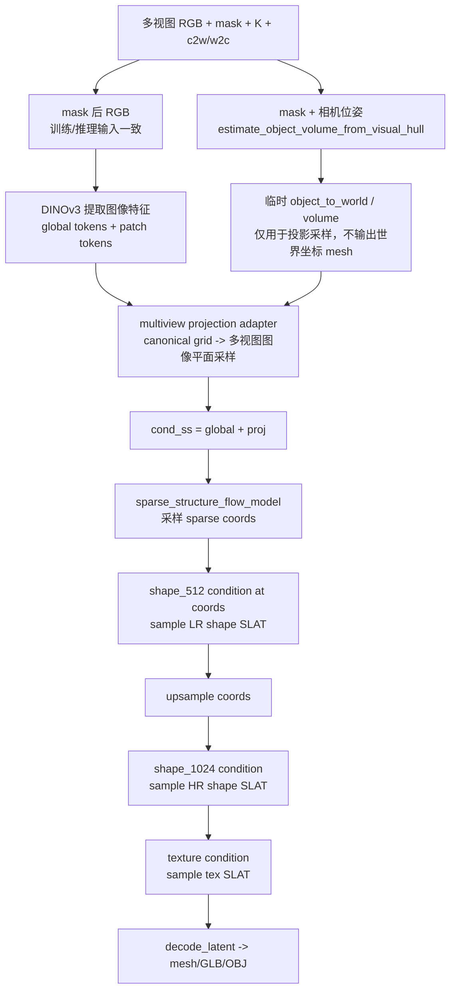

# 多视图稀疏结构五层测试报告

生成时间：2026-06-08  
项目目录：`/home/zjr/Tracker/pixal3d_multiview`  
当前 checkpoint：`/home/zjr/Tracker/pixal3d_multiview/outputs/train_v9/objaverse_5000_v9_select8_proj_only_e6/final.pt`

> Markdown 对字体和字号的支持取决于阅读器，不建议在报告里依赖固定字号。本文用标题层级、表格和 Mermaid 流程图保证可读性。

## 0. 当前目标和 Pipeline 总览

### 0.1 当前目标

当前模型目标不是直接估计 `T_M2W`，也不是替代 CoarseModel 的后续位姿优化。当前目标是：

输入多视图 RGB、mask、相机内参/外参，生成足够稳定的 canonical coarse sparse structure，再进入 Pixal3D/SLAT/mesh 阶段得到粗 mesh。后续真实世界中的 `T_M2W`、scale、pose 和 mesh 细化仍由 CoarseModel 处理。

当前测试重点：

- 数据集、相机、mask、target sparse 是否可靠。
- multiview condition adapter 是否语义合理。
- sparse checkpoint 是否真的学到了 denoising。
- pose、mask、visual hull 是否真的提供有效约束。
- sparse 质量是否足够进入 mesh 阶段。

### 0.2 推理 Pipeline 流程图

对应代码：

- 推理入口：`/home/zjr/Tracker/pixal3d_multiview/run_multiview.py`
- 多视图 pipeline：`/home/zjr/Tracker/pixal3d_multiview/pipeline.py`
- sparse condition：`/home/zjr/Tracker/pixal3d_multiview/sparse_condition.py`
- visual hull / projection：`/home/zjr/Tracker/pixal3d_multiview/multiview_projection.py`



### 0.3 各模块作用

| 模块 | 代码位置 | 作用 | 当前风险 |
|---|---|---|---|
| `load_manifest` | `run_multiview.py` | 读取多视图 RGB、mask、intrinsics、extrinsics | 相机方向、mask、图像裁剪必须和训练一致 |
| `estimate_object_volume_from_visual_hull` | `multiview_projection.py` | 用 mask + pose 临时估计物体所在体积 | 不是最终 `T_M2W`，只是内部投影参考体 |
| `DinoV3ProjFeatureExtractor` | `Pixal3D/.../image_conditioned_proj.py` | 提取 DINO global tokens 和 patch feature | global 正常，但 sparse projection 可能被 adapter 破坏 |
| `SparseMultiviewConditionBuilder` | `sparse_condition.py` | 把多视图特征投影/聚合到 sparse grid | 当前主要瓶颈，zero feature 比例过高 |
| `sample_sparse_structure` | `pipeline.py` / Pixal3D base | 根据 `cond_ss` 采样 sparse coords | 当前 sparse IoU 低，pose 影响弱 |
| `get_multiview_proj_cond_shape` | `pipeline.py` | 在 sparse/SLAT coords 上构建 shape/texture condition | 依赖前面 sparse coords 的质量 |
| `decode_latent` | Pixal3D base pipeline | 将 shape/texture SLAT 解码成 mesh | 目前 sparse 不稳，不建议过早得 mesh 结论 |

### 0.4 训练 Pipeline 只训练哪一段

当前训练脚本是：

`/home/zjr/Tracker/pixal3d_multiview/train_sparse_multiview.py`

它训练的是 sparse stage：

```text
target sparse latent x_0
  + noise, t
  -> x_t
  + cond_ss(global/proj)
  -> sparse_structure_flow_model 预测 velocity
  -> MSE fixed/flow matching loss
```

它没有训练 shape_512、shape_1024、texture，也没有直接训练 mesh。训练目标是让 sparse flow 在当前 multiview adapter condition 下更好地恢复 target sparse latent。

## 1. 第一层：数据和几何先验验收

### 1.1 测试什么

这一层检查训练数据本身是否可用。如果数据、相机、mask 或 target sparse 有系统性错位，后面的训练指标没有意义。

重点检查：

- 每个样本是否有 8 帧 selected views。
- mask 后 RGB 是否和训练/推理一致。
- target sparse coords 是否足够大，不是空或极薄。
- target sparse 投影到多视图 mask 后是否有足够 support。
- visual hull 是否为空，是否和 target 体积尺度相近。
- train/val 低纹理样本比例是否均衡。

### 1.2 使用的数据集

正式 v9 数据集：

`/data/pixal3d_multiview/objaverse_sparse_mv_artraj_pbr_5000_v9_select8`

| split | samples |
|---|---:|
| manifest | 1616 |
| train | 1488 |
| val | 128 |

视图设置：

| 项 | 值 |
|---|---:|
| candidate views | 24 |
| selected views | 8 |
| selection policy | `mask_pose_diverse` |

低纹理样本切分：

| 项 | 数量 |
|---|---:|
| total low_texture | 355 |
| train low_texture | 327 |
| val low_texture | 28 |

说明：train/val 低纹理比例已经用 stratified split 保持一致。

### 1.3 运行命令

```bash
cd /home/zjr/Tracker

/home/zjr/anaconda3/envs/reconviagen/bin/python -u \
  pixal3d_multiview/dataset_tools/check_multiview_sparse_data_quality.py \
  --manifest /data/pixal3d_multiview/objaverse_sparse_mv_artraj_pbr_5000_v9_select8/manifest.json \
  --output /home/zjr/Tracker/pixal3d_multiview/outputs/data_quality_checks/objaverse_5000_v9_select8_all \
  --max_frames 8 \
  --compute_visual_hull

/home/zjr/anaconda3/envs/reconviagen/bin/python -u \
  pixal3d_multiview/dataset_tools/check_multiview_sparse_data_quality.py \
  --manifest /data/pixal3d_multiview/objaverse_sparse_mv_artraj_pbr_5000_v9_select8/train.json \
  --output /home/zjr/Tracker/pixal3d_multiview/outputs/data_quality_checks/objaverse_5000_v9_select8_train \
  --max_frames 8 \
  --compute_visual_hull
```

数据质量报告：

- `/home/zjr/Tracker/pixal3d_multiview/outputs/data_quality_checks/objaverse_5000_v9_select8_all.md`
- `/home/zjr/Tracker/pixal3d_multiview/outputs/data_quality_checks/objaverse_5000_v9_select8_train.md`

### 1.4 当前结果

全体抽样 64 个样本：

| 指标 | mean | median | min | max |
|---|---:|---:|---:|---:|
| target_coords | 8151.86 | 7905.5 | 2520 | 23414 |
| fg_area_ratio_mean | 0.0556 | 0.0552 | 0.0107 | 0.1263 |
| projection_support_ratio_mean | 0.6791 | 0.6739 | 0.5077 | 0.9355 |
| projection_zero_support_ratio | 0.0853 | 0.0646 | 0.0000 | 0.2362 |
| outside_mask_nonzero_ratio_mean | 0.00238 | 0.00172 | 0.00089 | 0.0175 |
| visual_hull_occupied_ratio | 0.1152 | 0.1086 | 0.0193 | 0.3251 |

异常计数：

| 异常 | 数量 |
|---|---:|
| low_texture | 13 |
| flat_gray_blob | 0 |
| low_projection_support_flag | 0 |
| empty_or_tiny_target | 0 |
| bad_latent | 0 |
| tiny_mask | 0 |
| border_touch | 0 |
| visual_hull_empty | 0 |

### 1.5 如何阅读

- `projection_support_ratio_mean` 越高越好，表示 target sparse 投影到 mask 内的比例高。
- `projection_zero_support_ratio` 越低越好，表示几乎没有视图支持的 target 点少。
- `outside_mask_nonzero_ratio_mean` 越接近 0 越好，表示 mask 后图像和训练输入一致。
- `visual_hull_empty=0` 表示 mask + pose 能构建出有效 visual hull。

结论：数据集不是当前主要坏点。数据质量足够用于 sparse stage 微调，但仍有低纹理样本和部分 zero-support 比例偏高样本。

## 2. 第二层：adapter 语义验证

### 2.1 native proj 指什么

`native proj` 指 Pixal3D 原版 `DinoV3ProjFeatureExtractor` 产生的 `z_proj`，也就是 Pixal3D 原生单视图 sparse projection condition。

Pixal3D 原生 sparse condition 的输入是：

```text
单张 image
+ camera_angle_x
+ distance
+ mesh_scale
-> DINO patch features
-> ProjGrid 把 canonical 3D grid 投影到这张图上
-> z_proj: [1, grid_resolution^3, feature_dim]
```

代码在：

`/home/zjr/Tracker/Pixal3D/pixal3d/trainers/flow_matching/mixins/image_conditioned_proj.py`

Pixal3D 原生 pipeline 里调用方式在：

`/home/zjr/Tracker/Pixal3D/pixal3d/pipelines/pixal3d_image_to_3d.py`

关键语义：

```python
z_global, z_proj = image_cond_model(
    image,
    camera_angle_x=cam_angle,
    distance=dist_tensor,
    mesh_scale=scale_tensor,
)
cond = {"global": z_global, "proj": z_proj}
```

这里的 `z_proj` 是 Pixal3D sparse flow 预训练时看到的 projection feature 分布，所以它是当前 multiview adapter 的对照基准。

### 2.2 我们的 multiview proj 指什么

我们的 multiview adapter 不使用 Pixal3D 原生的固定单视图 `camera_angle_x/distance/mesh_scale`。它做的是：

```text
多视图 images + masks + intrinsics + extrinsics
-> visual hull 估计临时 object_to_world
-> canonical sparse grid points
-> 投影到每个视图
-> mask gating
-> front-depth visibility weighting
-> 多视图特征加权平均
-> cond["proj"]
```

对应代码：

- `train_sparse_multiview.py::make_multiview_condition`
- `sparse_condition.py::SparseMultiviewConditionBuilder`
- `multiview_projection.py::sample_features_multi_view`

注意：`object_to_world` 只用于内部投影采样，不是输出 mesh 的 `T_M2W`。pipeline 明确记录：

```text
mesh_output_space = pixal3d_canonical_object_space
object_volume_estimate is only used for internal projection sampling
```

### 2.3 为什么要测 native proj vs multiview proj

当前 sparse flow 的基础权重来自 Pixal3D。它原本适配的是 Pixal3D 原生 `z_proj` 分布。如果我们的 multiview `cond["proj"]` 和 native `z_proj` 分布差异极大，那么：

- 未微调 base 不能代表 Pixal3D 原版性能。
- 微调 checkpoint 即使 loss 降了，也可能只是适配了一个退化 adapter。
- pose 信息可能没有以强几何形式进入 sparse flow。

### 2.4 运行输出

补充测试输出：

`/home/zjr/Tracker/pixal3d_multiview/outputs/eval_v9/five_layer_supplement/condition_adapter_correct/summary.json`

### 2.5 当前结果

| 指标 | 数值 |
|---|---:|
| native global vs multiview first global cosine | 1.000000 |
| native proj vs multiview proj cosine | 0.086529 |
| native proj abs mean | 0.425913 |
| multiview proj abs mean | 0.025309 |
| native proj zero ratio | 0.000000 |
| multiview proj zero ratio | 0.904907 |
| multiview support mean | 0.108696 |
| multiview zero support mean | 3706.5 / 4096 |
| visibility nonzero ratio | 0.044617 |

### 2.6 如何阅读

- global cosine 为 1，说明同一张图的 DINO global tokens 没问题。
- proj cosine 只有 0.0865，说明当前 multiview projection feature 和 Pixal3D 原生 sparse condition 差异非常大。
- multiview proj zero ratio 约 90.5%，说明 16³ sparse grid 中大部分点没有有效投影特征。
- visibility nonzero ratio 只有 4.46%，说明 front-depth visibility 过滤后真正有权重的 grid 点更少。

结论：当前 adapter 的主要问题不是 DINO，而是 sparse grid 上的多视图投影过稀疏。原生 Pixal3D sparse flow 看到的是密集单视图投影特征；我们的 adapter 给它的是大量 zero feature 的多视图聚合特征。因此当前 checkpoint 即使训练后有提升，也很难充分利用 pose。

## 3. 第三层：训练有效性和 fixed loss

### 3.1 fixed loss 是什么意思

`fixed loss` 是一个诊断指标，不是最终生成质量指标。

当前 sparse flow 使用 flow matching 训练。训练时：

```text
target latent x_0
+ random noise
+ time t
-> noisy latent x_t
模型输入: x_t, t, cond
模型目标: 预测 velocity target
loss = MSE(pred_velocity, target_velocity)
```

`fixed loss` 做的是：固定 `t=0.5`，固定随机 seed 和样本集合，比较 base/checkpoint 在同一条件下的 velocity MSE。

它回答的问题是：

```text
checkpoint 是否比 base 更会做当前训练目标下的 denoising？
```

它不能直接回答：

```text
最终 sparse coords 是否好？
mesh 是否好？
pose 是否强约束？
```

这些必须看 sparse sampling 和消融。

### 3.2 训练 checkpoint 信息

| 项 | 值 |
|---|---|
| checkpoint | `/home/zjr/Tracker/pixal3d_multiview/outputs/train_v9/objaverse_5000_v9_select8_proj_only_e6/final.pt` |
| step | 8928 |
| epoch | 6 |
| train_manifest | `/data/pixal3d_multiview/objaverse_sparse_mv_artraj_pbr_5000_v9_select8/train.json` |
| max_frames | 8 |
| lr | 2e-5 |
| trainable | `proj_only` |
| cfg_drop_prob | 0.1 |
| amp_dtype | bf16 |

### 3.3 base vs checkpoint fixed loss

命令：

```bash
CUDA_VISIBLE_DEVICES=1 \
HF_HUB_OFFLINE=1 \
ATTN_BACKEND=flash_attn \
PYTORCH_CUDA_ALLOC_CONF=expandable_segments:True \
MPLCONFIGDIR=/tmp/matplotlib \
NUMBA_CACHE_DIR=/tmp/numba_cache \
/home/zjr/anaconda3/envs/reconviagen/bin/python -u \
  pixal3d_multiview/eval_fixed_train_loss.py \
  --train_manifest /data/pixal3d_multiview/objaverse_sparse_mv_artraj_pbr_5000_v9_select8/val.json \
  --checkpoint /home/zjr/Tracker/pixal3d_multiview/outputs/train_v9/objaverse_5000_v9_select8_proj_only_e6/final.pt \
  --output /home/zjr/Tracker/pixal3d_multiview/outputs/eval_v9/fixed_loss_val_final.json \
  --image_cond_model /home/zjr/Tracker/models/dinov3-vitl16-pretrain-lvd1689m \
  --max_frames 8 \
  --max_samples 128 \
  --fixed_t 0.5 \
  --amp_dtype bf16
```

结果：

| split | base mean | checkpoint mean | 相对变化 | improved |
|---|---:|---:|---:|---:|
| train 128 | 0.21447 | 0.19528 | -8.95% | 128/128 |
| val 128 | 0.21420 | 0.19368 | -9.58% | 128/128 |

如何阅读：

- fixed loss 下降表示 checkpoint 在当前 adapter 条件下确实更会做 denoising。
- train/val 都下降，说明不是纯 train overfit。
- 但 fixed loss 不是最终 sparse/mesh 质量。

### 3.4 fixed loss 几何消融

测试什么：

固定 `t=0.5`、固定 val 前 64 个样本，只评估当前 checkpoint。通过破坏/关闭不同几何条件，看 loss 是否明显变化。

输出：

`/home/zjr/Tracker/pixal3d_multiview/outputs/eval_v9/five_layer_supplement/fixed_loss_ablation`

结果：

| 配置 | checkpoint loss mean | 相对 correct 变化 |
|---|---:|---:|
| correct | 0.210774 | 0.0000 |
| shuffle_pose | 0.210814 | +0.0002 |
| identity_pose | 0.209395 | -0.0065 |
| no_auto_volume | 0.212991 | +0.0105 |
| no_visibility_depth | 0.213996 | +0.0153 |
| no_apply_mask | 0.210781 | +0.0000 |

配置含义：

| 配置 | 含义 |
|---|---|
| `correct` | 图像、mask、pose 都保持正确对应 |
| `shuffle_pose` | 图像/mask 不动，打乱 view 对应的 extrinsics |
| `identity_pose` | 图像/mask 不动，所有 extrinsics 设成单位阵 |
| `no_auto_volume` | 不用 visual hull 自动估计临时 object volume |
| `no_visibility_depth` | 不用 visual-hull front-depth visibility 权重 |
| `no_apply_mask` | 不把 RGB 背景乘 mask 置黑 |

如何阅读：

- 如果 pose 是强约束，`shuffle_pose` 或 `identity_pose` 应该明显变差。
- 实际上 `shuffle_pose` 几乎不变，`identity_pose` 甚至略低。
- `no_auto_volume` 和 `no_visibility_depth` 有 1% 到 1.5% 的 loss 上升，说明 visual hull 体积估计和 visibility 有一点贡献，但贡献很弱。

结论：训练有效，但 fixed-loss 层面不能证明当前 checkpoint 强依赖正确相机位姿。模型目前更像是在利用图像/数据先验和少量 visual-hull 体积约束，而不是强使用多视图 pose 对应。

## 4. 第四层：sparse sampling 消融和 Visual Hull hard filter

### 4.1 sparse sampling 消融在做什么

`sparse sampling` 是把 sparse flow 真正跑一遍采样，得到预测 sparse coords，然后和 target coords 比较。

它回答的问题是：

```text
模型实际生成的 coarse sparse structure 是否接近 target？
正确 pose 是否比错误 pose 更好？
关闭 visual hull / visibility 后 sparse 输出如何变化？
```

它比 fixed loss 更接近真实推理，因为 fixed loss 只测一步 denoising MSE，而 sparse sampling 会经过完整采样过程再 decode 成 coords。

核心指标：

| 指标 | 含义 |
|---|---|
| `IoU` | pred coords 和 target coords 的集合交并比，越高越好 |
| `target_recall` | target 中有多少被 pred 覆盖，越高越好 |
| `pred_precision` | pred 中有多少是真的 target，越高越好 |
| `pred_unique` | 预测 sparse 点数量 |
| `target_unique` | target sparse 点数量 |

可视化说明：

- 蓝色：target sparse coords。
- 黄色：模型预测 sparse coords。
- 三个 panel 是三个坐标平面的投影。
- 黄色越接近蓝色，sparse 结构越好。
- 如果黄色很多但散、外扩、偏移，说明 recall 可能升高但 precision/几何质量仍差。

### 4.2 base vs checkpoint sparse sampling

命令：

```bash
CUDA_VISIBLE_DEVICES=1 \
HF_HUB_OFFLINE=1 \
ATTN_BACKEND=flash_attn \
PYTORCH_CUDA_ALLOC_CONF=expandable_segments:True \
MPLCONFIGDIR=/tmp/matplotlib \
NUMBA_CACHE_DIR=/tmp/numba_cache \
/home/zjr/anaconda3/envs/reconviagen/bin/python -u \
  pixal3d_multiview/eval_sparse_sampling_batch.py \
  --manifest /data/pixal3d_multiview/objaverse_sparse_mv_artraj_pbr_5000_v9_select8/val.json \
  --checkpoint /home/zjr/Tracker/pixal3d_multiview/outputs/train_v9/objaverse_5000_v9_select8_proj_only_e6/final.pt \
  --output_dir /home/zjr/Tracker/pixal3d_multiview/outputs/eval_v9/sparse_sampling_batch_val_32_steps30 \
  --image_cond_model /home/zjr/Tracker/models/dinov3-vitl16-pretrain-lvd1689m \
  --indices 0-31 \
  --max_frames 8 \
  --steps 30 \
  --seed 1234
```

32 个 val 样本，30 steps：

| 指标 | base | checkpoint |
|---|---:|---:|
| mean IoU | 0.0094 | 0.0405 |
| mean target recall | 0.0105 | 0.0657 |
| mean pred precision | 0.1215 | 0.1210 |
| mean pred coords | 654 | 5027 |
| mean target coords | 9109 | 9109 |

逐样本胜率：

| 指标 | checkpoint 胜率 |
|---|---:|
| IoU | 30/32 |
| target recall | 31/32 |
| pred precision | 18/32 |

9 个 val 样本，50 steps：

| 指标 | base | checkpoint |
|---|---:|---:|
| mean IoU | 0.0104 | 0.0532 |
| mean target recall | 0.0159 | 0.1006 |
| mean pred precision | 0.1430 | 0.1362 |
| mean pred coords | 762 | 5935 |

可视化：

- `/home/zjr/Tracker/pixal3d_multiview/outputs/eval_v9/sparse_sampling_batch_val_9/base_vs_checkpoint_sparse_preview_grid.png`
- `/home/zjr/Tracker/pixal3d_multiview/outputs/eval_v9/sparse_sampling_batch_val_32_steps30/base_vs_checkpoint_sparse_preview_grid_compact.png`

结论：checkpoint 比 base 有明显进步，但结果仍不好。它主要从“几乎没有结构”变成“有粗糙结构”，不是稳定物体几何。

### 4.3 pose / visual hull / visibility sparse sampling 消融

测试 indices：

`0,1,5,10,20,30,50,80,100`

每个配置采样 30 steps。

输出：

`/home/zjr/Tracker/pixal3d_multiview/outputs/eval_v9/five_layer_supplement/sparse_sampling_ablation`

结果：

| 配置 | IoU | recall | precision | pred_unique | dIoU vs correct |
|---|---:|---:|---:|---:|---:|
| correct | 0.049622 | 0.093494 | 0.132837 | 5544.9 | 0.000000 |
| shuffle_pose | 0.045545 | 0.087291 | 0.127425 | 5526.6 | -0.004077 |
| no_auto_volume | 0.049579 | 0.120882 | 0.086176 | 11756.4 | -0.000043 |
| no_visibility_depth | 0.049367 | 0.095128 | 0.102925 | 7234.8 | -0.000255 |

如何阅读：

- `shuffle_pose` 比 correct 略差，说明 pose 有一点点影响。
- 但 IoU 只下降约 0.004，不足以说明 pose 是强约束。
- `no_auto_volume` 的 recall 上升、precision 大幅下降、预测点数翻倍，说明 auto volume/visibility 的作用更多是抑制外扩，而不是精确恢复几何。
- `no_visibility_depth` 的 IoU 几乎不变，但 precision 下降，说明 front-depth visibility 有一定去噪作用。

结论：sparse sampling 层面，当前 checkpoint 确实比未微调 base 更好，但正确 pose 相比错误 pose 的优势很弱。当前 sparse 质量仍不足以进入可靠 mesh 结论。

### 4.4 Visual hull hard filter 在代码里的作用是什么

`Visual hull hard filter` 不是训练代码里的默认模块，也不是当前 pipeline 的默认后处理。它是一个诊断脚本：

`/home/zjr/Tracker/pixal3d_multiview/eval_sparse_visual_hull_filter.py`

它做的事情是：

```text
已经采样出的 pred sparse coords
+ mask + pose 构建 visual hull score/support/visible grid
-> 删除不满足 visual hull support 阈值的 pred coords
-> 得到 filtered pred coords
-> 比较 raw vs filtered 的 IoU/recall/precision
```

它回答的问题是：

```text
如果直接用 visual hull 当硬裁剪，能不能修复 sparse 外扩？
```

它和 pipeline 中的 visual hull 不同：

| 位置 | 作用 |
|---|---|
| `pipeline.py` / `train_sparse_multiview.py` 中的 visual hull | 估计临时 object volume，提供投影参考和 visibility weighting |
| `eval_sparse_visual_hull_filter.py` | 评测后处理诊断，硬删除预测 sparse coords |

### 4.5 Visual hull hard filter 结果

旧 50-step 诊断：

| 指标 | raw checkpoint | VH-filtered |
|---|---:|---:|
| mean IoU | 0.0532 | 0.0338 |
| mean target recall | 0.1006 | 0.0416 |
| mean pred precision | 0.1362 | 0.1967 |
| mean pred coords | 5935 | 1585 |

同批补充 30-step 复核：

输出：

- `/home/zjr/Tracker/pixal3d_multiview/outputs/eval_v9/five_layer_supplement/visual_hull_filter_correct/summary.json`
- `/home/zjr/Tracker/pixal3d_multiview/outputs/eval_v9/five_layer_supplement/visual_hull_filter_correct/visual_hull_filter_grid.png`

| 指标 | raw | VH-filtered |
|---|---:|---:|
| mean IoU | 0.049622 | 0.031458 |
| mean target recall | 0.093494 | 0.038026 |
| mean pred precision | 0.132837 | 0.198370 |
| mean keep ratio | 1.000000 | 0.303430 |

逐样本改善：

| 指标 | 变好数量 |
|---|---:|
| IoU | 1/9 |
| precision | 8/9 |
| recall | 0/9 |

结论：visual hull hard filter 确实能提高 precision，但会严重损伤 recall 和 IoU。它适合做 soft prior 或训练输入，不适合直接作为采样后硬裁剪。

## 5. 第五层：mesh 阶段测试

### 5.1 测试什么

第五层应该测试 sparse coords 是否足够进入 SLAT/mesh 阶段，包括：

- sparse coords -> SLAT -> mesh。
- mesh normal preview。
- mesh color preview。
- mesh 与 GT mesh 的 Chamfer/F-score。
- 多视图 mask reprojection IoU。
- 对真实 GOOD_MESH_TEST，检查 silhouette 和 CoarseModel 后续收敛。

### 5.2 当前状态

当前不建议进入正式 mesh 阶段测试。原因：

- adapter projection feature 90.5% 为 zero，说明 sparse condition 本身仍有结构性问题。
- correct pose 和 shuffled pose 差距很小，说明 pose 约束没有变成强几何约束。
- checkpoint sparse IoU 约 0.05，距离稳定 mesh 所需的 sparse 质量仍偏低。
- visual hull hard filter 不能补救 sparse 输出，只能提高 precision、牺牲 recall。

### 5.3 进入 mesh 阶段前的建议门槛

| 指标 | 建议门槛 |
|---|---:|
| val mean IoU | 明显高于 0.10 |
| val recall@2 voxel | 明显高于 0.30 |
| pred coords / target coords | 大致稳定在 0.6 到 1.5 |
| 可视化 | 主轮廓和 target 大致贴合，无大面积外扩 |

当前 v9 还没达到。

## 6. 关键代码和结果文件索引

### 6.1 代码

| 功能 | 文件 |
|---|---|
| 推理入口 | `/home/zjr/Tracker/pixal3d_multiview/run_multiview.py` |
| multiview Pixal3D pipeline | `/home/zjr/Tracker/pixal3d_multiview/pipeline.py` |
| 数据构建 | `/home/zjr/Tracker/pixal3d_multiview/dataset_tools/build_objaverse_multiview_sparse_data.py` |
| PBR 渲染 | `/home/zjr/Tracker/pixal3d_multiview/dataset_tools/blender_pbr_render_multiview.py` |
| 数据质量检查 | `/home/zjr/Tracker/pixal3d_multiview/dataset_tools/check_multiview_sparse_data_quality.py` |
| sparse 训练 | `/home/zjr/Tracker/pixal3d_multiview/train_sparse_multiview.py` |
| multiview condition | `/home/zjr/Tracker/pixal3d_multiview/sparse_condition.py` |
| visual hull / projection | `/home/zjr/Tracker/pixal3d_multiview/multiview_projection.py` |
| adapter 分布测试 | `/home/zjr/Tracker/pixal3d_multiview/eval_condition_adapter_stats.py` |
| fixed loss eval | `/home/zjr/Tracker/pixal3d_multiview/eval_fixed_train_loss.py` |
| sparse sampling batch eval | `/home/zjr/Tracker/pixal3d_multiview/eval_sparse_sampling_batch.py` |
| VH hard filter eval | `/home/zjr/Tracker/pixal3d_multiview/eval_sparse_visual_hull_filter.py` |

### 6.2 结果文件

| 内容 | 路径 |
|---|---|
| 补充测试总汇总 JSON | `/home/zjr/Tracker/pixal3d_multiview/outputs/eval_v9/five_layer_supplement/summary.json` |
| 补充测试总汇总 MD | `/home/zjr/Tracker/pixal3d_multiview/outputs/eval_v9/five_layer_supplement/summary.md` |
| adapter 分布 | `/home/zjr/Tracker/pixal3d_multiview/outputs/eval_v9/five_layer_supplement/condition_adapter_correct/summary.json` |
| fixed loss 消融 | `/home/zjr/Tracker/pixal3d_multiview/outputs/eval_v9/five_layer_supplement/fixed_loss_ablation` |
| sparse sampling 消融 | `/home/zjr/Tracker/pixal3d_multiview/outputs/eval_v9/five_layer_supplement/sparse_sampling_ablation` |
| VH hard filter 复核 | `/home/zjr/Tracker/pixal3d_multiview/outputs/eval_v9/five_layer_supplement/visual_hull_filter_correct/summary.json` |
| VH hard filter 可视化 | `/home/zjr/Tracker/pixal3d_multiview/outputs/eval_v9/five_layer_supplement/visual_hull_filter_correct/visual_hull_filter_grid.png` |

## 7. 当前总判断

v9 checkpoint 不是完全失败。它在当前 multiview adapter 下确实比未微调权重更适配：

- fixed loss 在 train/val 都下降约 9%。
- sparse sampling IoU/recall 对 base 有稳定提升。
- sparse 采样从“几乎没有结构”变成“有粗糙结构”。

但当前结果还不能证明方法已经能生成好的 mesh：

- 当前 base 不是 Pixal3D 原版完整 pipeline baseline。
- adapter projection feature 90.5% 为 zero，说明 condition 结构严重稀疏。
- fixed loss 对 `shuffle_pose` 和 `identity_pose` 不敏感。
- sparse sampling 中 correct pose 只比 shuffle pose 略好。
- visual hull hard filter 不能直接解决 sparse 外扩问题。

最终结论：

**当前 multiview sparse checkpoint 有训练收益，但相机位姿约束仍然偏弱；主要瓶颈是 multiview projection adapter 产生了过多 zero feature，导致 Pixal3D sparse flow 很难把 pose 当作强几何条件使用。**

## 8. 下一步建议

当前更合理的下一步不是直接接 SLAT/mesh，而是先修 sparse condition：

1. 降低 multiview projection 的 zero-support 比例。
2. 不要只把 unsupported grid 点置零；需要引入 `support / visible / vh_score / depth confidence` 作为额外 soft channels 或 gating signal。
3. 区分“真实零特征”和“无观测”，避免 sparse flow 把大量无观测点当成有效特征。
4. 训练时显式加入 pose corruption ablation，让 correct pose 与 wrong pose 在 loss 上拉开差距。
5. 重新评估 `correct / shuffle_pose / identity_pose / no_auto_volume / no_visibility_depth`，直到 correct pose 在 fixed loss 和 sparse sampling 上都明显优于 wrong pose。
6. sparse 可视化达到门槛后，再进入 mesh/SLAT 阶段。

## 9. 修改计划和消融记录

### 9.1 2026-06-08 09:32:29 UTC：建议1，先去掉大量 zero projected feature

本次优先修改 `multiview_projection.sample_features_multi_view()`，目标是让 multi-view projected features 更接近 Pixal3D 原版投影分布。

原问题：

- 原版 Pixal3D 的 `ProjGrid` 使用 `grid_sample(..., padding_mode="border")`，即使 3D query point 投影出图，也会从图像边界采样 feature。
- 当前 multi-view adapter 默认 `empty_policy="zero"`，当一个 3D query point 在所有视角中都没有 mask/visibility support 时，会得到全 0 feature。
- 五层测试中 `multiview_proj_zero_ratio_mean` 约 0.905，说明 sparse flow 输入分布明显偏离原版 Pixal3D。

本次修改策略：

- 保留旧策略 `empty_policy="zero"`，作为严格对照。
- 新增 `empty_policy="soft"`：有 mask/visibility support 时使用 pose/mask 加权特征；support 低或为 0 时回退到 image/border sampled feature，避免直接全 0。
- 新增 `fallback_weight` 控制 fallback feature 强度。
- 新增 `support_confidence_power` 控制 support confidence 的软混合曲线。
- 置信度先作为 soft gating 使用，不直接拼接到 `proj` channel，避免改变 Pixal3D flow 的输入维度。

预期判断：

- `zero_support` 或 projected feature 的 zero ratio 应明显下降。
- `raw_zero_support` 仍记录原始 mask/visibility 的 unsupported 点数，用来判断几何支持本身是否改善。
- 如果 `soft` 只降低 zero feature 但 correct/shuffle 仍无差异，说明还需要下一步改 `z_global` fusion 或加入显式 pose corruption 训练。

本次消融需要至少跑：

- adapter condition 分布测试：验证 zero feature 是否下降。
- fixed loss correct/shuffle 测试：验证 pose 是否更敏感。
- sparse sampling correct/shuffle 测试：验证 sampled coords 是否更贴近 target。

#### 9.1.1 2026-06-09 00:53:16 UTC：建议1结果，`empty_policy=soft`

测试结果目录：

`pixal3d_multiview/outputs/eval_v9/projection_fallback_ablation_001`

本次测试使用 v9 val 数据，当前 checkpoint 为：

`pixal3d_multiview/outputs/train_v9/objaverse_5000_v9_select8_proj_only_e6/final.pt`

**Adapter condition 分布**

| 指标 | `zero` | `soft` | 说明 |
|---|---:|---:|---|
| `multiview_proj_zero_ratio_mean` | 0.9049 | 0.0000 | `soft` 已去掉 projected feature 大面积全 0 |
| `native_first_proj_vs_multiview_proj_cos_mean` | 0.0865 | 0.9210 | `soft` 后 multi-view proj 分布明显接近 Pixal3D 原版单视图投影 |
| `multiview_proj_abs_mean` | 0.0253 | 0.3638 | 特征幅值从接近 0 恢复到正常范围 |
| `raw_zero_support_mean` | 3706.5 | 3706.5 | 原始 mask/visibility 几何支持没有变强 |
| `fallback_points_mean` | 0.0 | 3706.5 | `soft` 主要是在无 support 点使用 fallback feature |
| `support_confidence_mean` | 0.0136 | 0.0136 | 有效几何支持仍然很稀疏 |

解释：

`soft` 成功修复了一个很大的接口分布问题：原版 Pixal3D sparse flow 很少看到整片全 0 的 projected feature，而旧 multi-view adapter 会让约 90% grid point 变成全 0。  
但 `raw_zero_support_mean` 没有下降，说明 mask / pose / visibility 本身覆盖到的 grid point 仍然少。也就是说，第一步只是让 unsupported point 不再以“异常全 0 特征”进入网络，并没有让相机位姿约束天然变强。

**Fixed loss**

| 条件 | `loss_mean` | `loss_median` |
|---|---:|---:|
| `zero + correct` | 0.2108 | 0.1868 |
| `zero + shuffle` | 0.2108 | 0.1857 |
| `zero + identity` | 0.2094 | 0.1867 |
| `soft + correct` | 0.2165 | 0.1894 |
| `soft + shuffle` | 0.2161 | 0.1895 |
| `soft + identity` | 0.2163 | 0.1936 |

解释：

当前 checkpoint 是在旧条件分布上训练的，直接切到 `soft` 后 fixed loss 略升是合理的，属于训练/推理条件不一致。更关键的是：`correct / shuffle / identity` 的 loss 差距仍然很小，说明 sparse denoiser 还没有把 pose 当成强约束。

**Sparse sampling**

| 条件 | checkpoint IoU | target recall | pred precision | pred unique |
|---|---:|---:|---:|---:|
| `zero + correct` | 0.0496 | 0.0935 | 0.1328 | 5544.9 |
| `zero + shuffle` | 0.0455 | 0.0873 | 0.1274 | 5526.6 |
| `soft + correct` | 0.0510 | 0.0828 | 0.1346 | 4524.2 |
| `soft + shuffle` | 0.0523 | 0.0993 | 0.1155 | 5897.3 |

解释：

`soft + correct` 相比 `zero + correct` 的 IoU 和 precision 只有小幅提升，recall 反而下降；同时 `soft + shuffle` 的 IoU 还略高于 `soft + correct`。这说明第一步不能单独证明 pose 约束有效，最多说明 projected feature 的输入分布被修正了。

**结论**

建议1是必要的，因为它解决了 multi-view adapter 与 Pixal3D 原版 sparse flow 之间的明显分布错配；但它不是充分条件。后续需要在 `soft` 条件下重新训练，并继续检查 `z_global` 多视角融合、projection support 置信度、pose corruption 训练目标，直到 correct pose 在 fixed loss 和 sparse sampling 上稳定优于 wrong pose。

### 9.2 2026-06-09 01:20:44 UTC：建议2，修正多视角 `z_global` 融合

测试结果目录：

`pixal3d_multiview/outputs/eval_v9/global_fusion_ablation_001`

本次代码修改位置：

- `pixal3d_multiview/condition_utils.py`
- `pixal3d_multiview/sparse_condition.py`
- `pixal3d_multiview/pipeline.py`
- `pixal3d_multiview/train_sparse_multiview.py`
- `pixal3d_multiview/eval_condition_adapter_stats.py`
- `pixal3d_multiview/eval_fixed_train_loss.py`
- `pixal3d_multiview/eval_sparse_sampling_batch.py`
- `pixal3d_multiview/sample_sparse_checkpoint.py`
- `pixal3d_multiview/run_multiview.py`

原问题：

当前 multi-view adapter 把每个视角的 DINO global token 直接串联：

```python
z_global = torch.cat([z_clstoken, z_regtokens], dim=1).reshape(1, -1, C)
```

如果输入 8 张图，每张图有 1 个 cls token 和 4 个 register token，那么 `z_global` 会从 Pixal3D 原版的 `[1, 5, C]` 变成 `[1, 40, C]`。这不一定错误，但它改变了 sparse flow 的 global condition token 数量。对于原版 Pixal3D 权重或只轻微微调的 checkpoint，这可能是额外分布偏移。

本次新增参数：

```bash
--global_fusion concat  # 旧行为，V 个视角的 global token 直接串联
--global_fusion mean    # 多视角 global token 按视角平均，回到 Pixal3D 原版 token 数
--global_fusion first   # 只使用第一视角 global token，用作对照
```

本轮测试只比较 `concat` 和 `mean`，并固定 `empty_policy=soft`。注意：当前 checkpoint 仍然是在旧 `concat + zero/旧条件` 分布上训练过的，因此这次测试只能判断接口兼容性和短期采样变化，不能代表 `mean + soft` 重新训练后的最终效果。

**Adapter condition 分布**

| 指标 | `soft + concat` | `soft + mean` | 说明 |
|---|---:|---:|---|
| `global_token_count_mean` | 40.0 | 5.0 | `mean` 把 global token 数恢复到 Pixal3D 原版规模 |
| `native_first_global_vs_multiview_first_global_cos_mean` | 1.0000 | 0.9776 | `mean` 是多视角平均，因此不再完全等于第一视角 global token |
| `native_first_proj_vs_multiview_proj_cos_mean` | 0.9210 | 0.9210 | projected feature 不受 global fusion 影响 |
| `multiview_proj_zero_ratio_mean` | 0.0000 | 0.0000 | 仍由 `empty_policy=soft` 负责去除全 0 feature |
| `support_confidence_mean` | 0.0136 | 0.0136 | 几何 support 本身没有变化 |

解释：

`global_fusion=mean` 按预期把 global token 数从 40 降回 5，减少了与 Pixal3D 原版 sparse flow 的 token 数分布差异。它不改变 projected feature、mask support 或 visibility support，所以它不是几何约束本身，只是 global condition 的接口修正。

**Fixed loss，32 个 val 样本**

| 条件 | `loss_mean` | `loss_median` |
|---|---:|---:|
| `concat + correct` | 0.2207 | 0.1947 |
| `concat + shuffle` | 0.2201 | 0.1939 |
| `mean + correct` | 0.2206 | 0.1944 |
| `mean + shuffle` | 0.2200 | 0.1937 |

解释：

fixed loss 下 `correct` 与 `shuffle` 仍然没有拉开；`shuffle` 甚至略低。这说明仅在旧 checkpoint 上切换 global fusion，不足以让 sparse denoiser 立刻对 pose 产生强敏感性。要验证 `mean + soft` 是否真正有效，仍需要用这套新条件重新训练。

**Sparse sampling，5 个 val 样本，20 steps**

| 条件 | checkpoint IoU | target recall | pred precision | pred unique |
|---|---:|---:|---:|---:|
| `concat + correct` | 0.0412 | 0.0616 | 0.1352 | 4801.2 |
| `concat + shuffle` | 0.0342 | 0.0514 | 0.1022 | 5420.2 |
| `mean + correct` | 0.0464 | 0.0682 | 0.1706 | 4717.4 |
| `mean + shuffle` | 0.0360 | 0.0531 | 0.1089 | 5154.2 |

解释：

在这个小样本 sparse sampling 上，`mean + correct` 比 `concat + correct` 略好，并且 `correct` 明显高于 `shuffle`。这是一个正向信号：把 global token 数恢复到 Pixal3D 原版规模后，采样阶段的姿态扰动差距略微变清楚。  
但这个结论还不够强，因为 fixed loss 没有支持同样结论，而且样本数只有 5 个。它更适合作为“下一轮训练配置应优先使用 `soft + mean`”的依据，而不是证明当前模型已经解决 pose 约束问题。

**结论**

建议2是合理的兼容性修正：`global_fusion=mean` 更接近 Pixal3D 原版 sparse flow 的 global token 形状，并在小规模 sparse sampling 中比旧 `concat` 有轻微优势。  
下一轮训练建议使用：

```bash
--empty_policy soft \
--global_fusion mean \
--cfg_drop_prob 0.0 或较小值 \
```

并加入显式 wrong-pose 对照训练/评估。判断是否真正有效，不能只看 fixed MSE loss，还必须看 `correct > shuffle/identity` 是否在 sparse sampling 上稳定成立。

### 9.3 2026-06-09 02:34:10 UTC：`soft + mean` 继续训练结果

训练输出目录：

`pixal3d_multiview/outputs/train_v9/objaverse_5000_v9_select8_soft_mean_from_e6_to_e10`

评估输出目录：

- `pixal3d_multiview/outputs/eval_v9/soft_mean_e10`
- `pixal3d_multiview/outputs/eval_v9/soft_mean_e10_step9000`

训练配置：

```bash
--resume pixal3d_multiview/outputs/train_v9/objaverse_5000_v9_select8_proj_only_e6/final.pt
--lr 1e-5
--trainable proj_only
--cfg_drop_prob 0.0
--empty_policy soft
--global_fusion mean
--fallback_weight 1.0
--support_confidence_power 1.0
```

训练文件：

- `step_9000.pt`
- `step_10000.pt`
- `last.pt`
- `final.pt`

注意：

这次训练不是完整的 e6 到 e10 四个 epoch。旧 checkpoint 的 step 是 8928，训练脚本默认 `--max_steps=10000`，因此实际只继续训练到 step 10000，多训约 1072 step。`final.pt` 里记录的 epoch=10 来自 `--max_epochs 10`，不能理解成真的完成了 10 个 epoch。

**Fixed loss，32 个 val 样本，`final.pt`**

| checkpoint | pose | `loss_mean` | `loss_median` |
|---|---|---:|---:|
| e6，上一轮 `mean + soft` | correct | 0.2206 | 0.1944 |
| e6，上一轮 `mean + soft` | shuffle | 0.2200 | 0.1937 |
| e10 final | correct | 0.2160 | 0.1903 |
| e10 final | shuffle | 0.2156 | 0.1901 |
| e10 final | identity | 0.2170 | 0.1950 |

解释：

继续训练后 fixed loss 有下降，说明模型确实继续适配了 `soft + mean` 条件。但这个指标仍然没有显示出可靠 pose 敏感性：`shuffle` 的 loss 仍略低于 `correct`，`identity` 只略高一点。  
因此 fixed loss 的下降不能直接解释为“相机位姿约束变强”。

**Sparse sampling，5 个 val 样本，20 steps**

| checkpoint | pose | IoU | target recall | pred precision | pred unique |
|---|---|---:|---:|---:|---:|
| e6，上一轮 `mean + soft` | correct | 0.0464 | 0.0682 | 0.1706 | 4717.4 |
| e6，上一轮 `mean + soft` | shuffle | 0.0360 | 0.0531 | 0.1089 | 5154.2 |
| step_9000 | correct | 0.0421 | 0.0583 | 0.1732 | 3928.6 |
| step_9000 | shuffle | 0.0346 | 0.0495 | 0.1134 | 4673.6 |
| final / step_10000 | correct | 0.0225 | 0.0280 | 0.1949 | 2664.8 |
| final / step_10000 | shuffle | 0.0302 | 0.0398 | 0.1240 | 3710.4 |

解释：

`step_9000` 还保留了 `correct > shuffle` 的趋势，但已经没有超过 e6。继续到 `final / step_10000` 后，sparse sampling 明显变差：

- correct IoU 从 e6 的 0.0464 降到 0.0225。
- correct recall 从 0.0682 降到 0.0280。
- pred unique 从 4717.4 降到 2664.8，说明输出 sparse coords 明显收缩。
- final 中 shuffle IoU 反而高于 correct，说明 pose 约束没有稳定变强。

这说明当前继续训练主要优化了 denoising MSE，但没有优化最终 thresholded sparse coords 的几何质量；甚至在 sampling 结果上出现了退化。

**本轮结论**

`soft + mean` 作为条件结构修正仍然合理，但直接从旧 e6 checkpoint 继续训练并没有带来更好的 sparse sampling。当前最重要的结论是：

1. `final.pt` 不建议作为当前 mesh/sparse 生成的首选 checkpoint。
2. 如果只在这次分支里选，`step_9000.pt` 比 `final.pt` 更合理，但它仍不如旧 e6 的 sparse sampling 指标。
3. fixed loss 不能作为主要选点指标；必须以 sparse sampling 的 IoU / recall / correct-vs-shuffle 差距做早停和 checkpoint 选择。
4. 后续训练不能只继续降低 MSE，需要加入更直接的 sparse 结构评价或训练约束。

**下一步建议**

下一步不建议继续盲目把 `final.pt` 往后训练。更合理的是：

- 加入 periodic validation：每隔固定 step 自动跑小规模 sparse sampling，保存 best-by-IoU checkpoint。
- 对 `correct / shuffle / identity` 做显式对照，训练目标或选择标准必须让 correct pose 优于 wrong pose。
- 尝试从 Pixal3D 原始 sparse flow 或更早 checkpoint 直接用 `soft + mean` 训练，而不是从已经适配旧 `zero/concat` 条件的 e6 checkpoint 继续。
- 如果继续从 e6 微调，先用更小学习率和更短 step，例如 `lr=2e-6`、每 200 step 做 sparse sampling 早停。

### 9.4 2026-06-09 02:50:00 UTC：下一轮训练计划和命令

本轮目标不是直接追求更低 train loss，而是回答两个问题：

1. `soft + mean` 条件是否存在一个 sparse sampling 变好的 checkpoint。
2. 如果从旧 e6 checkpoint 迁移会退化，那么从 Pixal3D 原始 sparse flow 开始训练是否更干净。

判断标准：

- 主要看 `sparse sampling`，不是只看 fixed loss。
- 需要 `correct_iou > shuffle_iou`。
- 需要 `correct_recall` 不明显下降。
- 需要 `pred_unique` 不出现明显收缩。
- checkpoint 选择优先级：`correct_iou`、`correct_iou - shuffle_iou`、`correct_recall`。

公共路径：

```bash
cd /home/zjr/Tracker

TRAIN=/data/pixal3d_multiview/objaverse_sparse_mv_artraj_pbr_5000_v9_select8/train.json
VAL=/data/pixal3d_multiview/objaverse_sparse_mv_artraj_pbr_5000_v9_select8/val.json
MODEL=/home/zjr/Tracker/models/dinov3-vitl16-pretrain-lvd1689m
E6=/home/zjr/Tracker/pixal3d_multiview/outputs/train_v9/objaverse_5000_v9_select8_proj_only_e6/final.pt
```

#### 实验 A：从旧 e6 checkpoint 小学习率短程迁移

目的：

验证从旧 e6 迁移到 `soft + mean` 是否只是在较短 step 内有效，以及哪个 step 开始退化。

关键设置：

- 从 e6 的 `step=8928` 继续。
- `--max_steps 9800` 是全局 step，实际多训约 872 step。
- `--save_every 200` 会留下 `step_9000 / 9200 / 9400 / 9600 / 9800` 附近的候选 checkpoint。
- 学习率降到 `2e-6`，避免像上一轮 `1e-5` 那样快速破坏 sampling。

训练命令：

```bash
tmux new -s pixal3d_soft_mean_e6_lr2e6_s9800
```

```bash
cd /home/zjr/Tracker

CUDA_VISIBLE_DEVICES=1 \
HF_HUB_OFFLINE=1 \
ATTN_BACKEND=flash_attn \
PYTORCH_CUDA_ALLOC_CONF=expandable_segments:True \
MPLCONFIGDIR=/tmp/matplotlib \
NUMBA_CACHE_DIR=/tmp/numba_cache \
/home/zjr/anaconda3/envs/reconviagen/bin/python -u \
  pixal3d_multiview/train_sparse_multiview.py \
  --train_manifest /data/pixal3d_multiview/objaverse_sparse_mv_artraj_pbr_5000_v9_select8/train.json \
  --output_dir /home/zjr/Tracker/pixal3d_multiview/outputs/train_v9/soft_mean_from_e6_lr2e6_s9800 \
  --resume /home/zjr/Tracker/pixal3d_multiview/outputs/train_v9/objaverse_5000_v9_select8_proj_only_e6/final.pt \
  --image_cond_model /home/zjr/Tracker/models/dinov3-vitl16-pretrain-lvd1689m \
  --max_frames 8 \
  --batch_size 1 \
  --num_workers 4 \
  --max_epochs 20 \
  --max_steps 9800 \
  --lr 2e-6 \
  --trainable proj_only \
  --cfg_drop_prob 0.0 \
  --empty_policy soft \
  --global_fusion mean \
  --fallback_weight 1.0 \
  --support_confidence_power 1.0 \
  --log_every 20 \
  --save_every 200 \
  --amp_dtype bf16
```

##### 实验 A 结果分析，e6 小学习率迁移（2026-06-09 03:32:00 UTC）

训练输出目录：

`pixal3d_multiview/outputs/train_v9/soft_mean_from_e6_lr2e6_s9800`

评估输出目录：

`pixal3d_multiview/outputs/eval_v9/soft_mean_from_e6_lr2e6_s9800_sweep`

本次补充实现了 sweep 评估脚本：

`pixal3d_multiview/eval_sparse_checkpoint_sweep.py`

它一次加载模型后批量评估多个 checkpoint，避免每个 step / pose 都重复加载 Pixal3D sparse flow、DINOv3 和 decoder。输出文件：

- `sweep_summary.json`
- `sweep_summary.csv`
- `all_metrics.csv`
- `sparse_sampling/*/summary.json`

实验 A 配置：

```bash
--resume pixal3d_multiview/outputs/train_v9/objaverse_5000_v9_select8_proj_only_e6/final.pt
--lr 2e-6
--max_steps 9800
--save_every 200
--empty_policy soft
--global_fusion mean
--cfg_drop_prob 0.0
```

评估设置：

- val indices：`0,1,5,10,20`
- sparse sampling steps：`20`
- pose modes：`correct / shuffle / identity`
- 对比 checkpoint：
  - e6 baseline：旧 `objaverse_5000_v9_select8_proj_only_e6/final.pt`
  - 实验 A：`step_9000 / 9200 / 9400 / 9600 / 9800 / final`

**Sparse sampling 汇总**

| checkpoint | step | correct IoU | shuffle IoU | identity IoU | correct - shuffle | correct - identity | correct recall | correct precision | pred unique |
|---|---:|---:|---:|---:|---:|---:|---:|---:|---:|
| e6 baseline | 8928 | 0.0464 | 0.0360 | 0.0382 | +0.0104 | +0.0082 | 0.0682 | 0.1706 | 4717.4 |
| step_9000 | 9000 | 0.0411 | 0.0350 | 0.0368 | +0.0061 | +0.0043 | 0.0559 | 0.1724 | 3772.0 |
| step_9200 | 9200 | 0.0302 | 0.0318 | 0.0399 | -0.0017 | -0.0097 | 0.0415 | 0.1561 | 3626.0 |
| step_9400 | 9400 | 0.0308 | 0.0345 | 0.0390 | -0.0037 | -0.0082 | 0.0418 | 0.1909 | 3403.8 |
| step_9600 | 9600 | 0.0293 | 0.0343 | 0.0389 | -0.0050 | -0.0096 | 0.0394 | 0.1919 | 3340.4 |
| step_9800 | 9800 | 0.0252 | 0.0351 | 0.0369 | -0.0099 | -0.0117 | 0.0321 | 0.1937 | 2915.6 |
| final_9800 | 9800 | 0.0252 | 0.0351 | 0.0369 | -0.0099 | -0.0117 | 0.0321 | 0.1937 | 2915.6 |

**结果解读**

实验 A 没有改善 e6 baseline。

最好的迁移点是 `step_9000`，但它仍然弱于旧 e6：

- correct IoU：`0.0411 < 0.0464`
- correct recall：`0.0559 < 0.0682`
- pred unique：`3772.0 < 4717.4`
- correct-vs-shuffle gap：`+0.0061 < +0.0104`
- correct-vs-identity gap：`+0.0043 < +0.0082`

从 `step_9200` 开始，wrong pose 反超 correct：

- `step_9200`：identity IoU `0.0399` > correct IoU `0.0302`
- `step_9400`：identity IoU `0.0390` > correct IoU `0.0308`
- `step_9600`：identity IoU `0.0389` > correct IoU `0.0293`
- `step_9800/final`：shuffle/identity 都明显高于 correct

同时，随着继续训练，correct 的 sparse 输出持续收缩：

- e6 pred unique：`4717.4`
- step_9000 pred unique：`3772.0`
- step_9800 pred unique：`2915.6`

precision 上升并不是好事，因为它伴随 recall 和 pred unique 明显下降，更像是模型变得保守，只输出少量更容易命中的 sparse coords，而不是恢复了完整结构。

**结论**

实验 A 说明：从旧 e6 checkpoint 用更小学习率 `2e-6` 迁移到 `soft + mean`，仍然没有带来更好的 sparse sampling。  
这比上一轮 `1e-5` 稳定一些，退化更慢，但方向仍然不对：继续训练会让 sparse coords 收缩，并且 correct pose 不再稳定优于 wrong pose。

因此：

1. 实验 A 不建议继续往后训练。
2. 实验 A 的任何 checkpoint 都不优于旧 e6 baseline。
3. 如果必须从实验 A 中选一个临时 checkpoint，只能选 `step_9000.pt`，但它也只是“退化最少”，不是改进。
4. 当前问题不是学习率单独造成的；旧 e6 到新 `soft + mean` 条件的迁移本身就不理想。

**下一步**

现在应该执行实验 B：从 Pixal3D 原始 sparse flow 直接训练 `soft + mean`。  
如果实验 B 能让 correct 稳定优于 shuffle/identity，说明新 condition 需要从头适配；如果实验 B 也失败，就需要进入更强几何条件设计：

- projection support confidence 作为显式输入或 gating；
- visual hull occupancy / surface prior；
- visibility confidence；
- pose corruption ranking / contrastive objective，而不是只做 denoising MSE。

#### 实验 B：从 Pixal3D 原始 sparse flow 直接训练 `soft + mean`

目的：

验证新 condition 是否需要从一开始就按 `soft + mean` 训练，而不是从旧 `zero + concat` checkpoint 迁移。

关键设置：

- 不使用 `--resume`。
- `--max_steps 1200` 先做短程验证，不做长训。
- `--save_every 200` 保存多个候选点。

训练命令：

```bash
tmux new -s pixal3d_soft_mean_raw_s1200
```

```bash
cd /home/zjr/Tracker

CUDA_VISIBLE_DEVICES=1 \
HF_HUB_OFFLINE=1 \
ATTN_BACKEND=flash_attn \
PYTORCH_CUDA_ALLOC_CONF=expandable_segments:True \
MPLCONFIGDIR=/tmp/matplotlib \
NUMBA_CACHE_DIR=/tmp/numba_cache \
/home/zjr/anaconda3/envs/reconviagen/bin/python -u \
  pixal3d_multiview/train_sparse_multiview.py \
  --train_manifest /data/pixal3d_multiview/objaverse_sparse_mv_artraj_pbr_5000_v9_select8/train.json \
  --output_dir /home/zjr/Tracker/pixal3d_multiview/outputs/train_v9/soft_mean_from_pixal3d_raw_s1200 \
  --image_cond_model /home/zjr/Tracker/models/dinov3-vitl16-pretrain-lvd1689m \
  --max_frames 8 \
  --batch_size 1 \
  --num_workers 4 \
  --max_epochs 20 \
  --max_steps 1200 \
  --lr 2e-5 \
  --trainable proj_only \
  --cfg_drop_prob 0.0 \
  --empty_policy soft \
  --global_fusion mean \
  --fallback_weight 1.0 \
  --support_confidence_power 1.0 \
  --log_every 20 \
  --save_every 200 \
  --amp_dtype bf16
```

##### 实验 B 结果分析，从 Pixal3D 原始 sparse flow 直接训练 `soft + mean`（2026-06-09 05:06:32 UTC）

评估输出：

- `/home/zjr/Tracker/pixal3d_multiview/outputs/eval_v9/soft_mean_from_pixal3d_raw_s1200_sweep/sweep_summary.csv`
- `/home/zjr/Tracker/pixal3d_multiview/outputs/eval_v9/soft_mean_from_pixal3d_raw_s1200_sweep/sweep_summary.json`
- `/home/zjr/Tracker/pixal3d_multiview/outputs/eval_v9/soft_mean_from_pixal3d_raw_s1200_sweep/all_metrics.csv`

评估方式：

- val indices：`0,1,5,10,20`
- sparse sampling steps：`20`
- pose modes：`correct / shuffle / identity`
- condition：`empty_policy=soft`，`global_fusion=mean`
- 判断方式：如果多视角相机位姿条件真的起作用，`correct` 的 sparse IoU 和 target recall 应该稳定高于 `shuffle / identity`。如果 `wrong pose` 反而更高，说明当前条件还没有形成有效的几何约束。

结果表：

| checkpoint | correct IoU | shuffle IoU | identity IoU | correct-shuffle | correct-identity | correct recall | correct precision | pred unique |
|---|---:|---:|---:|---:|---:|---:|---:|---:|
| step_200 | 0.0161 | 0.0230 | 0.0136 | -0.0068 | +0.0025 | 0.0191 | 0.1151 | 1532.0 |
| step_400 | 0.0235 | 0.0217 | 0.0192 | +0.0018 | +0.0043 | 0.0294 | 0.1261 | 2105.6 |
| step_600 | 0.0192 | 0.0233 | 0.0238 | -0.0041 | -0.0046 | 0.0231 | 0.1120 | 2026.0 |
| step_800 | 0.0173 | 0.0268 | 0.0307 | -0.0095 | -0.0134 | 0.0209 | 0.1725 | 2246.8 |
| step_1000 | 0.0243 | 0.0277 | 0.0277 | -0.0034 | -0.0034 | 0.0326 | 0.1324 | 2810.8 |
| step_1200 | 0.0238 | 0.0310 | 0.0213 | -0.0072 | +0.0025 | 0.0327 | 0.1269 | 2914.6 |
| final | 0.0238 | 0.0310 | 0.0213 | -0.0072 | +0.0025 | 0.0327 | 0.1269 | 2914.6 |

对比结论：

- 实验 B 没有通过 sparse pose 消融。只有 `step_400` 同时满足 `correct > shuffle` 和 `correct > identity`，但 margin 很小，`correct IoU=0.0235` 也明显低于旧 e6 baseline 的 `0.0464`。
- `step_800 / step_1000 / step_1200 / final` 都出现了 wrong pose 高于 correct pose 的情况，尤其 `step_1200/final` 中 `shuffle IoU=0.0310` 高于 `correct IoU=0.0238`。
- 从 Pixal3D 原始 sparse flow 直接短程训练 `soft + mean`，没有比“旧 e6 checkpoint 小学习率迁移”更好；它既没有恢复旧 e6 的 sparse 质量，也没有让正确相机位姿成为稳定优势。
- 因此，实验 B 不能作为继续长训的正证据。当前问题更像是 condition 注入和监督目标没有强迫 sparse flow 使用多视角几何，而不是单纯训练步数不够。

当前判断：

1. `soft empty fallback + mean global fusion` 改善了 zero feature 的输入形态，但没有自动解决 sparse flow 忽略/误用 pose 的问题。
2. 继续从 raw Pixal3D sparse flow 长训风险较高，因为 1200 step 内没有看到 correct pose 排序趋势。
3. 下一步更应该把 geometry support 显式变成 sparse stage 的输入或 loss，而不是只靠投影 feature 平均：
   - 把 per-voxel projection support / visibility confidence 作为额外 3D channel 或 sparse token feature；
   - 对 correct / shuffle pose 增加 ranking 或 contrastive loss；
   - 在 sparse logits 或 coords 选择阶段加入 visual hull / projection prior 的软约束；
   - 或先训练一个直接预测 sparse occupancy/logits 的 lightweight geometry head，再把结果接入 sparse flow。

#### 训练后评估命令：sparse sampling 选 checkpoint

先评估实验 A。把 `CKPTS` 改成实际存在的 checkpoint 文件；如果某个 step 不存在就删掉那一项。

```bash
cd /home/zjr/Tracker

OUT=/home/zjr/Tracker/pixal3d_multiview/outputs/eval_v9/soft_mean_from_e6_lr2e6_s9800
VAL=/data/pixal3d_multiview/objaverse_sparse_mv_artraj_pbr_5000_v9_select8/val.json
MODEL=/home/zjr/Tracker/models/dinov3-vitl16-pretrain-lvd1689m
RUN=/home/zjr/Tracker/pixal3d_multiview/outputs/train_v9/soft_mean_from_e6_lr2e6_s9800
CKPTS="$RUN/step_9000.pt $RUN/step_9200.pt $RUN/step_9400.pt $RUN/step_9600.pt $RUN/step_9800.pt $RUN/final.pt"

mkdir -p "$OUT/sparse_sampling"

for CKPT in $CKPTS; do
  [ -f "$CKPT" ] || continue
  TAG=$(basename "$CKPT" .pt)
  for POSE in correct shuffle identity; do
    CUDA_VISIBLE_DEVICES=1 \
    HF_HUB_OFFLINE=1 \
    ATTN_BACKEND=flash_attn \
    PYTORCH_CUDA_ALLOC_CONF=expandable_segments:True \
    MPLCONFIGDIR=/tmp/matplotlib \
    NUMBA_CACHE_DIR=/tmp/numba_cache \
    /home/zjr/anaconda3/envs/reconviagen/bin/python -u \
      pixal3d_multiview/eval_sparse_sampling_batch.py \
      --manifest "$VAL" \
      --checkpoint "$CKPT" \
      --output_dir "$OUT/sparse_sampling/${TAG}_${POSE}" \
      --image_cond_model "$MODEL" \
      --indices 0,1,5,10,20 \
      --max_frames 8 \
      --steps 20 \
      --seed 1234 \
      --pose_mode "$POSE" \
      --empty_policy soft \
      --global_fusion mean \
      --ablation_name "soft_mean_e6_lr2e6_${TAG}_${POSE}" \
      --quiet
  done
done
```

评估实验 B：

```bash
cd /home/zjr/Tracker

OUT=/home/zjr/Tracker/pixal3d_multiview/outputs/eval_v9/soft_mean_from_pixal3d_raw_s1200
VAL=/data/pixal3d_multiview/objaverse_sparse_mv_artraj_pbr_5000_v9_select8/val.json
MODEL=/home/zjr/Tracker/models/dinov3-vitl16-pretrain-lvd1689m
RUN=/home/zjr/Tracker/pixal3d_multiview/outputs/train_v9/soft_mean_from_pixal3d_raw_s1200
CKPTS="$RUN/step_200.pt $RUN/step_400.pt $RUN/step_600.pt $RUN/step_800.pt $RUN/step_1000.pt $RUN/step_1200.pt $RUN/final.pt"

mkdir -p "$OUT/sparse_sampling"

for CKPT in $CKPTS; do
  [ -f "$CKPT" ] || continue
  TAG=$(basename "$CKPT" .pt)
  for POSE in correct shuffle identity; do
    CUDA_VISIBLE_DEVICES=1 \
    HF_HUB_OFFLINE=1 \
    ATTN_BACKEND=flash_attn \
    PYTORCH_CUDA_ALLOC_CONF=expandable_segments:True \
    MPLCONFIGDIR=/tmp/matplotlib \
    NUMBA_CACHE_DIR=/tmp/numba_cache \
    /home/zjr/anaconda3/envs/reconviagen/bin/python -u \
      pixal3d_multiview/eval_sparse_sampling_batch.py \
      --manifest "$VAL" \
      --checkpoint "$CKPT" \
      --output_dir "$OUT/sparse_sampling/${TAG}_${POSE}" \
      --image_cond_model "$MODEL" \
      --indices 0,1,5,10,20 \
      --max_frames 8 \
      --steps 20 \
      --seed 1234 \
      --pose_mode "$POSE" \
      --empty_policy soft \
      --global_fusion mean \
      --ablation_name "soft_mean_raw_${TAG}_${POSE}" \
      --quiet
  done
done
```

#### 汇总查看命令

```bash
cd /home/zjr/Tracker

/home/zjr/anaconda3/envs/reconviagen/bin/python -c "
import json, pathlib
for root in [
    pathlib.Path('/home/zjr/Tracker/pixal3d_multiview/outputs/eval_v9/soft_mean_from_e6_lr2e6_s9800/sparse_sampling'),
    pathlib.Path('/home/zjr/Tracker/pixal3d_multiview/outputs/eval_v9/soft_mean_from_pixal3d_raw_s1200/sparse_sampling'),
]:
    print('\\n==', root, '==')
    rows = {}
    for p in sorted(root.glob('*/summary.json')):
        d = json.load(open(p))
        name = p.parent.name
        tag, pose = name.rsplit('_', 1)
        c = d['checkpoint']
        rows.setdefault(tag, {})[pose] = {
            'iou': c['iou']['mean'],
            'recall': c['target_recall']['mean'],
            'precision': c['pred_precision']['mean'],
            'pred_unique': c['pred_unique']['mean'],
        }
    for tag, poses in rows.items():
        cc = poses.get('correct', {})
        ss = poses.get('shuffle', {})
        ii = poses.get('identity', {})
        gap_s = cc.get('iou', 0) - ss.get('iou', 0)
        gap_i = cc.get('iou', 0) - ii.get('iou', 0)
        print(tag, 'correct_iou=', round(cc.get('iou', -1), 4),
              'shuffle_iou=', round(ss.get('iou', -1), 4),
              'identity_iou=', round(ii.get('iou', -1), 4),
              'gap_shuffle=', round(gap_s, 4),
              'gap_identity=', round(gap_i, 4),
              'recall=', round(cc.get('recall', -1), 4),
              'pred_unique=', round(cc.get('pred_unique', -1), 1))
"
```

#### 如何读结果

优先选满足以下条件的 checkpoint：

1. `correct_iou` 最高。
2. `correct_iou - shuffle_iou > 0`。
3. `correct_iou - identity_iou > 0`。
4. `correct_recall` 不低于旧 e6 的一半，最好接近或超过 0.068。
5. `pred_unique` 不要像上次 final 那样明显收缩到 2000 多。

如果实验 A 仍然退化，而实验 B 有更好的 correct-vs-wrong gap，说明旧 e6 到新条件的迁移不合适，应改为从原始 Pixal3D sparse flow 按新条件训练。  
如果实验 A 和 B 都不能让 correct 稳定优于 wrong pose，下一步就不是继续调学习率，而是需要把 projection support / visual hull occupancy / visibility confidence 作为更强的几何条件接入训练。

## 10. 2026-06-09 05:18:20 UTC：A/B 实验后的下一步方向

### 10.1 当前判断

实验 A 和实验 B 都没有证明当前 `soft + mean` multiview condition 能稳定让 `correct pose` 优于 `shuffle / identity pose`。

这说明当前多视角条件仍然偏软：

- 相机位姿主要隐含在 3D query voxel 反投影到 2D feature 的采样过程里；
- sparse flow 的训练目标仍是 denoising MSE，没有明确要求模型区分正确位姿和错误位姿；
- DINO projected feature 是主输入，但几何 support、可见性、visual hull inside/outside 等信息没有作为显式数值条件进入 sparse stage；
- 因此模型可以部分忽略 pose，甚至在 wrong pose 下得到接近或更高的 sparse IoU。

所以，下一步不应该继续只调 `lr / step / empty_policy / global_fusion`。  
更合理的方向是把显式几何约束接进 sparse stage。

### 10.2 已完成：geometry-only baseline（2026-06-09）

输出目录：

`/home/zjr/Tracker/pixal3d_multiview/outputs/eval_v9/geometry_only_baseline_val_001`

测试内容：

不加载 Pixal3D sparse flow，也不加载 DINO，只用 `mask + camera pose` 生成 visual hull / projection support sparse coords，再和 target sparse coords 比较。

核心结果：

| pred mode | correct IoU | shuffle IoU | identity IoU | correct-shuffle | correct-identity | correct recall | shuffle recall |
|---|---:|---:|---:|---:|---:|---:|---:|
| `topk_score` | 0.0843 | 0.0786 | 0.0260 | +0.0056 | +0.0582 | 0.1510 | 0.1443 |
| `vh_volume` | 0.0896 | 0.0843 | 0.0167 | +0.0053 | +0.0729 | 0.3031 | 0.2640 |
| `vh_surface` | 0.0386 | 0.0428 | 0.0096 | -0.0041 | +0.0290 | 0.0659 | 0.0706 |
| `topk_surface_score` | 0.0388 | 0.0432 | 0.0096 | -0.0044 | +0.0292 | 0.0648 | 0.0706 |

结果解读：

- geometry-only 能明显区分 `identity`，说明 mask + pose 几何信号不是完全无效。
- geometry-only 对 `shuffle` 区分度很弱：`correct` 和 `shuffle` 的 IoU 很接近，surface 类预测里甚至 `shuffle` 更高。
- 这说明当前 visual hull / support 几何只能排除非常错误的相机位姿，不能稳定识别“图像和相机是否一一配对正确”。

原因判断：

1. `shuffle` 使用的是同一物体、同一段轨迹里的相机集合，只是打乱 image-pose 对应。相机仍然围绕同一个物体，因此 silhouette carve 出来的体积仍然可能接近 target。
2. visual hull 只使用 mask/silhouette，不使用纹理对应；它能判断 voxel 是否投影在前景内，但不能判断该 voxel 是否对应当前视角的真实可见表面。
3. object volume 估计会根据错误的 mask+pose 重新自适应，因此 shuffle 不会像 identity 那样直接崩掉。

### 10.3 已完成：显式 geometry support condition 分布检查（2026-06-09）

输出目录：

`/home/zjr/Tracker/pixal3d_multiview/outputs/eval_v9/geometry_condition_stats_add001`

本次实现的显式 geometry feature：

```text
support_ratio
support_fraction
visible_fraction
mask_prob_mean
mask_prob_max
visual_hull_inside
visual_hull_surface
front_visibility_ratio
x
y
z
```

注入方式：

```text
cond["proj"][..., :11] += geometry_feature * geometry_feature_scale
```

也就是 `--geometry_feature_mode add`。该方式不改变 Pixal3D sparse flow 的输入 shape。

condition 分布结果：

| 指标 | 数值 |
|---|---:|
| native first global vs multiview first global cosine | 0.9776 |
| native first proj vs multiview proj cosine | 0.9195 |
| native proj abs mean | 0.4259 |
| multiview proj abs mean | 0.3639 |
| multiview proj zero ratio | 0.0000 |
| support mean | 6.8553 |
| zero support mean | 0.0000 |
| raw zero support mean | 3706.5 / 4096 |
| fallback points mean | 3706.5 / 4096 |
| support confidence mean | 0.0136 |
| visibility nonzero ratio mean | 0.0446 |

补充统计：

| geometry metric | mean | min | max |
|---|---:|---:|---:|
| geometry support ratio | 0.1456 | 0.0890 | 0.1967 |
| visual hull inside ratio | 0.0726 | 0.0281 | 0.1479 |
| visual hull surface ratio | 0.0480 | 0.0273 | 0.0808 |
| front visibility ratio | 0.0241 | 0.0135 | 0.0377 |
| raw support mean | 0.1087 | 0.0620 | 0.1546 |
| effective support mean | 6.8553 | 5.8718 | 7.5176 |

结果解读：

- condition tensor 的数值分布是健康的：没有全零，global/proj token 和 Pixal3D 原生分布接近。
- 但真正来自 mask/pose/visibility 的 raw support 很稀疏：4096 个 sparse grid 点里平均约 3706 个点原始 support 为 0。
- `soft fallback` 让 `cond["proj"]` 不为空，但也会稀释 pose 约束，因为大量 voxel 的 feature 来自 fallback，而不是真实 mask/visibility support。

当前结论：

```text
condition 数值分布健康；
但 geometry-only 对 shuffle 区分度弱；
soft fallback 修复了空特征问题，同时也削弱了 pose 约束。
```

### 10.4 当前第一优先级：更强 pose corruption 验证

当前 `shuffle` 不是足够强的 wrong-pose 对照。  
在继续设计新的训练目标或长训 sparse flow 之前，应该先验证几何信号对更强 pose corruption 是否有明确排序。

已新增 pose modes：

```text
correct
shuffle
reverse
noise
large_noise
identity
```

含义：

- `correct`：原始 image-pose 对应。
- `shuffle`：同一序列内随机打乱相机位姿。
- `reverse`：同一序列内倒序匹配相机位姿。
- `noise`：每个相机加入中等旋转和平移扰动。
- `large_noise`：每个相机加入强旋转和平移扰动。
- `identity`：所有相机置为单位矩阵。

下一步要回答的问题：

1. `correct` 是否明显优于 `noise / large_noise / identity`？
2. `shuffle / reverse` 是否仍然接近 `correct`？
3. 如果只有 `identity / large_noise` 明显差，而 `shuffle / reverse` 仍接近 correct，则说明 visual hull 类几何约束对真实 AR 轨迹里的轻错配仍然太弱。

运行命令：

```bash
cd /home/zjr/Tracker

CUDA_VISIBLE_DEVICES=1 \
/home/zjr/anaconda3/envs/reconviagen/bin/python -u \
  pixal3d_multiview/eval_geometry_only_baseline.py \
  --manifest /data/pixal3d_multiview/objaverse_sparse_mv_artraj_pbr_5000_v9_select8/val.json \
  --output_dir /home/zjr/Tracker/pixal3d_multiview/outputs/eval_v9/geometry_only_pose_corruption_val_001 \
  --indices 0,1,5,10,20,30,50,80,100 \
  --pose_modes correct,shuffle,reverse,noise,large_noise,identity \
  --pred_modes vh_surface,vh_volume,topk_score,topk_surface_score \
  --device cuda \
  --max_frames 8 \
  --resolution 64 \
  --vh_volume_resolution 48
```

查看结果：

```bash
column -s, -t /home/zjr/Tracker/pixal3d_multiview/outputs/eval_v9/geometry_only_pose_corruption_val_001/summary.csv
cat /home/zjr/Tracker/pixal3d_multiview/outputs/eval_v9/geometry_only_pose_corruption_val_001/summary.md
```

判断标准：

- 如果 `correct >> noise / large_noise / identity`，说明几何信号对明显错误 pose 有效。
- 如果 `correct ≈ shuffle / reverse`，说明 silhouette geometry 对同一轨迹内错配仍然不够强。
- 如果 `correct` 连 `noise / large_noise` 都不能明显优于，则优先查 object volume、camera convention、mask 和 grid 坐标系。

#### 10.4.1 强 pose corruption 结果（2026-06-09 06:20:59 UTC）

输出目录：

`/home/zjr/Tracker/pixal3d_multiview/outputs/eval_v9/geometry_only_pose_corruption_val_001`

核心结果：

| pose | topk_score IoU | vh_volume IoU | vh_surface IoU | topk_score recall | vh_volume recall |
|---|---:|---:|---:|---:|---:|
| `correct` | 0.0843 | 0.0896 | 0.0386 | 0.1510 | 0.3031 |
| `shuffle` | 0.0786 | 0.0843 | 0.0428 | 0.1443 | 0.2640 |
| `reverse` | 0.0685 | 0.0700 | 0.0356 | 0.1274 | 0.2293 |
| `noise` | 0.0429 | 0.0363 | 0.0209 | 0.0803 | 0.0996 |
| `large_noise` | 0.0162 | 0.0204 | 0.0124 | 0.0312 | 0.1304 |
| `identity` | 0.0260 | 0.0167 | 0.0096 | 0.0506 | 0.0249 |

排序现象：

```text
correct ≈ shuffle > reverse > noise > identity / large_noise
```

更具体地说：

- `correct` 对 `identity / large_noise / noise` 有明显优势，说明几何信号对明显错误的 pose 是有效的。
- `correct` 对 `shuffle` 的优势很小：
  - `topk_score` 只高 `+0.0056`；
  - `vh_volume` 只高 `+0.0053`；
  - `vh_surface` 反而低 `-0.0041`。
- `reverse` 比 `shuffle` 更差，但仍明显好于 `noise / identity`，说明同轨迹相机集合即使错配，也会保留不少 silhouette 几何约束。

结论：

`mask + camera pose` 的 geometry-only 约束只能判断“相机是否大体围绕这个物体”，但不能稳定判断“每张图是否匹配正确的相机位姿”。

这意味着：

1. visual hull / projection support 可以作为 sanity check、候选区域、弱 prior。
2. 它不适合作为当前 sparse stage 的唯一强监督信号。
3. 直接把 geometry feature 加到 `cond["proj"]` 后长训 sparse flow，预期收益有限，因为输入几何本身对 `shuffle` 区分度太低。
4. 如果目标是利用 AR 多视角位姿提升粗 mesh，下一步必须引入能区分 image-pose 对应关系的信号，而不只是 silhouette support。

下一步建议：

- 暂缓训练 `geometry_add_from_pixal3d_raw_s1200` 这类 sparse flow。
- 先改进测试/condition，使其包含“视图-特征-几何”的一致性，而不是只用 mask visual hull：
  - 对每个 voxel 记录 per-view support pattern，而不是只做 view 平均；
  - 增加 per-view projected feature variance / consistency；
  - 加入可见面前后遮挡后的 feature aggregation，而不是所有 mask 内点都平均；
  - 增加跨视角 feature 一致性指标，用来区分 correct 和 shuffle。

当前判断：

```text
condition 分布健康；
geometry-only 对大错 pose 有效；
但 geometry-only 对 shuffle 级错配不够敏感。

因此，当前瓶颈不是 tensor 分布坏，也不是 visual hull 完全无效，
而是 silhouette geometry 缺少 image-pose correspondence 约束。
```

## 11. 2026-06-09 06:58:51 UTC：下一步实现 learned view aggregator

### 11.1 为什么不是继续长训当前 weighted mean

当前多视角 sparse condition 的核心路径是：

```text
多视角 RGB
  -> DINOv3 patch feature
  -> 每个 voxel 投影到每个 view
  -> mask / visibility 加权平均
  -> cond["proj"] [1, 16^3, C]
  -> Pixal3D sparse flow
```

前面的消融已经说明：

- `correct pose` 的 per-view feature consistency 在均值上最高；
- 但 `shuffle/reverse` 与 `correct` 差距仍然很小；
- 简单 weighted mean 会把“哪个视角更可信”这个信息提前压扁；
- 因此直接长训 sparse flow 很可能学不到稳定的 image-pose correspondence。

所以当前下一步不是 full finetune sparse flow，而是先加入一个轻量 learned view aggregator。

### 11.2 新 aggregator 的作用

新路径：

```text
per-view DINO feature
+ per-view mask / visibility / uv / depth / xyz geometry token
  -> ViewGatedAggregator
  -> residual delta
  -> cond["proj"] [1, 16^3, C]
  -> frozen Pixal3D sparse flow
```

关键点：

- 每个 voxel 内只在 `V` 个 view 之间做 gating；
- 参数由所有 voxel 共享，不是每个 voxel 一套参数；
- 复杂度约为 `O(num_voxels * num_views)`，不是全局 token attention；
- 初始 `delta_proj` 是零初始化，所以初始输出等价于原来的 weighted mean；
- 第一阶段冻结 DINOv3 和 Pixal3D sparse flow，只训练 aggregator。

### 11.3 已实现代码

新增：

```text
pixal3d_multiview/view_aggregator.py
```

主要模块：

```text
ViewGatedAggregator
sample_view_features_for_aggregation
```

修改：

```text
pixal3d_multiview/sparse_condition.py
pixal3d_multiview/train_sparse_multiview.py
pixal3d_multiview/eval_fixed_train_loss.py
pixal3d_multiview/eval_sparse_sampling_batch.py
pixal3d_multiview/sample_sparse_checkpoint.py
```

新增训练参数：

```text
--view_aggregator gated
--view_aggregator_reduced_dim
--view_aggregator_hidden_dim
--view_aggregator_dropout
--view_aggregator_residual_scale
--trainable none
```

其中 `--trainable none` 表示冻结 Pixal3D sparse flow，只训练 learned view aggregator。

### 11.4 推荐先跑的短训练

目的：

先验证 aggregator 是否能在不改 sparse flow 权重的情况下让 fixed loss 和 sparse sampling 稍微变好。不要直接长训。

训练命令：

```bash
cd /home/zjr/Tracker

CUDA_VISIBLE_DEVICES=1 \
HF_HUB_OFFLINE=1 \
ATTN_BACKEND=flash_attn \
PYTORCH_CUDA_ALLOC_CONF=expandable_segments:True \
MPLCONFIGDIR=/tmp/matplotlib \
NUMBA_CACHE_DIR=/tmp/numba_cache \
/home/zjr/anaconda3/envs/reconviagen/bin/python -u \
  pixal3d_multiview/train_sparse_multiview.py \
  --train_manifest /data/pixal3d_multiview/objaverse_sparse_mv_artraj_pbr_5000_v9_select8/train.json \
  --output_dir /home/zjr/Tracker/pixal3d_multiview/outputs/train_v9/view_gated_agg_s1200 \
  --image_cond_model /home/zjr/Tracker/models/dinov3-vitl16-pretrain-lvd1689m \
  --max_frames 8 \
  --batch_size 1 \
  --num_workers 2 \
  --max_epochs 1 \
  --max_steps 1200 \
  --lr 1e-4 \
  --weight_decay 0.01 \
  --trainable none \
  --view_aggregator gated \
  --view_aggregator_reduced_dim 128 \
  --view_aggregator_hidden_dim 256 \
  --view_aggregator_dropout 0.0 \
  --view_aggregator_residual_scale 1.0 \
  --cfg_drop_prob 0.0 \
  --empty_policy zero \
  --log_every 10 \
  --save_every 300 \
  --amp_dtype bf16
```

### 11.5 训练后固定 loss 检查

```bash
cd /home/zjr/Tracker

CUDA_VISIBLE_DEVICES=1 \
HF_HUB_OFFLINE=1 \
ATTN_BACKEND=flash_attn \
PYTORCH_CUDA_ALLOC_CONF=expandable_segments:True \
MPLCONFIGDIR=/tmp/matplotlib \
NUMBA_CACHE_DIR=/tmp/numba_cache \
/home/zjr/anaconda3/envs/reconviagen/bin/python -u \
  pixal3d_multiview/eval_fixed_train_loss.py \
  --train_manifest /data/pixal3d_multiview/objaverse_sparse_mv_artraj_pbr_5000_v9_select8/val.json \
  --checkpoint /home/zjr/Tracker/pixal3d_multiview/outputs/train_v9/view_gated_agg_s1200/final.pt \
  --output /home/zjr/Tracker/pixal3d_multiview/outputs/eval_v9/view_gated_agg_s1200/fixed_loss_val.json \
  --image_cond_model /home/zjr/Tracker/models/dinov3-vitl16-pretrain-lvd1689m \
  --max_frames 8 \
  --max_samples 128 \
  --fixed_t 0.5 \
  --amp_dtype bf16 \
  --empty_policy zero \
  --view_aggregator gated \
  --view_aggregator_reduced_dim 128 \
  --view_aggregator_hidden_dim 256 \
  --view_aggregator_dropout 0.0 \
  --view_aggregator_residual_scale 1.0 \
  --quiet
```

判断标准：

```text
checkpoint.loss_mean < base.loss_mean
```

如果 val loss 没有下降，就不进入长训。

### 11.6 训练后 sparse sampling 检查

```bash
cd /home/zjr/Tracker

CUDA_VISIBLE_DEVICES=1 \
HF_HUB_OFFLINE=1 \
ATTN_BACKEND=flash_attn \
PYTORCH_CUDA_ALLOC_CONF=expandable_segments:True \
MPLCONFIGDIR=/tmp/matplotlib \
NUMBA_CACHE_DIR=/tmp/numba_cache \
/home/zjr/anaconda3/envs/reconviagen/bin/python -u \
  pixal3d_multiview/eval_sparse_sampling_batch.py \
  --manifest /data/pixal3d_multiview/objaverse_sparse_mv_artraj_pbr_5000_v9_select8/val.json \
  --checkpoint /home/zjr/Tracker/pixal3d_multiview/outputs/train_v9/view_gated_agg_s1200/final.pt \
  --output_dir /home/zjr/Tracker/pixal3d_multiview/outputs/eval_v9/view_gated_agg_s1200/sparse_sampling_val_9 \
  --image_cond_model /home/zjr/Tracker/models/dinov3-vitl16-pretrain-lvd1689m \
  --indices 0,1,5,10,20,30,50,80,100 \
  --max_frames 8 \
  --steps 30 \
  --seed 1234 \
  --empty_policy zero \
  --view_aggregator gated \
  --view_aggregator_reduced_dim 128 \
  --view_aggregator_hidden_dim 256 \
  --view_aggregator_dropout 0.0 \
  --view_aggregator_residual_scale 1.0 \
  --quiet
```

判断标准：

```text
checkpoint IoU / recall / precision 是否优于 base
预测 sparse bbox 是否更接近 target bbox
可视化 sparse_preview.png 是否更稳定
```

### 11.7 如果短训练有效，下一步

如果 fixed loss 和 sparse sampling 都改善，再做第二阶段：

```text
view aggregator + sparse flow cross-attn/proj 层
```

也就是：

```text
--trainable proj_only
--view_aggregator gated
```

如果短训练无效，优先检查：

```text
per-view token 是否过于语义化导致区分度不足
visibility/front-depth 是否筛得太少
是否需要加入 contrastive/ranking loss 来显式拉开 correct 和 shuffle
```

### 11.8 view_gated_agg_s1200 结果分析（2026-06-09 07:50:17 UTC）

训练输出：

```text
/home/zjr/Tracker/pixal3d_multiview/outputs/train_v9/view_gated_agg_s1200/final.pt
```

fixed loss 输出：

```text
/home/zjr/Tracker/pixal3d_multiview/outputs/eval_v9/view_gated_agg_s1200/fixed_loss_val.json
```

sparse sampling 输出：

```text
/home/zjr/Tracker/pixal3d_multiview/outputs/eval_v9/view_gated_agg_s1200/sparse_sampling_val_9/summary.json
/home/zjr/Tracker/pixal3d_multiview/outputs/eval_v9/view_gated_agg_s1200/sparse_sampling_val_9/metrics.csv
```

#### Fixed loss

评估设置：

```text
val.json
max_samples = 128
fixed_t = 0.5
pose_mode = correct
empty_policy = zero
view_aggregator = gated
checkpoint_step = 1200
```

结果：

| model | loss mean | loss median |
|---|---:|---:|
| base | 0.214200 | 0.177038 |
| view_gated_agg_s1200 | 0.210061 | 0.172844 |
| delta | -0.004139 | -0.004194 |

相对下降：

```text
mean loss: -1.93%
```

结论：

loss 确实下降，但幅度很小。它说明 learned view aggregator 没有破坏 sparse flow 的输入分布，并且学到了一点有用修正；但单看 fixed loss，还不能证明几何质量明显变好。

#### Sparse sampling

评估设置：

```text
indices = [0, 1, 5, 10, 20, 30, 50, 80, 100]
steps = 30
seed = 1234
pose_mode = correct
```

汇总：

| model | IoU mean | recall mean | precision mean | pred unique mean | target unique mean |
|---|---:|---:|---:|---:|---:|
| base | 0.009462 | 0.014837 | 0.100387 | 691.7 | 8508.9 |
| view_gated_agg_s1200 | 0.036889 | 0.065529 | 0.124711 | 3626.2 | 8508.9 |
| delta | +0.027427 | +0.050692 | +0.024324 | +2934.6 | 0.0 |

逐样本 IoU：

| index | base IoU | gated IoU | delta |
|---:|---:|---:|---:|
| 0 | 0.006351 | 0.039386 | +0.033035 |
| 1 | 0.005126 | 0.015904 | +0.010778 |
| 5 | 0.019298 | 0.010461 | -0.008838 |
| 10 | 0.000148 | 0.005519 | +0.005371 |
| 20 | 0.000000 | 0.027472 | +0.027472 |
| 30 | 0.000000 | 0.114346 | +0.114346 |
| 50 | 0.049387 | 0.063323 | +0.013937 |
| 80 | 0.003490 | 0.036866 | +0.033375 |
| 100 | 0.001358 | 0.018723 | +0.017365 |

逐样本统计：

```text
IoU 提升：8 / 9
recall 提升：8 / 9
precision 提升：5 / 9
pred_unique 提升：9 / 9
```

#### 当前解释

learned view aggregator 的短训练是有效的，但效果不完全等价于“结构更准”。

积极信号：

- fixed loss 小幅下降，说明训练目标方向正确；
- sampling 的 IoU 和 recall 明显提高；
- 9 个样本里 8 个 IoU 提升，说明不是单个 outlier 拉高；
- checkpoint 成功加载 `view_aggregator` 权重，`view_aggregator_missing_keys=0`。

需要警惕：

- `pred_unique` 从约 `692` 增加到约 `3626`，输出稀疏点数量约增加 5.2 倍；
- recall 提升很明显，但部分来自“预测更多点”；
- precision 只从 `0.1004` 到 `0.1247`，提升比 recall 小；
- index 5 的 IoU 和 precision 下降，说明 aggregator 不是稳定单调改进。

因此当前结论是：

```text
view-gated aggregator 比简单 weighted mean 更有用；
它能让 sparse flow 产生更接近 target 的 sparse coords；
但它也明显提高了输出密度，下一步需要检查是否过度扩张。
```

这一步足以证明 learned view aggregator 方向值得继续，但还不足以直接进入长训。

#### 下一步建议

优先做两个补充检查：

1. 扩大 sparse sampling 到更多 val 样本，例如 `indices 0-31`，确认 9 个样本上的提升不是偶然。
2. 对同一个 checkpoint 跑 pose corruption sampling：

```text
correct vs shuffle vs reverse vs noise
```

如果 checkpoint 在 `correct` 下提升，但 `shuffle` 下也同样提升，说明 aggregator 只是学到了更强的密度/形状 prior，而不是更强的 image-pose correspondence。

如果 `correct` 明显优于 `shuffle/noise`，才说明 learned aggregator 真正在利用相机位姿和视图对应。

注意：下一轮 pose corruption sampling 必须和本节 sparse sampling 使用同一组 condition 参数，否则不能直接解释 `view_gated_agg_s1200` 的提升来源。这里应固定：

```text
empty_policy = zero
global_fusion = concat
view_aggregator = gated
```

### 11.9 当前模型结构与参数（2026-06-09 08:45:00 UTC）

这一节把当前正在测试的 `view_gated_agg_s1200` 模型结构重新整理清楚，避免把前面不同阶段的实验混在一起。

当前 checkpoint：

```text
/home/zjr/Tracker/pixal3d_multiview/outputs/train_v9/view_gated_agg_s1200/final.pt
```

#### 总体结构

```text
多视图 RGB + mask + intrinsics + extrinsics
  -> mask 后图像输入 DINOv3
  -> visual hull 粗估 object volume / object_to_world
  -> Pixal3D 16^3 sparse query points 投影到每个视图
  -> mask + front-depth visibility 得到每个 query/view 的 support
  -> 从每个视图 DINO patch feature 采样 per-view feature
  -> 原始 weighted mean 得到 base projected feature
  -> view-gated aggregator 生成 residual projected feature
  -> Pixal3D sparse flow 预测 sparse latent / sparse coords
```

#### 模块状态

| 模块 | 来源 | 参数量 | 训练状态 |
|---|---|---:|---|
| sparse flow denoiser | `TencentARC/Pixal3D/ckpts/ss_flow_img_dit_1_3B_64_bf16` | 1,339,674,120 | frozen |
| DINOv3 image encoder | `/home/zjr/Tracker/models/dinov3-vitl16-pretrain-lvd1689m` | 未写入 checkpoint | frozen |
| view-gated aggregator | `pixal3d_multiview/view_aggregator.py` | 1,217,176 | trainable |

注意：这轮训练参数里 `trainable = none`，所以 Pixal3D sparse flow 没有更新；实际训练的是新增的 `view_gated_aggregator`。

#### DINOv3 / image condition 参数

```text
model = DINOv3 ViT-L/16
hidden_size = 1024
num_hidden_layers = 24
num_attention_heads = 16
num_register_tokens = 4
patch_size = 16
image_cond_model.image_size = 512
ss_grid_resolution = 16
```

每个输入视图产生：

```text
1 个 cls token
4 个 register tokens
patch tokens
```

当前 `global_fusion = concat`，所以 8 个视图时 global token 数为：

```text
8 * (1 + 4) = 40 tokens
```

#### projected feature / pose condition 参数

当前有效条件配置：

```text
max_frames = 8
empty_policy = zero
global_fusion = concat
geometry_feature_mode = none
view_aggregator = gated
camera_forward_sign = 1.0
mask_threshold = 0.5
```

visual hull / visibility 参数：

```text
vh_volume_resolution = 48
vh_min_visible_views = 1
vh_min_support_views = 2
vh_min_support_ratio = 0.6
vh_volume_initial_extent_ratio = 0.6
vh_volume_padding = 1.25
vh_volume_min_extent = 0.05
vh_volume_refine_steps = 2
vh_visibility_resolution = 48
vh_visibility_dilation = 3
visibility_depth_tolerance_ratio = 0.15
visibility_weight_min = 0.05
```

#### view-gated aggregator 结构

每个 voxel/query 对每个 view 采样一个 DINO feature，并附带 11 维几何 token：

```text
[visibility_weight,
 mask_value,
 in_image,
 valid_depth,
 mask_hit,
 u_norm,
 v_norm,
 depth_norm,
 x_obj,
 y_obj,
 z_obj]
```

aggregator 的结构是：

```text
feature_dim = 1024
geom_dim = 11
feature_reduce: Linear(1024 -> 128)
gate:
  LayerNorm(128 + 11)
  Linear(139 -> 256)
  SiLU
  Dropout(0.0)
  Linear(256 -> 1)
softmax over views
learned view feature = weighted sum over views
delta_proj: Linear(1024 -> 1024)
output = base_weighted_mean + residual_scale * delta_proj(learned_view_feature)
residual_scale = trainable scalar, init 1.0
```

`delta_proj` 初始化为 0，所以训练开始时等价于原始 weighted mean，随后学习 residual 修正。

#### 训练参数

训练数据：

```text
/data/pixal3d_multiview/objaverse_sparse_mv_artraj_pbr_5000_v9_select8/train.json
```

训练设置：

```text
max_steps = 1200
max_epochs = 1
batch_size = 1
num_workers = 2
lr = 1e-4
weight_decay = 0.01
amp_dtype = bf16
t_schedule = logitNormal
sigma_min = 1e-5
cfg_drop_prob = 0.0
seed = 42
save_every = 300
```

训练目标仍是 sparse flow matching：

```text
x_0 = target sparse latent
noise ~ N(0, 1)
x_t = diffuse(x_0, noise, t)
target velocity = (1 - sigma_min) * noise - x_0
loss = MSE(denoiser(x_t, t, cond), target velocity)
```

当前条件里的 pose 信息没有直接作为单独向量输入 sparse flow，而是通过：

```text
3D query -> 多视图投影 -> mask/visibility support -> per-view DINO feature sampling -> projected condition
```

间接进入 sparse flow。

### 11.10 view_gated_agg_s1200 同条件 correct / shuffle / noise sampling 检查（2026-06-09 08:34:39 UTC）

本节是对 11.8 的同条件 pose corruption 检查。和 11.8 保持一致：

```text
empty_policy = zero
global_fusion = concat
view_aggregator = gated
```

输出目录：

```text
/home/zjr/Tracker/pixal3d_multiview/outputs/eval_v9/view_gated_agg_s1200/pose_sampling_zero_concat_correct_shuffle_noise
```

关键输出：

```text
sweep_summary.json
sweep_summary.csv
all_metrics.csv
samples/final_correct_idxXXXX/sparse_preview.png
samples/final_shuffle_idxXXXX/sparse_preview.png
samples/final_noise_idxXXXX/sparse_preview.png
```

评估设置：

```text
checkpoint_step = 1200
checkpoint_epoch = 1
manifest = /data/pixal3d_multiview/objaverse_sparse_mv_artraj_pbr_5000_v9_select8/val.json
indices = [0, 1, 5, 10, 20, 30, 50, 80, 100]
pose_modes = correct, shuffle, noise
steps = 30
```

#### 汇总结果

| pose mode | IoU mean | recall mean | precision mean | pred unique mean | target unique mean |
|---|---:|---:|---:|---:|---:|
| correct | 0.036889 | 0.065529 | 0.124711 | 3626.2 | 8508.9 |
| shuffle | 0.030310 | 0.046423 | 0.126284 | 2883.9 | 8508.9 |
| noise | 0.027560 | 0.039189 | 0.111859 | 2915.4 | 8508.9 |

#### correct 与错误 pose 的差值

`mean_delta = correct - other`。

| 对比 | 指标 | mean delta | median delta | correct 胜出样本数 |
|---|---|---:|---:|---:|
| correct vs shuffle | IoU | +0.006579 | -0.004015 | 1 / 9 |
| correct vs shuffle | recall | +0.019106 | -0.006984 | 2 / 9 |
| correct vs shuffle | precision | -0.001573 | -0.005947 | 1 / 9 |
| correct vs shuffle | pred unique | +742.3 | -274.0 | 3 / 9 |
| correct vs noise | IoU | +0.009329 | -0.005595 | 4 / 9 |
| correct vs noise | recall | +0.026340 | +0.001041 | 5 / 9 |
| correct vs noise | precision | +0.012852 | +0.019334 | 6 / 9 |
| correct vs noise | pred unique | +710.8 | -148.0 | 4 / 9 |

#### 逐样本 IoU

| index | correct IoU | shuffle IoU | noise IoU | correct pred | shuffle pred | noise pred |
|---:|---:|---:|---:|---:|---:|---:|
| 0 | 0.0394 | 0.0413 | 0.0478 | 2527 | 2576 | 3003 |
| 1 | 0.0159 | 0.0197 | 0.0305 | 1802 | 2148 | 2421 |
| 5 | 0.0105 | 0.0211 | 0.0000 | 1205 | 1479 | 0 |
| 10 | 0.0055 | 0.0212 | 0.0048 | 4390 | 4763 | 4538 |
| 20 | 0.0275 | 0.0389 | 0.0000 | 2554 | 2434 | 0 |
| 30 | 0.1143 | 0.0021 | 0.0267 | 9294 | 518 | 2166 |
| 50 | 0.0633 | 0.0635 | 0.0702 | 4579 | 4336 | 1334 |
| 80 | 0.0369 | 0.0422 | 0.0437 | 4787 | 5777 | 9389 |
| 100 | 0.0187 | 0.0227 | 0.0243 | 1498 | 1924 | 3388 |

#### 结论

这次结果比上一轮错条件的 `soft + mean` sweep 更合理：在同条件 `zero + concat + gated` 下，`correct` 的平均 IoU 和 recall 高于 `shuffle/noise`。

积极信号：

- `correct` mean IoU = `0.036889`，高于 `shuffle` 的 `0.030310` 和 `noise` 的 `0.027560`。
- `correct` mean recall = `0.065529`，高于 `shuffle` 的 `0.046423` 和 `noise` 的 `0.039189`。
- `noise` 下有两个样本预测为空，说明较明显 pose 扰动会破坏 condition，模型不是完全忽略 pose。

但这个结果还不能证明 pose-aware correspondence 已经稳定成立：

- `correct vs shuffle` 的 IoU 胜出只有 `1 / 9`。
- `correct vs shuffle` 的 median IoU delta 是负数 `-0.004015`。
- mean IoU 主要被 index 30 拉高：index 30 中 `correct=0.1143`，`shuffle=0.0021`。
- 如果去掉 index 30，`correct` 的平均 IoU 会明显下降，`shuffle` 反而会更接近或更高。
- `correct` 的 precision 并没有超过 `shuffle`，说明 recall/IoU 提升仍部分来自预测点数更多。

所以当前最准确的判断是：

```text
view_gated_agg_s1200 已经出现了 pose 相关信号；
但这个信号还不稳定，不能说模型已经可靠学会 correct image-pose correspondence。
```

和 11.8 合并来看：

```text
1. view-gated aggregator 明显优于 base weighted mean；
2. 同条件 pose sweep 的均值开始出现 correct > wrong pose；
3. 但逐样本排序仍不稳定，wrong pose 经常高于 correct；
4. 下一步不应该直接长训到 mesh stage，而应围绕 pose-aware aggregation 继续改训练目标或 checkpoint 选择标准。
```

下一步 checkpoint 选择不能只看 fixed loss，也不能只看 correct-only sparse sampling。必须同时看：

```text
correct IoU
correct recall
correct - shuffle IoU
correct - noise IoU
correct/shuffle 的 pred_unique 是否只是密度差
逐样本 correct 胜出比例
```

### 11.11 检测策略修正：不再把 shuffle 作为主要 wrong-pose 判据（2026-06-09 09:05:00 UTC）

前面的结果说明 `shuffle` 对当前任务不是强 wrong-pose。原因是：

```text
同一物体的 AR-like 环绕轨迹里，shuffle 仍然保留同一组相机外参；
它只是打乱 image-pose 对应，但相机集合仍围绕同一个物体；
对 voxel / silhouette / visual-hull 类几何约束来说，这种扰动经常仍能 carve 出相近空间。
```

所以后续 checkpoint 选择不能每次只看：

```text
correct vs shuffle
```

新的主要检测集合改为：

```text
correct
reverse
noise
large_noise
identity
```

其中：

```text
reverse：同一相机集合，反向配对，仍是较弱但比 shuffle 更有结构的错配；
noise：中等旋转/平移扰动；
large_noise：强旋转/平移扰动；
identity：所有相机变成单位位姿，用于检查模型是否真的依赖 AR pose。
```

检测代码已修改：

```text
/home/zjr/Tracker/pixal3d_multiview/eval_sparse_checkpoint_sweep.py
```

主要变化：

```text
默认 indices = 0-63
默认 pose_modes = correct,reverse,noise,large_noise,identity
新增 reference_pose = correct
输出 pose_pairwise.csv
输出 pose_rank_per_sample.csv
输出 pose_rank_summary.csv
输出 sweep_report.md
```

新的判断方式：

```text
1. 不只看 correct 的 IoU/recall。
2. 看 correct 相比 reverse/noise/large_noise/identity 的 mean delta 和 median delta。
3. 看 correct 在每个样本里的 rank，而不是只看均值。
4. 看 correct top-1 rate，即 correct 是否经常是所有 pose mode 中最好的。
5. 看 pred_unique，避免模型只是靠输出更多点提高 recall。
```

更合理的通过标准应该是：

```text
correct 的 IoU / recall 均值高于强 wrong pose；
correct - large_noise / identity 的 median delta 为正；
correct top-1 rate 明显高于随机水平；
correct 的 pred_unique 没有异常膨胀；
如果 reverse 接近 correct，可以接受，但 large_noise / identity 不应接近 correct。
```

### 11.12 no-aggregator baseline 与 checkpoint step sweep 结果（2026-06-09 14:10:17 UTC）

本节对应两组补充测试：

```text
1. view_aggregator = none 的 baseline
2. view_gated_agg_s1200 中 step_300 / step_600 / step_900 / final 的强 wrong-pose sweep
```

评估条件保持一致：

```text
manifest = /data/pixal3d_multiview/objaverse_sparse_mv_artraj_pbr_5000_v9_select8/val.json
indices = 0-63
pose_modes = correct, reverse, noise, large_noise, identity
steps = 30
empty_policy = zero
global_fusion = concat
```

#### 输出路径

no-aggregator baseline：

```text
/home/zjr/Tracker/pixal3d_multiview/outputs/eval_v9/view_gated_agg_s1200/pose_sampling_strong_0_63_noagg
```

checkpoint step sweep：

```text
/home/zjr/Tracker/pixal3d_multiview/outputs/eval_v9/view_gated_agg_s1200/pose_sampling_strong_0_63_steps
```

关键文件：

```text
sweep_report.md
sweep_summary.csv
pose_pairwise.csv
pose_rank_summary.csv
```

#### no-aggregator baseline

`view_aggregator=none` 时，使用同一个 sparse checkpoint，但不启用 learned view-gated aggregator。

| pose | IoU mean | IoU median | recall mean | precision mean | pred unique mean |
|---|---:|---:|---:|---:|---:|
| correct | 0.009854 | 0.004865 | 0.012100 | 0.093624 | 772.0 |
| reverse | 0.011450 | 0.006148 | 0.013494 | 0.107682 | 787.6 |
| noise | 0.011112 | 0.005208 | 0.013250 | 0.090887 | 807.5 |
| large_noise | 0.009916 | 0.004560 | 0.011626 | 0.094268 | 735.9 |
| identity | 0.010812 | 0.005082 | 0.012828 | 0.100139 | 817.7 |

no-aggregator 的 correct rank：

| metric | correct top1 | top1 rate | rank mean | rank median |
|---|---:|---:|---:|---:|
| IoU | 16 / 64 | 0.250 | 2.938 | 3.0 |
| recall | 16 / 64 | 0.250 | 2.906 | 3.0 |
| precision | 9 / 64 | 0.141 | 2.969 | 3.0 |

结论：

```text
没有 view-gated aggregator 时，correct 并不优于 wrong pose。
correct IoU 甚至低于 reverse/noise/identity。
这说明原始 weighted-mean projection condition 对 pose 的利用非常弱。
```

因此，`view-gated aggregator` 不是可有可无的模块，它是当前 sparse stage 出现 pose 区分能力的主要来源。

#### checkpoint step sweep 汇总

只列 correct pose 的核心指标：

| checkpoint | correct IoU | correct IoU median | correct recall | correct recall median | correct precision | pred unique |
|---|---:|---:|---:|---:|---:|---:|
| step_300 | 0.023281 | 0.016151 | 0.033814 | 0.019207 | 0.093909 | 2397.4 |
| step_600 | 0.030191 | 0.024871 | 0.048192 | 0.034683 | 0.098025 | 3735.0 |
| step_900 | 0.030658 | 0.025636 | 0.054248 | 0.037055 | 0.094491 | 4476.9 |
| final / step_1200 | 0.025794 | 0.014113 | 0.042847 | 0.018501 | 0.096327 | 3389.8 |

`step_900` 的 correct IoU 和 recall 最好；`final` 相比 `step_900` 已经退化。

#### strong wrong-pose 差距

correct - wrong pose 的 IoU mean delta：

| checkpoint | reverse | noise | large_noise | identity |
|---|---:|---:|---:|---:|
| step_300 | -0.000471 | +0.006791 | +0.010837 | +0.009297 |
| step_600 | +0.000847 | +0.011252 | +0.018141 | +0.015851 |
| step_900 | +0.003584 | +0.011716 | +0.017212 | +0.016834 |
| final / step_1200 | -0.000110 | +0.009743 | +0.013731 | +0.010859 |

correct - wrong pose 的 recall mean delta：

| checkpoint | reverse | noise | large_noise | identity |
|---|---:|---:|---:|---:|
| step_300 | -0.000500 | +0.010056 | +0.017973 | +0.016144 |
| step_600 | +0.002667 | +0.018806 | +0.033165 | +0.030023 |
| step_900 | +0.010283 | +0.025921 | +0.036193 | +0.036371 |
| final / step_1200 | +0.002668 | +0.018853 | +0.027520 | +0.024223 |

`step_900` 在 strong wrong pose 上最稳：

```text
correct - noise recall      = +0.025921
correct - large_noise recall = +0.036193
correct - identity recall    = +0.036371
```

它也是唯一一个对 `reverse` 有比较明显 recall 优势的 checkpoint：

```text
step_900: correct - reverse recall = +0.010283
```

#### correct rank

| checkpoint | IoU top1 | IoU rank mean | recall top1 | recall rank mean | precision top1 |
|---|---:|---:|---:|---:|---:|
| step_300 | 15 / 64 | 2.359 | 20 / 64 | 2.156 | 11 / 64 |
| step_600 | 25 / 64 | 1.938 | 27 / 64 | 1.844 | 17 / 64 |
| step_900 | 25 / 64 | 1.953 | 30 / 64 | 1.875 | 14 / 64 |
| final / step_1200 | 26 / 64 | 2.141 | 27 / 64 | 2.063 | 15 / 64 |

rank 指标里：

```text
step_600 的 IoU rank mean 略好；
step_900 的 recall top1 最好；
final 的 top1 看似略高，但 correct IoU / recall 和 strong wrong-pose margin 已经下降。
```

综合 sparse 质量和 pose 区分能力，当前最好 checkpoint 应选：

```text
/home/zjr/Tracker/pixal3d_multiview/outputs/train_v9/view_gated_agg_s1200/step_900.pt
```

不是：

```text
/home/zjr/Tracker/pixal3d_multiview/outputs/train_v9/view_gated_agg_s1200/final.pt
```

#### 当前总判断

1. `view-gated aggregator` 明显有效：

```text
noagg correct IoU = 0.009854
gated step_900 correct IoU = 0.030658
```

约为 3.1 倍。

2. `view-gated aggregator` 带来了真正的 pose 信号：

```text
noagg 下 correct 不优于 noise / identity；
gated step_900 下 correct 明显优于 noise / large_noise / identity。
```

3. 继续只训练 aggregator 到 final 会退化：

```text
step_900 > final
```

所以当前不能再用 `final.pt` 做后续判断，应以 `step_900.pt` 作为当前最佳。

4. 但 sparse 质量仍然偏低：

```text
step_900 correct IoU = 0.030658
step_900 correct recall = 0.054248
```

这说明 pose condition 方向有效，但距离可直接进入 mesh/SLAT 阶段还不够。

#### 下一步建议

现在不需要继续做同类型 `shuffle/noise` 评估了。已经验证出三件事：

```text
1. noagg 不行；
2. gated 有效；
3. step_900 是当前最佳；
```

下一步应该进入第二阶段训练：

```text
从 step_900 初始化；
保留 view-gated aggregator；
解冻 sparse flow 的 condition/projection 相关层；
小学习率训练短程；
用 strong pose sweep 选择 checkpoint。
```

训练目标不变，但训练参数应改为：

```text
--trainable proj_only
--view_aggregator gated
--lr 1e-5 或 5e-6
```

同时需要修改训练脚本支持：

```text
只加载 weights，不加载 optimizer，不继承 step
```

否则从 `step_900.pt` 切换到 `proj_only` 继续训练时，旧 optimizer state 和 step 语义会混乱。

### 11.13 non-frozen aggregator 短程迁移测试结果（2026-06-10 07:45:15 UTC）

本节分析的是下面这个训练目录：

```text
/home/zjr/Tracker/pixal3d_multiview/outputs/train_v9/view_gated_proj_from_s900_lr5e6_s1200_001
```

它不是冻结 `view-gated aggregator` 的版本。该训练实际参数来自 `args.json`：

```text
init_weights = /home/zjr/Tracker/pixal3d_multiview/outputs/train_v9/view_gated_agg_s1200/step_900.pt
lr = 5e-6
cfg_drop_prob = 0.0
save_every = 300
trainable = proj_only
view_aggregator = gated
empty_policy = zero
global_fusion = concat
geometry_feature_mode = none
```

但这次训练发生在 `--freeze_view_aggregator` 参数加入之前，因此：

```text
sparse flow 的 proj/cross_attn 相关层参与训练；
view-gated aggregator 也继续参与训练。
```

所以本节回答的问题是：

```text
从 view_gated_agg_s1200/step_900 初始化后，
同时微调 sparse flow proj 层和 view-gated aggregator，
是否能进一步提升 sparse coords 和 pose 区分度？
```

不是回答：

```text
冻结 aggregator 后，只微调 sparse flow proj 层是否有效？
```

#### 测试完整性

测试输出目录：

```text
/home/zjr/Tracker/pixal3d_multiview/outputs/eval_v9/view_gated_proj_from_s900_lr5e6_s1200_001
```

已完成的部分：

```text
fixed_loss/train_*.json
fixed_loss/val_*.json
pose_sweep_strong_0_63/sweep_summary.csv
pose_sweep_strong_0_63/all_metrics.csv
pose_sweep_strong_0_63/pose_pairwise.csv
pose_sweep_strong_0_63/pose_rank_summary.csv
pose_sweep_strong_0_63/sweep_report.md
```

完整性检查：

```text
all_metrics.csv: 1600 rows + header
= 5 checkpoints x 5 pose modes x 64 samples

sweep_summary.csv: 25 rows + header
= 5 checkpoints x 5 pose modes

pose_pairwise.csv: 100 rows + header
= 5 checkpoints x 4 wrong poses x 5 metrics

pose_rank_summary.csv: 15 rows + header
= 5 checkpoints x 3 rank metrics
```

因此 strong pose sweep 的数值测试已经完整完成。

未完成的部分：

```text
preview_step_900/
preview_step_1200/
preview_final/
```

这些 preview 目录没有生成，说明脚本最后的可视化预览阶段没有完成或没有执行。当前结论只基于数值测试。

#### fixed loss

| checkpoint | val fixed loss | train fixed loss |
|---|---:|---:|
| step_300 | 0.209346 | 0.210837 |
| step_600 | 0.208391 | 0.209916 |
| step_900 | 0.207818 | 0.209456 |
| step_1200 / final | 0.207426 | 0.209049 |

fixed loss 随训练 step 持续下降，`step_1200/final` 最低。这说明该分支确实在 flow-matching loss 上继续优化了。

但是这里不能只看 fixed loss。前面多次实验已经显示：fixed loss 下降不一定等价于 sparse coords 更好，也不一定等价于 pose 区分能力更强。

#### strong pose sweep 的 correct sparse 指标

| checkpoint | correct IoU | correct recall | correct precision | pred unique |
|---|---:|---:|---:|---:|
| step_300 | 0.027850 | 0.043636 | 0.104314 | 3365.5 |
| step_600 | 0.027999 | 0.044959 | 0.100451 | 3505.2 |
| step_900 | 0.027950 | 0.043974 | 0.104242 | 3468.9 |
| step_1200 / final | 0.028571 | 0.045333 | 0.109093 | 3436.2 |

本分支内部看，`step_1200/final` 的 correct IoU、recall、precision 略高于 `step_300/600/900`。

但与进入这次训练前的当前最佳 checkpoint 对比：

```text
旧 view_gated_agg_s1200/step_900 correct IoU    = 0.030658
旧 view_gated_agg_s1200/step_900 correct recall = 0.054248

本分支 final correct IoU    = 0.028571
本分支 final correct recall = 0.045333
```

也就是说，本次 non-frozen 短程迁移虽然降低了 fixed loss，但没有超过旧 `view_gated_agg_s1200/step_900` 的 sparse sampling 质量。

#### correct vs wrong pose

IoU mean delta，定义为：

```text
correct - wrong_pose
```

| checkpoint | reverse | noise | large_noise | identity |
|---|---:|---:|---:|---:|
| step_300 | +0.003769 | +0.010286 | +0.015908 | +0.014054 |
| step_600 | +0.003377 | +0.009464 | +0.015208 | +0.014146 |
| step_900 | +0.002778 | +0.009579 | +0.015459 | +0.014039 |
| step_1200 / final | +0.001633 | +0.009996 | +0.015642 | +0.013829 |

Recall mean delta：

| checkpoint | reverse | noise | large_noise | identity |
|---|---:|---:|---:|---:|
| step_300 | +0.007494 | +0.018448 | +0.028516 | +0.026192 |
| step_600 | +0.007580 | +0.018058 | +0.028759 | +0.027539 |
| step_900 | +0.006073 | +0.017676 | +0.028107 | +0.026571 |
| step_1200 / final | +0.005023 | +0.018470 | +0.028905 | +0.026945 |

可以看到：

```text
correct 明显优于 noise / large_noise / identity；
但 correct 对 reverse 的优势仍然很弱，并且随训练推进没有增强。
```

这说明该分支仍然能利用一部分 pose 信息，但对真实多视角几何顺序的约束还不够强。

#### correct rank

| checkpoint | IoU top1 | recall top1 | precision top1 |
|---|---:|---:|---:|
| step_300 | 25 / 64 | 28 / 64 | 14 / 64 |
| step_600 | 27 / 64 | 27 / 64 | 16 / 64 |
| step_900 | 28 / 64 | 29 / 64 | 15 / 64 |
| step_1200 / final | 24 / 64 | 27 / 64 | 14 / 64 |

rank 指标显示：

```text
step_900 在本分支中 rank 稍好；
final 的 correct IoU/recall 均值略高，但 correct top1 反而下降；
没有一个 checkpoint 能让 correct 稳定成为第一名。
```

这进一步说明 fixed loss 最低的 `final` 并不一定是最好的 sparse/pose checkpoint。

#### 与旧最佳 step_900 的对比

旧最佳：

```text
/home/zjr/Tracker/pixal3d_multiview/outputs/train_v9/view_gated_agg_s1200/step_900.pt
```

旧强 pose sweep 中：

```text
correct IoU    = 0.030658
correct recall = 0.054248

correct - reverse IoU    = +0.003584
correct - reverse recall = +0.010283

correct - noise IoU      = +0.011716
correct - large_noise IoU = +0.017212
correct - identity IoU    = +0.016834
```

本分支最好的 `final/step_1200`：

```text
correct IoU    = 0.028571
correct recall = 0.045333

correct - reverse IoU    = +0.001633
correct - reverse recall = +0.005023

correct - noise IoU      = +0.009996
correct - large_noise IoU = +0.015642
correct - identity IoU    = +0.013829
```

因此本分支没有超过旧最佳 `view_gated_agg_s1200/step_900`。尤其是 `reverse` 区分度下降，说明继续共同训练 aggregator 和 sparse flow proj 层没有强化几何对应，反而可能把已有的 pose-sensitive 聚合能力冲淡了。

#### 本节结论

1. 本次测试数值部分完整完成，preview 可视化没有完成。
2. 该分支训练参数里的 `lr=5e-6`、`cfg_drop_prob=0.0`、`save_every=300` 是正确的。
3. 该分支不是冻结 aggregator 版本，而是 `proj_only + view-gated aggregator` 共同训练版本。
4. fixed loss 确实下降，`final/step_1200` 最低。
5. sparse sampling 没有超过旧 `view_gated_agg_s1200/step_900`。
6. pose 区分仍然主要体现在 `noise / large_noise / identity`，对 `reverse` 仍弱。
7. 当前不应把本分支 `final.pt` 作为新的最佳 checkpoint。

当前仍建议保留旧最佳：

```text
/home/zjr/Tracker/pixal3d_multiview/outputs/train_v9/view_gated_agg_s1200/step_900.pt
```

下一步应测试真正的冻结 aggregator 版本：

```text
/home/zjr/Tracker/pixal3d_multiview/outputs/train_v9/view_gated_proj_from_s900_lr5e6_s1200_freezeagg_001
```

只有当冻结版本在 strong pose sweep 中超过旧 `step_900`，才说明“保留 aggregator、只调 sparse flow condition/proj 层”有效。否则应该停止这类短程迁移，转向显式 geometry support 输入或更强的 pose/geometry 监督。

### 11.14 freeze aggregator 短程迁移测试结果（2026-06-10 15:32:16 UTC）

本节分析真正冻结 `view-gated aggregator` 的短程迁移实验。

训练目录：

```text
/home/zjr/Tracker/pixal3d_multiview/outputs/train_v9/view_gated_proj_from_s900_lr5e6_s1200_freezeagg_001
```

评估目录：

```text
/home/zjr/Tracker/pixal3d_multiview/outputs/eval_v9/view_gated_proj_from_s900_lr5e6_s1200_freezeagg_001
```

训练参数确认：

```text
init_weights = /home/zjr/Tracker/pixal3d_multiview/outputs/train_v9/view_gated_agg_s1200/step_900.pt
lr = 5e-6
cfg_drop_prob = 0.0
save_every = 300
trainable = proj_only
view_aggregator = gated
freeze_view_aggregator = true
empty_policy = zero
global_fusion = concat
geometry_feature_mode = none
```

这次实验回答的问题是：

```text
保留已经训练好的 view-gated aggregator，
只微调 Pixal3D sparse flow 的 proj/cross_attn 相关层，
能否进一步提升 sparse coords 和 pose 区分度？
```

#### 测试完整性

完整输出已生成：

```text
fixed_loss/train_*.json
fixed_loss/val_*.json
pose_sweep_strong_0_63/sweep_summary.csv
pose_sweep_strong_0_63/all_metrics.csv
pose_sweep_strong_0_63/pose_pairwise.csv
pose_sweep_strong_0_63/pose_rank_summary.csv
pose_sweep_strong_0_63/sweep_report.md
preview_step_900/
preview_step_1200/
preview_final/
```

完整性检查：

```text
all_metrics.csv: 1600 rows + header
= 5 checkpoints x 5 pose modes x 64 samples

sweep_summary.csv: 25 rows + header
= 5 checkpoints x 5 pose modes

pose_pairwise.csv: 100 rows + header
= 5 checkpoints x 4 wrong poses x 5 metrics

pose_rank_summary.csv: 15 rows + header
= 5 checkpoints x 3 rank metrics

preview sparse_preview.png:
step_900  = 36
step_1200 = 36
final     = 36
```

因此这次测试完整完成。

#### fixed loss

| checkpoint | val fixed loss | train fixed loss |
|---|---:|---:|
| step_300 | 0.209913 | 0.211390 |
| step_600 | 0.209213 | 0.210713 |
| step_900 | 0.208741 | 0.210239 |
| step_1200 / final | 0.208427 | 0.209925 |

fixed loss 随训练继续下降，说明冻结 aggregator 后，仅训练 sparse flow 的 `proj_only` 层仍然能优化 flow-matching loss。

但与 non-frozen 版本相比，fixed loss 降幅更小：

```text
non-frozen final val fixed loss = 0.207426
freeze final val fixed loss     = 0.208427
```

这符合预期：冻结 aggregator 后可训练参数更少，loss 优化能力弱一些。

#### strong pose sweep 的 correct sparse 指标

| checkpoint | correct IoU | correct recall | correct precision | pred unique |
|---|---:|---:|---:|---:|
| step_300 | 0.029798 | 0.051619 | 0.094588 | 4248.7 |
| step_600 | 0.029578 | 0.050910 | 0.096879 | 4125.4 |
| step_900 | 0.029002 | 0.049585 | 0.096429 | 4012.1 |
| step_1200 / final | 0.028586 | 0.048501 | 0.097935 | 3977.9 |

冻结版本内部，`step_300` 是最好的 sparse checkpoint；继续训练到 `600/900/1200` 后，IoU 和 recall 持续下降。

这说明：

```text
在冻结 aggregator 的条件下，继续训练 sparse flow proj 层并没有持续带来 sparse 质量提升；
训练越久，sparse recall 越低。
```

#### correct vs wrong pose

IoU mean delta，定义为：

```text
correct - wrong_pose
```

| checkpoint | reverse | noise | large_noise | identity |
|---|---:|---:|---:|---:|
| step_300 | +0.003795 | +0.010971 | +0.016672 | +0.015880 |
| step_600 | +0.004120 | +0.010912 | +0.016611 | +0.015879 |
| step_900 | +0.003660 | +0.010622 | +0.016294 | +0.015557 |
| step_1200 / final | +0.003621 | +0.010132 | +0.015500 | +0.015075 |

Recall mean delta：

| checkpoint | reverse | noise | large_noise | identity |
|---|---:|---:|---:|---:|
| step_300 | +0.010596 | +0.023844 | +0.034179 | +0.034069 |
| step_600 | +0.011161 | +0.023601 | +0.033885 | +0.033558 |
| step_900 | +0.010268 | +0.022784 | +0.033013 | +0.032634 |
| step_1200 / final | +0.010106 | +0.021684 | +0.031419 | +0.031463 |

冻结版本对 strong wrong poses 仍有稳定区分：

```text
correct 明显优于 noise / large_noise / identity；
correct 对 reverse 也有小幅正向优势。
```

但是这些优势没有超过进入本次训练前的旧最佳。

旧最佳 `view_gated_agg_s1200/step_900`：

```text
correct - reverse IoU    = +0.003584
correct - reverse recall = +0.010283
correct - noise IoU      = +0.011716
correct - large_noise IoU = +0.017212
correct - identity IoU    = +0.016834
```

冻结版本最好的 `step_300`：

```text
correct - reverse IoU    = +0.003795
correct - reverse recall = +0.010596
correct - noise IoU      = +0.010971
correct - large_noise IoU = +0.016672
correct - identity IoU    = +0.015880
```

解释：

```text
step_300 对 reverse 的 delta 与旧最佳相当，略高一点；
但对 noise / large_noise / identity 的 delta 略低；
correct sparse 本身的 IoU/recall 也低于旧最佳。
```

#### correct rank

| checkpoint | IoU top1 | recall top1 | precision top1 |
|---|---:|---:|---:|
| step_300 | 24 / 64 | 29 / 64 | 13 / 64 |
| step_600 | 25 / 64 | 29 / 64 | 13 / 64 |
| step_900 | 23 / 64 | 26 / 64 | 14 / 64 |
| step_1200 / final | 23 / 64 | 28 / 64 | 15 / 64 |

与旧最佳 `view_gated_agg_s1200/step_900` 对比：

```text
旧最佳 recall top1 = 30 / 64
freeze step_300 recall top1 = 29 / 64
freeze step_600 recall top1 = 29 / 64
```

rank 没有提升。

#### 与旧最佳和 non-frozen 分支对比

| checkpoint | correct IoU | correct recall | precision | pred unique |
|---|---:|---:|---:|---:|
| old view_gated_agg_s1200 step_900 | 0.030658 | 0.054248 | 0.094491 | 4476.9 |
| non-frozen final / step_1200 | 0.028571 | 0.045333 | 0.109093 | 3436.2 |
| freeze step_300 | 0.029798 | 0.051619 | 0.094588 | 4248.7 |
| freeze step_600 | 0.029578 | 0.050910 | 0.096879 | 4125.4 |
| freeze step_900 | 0.029002 | 0.049585 | 0.096429 | 4012.1 |
| freeze final / step_1200 | 0.028586 | 0.048501 | 0.097935 | 3977.9 |

结论：

```text
freeze 版本明显优于 non-frozen 版本；
但 freeze 版本仍没有超过旧最佳 view_gated_agg_s1200/step_900。
```

尤其是 sparse recall：

```text
old step_900 recall = 0.054248
freeze step_300 recall = 0.051619
freeze final recall = 0.048501
```

说明从旧 `step_900` 出发，继续微调 sparse flow 的 `proj_only` 层反而降低了 target recall。

#### 本节结论

1. freeze aggregator 测试完整完成。
2. 冻结 aggregator 后，fixed loss 继续下降，但 sparse sampling 没有提升。
3. 最好的 freeze checkpoint 是 `step_300`，不是 `final`。
4. freeze 版本比 non-frozen 版本更稳，说明继续训练 aggregator 会更容易破坏已有条件。
5. 但 freeze `step_300` 仍低于旧最佳 `view_gated_agg_s1200/step_900`。
6. 继续做 `proj_only` 短程迁移没有必要。

当前最佳 checkpoint 仍然是：

```text
/home/zjr/Tracker/pixal3d_multiview/outputs/train_v9/view_gated_agg_s1200/step_900.pt
```

如果必须在 freeze 分支中选一个临时 checkpoint，只能选：

```text
/home/zjr/Tracker/pixal3d_multiview/outputs/train_v9/view_gated_proj_from_s900_lr5e6_s1200_freezeagg_001/step_300.pt
```

但它不是新的最佳，只是 freeze 分支里退化最少的一个。

#### 下一步建议

不建议继续：

```text
从 old step_900 出发，继续训练 sparse flow proj_only；
不管 aggregator 是否冻结。
```

原因：

```text
non-frozen: fixed loss 更低，但 sparse recall 明显下降；
freeze: sparse recall 比 non-frozen 好，但仍低于 old step_900；
两者都没有把 correct pose 的 sparse coords 推到更接近 target。
```

下一阶段应转向更强的显式几何条件，而不是继续调学习率或训练步数。

优先建议：

1. 把 geometry support 显式接入 condition，而不是只通过 aggregator 的 view_geom 间接使用。

   具体包括：

   ```text
   per-voxel visual hull occupancy
   per-voxel support_count
   per-voxel visible_count
   per-voxel support_ratio
   per-voxel surface_score
   per-voxel depth_visibility_confidence
   ```

2. 新建一个 `geometry_feature_mode=concat_adapter` 或等价模块。

   不要继续把几何量简单 `add/replace` 到 DINO feature 前几个通道。更合理的是：

   ```text
   geometry features -> small MLP -> feature_dim residual
   z_proj = z_proj + geometry_residual
   ```

   这样 sparse flow 看到的是和 DINO 条件同维度、可学习映射后的几何提示。

3. 先冻结 sparse flow，只训练 geometry adapter / view aggregator，做短程 sanity check。

   判断标准：

   ```text
   correct IoU / recall 必须超过 old step_900；
   correct - reverse 必须不下降；
   correct - identity / large_noise 必须保持或扩大。
   ```

4. 如果 geometry adapter 有效，再小学习率解冻 sparse flow 的 `proj_only` 层。

5. 暂时不要进入 SLAT/mesh 阶段。

   当前 sparse 最高仍只有：

   ```text
   IoU ≈ 0.0307
   recall ≈ 0.0542
   ```

   这个 sparse 质量还不足以支撑高质量 mesh。

### 11.15 显式 geometry adapter 训练与测试结果（2026-06-11 00:00:00 UTC）

#### 本次修改思路

本次不再继续训练 sparse flow 的 `proj_only` 层，而是在现有 multi-view projected feature 后面加入一个很小的显式几何 residual adapter：

```text
RGB/mask/camera pose
  -> visual hull / projection support / front-depth visibility
  -> per-voxel geometry features
  -> GeometryConsistencyAdapter MLP
  -> z_proj residual
  -> Pixal3D sparse flow
```

显式 geometry feature 维度为 17，包含：

```text
support_ratio
support_fraction
visible_fraction
mask_prob_mean
mask_prob_max
mask_prob_std
visual_hull_inside
visual_hull_surface
surface_score
front_visibility_ratio
front_visibility_fraction
front_visibility_max
support_entropy
zero_support
x / y / z
```

本次训练配置：

```text
初始化 checkpoint:
/home/zjr/Tracker/pixal3d_multiview/outputs/train_v9/view_gated_agg_s1200/step_900.pt

训练输出:
/home/zjr/Tracker/pixal3d_multiview/outputs/train_v9/geometry_adapter_from_s900_s1200_001

测试输出:
/home/zjr/Tracker/pixal3d_multiview/outputs/eval_v9/geometry_adapter_from_s900_s1200_001

trainable sparse flow: 0
view-gated aggregator: frozen
geometry adapter: trainable
lr: 1e-4
max_steps: 1200
cfg_drop_prob: 0.0
empty_policy: zero
global_fusion: concat
```

也就是说，这次实验专门验证：

```text
只加入显式几何 residual adapter，是否能改善 sparse coords？
```

#### 测试完整性

本次输出完整，包含：

```text
old best baseline:
/home/zjr/Tracker/pixal3d_multiview/outputs/eval_v9/geometry_adapter_from_s900_s1200_001/baseline_old_s900_pose_sweep_strong

geometry adapter fixed loss:
/home/zjr/Tracker/pixal3d_multiview/outputs/eval_v9/geometry_adapter_from_s900_s1200_001/fixed_loss

geometry adapter pose sweep:
/home/zjr/Tracker/pixal3d_multiview/outputs/eval_v9/geometry_adapter_from_s900_s1200_001/pose_sweep_strong

preview:
/home/zjr/Tracker/pixal3d_multiview/outputs/eval_v9/geometry_adapter_from_s900_s1200_001/preview_step_900
/home/zjr/Tracker/pixal3d_multiview/outputs/eval_v9/geometry_adapter_from_s900_s1200_001/preview_step_1200
/home/zjr/Tracker/pixal3d_multiview/outputs/eval_v9/geometry_adapter_from_s900_s1200_001/preview_final
```

preview 共生成 108 张 `sparse_preview.png` 对应的样本视图。

#### Fixed loss

| checkpoint | train loss | val loss |
|---|---:|---:|
| old best step_900 | 0.212414 | 0.210953 |
| geometry step_300 | 0.205089 | 0.203490 |
| geometry step_600 | 0.202101 | 0.200434 |
| geometry step_900 | 0.200572 | 0.198673 |
| geometry step_1200 / final | 0.199634 | 0.197815 |

结论：

```text
fixed loss 明显下降。
```

从训练目标本身看，geometry adapter 是有效的；它确实能把显式几何统计转成 sparse flow 可利用的 projected feature residual。

但 fixed loss 不能直接等同于 sparse coords 质量。后面 sparse sampling 结果显示，`final/step_1200` 虽然 fixed loss 最低，但不是 pose 区分最好的 checkpoint。

#### Strong pose sweep 的 correct sparse 指标

评估设置：

```text
val indices: 0-63，共 64 个样本
pose modes: correct, reverse, noise, large_noise, identity
sampling steps: 30
```

旧 best baseline：

| checkpoint | correct IoU | correct recall | precision | pred unique |
|---|---:|---:|---:|---:|
| old best step_900 | 0.030658 | 0.054248 | 0.094491 | 4476.9 |

新 geometry adapter：

| checkpoint | correct IoU | correct recall | precision | pred unique |
|---|---:|---:|---:|---:|
| geometry step_300 | 0.028540 | 0.048169 | 0.091813 | 4023.0 |
| geometry step_600 | 0.035574 | 0.066663 | 0.095672 | 5505.5 |
| geometry step_900 | 0.031053 | 0.055093 | 0.090538 | 4757.0 |
| geometry step_1200 / final | 0.035396 | 0.066508 | 0.090216 | 5575.6 |

相对旧 best，`geometry step_600`：

```text
IoU:    0.030658 -> 0.035574，约 +16.0%
recall: 0.054248 -> 0.066663，约 +22.9%
precision: 0.094491 -> 0.095672，基本持平略升
pred unique: 4476.9 -> 5505.5，预测 sparse 覆盖更大
```

相对旧 best，`geometry final/step_1200`：

```text
IoU:    0.030658 -> 0.035396，约 +15.5%
recall: 0.054248 -> 0.066508，约 +22.6%
precision: 0.094491 -> 0.090216，略降
pred unique: 4476.9 -> 5575.6，预测 sparse 覆盖更大
```

结论：

```text
显式 geometry adapter 确实提高了 sparse coverage 和 target recall。
```

这比前面的 `proj_only` 短程迁移更有价值，因为它不是只降低 fixed loss，而是在 correct sparse sampling 上也超过了旧 best。

#### Correct-vs-wrong pose 区分

旧 best step_900 的 correct-vs-wrong 差距：

| wrong pose | IoU mean delta | recall mean delta | correct IoU wins |
|---|---:|---:|---:|
| reverse | +0.003584 | +0.010283 | 32 / 64 |
| noise | +0.011716 | +0.025921 | 49 / 64 |
| large_noise | +0.017212 | +0.036193 | 52 / 64 |
| identity | +0.016834 | +0.036371 | 49 / 64 |

geometry step_600 的 correct-vs-wrong 差距：

| wrong pose | IoU mean delta | recall mean delta | correct IoU wins |
|---|---:|---:|---:|
| reverse | -0.000587 | +0.001158 | 39 / 64 |
| noise | +0.007756 | +0.017598 | 38 / 64 |
| large_noise | +0.010175 | +0.025145 | 43 / 64 |
| identity | +0.011047 | +0.028183 | 41 / 64 |

geometry final/step_1200 的 correct-vs-wrong 差距：

| wrong pose | IoU mean delta | recall mean delta | correct IoU wins |
|---|---:|---:|---:|
| reverse | -0.000831 | +0.001639 | 30 / 64 |
| noise | +0.004570 | +0.013087 | 38 / 64 |
| large_noise | +0.007961 | +0.020293 | 38 / 64 |
| identity | +0.009135 | +0.022337 | 35 / 64 |

这里有一个重要变化：

```text
geometry adapter 提高了 correct sparse recall；
但它削弱了 correct 与 wrong pose 的区分度。
```

尤其是 `reverse`：

```text
old best: correct IoU 比 reverse 高 +0.003584
geometry step_600: correct IoU 比 reverse 低 -0.000587
geometry final: correct IoU 比 reverse 低 -0.000831
```

说明当前 geometry adapter 更像是在强化“物体大概在哪里、哪些 voxel 有几何支持”，但还没有强制模型学习“图像-相机位姿必须一一对应”。它提高了空间覆盖，但没有充分解决 pose consistency。

#### Correct rank

旧 best step_900：

| metric | correct top1 | top1 rate | rank mean |
|---|---:|---:|---:|
| IoU | 25 / 64 | 0.3906 | 1.953 |
| recall | 30 / 64 | 0.4688 | 1.875 |

geometry step_600：

| metric | correct top1 | top1 rate | rank mean |
|---|---:|---:|---:|
| IoU | 21 / 64 | 0.3281 | 2.484 |
| recall | 26 / 64 | 0.4063 | 2.250 |

geometry final/step_1200：

| metric | correct top1 | top1 rate | rank mean |
|---|---:|---:|---:|
| IoU | 14 / 64 | 0.2188 | 2.797 |
| recall | 17 / 64 | 0.2656 | 2.328 |

结论：

```text
step_600 是本次 geometry adapter 分支里 sparse 指标最均衡的 checkpoint；
final/step_1200 fixed loss 最低，但 pose rank 明显更差。
```

#### Preview 9 样本结果

preview 是 9 个样本的小规模可视化集，不作为最终统计依据，但可以辅助检查趋势。

| checkpoint | pose | IoU | recall | precision |
|---|---|---:|---:|---:|
| step_900 | correct | 0.045608 | 0.085996 | 0.123794 |
| step_900 | reverse | 0.033498 | 0.067678 | 0.103859 |
| step_900 | large_noise | 0.043891 | 0.080000 | 0.148604 |
| step_900 | identity | 0.027343 | 0.044116 | 0.103737 |
| step_1200/final | correct | 0.054711 | 0.108481 | 0.121882 |
| step_1200/final | reverse | 0.036424 | 0.064378 | 0.109176 |
| step_1200/final | large_noise | 0.043048 | 0.077104 | 0.141919 |
| step_1200/final | identity | 0.028341 | 0.042394 | 0.102792 |

小样本 preview 上 correct 明显更好，但 64 样本 strong sweep 显示这个优势不够稳定。因此最终判断仍以 64 样本 sweep 为准。

#### 本节结论

本次显式 geometry adapter 是有效方向，但还不完整。

有效的部分：

```text
fixed loss 明显下降；
correct sparse IoU/recall 超过旧 best；
geometry support 显式输入比单纯继续 proj_only 训练更有价值。
```

不足的部分：

```text
correct-vs-reverse 区分不稳定；
correct rank 比旧 best 下降；
final checkpoint fixed loss 最低，但 sparse pose consistency 最差；
当前模型仍可能把 geometry adapter 当成通用 occupancy prior，而不是严格的图像-位姿一致性约束。
```

当前推荐 checkpoint：

```text
/home/zjr/Tracker/pixal3d_multiview/outputs/train_v9/geometry_adapter_from_s900_s1200_001/step_600.pt
```

不推荐直接用：

```text
/home/zjr/Tracker/pixal3d_multiview/outputs/train_v9/geometry_adapter_from_s900_s1200_001/final.pt
```

因为 final 虽然 fixed loss 最低，但 pose rank 和 correct-vs-reverse 更差。

```
geometry adapter 学到的主要不是：

这张图必须配这个 camera pose

而更像：

根据 mask / visual hull / support stats，
哪些 voxel 大概更可能属于物体。
```

#### 下一步建议

下一步不应继续单纯拉长 geometry adapter 训练。当前问题已经从：

```text
有没有显式几何信息？
```

变成：

```text
模型是否真的依赖正确的 image-pose 对应关系？
```

优先建议：

1. 在 geometry adapter 基础上加入 wrong-pose consistency / ranking 训练。

   对同一个样本、同一个 `x_t/t/noise`，构造：

   ```text
   cond_correct
   cond_reverse
   cond_noise
   cond_large_noise
   cond_identity
   ```

   目标不是让 wrong pose 产生好结果，而是让：

   ```text
   loss(correct) + margin < loss(wrong)
   ```

   这样才能直接约束模型使用正确相机位姿，而不是只学习一个泛化的 geometry prior。

2. wrong pose 重点不要再用 shuffle。

   当前更有价值的是：

   ```text
   reverse
   noise
   large_noise
   identity
   ```

   尤其 `reverse`，因为它最接近真实轨迹扰动下的难负样本。

3. 继续保留 `step_600` 作为下一阶段初始化，而不是 final。

   推荐下一阶段从：

   ```text
   /home/zjr/Tracker/pixal3d_multiview/outputs/train_v9/geometry_adapter_from_s900_s1200_001/step_600.pt
   ```

   出发训练 pose consistency loss。

4. 暂时仍不要进入完整 mesh/SLAT 长流程。

   当前 best sparse recall 只有约：

   ```text
   recall ≈ 0.0667
   IoU ≈ 0.0356
   ```

   虽然比旧 best 有进步，但还不足以稳定支撑高质量 mesh。

### 11.16 2026-06-11 07:28:05 UTC：wrong-pose ranking 保守训练结果

本节整理脚本：

```text
pixal3d_multiview/scripts/run_pose_ranking_train_eval.sh
```

对应训练输出：

```text
/home/zjr/Tracker/pixal3d_multiview/outputs/train_v9/pose_ranking_from_geom_s600_w005_m0005_s600_001
```

对应评测输出：

```text
/home/zjr/Tracker/pixal3d_multiview/outputs/eval_v9/pose_ranking_from_geom_s600_w005_m0005_s600_001
```

#### 本次训练配置

本次不是从 Pixal3D 官方 sparse flow 重新训练，而是从上一阶段 geometry adapter 的较优 checkpoint 继续小步修正：

```text
init_weights = /home/zjr/Tracker/pixal3d_multiview/outputs/train_v9/geometry_adapter_from_s900_s1200_001/step_600.pt
max_steps = 600
lr = 2e-5
cfg_drop_prob = 0.0
empty_policy = zero
global_fusion = concat
view_aggregator = gated, frozen
geometry_adapter = mlp, trainable
trainable = none
```

加入的 wrong-pose ranking 配置：

```text
pose_ranking_weight = 0.05
pose_ranking_margin = 0.005
pose_ranking_modes = reverse, noise, large_noise, identity
pose_ranking_num_wrong = 1
```

训练目标变为：

```text
loss = MSE(correct_condition) + weight * max(0, MSE(correct_condition) + margin - MSE(wrong_condition))
```

这个目标的意图是：同一个样本、同一个 `x_t/t/noise` 下，正确 pose condition 的 denoise loss 应该小于错误 pose condition。

#### 如何分析

本次结果按四层判断，而不是只看训练 loss：

1. `fixed loss`：checkpoint 在固定 `t=0.5`、固定 val subset 上的 MSE 是否下降。
2. `correct sparse quality`：正确 pose 下采样出的 sparse coords 是否更接近 target。
3. `correct-vs-wrong`：正确 pose 是否稳定好于 `reverse/noise/large_noise/identity`。
4. `correct rank`：在每个样本内，correct 是否经常排在所有 pose mode 的第一名。

其中第 2、3、4 点比 fixed loss 更重要，因为当前最终目标不是只降低 flow matching loss，而是让相机位姿真正参与 sparse geometry 生成。

#### Fixed Loss

| checkpoint | val fixed loss |
|---|---:|
| old view-gated step_900 | 0.210953 |
| geometry adapter init step_600 | 0.200434 |
| pose-ranking final/step_600 | 0.199443 |

`fixed loss` 有小幅继续下降：

```text
0.200434 -> 0.199443
```

但幅度很小，且 fixed loss 不能单独证明 sparse coords 更好，也不能证明模型更依赖正确 pose。

#### 正确 Pose 下的 Sparse 质量

64 个 val 样本，`steps=30`。

| checkpoint | IoU | recall | precision | pred unique |
|---|---:|---:|---:|---:|
| old view-gated step_900 | 0.030658 | 0.054248 | 0.094491 | 4476.9 |
| geometry adapter init step_600 | 0.035574 | 0.066663 | 0.095672 | 5505.5 |
| pose-ranking final/step_600 | 0.034680 | 0.062320 | 0.096587 | 5024.1 |

相对 geometry adapter init，wrong-pose ranking 后：

```text
IoU    : 0.035574 -> 0.034680
recall : 0.066663 -> 0.062320
pred   : 5505.5   -> 5024.1
```

也就是 correct pose 的覆盖率下降了，precision 略升主要是因为预测 sparse coords 变少。这说明本次 ranking 更像在收缩/正则化预测结果，而不是提升正确 pose 的几何恢复能力。

#### Wrong Pose 区分度

对比 geometry adapter init 与 pose-ranking final。

| wrong pose | metric | init mean delta | ranking mean delta | init wins | ranking wins |
|---|---|---:|---:|---:|---:|
| reverse | IoU | -0.000587 | -0.000251 | 39/64 | 37/64 |
| reverse | recall | +0.001158 | +0.001945 | 39/64 | 35/64 |
| noise | IoU | +0.007756 | +0.007058 | 38/64 | 39/64 |
| noise | recall | +0.017598 | +0.014087 | 42/64 | 41/64 |
| large_noise | IoU | +0.010175 | +0.009205 | 43/64 | 44/64 |
| large_noise | recall | +0.025145 | +0.020390 | 48/64 | 46/64 |
| identity | IoU | +0.011047 | +0.008885 | 41/64 | 42/64 |
| identity | recall | +0.028183 | +0.021405 | 47/64 | 44/64 |

结论：

- `reverse` 仍然没有被真正拉开，IoU mean delta 仍为负。
- `noise/large_noise/identity` 本来已经能区分，ranking 后没有稳定扩大差距，部分 recall delta 反而下降。
- 这说明当前 MSE-ranking 对“正确 image-pose 对应关系”的约束力度仍然不足。

#### Correct Rank

`correct rank` 表示在同一个样本里，correct pose 的指标是否排在所有 pose mode 第一。

| checkpoint | metric | correct top1 | top1 rate | rank mean |
|---|---|---:|---:|---:|
| geometry adapter init step_600 | IoU | 21/64 | 0.328 | 2.484 |
| geometry adapter init step_600 | recall | 26/64 | 0.406 | 2.250 |
| geometry adapter init step_600 | precision | 11/64 | 0.172 | 3.094 |
| pose-ranking final/step_600 | IoU | 17/64 | 0.266 | 2.469 |
| pose-ranking final/step_600 | recall | 19/64 | 0.297 | 2.375 |
| pose-ranking final/step_600 | precision | 8/64 | 0.125 | 3.109 |

ranking 后 top1 率下降，尤其 recall：

```text
26/64 -> 19/64
```

这说明它没有让 correct pose 在逐样本层面更稳定胜出。

#### 结论

本次 conservative wrong-pose ranking 不应作为新的 best checkpoint。

推荐继续使用当前 best：

```text
/home/zjr/Tracker/pixal3d_multiview/outputs/train_v9/geometry_adapter_from_s900_s1200_001/step_600.pt
```

本次训练说明：

1. `fixed loss` 能继续降，但这不等价于 sparse geometry 更好。
2. wrong-pose ranking 轻微降低了 denoise loss，却牺牲了 correct sparse recall。
3. `reverse` 仍然是核心难点：它保留同一组相机，只破坏视图顺序/对应关系，当前 condition 仍不能稳定区分。
4. 当前简单的 flow-MSE ranking 不足以迫使模型学习“图像 feature 必须和对应相机 pose 匹配”。

#### 下一步建议

不要继续沿用这版 ranking 长训。

下一步优先做 condition 层面的 pose-sensitive 约束，而不是直接让 denoiser 在 wrong pose 上 MSE 变差：

1. 在 condition/aggregator 输出上加一个轻量 pose-consistency score head。
2. 对 `correct` 与 `reverse/noise/large_noise/identity` 做 contrastive/ranking，但作用在 condition 几何一致性分数上。
3. 先验证该 score 是否能把 `reverse` 拉开，再决定是否接回 sparse flow 训练。
4. 如果仍要训练 denoiser，继续从 geometry adapter step_600 出发，但 ranking 权重需要更弱，并且必须以 `correct sparse recall` 和 `correct rank` 作为早停指标，而不是只看 fixed loss。

### 11.17 2026-06-12 01:17:55 UTC：pose consistency head logit prior 训练与 alpha 消融

本节测试的是前面提出的 condition 层 pose-sensitive 约束：

- 训练一个轻量 `pose_consistency_head`，只判断每个 voxel/view 的投影特征与当前 pose 是否一致。
- 不直接改 sparse flow denoiser 权重。
- 推理时把 head 输出的 raw logits 作为 `view_gated_aggregator` 的 softmax logit prior：

```text
gate_logits = gate_logits + alpha * pose_consistency_logits
```

训练命令对应：

```text
RUN_NAME=pose_consistency_head_logit_prior_001
MAX_STEPS=1200
POSE_CONSISTENCY_ALPHA=1.0
```

之后复用同一个 head checkpoint，又测试了：

```text
RUN_NAME=pose_consistency_head_logit_prior_001_alpha05
RUN_TRAIN=0
POSE_CONSISTENCY_ALPHA=0.5
```

相关输出：

```text
head checkpoint:
/home/zjr/Tracker/pixal3d_multiview/outputs/train_v9/pose_consistency_heads/pose_consistency_head_logit_prior_001/final.pt

alpha=1.0 eval:
/home/zjr/Tracker/pixal3d_multiview/outputs/eval_v9/pose_consistency_head_logit_prior_001

alpha=0.5 eval:
/home/zjr/Tracker/pixal3d_multiview/outputs/eval_v9/pose_consistency_head_logit_prior_001_alpha05
```

#### Head 训练是否学到 pose 区分

训练末尾 step 1200：

```text
loss              = 0.0238
correct_score     = 0.6038
wrong_score_mean  = 0.5403
correct_keep      = 0.7624
wrong_keep_mean   = 0.6748
```

这说明 head 在训练 batch 上确实学到了一定区分度，但不是强分离。

128 个 val 样本上的 condition score：

| pose mode | score mean | keep mean |
|---|---:|---:|
| correct | 0.6909 | 0.7658 |
| cyclic_shift1 | 0.6507 | 0.7244 |
| cyclic_shift2 | 0.6473 | 0.7199 |
| reverse | 0.6489 | 0.7240 |
| cross_sample | 0.6517 | 0.7259 |
| noise | 0.5026 | 0.5264 |
| large_noise | 0.2402 | 0.2362 |
| identity | 0.9325 | 0.9482 |

pairwise 结果：

| 对比 | score mean delta | correct wins |
|---|---:|---:|
| correct vs cyclic_shift1 | +0.0402 | 112/128 |
| correct vs cyclic_shift2 | +0.0436 | 114/128 |
| correct vs reverse | +0.0420 | 114/128 |
| correct vs cross_sample | +0.0392 | 107/128 |
| correct vs noise | +0.1883 | 115/128 |
| correct vs large_noise | +0.4507 | 122/128 |
| correct vs identity | -0.2416 | 1/128 |

结论：

1. `pose_consistency_head` 对 `cyclic_shift/reverse/cross_sample/noise/large_noise` 都有正向区分能力。
2. 但是 `identity` 分数异常高，说明这个 head 学到的不是完整的“真实 pose 正确性”，而更像“投影 support 是否稳定、集中、容易解释”。
3. 因此 `identity` 可以保留做 sanity eval，但不应作为 rank/top1 的主要判断依据，也不适合作为核心负样本。

#### 接入 sparse sampling 后是否变好

sparse checkpoint 仍是当前 best：

```text
/home/zjr/Tracker/pixal3d_multiview/outputs/train_v9/geometry_adapter_from_s900_s1200_001/step_600.pt
```

比较无 head、alpha=1.0、alpha=0.5 三组结果：

| 设置 | correct IoU | correct recall | correct precision | pred unique |
|---|---:|---:|---:|---:|
| no head baseline | 0.035574 | 0.066663 | 0.095672 | 5505.5 |
| head logit prior alpha=1.0 | 0.034601 | 0.065289 | 0.092550 | 5501.7 |
| head logit prior alpha=0.5 | 0.034989 | 0.065882 | 0.093485 | 5507.5 |

alpha=1.0 相对 baseline：

```text
IoU    : 0.035574 -> 0.034601
recall : 0.066663 -> 0.065289
precision: 0.095672 -> 0.092550
```

alpha=0.5 相对 baseline：

```text
IoU    : 0.035574 -> 0.034989
recall : 0.066663 -> 0.065882
precision: 0.095672 -> 0.093485
```

也就是 alpha=0.5 比 alpha=1.0 温和，但二者都没有超过 no-head baseline。

#### Wrong pose 区分度

alpha=1.0 下：

| wrong pose | IoU mean delta | recall mean delta | IoU wins | recall wins |
|---|---:|---:|---:|---:|
| cyclic_shift1 | -0.000659 | -0.001658 | 34/64 | 31/64 |
| cyclic_shift2 | -0.001247 | -0.001240 | 29/64 | 31/64 |
| reverse | -0.001813 | -0.000662 | 33/64 | 36/64 |
| noise | +0.006870 | +0.015746 | 37/64 | 40/64 |
| large_noise | +0.009212 | +0.023742 | 42/64 | 48/64 |
| identity | +0.010283 | +0.027081 | 41/64 | 47/64 |

alpha=0.5 下：

| wrong pose | IoU mean delta | recall mean delta | IoU wins | recall wins |
|---|---:|---:|---:|---:|
| cyclic_shift1 | -0.000473 | -0.001384 | 37/64 | 35/64 |
| cyclic_shift2 | -0.000566 | -0.000186 | 33/64 | 35/64 |
| reverse | -0.001472 | -0.000067 | 34/64 | 35/64 |
| noise | +0.007098 | +0.016126 | 40/64 | 41/64 |
| large_noise | +0.009681 | +0.024474 | 43/64 | 49/64 |
| identity | +0.010643 | +0.027641 | 41/64 | 47/64 |

结论：

- `noise/large_noise/identity` 仍能被 correct 拉开。
- `cyclic_shift/reverse` 仍没有被稳定拉开，甚至平均 IoU 仍略低于 wrong pose。
- 这说明 head 虽然在 condition score 上能区分 `reverse/cyclic_shift`，但这个 score 接入 aggregator 后没有转化成 sparse coords 的几何提升。

#### Correct rank

| 设置 | metric | correct top1 | top1 rate | rank mean |
|---|---|---:|---:|---:|
| alpha=1.0 | IoU | 11/64 | 0.172 | 3.625 |
| alpha=1.0 | recall | 13/64 | 0.203 | 3.328 |
| alpha=0.5 | IoU | 13/64 | 0.203 | 3.438 |
| alpha=0.5 | recall | 14/64 | 0.219 | 3.203 |

alpha=0.5 的 rank 略好于 alpha=1.0，但仍不够好。当前 head-prior 不能让 correct pose 在逐样本 sparse 几何上稳定胜出。

#### 总结判断

这次实验分成两个结论：

1. `pose_consistency_head` 本身是有效的 condition 诊断器。它能在 score 层面把 correct 与 `cyclic_shift/reverse/cross_sample/noise/large_noise` 拉开。
2. 直接把 head logits 加到 view aggregator softmax logits 里，目前不是有效的 sparse geometry 改进方式。它没有提升 correct IoU/recall，alpha 越大反而越容易损伤 correct sparse 结果。

目前 best checkpoint 不变：

```text
/home/zjr/Tracker/pixal3d_multiview/outputs/train_v9/geometry_adapter_from_s900_s1200_001/step_600.pt
```

#### 下一步建议

不要继续单独扩大 alpha 或长训这个 head。

下一步应让 pose-sensitive 信号和 sparse 目标对齐，而不是只训练一个独立 score：

1. 保留 `pose_consistency_head` 作为诊断与辅助模块，但不要直接用 alpha=0.5/1.0 强接入生产推理。
2. 训练时冻结 sparse flow，联合训练 `view_aggregator + pose_consistency_head`，目标包含 correct denoise loss，同时加入较弱的 condition ranking。
3. 训练监控不再只看 score 或 fixed loss，必须同时看 sparse sampling 的 `correct recall`、`correct IoU`、`correct rank`。
4. `identity` 继续作为 eval sanity，不作为主要负样本；核心负样本应是 `cyclic_shift/cross_sample/reverse/noise/large_noise`。
5. 如果继续做 logit prior，优先从小 alpha 测试，例如 `0.1/0.2`，并且只在 sparse sampling 指标验证变好后保留。

### 11.18 2026-06-12 02:09:50 UTC：pose condition 诊断，voxel ray 与 target/non-target

本节不是训练实验，而是诊断现有 condition 为什么没有稳定改善 sparse geometry。

运行输出：

```text
/home/zjr/Tracker/pixal3d_multiview/outputs/eval_v9/pose_condition_diagnostics_target_voxel_001
```

使用：

```text
manifest:
/data/pixal3d_multiview/objaverse_sparse_mv_artraj_pbr_5000_v9_select8/val.json

indices:
0-127

pose modes:
correct, cyclic_shift1, cyclic_shift2, reverse, noise, large_noise, cross_sample, identity

head:
/home/zjr/Tracker/pixal3d_multiview/outputs/train_v9/pose_consistency_heads/pose_consistency_head_logit_prior_001/final.pt

view aggregator / sparse checkpoint:
/home/zjr/Tracker/pixal3d_multiview/outputs/train_v9/geometry_adapter_from_s900_s1200_001/step_600.pt

pose_consistency_alpha:
0.5
```

#### 诊断内容

这次补充了三个关键诊断：

1. `voxel ray diversity`：不只看相机全局轨迹，而是看每个 voxel 实际有 support 的 view 之间的 ray angle。
2. `target vs non-target`：用 sparse target coords 切分，检查 head/attention 是否更偏向真实目标结构。
3. `old / learned / prior attention`：比较原始 support attention、view-gated aggregator attention、加 head logit prior 后的 attention。

#### Support / Agreement

| pose | support nz | support multi | all-mean cos | LOO cos | voxel ray |
|---|---:|---:|---:|---:|---:|
| correct | 0.0964 | 0.0546 | 0.9888 | 0.9684 | 29.85 |
| reverse | 0.0949 | 0.0525 | 0.9874 | 0.9617 | 32.17 |
| cyclic_shift1 | 0.0974 | 0.0537 | 0.9875 | 0.9614 | 33.37 |
| cyclic_shift2 | 0.0981 | 0.0539 | 0.9876 | 0.9613 | 33.26 |
| cross_sample | 0.0911 | 0.0505 | 0.9873 | 0.9620 | 29.89 |
| noise | 0.0701 | 0.0284 | 0.9897 | 0.9448 | 42.49 |
| large_noise | 0.0443 | 0.0064 | 0.9960 | 0.9324 | 69.11 |
| identity | 0.0061 | 0.0061 | 0.9830 | 0.9753 | 0.008 |

结论：

- `correct` 在 LOO agreement 上确实高于 `reverse/cyclic/cross_sample`，但差距很小，大约 `+0.006~0.007`。
- `identity` 的 support 极少，但 LOO agreement 很高。这说明它是“少量重复/集中投影非常自一致”，不是有效多视角几何。
- `large_noise` 的 all-mean cos 最高，但 LOO cos 很低，说明 all-mean agreement 会被当前 view 自身参与平均而虚高，后续应优先看 LOO。
- voxel ray angle 单独不能作为正确性指标。`cyclic/reverse` 的 voxel ray 甚至高于 correct，但 sparse 结果并不好。

#### Head Logit 与 Identity 高分原因

| pose | head logit | head gate | prior entropy | old->prior L1 |
|---|---:|---:|---:|---:|
| correct | 2.1429 | 0.7606 | 0.5272 | 0.2740 |
| reverse | 1.7051 | 0.7227 | 0.4711 | 0.2853 |
| cyclic_shift1 | 1.7071 | 0.7227 | 0.4653 | 0.2869 |
| cyclic_shift2 | 1.6579 | 0.7184 | 0.4614 | 0.2852 |
| cross_sample | 1.7330 | 0.7243 | 0.4772 | 0.2904 |
| noise | 0.8561 | 0.5347 | 0.2660 | 0.1995 |
| large_noise | -0.2448 | 0.2465 | 0.0795 | 0.0800 |
| identity | 5.1600 | 0.9480 | 1.6531 | 0.3646 |

`identity` 分数最高，但：

```text
identity support nz = 0.0061
identity voxel ray = 0.008 deg
identity camera baseline = 0
```

所以 identity 高分不是因为它是正确 pose，而是因为它形成了非常小、非常集中、几乎重复的投影支持集合。当前 head 很容易把这种“重复投影自一致”判断为高可信。

这进一步确认：

```text
当前 head score 更接近 projection self-consistency / support consistency，
不是 pose correctness，也不是 target geometry correctness。
```

#### Target vs Non-target

| pose | target head logit | non-target head logit | target - non-target | target voxel ray | non-target voxel ray |
|---|---:|---:|---:|---:|---:|
| correct | 2.1244 | 2.1853 | -0.0609 | 31.26 | 29.25 |
| reverse | 1.5468 | 1.7458 | -0.1991 | 33.59 | 31.79 |
| cyclic_shift1 | 1.5388 | 1.7664 | -0.2276 | 34.49 | 32.55 |
| cyclic_shift2 | 1.5318 | 1.6945 | -0.1627 | 34.72 | 32.54 |
| cross_sample | 1.6131 | 1.7839 | -0.1709 | 30.74 | 29.31 |
| identity | 5.0328 | 5.2101 | -0.2188 | 0.007 | 0.008 |
| noise | 0.8748 | 0.7215 | +0.1695 | 43.49 | 42.58 |
| large_noise | -0.3748 | -0.4305 | +0.0818 | 69.79 | 69.31 |

最重要的结论：

- 在 `correct` 下，target head logit 反而低于 non-target：`2.1244 < 2.1853`。
- `reverse/cyclic/cross_sample/identity` 也都是 non-target 高于 target。
- 只有 `noise/large_noise` 这种明显破坏的 easy negative，target logit 才高于 non-target。

这说明当前 head/attention 没有学到“哪些 voxel 属于目标 sparse structure”。它更偏向 support 自一致，而不是 target-aware geometry。

#### Correct-vs-Wrong 关键差值

correct 相对 wrong pose：

| wrong pose | LOO cos delta | head logit delta | target-gap delta | voxel ray delta |
|---|---:|---:|---:|---:|
| reverse | +0.00665 | +0.4378 | +0.1382 | -2.3157 |
| cyclic_shift1 | +0.00694 | +0.4358 | +0.1667 | -3.5187 |
| cyclic_shift2 | +0.00703 | +0.4850 | +0.1019 | -3.4080 |
| cross_sample | +0.00639 | +0.4100 | +0.1100 | -0.0341 |
| noise | +0.02278 | +1.1197 | -0.2310 | -12.3076 |
| large_noise | +0.03432 | +1.9940 | +0.0118 | -35.0759 |
| identity | -0.00700 | -3.0369 | +0.1510 | +29.9467 |

如何理解：

- `reverse/cyclic/cross_sample`：head 能分出一点 score，但差距主要来自全局自一致性；target-aware 差距不稳定。
- `noise/large_noise`：容易区分，但这类错误太粗，不代表真实 AR pose 错配问题。
- `identity`：head 完全误判为高可信，说明该 head 的 score 不应该直接当作 pose correctness。

#### 总结

这次诊断确认了当前瓶颈：

1. `pose_consistency_head` 不是 target-aware。它没有更偏向 target sparse coords，甚至在 correct pose 下 non-target logit 更高。
2. `identity` 高分来自重复/集中投影的自一致，不是有效几何。
3. `voxel ray diversity` 很必要，但不能单独作为正确性约束。wrong pose 也可能产生较大的 voxel ray angle。
4. 现有 `head logit prior` 确实会改变 attention，但改变方向没有对齐 sparse target，所以 sparse sampling 没有变好。

#### 下一步建议

下一步不建议继续训练当前 head，也不建议继续调 `alpha`。

优先级应改为：让 condition/gate 显式知道 target geometry 或 visual hull geometry，而不是只看 feature 自一致。

建议做两个小实验：

1. **target-aware diagnostic head**

   不接 sparse flow，先训练/评估一个非常小的 voxel classifier：

   ```text
   input:
   - support stats
   - LOO agreement
   - voxel ray angle
   - visual hull score
   - current head logit

   target:
   - target sparse coords = positive
   - non-target supported coords = negative
   ```

   目标不是最终模型，而是验证这些 condition statistics 是否能区分 target/non-target。

2. **geometry-aware gate loss**

   如果上一步可分，再把它接入 view aggregator：

   ```text
   total_loss =
       denoise_loss_correct
     + w_target * target_aware_gate_loss
     + w_rank   * weak pose ranking
   ```

   其中 `target_aware_gate_loss` 必须要求：

   ```text
   target voxel 的 useful view logits 高于 non-target voxel
   ```

   而不是只要求 correct score 高于 wrong score。

继续使用当前 best sparse checkpoint：

```text
/home/zjr/Tracker/pixal3d_multiview/outputs/train_v9/geometry_adapter_from_s900_s1200_001/step_600.pt
```

### 11.19 2026-06-12 02:26:20 UTC：target-aware diagnostic head 实现与 smoke 测试

按照 11.18 的建议，已实现一个不接 sparse flow 的 target-aware diagnostic head：

```text
/home/zjr/Tracker/pixal3d_multiview/train_target_aware_diagnostic_head.py
```

这个脚本只做诊断，不训练 Pixal3D sparse flow，也不改 view aggregator。它的目的很窄：

```text
验证当前 condition statistics 是否能区分 target voxel 与 non-target voxel。
```

输入特征：

```text
support_count
support_fraction
support_weight_sum
support_weight_mean
agreement_all_mean_cos
agreement_loo_cos
agreement_pair_cos
agreement_mean_norm
voxel_ray_angle_deg
voxel_camera_baseline
visual_hull_score
visual_hull_support_fraction
visual_hull_visible_fraction
head_logit_mean
head_gate_mean
head_voxel_score
old_attention_entropy
old_attention_max
```

训练目标：

```text
positive: target sparse coords
negative: supported non-target voxels
```

输出：

```text
target_aware_diagnostic_head.pt
summary.json
report.md
train_log.csv
train_meta.csv
val_meta.csv
```

#### CPU smoke 测试

为了确认代码路径可用，先在 CPU 上跑了最小 smoke：

```text
train_indices = 0
val_indices   = 0
max_frames    = 2
epochs        = 1
max_pos       = 16
neg_per_pos   = 1
```

输出：

```text
/home/zjr/Tracker/pixal3d_multiview/outputs/eval_v9/target_aware_diag_head_smoke_cpu
```

结果：

| split | loss | AUC | AP | P@0.5 | R@0.5 | target score | non-target score | gap |
|---|---:|---:|---:|---:|---:|---:|---:|---:|
| train | 0.6931 | 0.5156 | 0.5823 | 0.4000 | 0.1250 | 0.4889 | 0.4884 | +0.0005 |
| val | 0.6941 | 0.4336 | 0.5285 | 1.0000 | 0.0625 | 0.4862 | 0.4867 | -0.0005 |

这个 smoke 只说明：

```text
manifest -> image feature extraction -> voxel statistics -> balanced target/non-target sampling -> MLP training -> report
```

整条代码路径能跑通。

它不说明方法有效，因为样本数太少、训练步数太少。

#### 正式判断标准

下一步需要在 GPU 上跑至少 64/128 个 train/val 样本。判断标准：

```text
val AUC 明显 > 0.5
val AP 明显高于正样本比例
target_score_mean > non_target_score_mean
score_gap 为正且稳定
```

如果这些成立，说明当前 condition statistics 具备 target-aware 信息，可以继续做 `geometry-aware gate loss`。

如果不成立，说明当前统计量本身仍不足以指导 target-aware gating，需要回到 condition 特征设计，而不是接入 sparse flow 长训。

### 11.20 2026-06-12 02:38:30 UTC：target-aware diagnostic head 正式结果分析

#### 运行目标

这次测试不是训练 sparse flow，也不是训练多视角生成模型，而是做一个诊断：

```text
当前 condition statistics 是否能区分 target sparse coords 和 supported non-target coords？
```

如果这个很小的 MLP head 都不能稳定区分 target / non-target，那么说明现有统计量本身几何判别力不足，后续不应该直接把它作为强 gate 接进 sparse flow。

#### 输出路径

```text
/home/zjr/Tracker/pixal3d_multiview/outputs/eval_v9/target_aware_diag_head_128_v1
```

主要文件：

```text
summary.json
report.md
target_aware_diagnostic_head.pt
train_log.csv
train_meta.csv
val_meta.csv
```

#### 数据规模

| split | used samples | voxels | positive voxels | negative voxels |
|---|---:|---:|---:|---:|
| train | 128 / 128 | 39,567 | 12,738 | 26,829 |
| val | 128 / 128 | 43,077 | 13,709 | 29,368 |

这里的 positive voxel 是 target sparse coords 中也被 visual-hull/projection support 覆盖到的体素；negative voxel 是 support 内但不属于 target sparse coords 的体素。

#### target 覆盖情况

| split | positive_supported / target | positive_supported / supported | supported_count median | positive_supported_count median |
|---|---:|---:|---:|---:|
| train | 0.2141 | 0.2864 | 327.0 | 86.0 |
| val | 0.2224 | 0.2758 | 355.5 | 93.0 |

这说明 visual hull / projection support 只覆盖了大约 21%-22% 的 target sparse coords。也就是说，当前 support 本身并不能完整覆盖目标几何，只能作为局部候选约束。

#### 训练曲线

`train_log.csv` 中 loss 从 `0.6773` 降到 `0.6209`，说明这个小 head 学到了一些可分信息。但正负 loss 分化明显：

```text
final neg_loss ~= 0.3823
final pos_loss ~= 1.1230
```

这表示模型更倾向于保守地给低分，所以在固定阈值 `0.5` 下几乎不预测正样本。

#### 最终指标

| split | loss | AUC | AP | P@0.5 | R@0.5 | target score | non-target score | gap |
|---|---:|---:|---:|---:|---:|---:|---:|---:|
| train | 0.620705 | 0.5755 | 0.3806 | 0.0000 | 0.0000 | 0.3296 | 0.3154 | +0.0142 |
| val | 0.620763 | 0.5617 | 0.3628 | 0.0000 | 0.0000 | 0.3258 | 0.3148 | +0.0110 |

#### 结论

这次结果说明：当前 condition statistics 对 target / non-target 有一点弱区分能力，但强度很低。

证据：

```text
val AUC = 0.5617，只比随机 0.5 略高
val target/non-target score gap = +0.0110，很小
P@0.5 / R@0.5 = 0，说明 score 标定偏低，不能直接当硬 gate 使用
```

因此不能把这个 head 直接作为强约束接入 sparse flow。它最多说明“里面有一点 target-aware 信息”，但还没有达到可以稳定驱动几何生成的程度。

#### 对当前路线的影响

这次诊断支持前面的判断：

```text
现有 pose consistency head 更像是在判断投影 support / view agreement 是否自一致，
而不是判断该 voxel 是否属于最终 sparse target geometry。
```

现在 target-aware head 的 AUC 只有 `0.56`，说明问题不只是 head 形式不够复杂，而是当前输入统计量本身缺少足够强的目标几何判别信号。

#### 下一步建议

下一步不建议直接继续长训 sparse flow，也不建议把当前 target-aware score 硬乘到 feature 上。

优先做两件事：

1. 把 target-aware 诊断从统计量 MLP 升级为 voxel feature 级诊断。
   也就是直接输入每个 voxel 的多视角 projected DINO features、view direction、mask support、visual hull support，让 head 判断 target / non-target。这样能判断“原始 back-projected feature 本身是否有 target 信息”。

2. 如果 voxel feature 级诊断仍然只有接近随机的 AUC，说明当前 2D-3D 对应方式不够，需要重做 projection/visibility/volume 对齐；如果 AUC 明显升高，再把这个 head 改成 view aggregation 前的 soft gating loss。

当前不应把 `0.5617` 的诊断结果当作有效几何约束。

### 11.21 2026-06-12 02:51:47 UTC：voxel feature 级 target-aware 诊断代码

#### 新增脚本

```text
/home/zjr/Tracker/pixal3d_multiview/train_voxel_feature_diagnostic_head.py
```

这个脚本用于验证：

```text
原始多视角 back-projected DINO feature 本身是否能区分 target voxel 和 supported non-target voxel。
```

它与 `train_target_aware_diagnostic_head.py` 的区别是：

- 旧脚本只输入 18 维手工 condition statistics。
- 新脚本直接输入每个 voxel 的 per-view DINO features、support weights、view geometry，并可选拼接 18 维统计量。
- 新脚本仍然不训练 sparse flow，只训练轻量二分类诊断 head。

#### 输入组成

```text
sampled_features: [voxel, view, DINO_dim]
support_weights:  [voxel, view]
view_geom:        [voxel, view, 11]
stats:            18-D condition statistics
label:            target sparse coord / supported non-target coord
```

#### 模型结构

```text
DINO feature -> Linear reduce
reduced feature + view_geom -> per-view encoder
support-weighted view logits -> softmax over views
pooled voxel feature + optional stats -> classifier
```

这个结构只在每个 voxel 内部跨 view 聚合，不做 voxel-to-voxel attention，因此参数量和计算量都可控。

#### smoke 测试

已运行最小 CPU smoke：

```text
train_indices = 0
val_indices   = 0
max_frames    = 2
epochs        = 1
max_pos       = 4
neg_per_pos   = 1
```

输出：

```text
/home/zjr/Tracker/pixal3d_multiview/outputs/eval_v9/voxel_feature_diag_head_smoke_cpu
```

结果：

| split | count | AUC | AP | target score | non-target score | gap |
|---|---:|---:|---:|---:|---:|---:|
| train | 8 | 0.6250 | 0.6917 | 0.5480 | 0.5198 | +0.0282 |
| val | 8 | 0.6250 | 0.6083 | 0.5426 | 0.5166 | +0.0260 |

这个 smoke 只证明代码链路可跑通，不证明方法有效，因为样本极少。

#### 正式判断标准

下一步正式跑 128/512 个样本后，重点比较：

```text
voxel feature head 的 val AUC
vs
统计量 MLP 的 val AUC = 0.5617
```

如果 voxel feature head 明显更高，例如 `val AUC > 0.65`，说明原始 back-projected feature 里有 target-aware 信息，下一步可以设计 feature-level gate loss。

如果仍然接近 `0.56` 或 `0.5`，说明不是统计量丢信息，而是当前 2D-3D projection / visual hull volume / visibility 对齐本身不足。

### 11.22 2026-06-12 04:19:21 UTC：voxel feature 级 target-aware 诊断结果分析

#### 对比实验

本节比较三组 target/non-target voxel 诊断：

1. `statistics MLP`
   只输入 18 维 condition statistics。

2. `voxel feature only`
   输入每个 voxel 的多视角 back-projected DINO feature、support weights、view geometry，不拼接 18 维统计量。

3. `voxel feature + statistics`
   输入 raw voxel feature，同时拼接 18 维统计量，并加载已有 pose consistency head 产生的统计项。

#### 输出路径

```text
statistics MLP:
/home/zjr/Tracker/pixal3d_multiview/outputs/eval_v9/target_aware_diag_head_128_v1

voxel feature only:
/home/zjr/Tracker/pixal3d_multiview/outputs/eval_v9/voxel_feature_diag_head_128_feature_only_v1

voxel feature + statistics:
/home/zjr/Tracker/pixal3d_multiview/outputs/eval_v9/voxel_feature_diag_head_128_feature_stats_v1
```

三组实验使用同样的样本规模：

| split | samples | sampled voxels | positives |
|---|---:|---:|---:|
| train | 128 | 39,567 | 12,738 |
| val | 128 | 43,077 | 13,709 |

#### 总体结果

| method | train AUC | val AUC | val AP | val target score | val non-target score | val gap |
|---|---:|---:|---:|---:|---:|---:|
| statistics MLP | 0.5755 | 0.5617 | 0.3628 | 0.3258 | 0.3148 | +0.0110 |
| voxel feature only | 0.8759 | 0.6107 | 0.4006 | 0.3141 | 0.2347 | +0.0794 |
| voxel feature + statistics | 0.8609 | 0.5672 | 0.3650 | 0.3011 | 0.2547 | +0.0464 |

#### 结论 1：raw voxel feature 确实比手工统计量更有用

`voxel feature only` 的 val AUC 从统计量 MLP 的 `0.5617` 提升到 `0.6107`，val score gap 从 `+0.0110` 提升到 `+0.0794`。

这说明：

```text
原始 back-projected DINO feature 中确实包含一部分 target-aware 信息。
```

之前只看 support / agreement / ray diversity / head score 这类统计量，会丢掉一部分可用信号。

#### 结论 2：但当前信号还不足以作为强几何约束

虽然 `voxel feature only` 明显优于统计量 MLP，但它还没有达到预设的可接入标准：

```text
目标阈值：val AUC > 0.65
当前结果：val AUC = 0.6107
```

同时 train/val gap 很大：

```text
train AUC = 0.8759
val AUC   = 0.6107
```

这说明这个 head 在 128 个训练样本上可以拟合很多目标/非目标差异，但这些差异的跨样本泛化仍然有限。

因此当前结果不能直接证明“接入 feature-level gate loss 后 sparse flow 会稳定变好”。

#### 结论 3：拼接旧 statistics / pose consistency head 没有帮助

`voxel feature + statistics` 的 val AUC 只有 `0.5672`，几乎退回统计量 MLP 水平，并明显低于 `voxel feature only` 的 `0.6107`。

这说明当前 18 维 statistics 和已有 pose consistency head 对 target-aware voxel classification 没有提供有效增益，反而可能引入噪声或让小 head 更容易过拟合训练集。

这也进一步支持之前的判断：

```text
已有 pose consistency head 更像在判断 projection/support 自一致，
不是在判断 voxel 是否属于 target sparse geometry。
```

#### 对当前路线的判断

目前最重要的结论不是“已经可以训练 sparse flow”，而是：

```text
raw back-projected voxel feature 有弱 target-aware 信号；
statistics/pose-consistency 形式太弱；
projection/visibility/volume 对齐仍然是主要瓶颈。
```

所以当前不建议直接把这个 diagnostic head 接进 sparse flow 长训。

#### 下一步建议

下一步优先做更细的诊断消融，而不是马上训练生成模型：

1. 做 `voxel feature diagnostic ablation`
   分别测试：

   ```text
   DINO feature only
   view geometry only
   support weights only
   DINO feature + view geometry
   DINO feature + support weights
   DINO feature + geometry + support
   ```

   目的：判断 `0.6107` 到底来自图像语义/纹理特征，还是来自几何 support 分布。

2. 把样本扩大到 512 或 1024。

   目的：确认 `val AUC=0.6107` 是否稳定。如果 512/1024 后仍在 `0.60+`，说明 raw feature 信号真实存在；如果掉回 `0.56`，说明 128 样本结果不稳。

3. 检查 positive support 覆盖问题。

   当前 visual hull / projection support 只覆盖约 21%-22% 的 target sparse coords。也就是说，大量 target voxel 根本没有进入可学习候选集合。即使 voxel feature head 有一定判别力，也无法覆盖完整 sparse 结构。

4. 如果 ablation 显示 `DINO feature` 是主要贡献，再设计 feature-level gate loss。

   这一步才考虑把 target-aware score 用在 view aggregation 前，训练目标不是直接让 wrong pose sparse MSE 变差，而是让 target voxel 的 view-pooled feature 更可分、non-target supported voxel 被压低。

当前第一优先级是第 1 点：补全 `voxel feature diagnostic ablation`。

### 11.23 2026-06-12 04:53:36 UTC：voxel feature ablation 128 结果分析

#### 输出路径

```text
/home/zjr/Tracker/pixal3d_multiview/outputs/eval_v9/voxel_feature_ablation_128_v1
```

汇总文件：

```text
/home/zjr/Tracker/pixal3d_multiview/outputs/eval_v9/voxel_feature_ablation_128_v1/summary.tsv
```

#### 结果

| mode | train AUC | val AUC | val AP | val gap | val P@0.5 | val R@0.5 |
|---|---:|---:|---:|---:|---:|---:|
| geometry_only | 0.6804 | 0.6186 | 0.4289 | +0.0578 | 0.5166 | 0.1473 |
| geometry_support | 0.6799 | 0.6165 | 0.4280 | +0.0539 | 0.5413 | 0.1171 |
| full | 0.8759 | 0.6107 | 0.4006 | +0.0794 | 0.4387 | 0.2267 |
| feature_geometry | 0.8896 | 0.6098 | 0.3997 | +0.0800 | 0.4319 | 0.2266 |
| feature_support | 0.7972 | 0.5329 | 0.3462 | +0.0234 | 0.3642 | 0.1966 |
| feature_only | 0.8074 | 0.5251 | 0.3388 | +0.0183 | 0.3569 | 0.1944 |
| support_only | 0.5253 | 0.5127 | 0.3292 | +0.0009 | 0.0000 | 0.0000 |

#### 关键结论

这组 ablation 推翻了上一节里一个偏乐观的解释：

```text
val AUC=0.6107 并不主要来自 DINO 图像特征。
```

证据：

```text
feature_only val AUC = 0.5251
support_only val AUC = 0.5127
geometry_only val AUC = 0.6186
full val AUC = 0.6107
feature_geometry val AUC = 0.6098
```

也就是说，当前 target/non-target voxel 的可分性主要来自 `view geometry / projection geometry / canonical xyz`，而不是来自 DINO 反投影图像特征。

#### 对 DINO feature 的判断

`feature_only` 的 train AUC 很高：

```text
train AUC = 0.8074
val AUC   = 0.5251
```

这说明 DINO feature-only head 在训练样本上能拟合，但跨样本几乎不泛化。当前 DINO back-projected feature 单独使用时并没有稳定 target-aware 判别力。

`feature_support` 也只有：

```text
val AUC = 0.5329
```

说明简单把 support 加回去，也没有让 DINO feature 变成有效 target 判别信号。

#### 对 geometry 的判断

`geometry_only` 和 `geometry_support` 最强：

```text
geometry_only val AUC    = 0.6186
geometry_support val AUC = 0.6165
```

这说明模型主要学到的是：

```text
某些 canonical grid 位置、投影 u/v/depth、xyz 与 target sparse coords 更相关。
```

这有两种可能：

1. 合成数据/latent target 在 canonical 坐标系里存在强 shape prior，head 靠 xyz 位置猜 target。
2. visual hull / object volume 估计让 target 和 non-target 在投影几何上存在偏差，head 靠 projection geometry 猜 target。

无论是哪种，这都不是我们真正想要的“图像内容驱动的多视角重建”。

#### 对 support 的判断

`support_only` 几乎随机：

```text
val AUC = 0.5127
val gap = +0.0009
P@0.5 / R@0.5 = 0
```

说明 mask/visibility/support 是否命中本身不能区分 target 和 non-target。它只能提供候选区域，不能提供足够的 surface/shape 判别。

#### 当前结论

当前多视角 condition 的主要问题不是“缺一个更强的 head”，而是：

```text
image feature 没有稳定变成 target-aware voxel feature；
当前可分信号主要来自 geometry/canonical prior；
visual hull/support 只能给候选，不足以决定 sparse target。
```

因此现在不建议把 `voxel_feature_diagnostic_head` 直接接入 sparse flow，也不建议基于当前 DINO projection 做长训。

#### 下一步建议

下一步应先定位为什么 DINO feature-only 不泛化：

1. 做 `remove xyz` 几何消融。

   当前 `geometry_only` 包含 `u/v/depth/xyz`，其中 `xyz` 可能直接泄漏 canonical shape prior。需要把几何拆成：

   ```text
   uv_depth_only
   xyz_only
   uv_depth_xyz
   ```

   如果 `xyz_only` 很高，说明模型主要靠 canonical 坐标先验。

2. 做 image feature 的可视化/近邻检查。

   对 target/non-target voxel 的 pooled DINO feature 做 PCA/UMAP 或最近邻，检查它们是否真的混在一起。如果混在一起，说明反投影特征没有形成可分 surface signal。

3. 重新检查 visibility / front-depth 筛选。

   如果背面/内部 voxel 仍然采到前表面 feature，那么 target/non-target 会共享相似 DINO feature，导致 `feature_only` 不泛化。

4. 暂时不要训练 sparse flow。

   在 `feature_only val AUC ~= 0.525` 的情况下，直接把 feature gate 接进生成模型，大概率只会学到 dataset/canonical bias，而不是图像内容约束。

当前最优先的是第 1 点：拆分 `geometry_only`，确认 `geometry_only=0.6186` 到底是不是 `xyz` 先验导致。

### 11.24 2026-06-12 05:24:35 UTC：geometry split ablation 128 结果分析

#### 输出路径

```text
/home/zjr/Tracker/pixal3d_multiview/outputs/eval_v9/voxel_geometry_split_ablation_128_v1
```

汇总文件：

```text
/home/zjr/Tracker/pixal3d_multiview/outputs/eval_v9/voxel_geometry_split_ablation_128_v1/summary.tsv
```

#### 结果

| mode | train AUC | val AUC | val AP | val gap | val P@0.5 | val R@0.5 |
|---|---:|---:|---:|---:|---:|---:|
| geometry_only | 0.6804 | 0.6186 | 0.4289 | +0.0578 | 0.5166 | 0.1473 |
| uv_depth_xyz | 0.6804 | 0.6186 | 0.4289 | +0.0578 | 0.5166 | 0.1473 |
| xyz_only | 0.6737 | 0.6163 | 0.4249 | +0.0566 | 0.4983 | 0.1940 |
| geometry_support | 0.6799 | 0.6165 | 0.4280 | +0.0539 | 0.5413 | 0.1171 |
| uv_depth_only | 0.6043 | 0.5821 | 0.3744 | +0.0193 | 0.0000 | 0.0000 |
| support_only | 0.5253 | 0.5127 | 0.3292 | +0.0009 | 0.0000 | 0.0000 |

#### 关键结论

`geometry_only` 和 `uv_depth_xyz` 完全一致，这是预期内的：当前代码中 `geometry_only` 本来就是取 `view_geom[..., 5:11]`，也就是 `u/v/depth + xyz`。

真正关键的对比是：

```text
xyz_only val AUC      = 0.6163
uv_depth_only val AUC = 0.5821
geometry_only val AUC = 0.6186
```

这说明 `geometry_only` 的主要判别力几乎全部来自 canonical `xyz`，而不是来自多视角投影的 `u/v/depth`。

#### 解释

当前 target/non-target voxel 分类器只看 canonical xyz 坐标，就可以达到接近 `geometry_only` 的效果。这说明模型学到的是：

```text
哪些 canonical grid 区域更可能属于 Objaverse sparse target。
```

这更像数据集/规范坐标系下的 shape occupancy prior，而不是图像内容约束，也不是 AR pose 带来的多视角约束。

`uv_depth_only` 虽然高于随机：

```text
val AUC = 0.5821
```

但明显低于 `xyz_only`，并且 `P@0.5/R@0.5=0`，说明它的打分虽然有一点排序信息，但标定和判别强度都不够。

`support_only` 基本随机，继续说明 mask/visibility/support 只适合作为候选过滤，不适合作为 target 判别。

#### 对当前模型结构的影响

当前 `view_geom` 里包含 canonical xyz。对于 view-gated aggregator 或任何 target-aware gate 来说，这个通道很危险：

```text
它可以让 head 绕过图像内容，直接学习 canonical occupancy prior。
```

这解释了为什么之前：

```text
feature_only val AUC = 0.5251
feature_geometry/full val AUC ~= 0.610
```

因为提升主要不是 DINO feature 带来的，而是 xyz prior 带来的。

#### 下一步建议

下一步不要继续把含 xyz 的 geometry 送进 gate。优先做两个修改：

1. 给正式训练/评估里的 `view_aggregator` 增加 `geom_ablation` 或 `view_geom_mode`。

   至少支持：

   ```text
   full
   no_xyz
   uv_depth_only
   support_only
   ```

   训练时先用 `no_xyz` 或 `uv_depth_only`，避免 gate 学 canonical shape prior。

2. 补一个 `feature_uv_depth` 和 `feature_xyz` 诊断。

   现在已经知道 `xyz_only` 强，下一步要确认：

   ```text
   DINO + uv/depth 是否比 DINO only 更好？
   DINO + xyz 是否几乎等于 feature_geometry？
   ```

   如果 `feature_uv_depth` 仍然接近 `feature_only`，说明 DINO feature 与投影几何结合后仍未形成有效 target-aware signal；需要回到 visibility/front-depth/feature sampling 对齐问题。

当前第一优先级是让 aggregator/gate 训练不要再依赖 canonical xyz。

### 11.25 2026-06-12 07:46:00 UTC：view-gated aggregator 去掉 canonical xyz 的训练结果

#### 实验目的

11.24 的 geometry split ablation 显示：

```text
xyz_only val AUC      = 0.6163
uv_depth_only val AUC = 0.5821
geometry_only val AUC = 0.6186
```

这说明 `view_geom` 里的 canonical `xyz` 很可能让 gate 学到规范坐标系 occupancy prior，而不是学习真正的多视角图像-位姿对应。

本节实验把正式生成条件里的 `view_gated_aggregator` 改成：

```text
view_aggregator_geom_mode = no_xyz
```

也就是 gate 仍可使用：

```text
per-view DINO feature
support / mask / visibility confidence
projected u/v/depth
```

但不能直接使用 canonical voxel `xyz`。

#### 训练设置

训练输出：

```text
/home/zjr/Tracker/pixal3d_multiview/outputs/train_v9/view_gated_no_xyz_from_s900_s1200_001
```

评估输出：

```text
/home/zjr/Tracker/pixal3d_multiview/outputs/eval_v9/view_gated_no_xyz_from_s900_s1200_001
```

关键参数：

```text
init_weights = /home/zjr/Tracker/pixal3d_multiview/outputs/train_v9/view_gated_agg_s1200/step_900.pt
trainable = none
view_aggregator = gated
view_aggregator_geom_mode = no_xyz
geometry_feature_mode = none
geometry_adapter = none
lr = 5e-6
cfg_drop_prob = 0.0
max_steps = 1200
```

注意：`trainable=none` 表示 Pixal3D sparse flow 主干没有更新；本次只训练新增的 `view_gated_aggregator`。

#### Fixed Loss

val fixed loss：

| checkpoint | val loss mean | val loss median |
|---|---:|---:|
| step_300 | 0.210366 | 0.171965 |
| step_600 | 0.209988 | 0.171447 |
| step_900 | 0.209834 | 0.170974 |
| step_1200 / final | 0.209694 | 0.170878 |

对比旧 full-geometry `view_gated_agg_s1200/final`：

| model | val loss mean | val loss median |
|---|---:|---:|
| full geometry view_gated_agg_s1200 final | 0.210061 | 0.172844 |
| no_xyz final | 0.209694 | 0.170878 |

`no_xyz` 没有退化，反而略好一点，但提升很小。

#### Strong Pose Sweep

评估路径：

```text
/home/zjr/Tracker/pixal3d_multiview/outputs/eval_v9/view_gated_no_xyz_from_s900_s1200_001/pose_sweep_0-63
```

final checkpoint，64 个 val 样本：

| pose mode | IoU mean | recall mean | precision mean | pred unique mean |
|---|---:|---:|---:|---:|
| correct | 0.028804 | 0.045587 | 0.109005 | 3477.2 |
| reverse | 0.026265 | 0.039716 | 0.100677 | 3133.4 |
| cyclic_shift1 | 0.026894 | 0.042686 | 0.097610 | 3321.6 |
| cyclic_shift2 | 0.026669 | 0.041590 | 0.100709 | 3270.8 |
| noise | 0.018593 | 0.026878 | 0.085876 | 1919.5 |
| large_noise | 0.012148 | 0.015461 | 0.091695 | 1422.2 |
| identity | 0.014718 | 0.018443 | 0.095381 | 1295.3 |

同 pose set 下重新计算 `correct` 排名，使用：

```text
correct / reverse / noise / large_noise / identity
```

结果：

| metric | correct top1 | top1 rate | correct rank mean | margin to best mean |
|---|---:|---:|---:|---:|
| IoU | 26 / 64 | 40.6% | 1.969 | -0.005943 |
| recall | 28 / 64 | 43.8% | 1.906 | -0.010637 |
| precision | 16 / 64 | 25.0% | 2.453 | -0.054585 |

#### 与旧 full-geometry 结果对比

旧 full-geometry `view_gated_agg_s1200/final` 在同类 zero/concat strong sweep 下：

| model | correct IoU | correct recall | correct precision | correct pred unique |
|---|---:|---:|---:|---:|
| full geometry final | 0.025794 | 0.042847 | 0.096327 | 3389.8 |
| no_xyz final | 0.028804 | 0.045587 | 0.109005 | 3477.2 |

`no_xyz` 的 correct sparse 指标略高，说明去掉 canonical `xyz` 后，模型并没有失去有效信号。

但是 `no_xyz` 对 `reverse / cyclic_shift` 的区分仍然不够强：

```text
correct IoU      = 0.028804
reverse IoU      = 0.026265
cyclic_shift1 IoU = 0.026894
cyclic_shift2 IoU = 0.026669
```

这说明当前条件能明显排斥大错误 pose：

```text
noise / large_noise / identity
```

但仍不能稳定区分“轨迹仍合理但图像-相机对应错位”的错误。

#### 结论

这是一个正结果：

1. `view_gated_aggregator` 不完全依赖 canonical `xyz`。
2. 去掉 `xyz` 后，fixed loss 仍下降，sparse sampling 指标也没有退化。
3. 多视角投影特征、support、u/v/depth 里确实有可用信号。

但这还没有解决最终问题：

1. sparse 输出仍偏少，`target_unique ~= 8363`，`pred_unique ~= 3477`。
2. recall 仍低，`correct recall = 0.0456`。
3. `reverse / cyclic_shift` 仍和 `correct` 接近，说明 image-pose correspondence 约束仍弱。

#### 下一步

下一步应跑 `uv_depth_only` 对照：

```text
view_aggregator_geom_mode = uv_depth_only
```

这个实验会进一步回答：

```text
no_xyz 的有效信号到底主要来自 projected u/v/depth，
还是仍然主要来自 DINO feature + support/mask/visibility？
```

如果 `uv_depth_only` 接近 `no_xyz`，说明投影几何本身有明显贡献。

如果 `uv_depth_only` 明显低于 `no_xyz`，说明当前有效信号主要来自 DINO feature 与 support，而不是 u/v/depth。

### 11.26 2026-06-13 01:32:22 UTC：view-gated aggregator 只保留 projected u/v/depth 的对照结果

#### 实验目的

本节是 11.25 的直接对照实验。训练时把 `view_gated_aggregator` 的几何输入进一步收窄为：

```text
view_aggregator_geom_mode = uv_depth_only
```

也就是 gate 仍使用 per-view DINO feature，但 `view_geom` 里只保留：

```text
projected u
projected v
depth
```

不使用：

```text
canonical xyz
support / mask / visibility confidence
```

这个实验用于判断 11.25 的 `no_xyz` 效果到底来自：

1. projected `u/v/depth`；
2. support / mask / visibility；
3. DINO feature 本身。

#### 训练设置

训练输出：

```text
/home/zjr/Tracker/pixal3d_multiview/outputs/train_v9/view_gated_uv_depth_only_from_s900_s1200_001
```

评估输出：

```text
/home/zjr/Tracker/pixal3d_multiview/outputs/eval_v9/view_gated_uv_depth_only_from_s900_s1200_001
```

关键参数：

```text
init_weights = /home/zjr/Tracker/pixal3d_multiview/outputs/train_v9/view_gated_agg_s1200/step_900.pt
trainable = none
view_aggregator = gated
view_aggregator_geom_mode = uv_depth_only
geometry_feature_mode = none
geometry_adapter = none
lr = 5e-6
cfg_drop_prob = 0.0
max_steps = 1200
```

与 11.25 一样，本次没有训练 Pixal3D sparse flow 主干，只训练新增的 `view_gated_aggregator`。

#### Fixed Loss

val fixed loss：

| checkpoint | val loss mean | val loss median |
|---|---:|---:|
| step_300 | 0.210370 | 0.171924 |
| step_600 | 0.209971 | 0.171386 |
| step_900 | 0.209839 | 0.170955 |
| step_1200 / final | 0.209695 | 0.170934 |

与 11.25 `no_xyz` 对比：

| model | val loss mean | val loss median |
|---|---:|---:|
| no_xyz final | 0.209694 | 0.170878 |
| uv_depth_only final | 0.209695 | 0.170934 |

两者几乎完全一致。

#### Strong Pose Sweep

评估路径：

```text
/home/zjr/Tracker/pixal3d_multiview/outputs/eval_v9/view_gated_uv_depth_only_from_s900_s1200_001/pose_sweep_0-63
```

final checkpoint，64 个 val 样本：

| pose mode | IoU mean | recall mean | precision mean | pred unique mean |
|---|---:|---:|---:|---:|
| correct | 0.028634 | 0.045308 | 0.108782 | 3476.4 |
| reverse | 0.026223 | 0.039613 | 0.101084 | 3124.7 |
| cyclic_shift1 | 0.026856 | 0.042680 | 0.097273 | 3325.0 |
| cyclic_shift2 | 0.026892 | 0.042017 | 0.101141 | 3277.2 |
| noise | 0.018446 | 0.026666 | 0.085831 | 1915.0 |
| large_noise | 0.012156 | 0.015469 | 0.091498 | 1423.0 |
| identity | 0.014671 | 0.018378 | 0.095479 | 1296.1 |

与 `no_xyz` 对比：

| model | correct IoU | correct recall | correct precision | correct pred unique |
|---|---:|---:|---:|---:|
| no_xyz final | 0.028804 | 0.045587 | 0.109005 | 3477.2 |
| uv_depth_only final | 0.028634 | 0.045308 | 0.108782 | 3476.4 |

差异可以忽略。

#### Correct Pose 排名

同 pose set 下重新计算 `correct` 排名，使用：

```text
correct / reverse / noise / large_noise / identity
```

| model | metric | correct top1 | top1 rate | correct rank mean | margin to best mean |
|---|---|---:|---:|---:|---:|
| uv_depth_only | IoU | 26 / 64 | 40.6% | 1.953 | -0.005878 |
| uv_depth_only | recall | 28 / 64 | 43.8% | 1.891 | -0.010567 |
| uv_depth_only | precision | 15 / 64 | 23.4% | 2.484 | -0.054564 |
| no_xyz | IoU | 26 / 64 | 40.6% | 1.969 | -0.005943 |
| no_xyz | recall | 28 / 64 | 43.8% | 1.906 | -0.010637 |
| no_xyz | precision | 16 / 64 | 25.0% | 2.453 | -0.054585 |

`uv_depth_only` 和 `no_xyz` 的 correct rank 也几乎一致。

#### 结论

本次结果非常明确：

```text
uv_depth_only ~= no_xyz
```

因此 11.25 中 `no_xyz` 的有效信号主要不是来自 support/mask/visibility 通道，而是来自：

```text
per-view DINO feature + projected u/v/depth
```

进一步说：

1. canonical `xyz` 不是必须的；去掉后模型仍可训练。
2. support/mask/visibility 对 view-gated aggregator 的贡献很弱；只保留 `u/v/depth` 已经几乎等价。
3. 当前 pose-sensitive 信号主要体现在投影几何，即“这个 voxel 在各视角会投到哪里、深度是多少”。

但问题仍然存在：

1. `correct` 仍只略高于 `reverse / cyclic_shift`。
2. sparse recall 仍低，`correct recall ~= 0.045`。
3. 当前 `u/v/depth` 更像 soft pose feature，而不是强 2D-3D correspondence 约束。

#### 下一步建议

下一步不要继续在 `full/no_xyz/uv_depth_only` 之间调参。这个消融已经说明：

```text
有效信号在 projected u/v/depth，
但它作为 gate 输入仍然太软。
```

更合理的下一步是把 `u/v/depth` 从“gate 的辅助输入”升级为“显式 2D-3D 对齐监督”：

1. **训练 view-level target-aware gate**

   用 target sparse coords 作为监督，对每个 target voxel 训练 view gate，让正确投影的 view 特征权重大，让错 pose / cross-sample pose 的 view 权重小。

   关键点：loss 不再只看 flow matching MSE，而是直接约束 per-view attention。

2. **加入 cross-sample / cyclic-shift 的 view correspondence loss**

   负样本不要只用 identity 或 large_noise。优先使用：

   ```text
   cyclic_shift1
   cyclic_shift2
   cross_sample
   reverse
   ```

   因为这些更接近真实“轨迹合理但图像-相机对应错位”的难负样本。

3. **检查 uv/depth 的标定方式**

   既然 `uv_depth_only` 已经和 `no_xyz` 等价，下一步需要确认：

   ```text
   u/v/depth 的尺度、归一化、depth tolerance 是否足够区分前表面/背面/内部 voxel。
   ```

   特别是当前 `visibility_depth_tolerance_ratio = 0.15` 可能仍偏宽，导致背面/内部 voxel 也能采到前表面 feature。

4. **短期 checkpoint 选择**

   当前若必须选一个继续实验，`uv_depth_only final` 与 `no_xyz final` 基本等价。为了减少 canonical/support shortcut，后续更建议用：

   ```text
   view_gated_uv_depth_only_from_s900_s1200_001/final.pt
   ```

   作为下一轮 view correspondence loss 的初始化。

### 12. 2026-06-14 10:21:09 UTC：ProjectionAlignmentHead 独立 2D-3D 对齐监督实验

#### 实验目的

这一步没有接入 sparse flow，也没有直接生成 sparse coords。它只训练一个独立的 `ProjectionAlignmentHead`，验证当前多视角投影特征是否具备可学习的 2D-3D 对齐信号。

模型输入来自已有 view aggregation 采样链路：

```text
sampled_features: [V, N, C]
support_weights:  [V, N]
view_geom:        [V, N, 11]
```

本次使用：

```text
geom_mode = uv_depth_only
```

也就是 head 只显式使用：

```text
u_norm / v_norm / depth_norm
```

不使用 canonical xyz，不使用 support/mask/visibility 通道作为直接几何 shortcut。

head 输出：

```text
align_logit[v,n]   # view-v 对 voxel-n 的 2D-3D 对齐可信度
attn[v,n]          # softmax_v(align_logit)
voxel_logit[n]     # voxel-n 是否接近 target sparse structure
```

训练负样本：

```text
reverse
cyclic_shift1
cyclic_shift2
cross_sample
identity
noise
large_noise
```

权重：

```text
0.25, 0.22, 0.22, 0.16, 0.08, 0.035, 0.035
```

#### 运行位置

```text
/home/zjr/Tracker/pixal3d_multiview/outputs/train_v9/projection_alignment_heads/projection_alignment_uv_depth_only_001
```

关键输出：

```text
summary.json
report.md
target_voxel_metrics.csv
pose_alignment_summary.csv
attention_summary.csv
train_log.csv
```

#### Target / Non-target Voxel 区分

| split | AUC | AP | target score | non-target score | gap |
|---|---:|---:|---:|---:|---:|
| train | 0.7374 | 0.8214 | 0.3949 | 0.3444 | 0.0505 |
| val | 0.6880 | 0.7640 | 0.3919 | 0.3558 | 0.0361 |

解读：

1. `val AUC = 0.6880`，说明 `sampled DINO feature + projected u/v/depth` 确实包含可学习的 target/non-target 信息。
2. 但是 `val gap = 0.0361`，低于先前设定的理想阈值 `0.05`，说明 voxel-level confidence 还不够强。
3. 这一步证明了方向有信号，但还不是可以直接作为强 sparse prior 的程度。

#### Correct vs Wrong Alignment

| wrong pose | score type | delta mean | correct wins | win rate |
|---|---|---:|---:|---:|
| reverse | support | +0.0224 | 111/128 | 86.7% |
| reverse | attention | +0.0185 | 100/128 | 78.1% |
| cyclic_shift1 | support | +0.0147 | 101/128 | 78.9% |
| cyclic_shift1 | attention | +0.0112 | 89/128 | 69.5% |
| cyclic_shift2 | support | +0.0186 | 101/128 | 78.9% |
| cyclic_shift2 | attention | +0.0150 | 91/128 | 71.1% |
| cross_sample | support | +0.0221 | 104/128 | 81.2% |
| cross_sample | attention | +0.0184 | 96/128 | 75.0% |
| identity | support | +0.0042 | 100/128 | 78.1% |
| identity | attention | -0.0072 | 87/128 | 68.0% |
| noise | support | -0.1599 | 57/128 | 44.5% |
| noise | attention | -0.1656 | 50/128 | 39.1% |
| large_noise | support | -0.5017 | 24/128 | 18.8% |
| large_noise | attention | -0.5036 | 27/128 | 21.1% |

最重要的正向结果：

1. `reverse / cyclic_shift / cross_sample` 已经能被区分。
2. 这比之前直接看 sparse sampling 的 `correct vs reverse` 更清楚，说明当前投影特征里确实存在 pose-sensitive correspondence 信号。
3. `cross_sample` 也能被区分，说明 head 不是只记住局部轨迹平滑性，而是能感知图像-相机对应关系被破坏。

但有一个明显问题：

```text
noise / large_noise 的 delta 是负数
```

也就是 wrong noise pose 的 alignment score 反而高于 correct。这说明当前 scoring / loss 仍有缺陷，不能直接把这个 head 接入 sparse flow 当作强约束。

可能原因：

1. 当前 score 是在 `target_soft * support_wrong` 上加权平均，wrong pose 如果只留下少量高分 support voxel，平均值会被抬高。
2. `noise / large_noise` 会改变 visual hull 估计和可见 support 分布，导致 score 不再和 correct pose 在同一个 voxel/view 支持集合上比较。
3. ranking loss 每步只抽 2 个负样本，且 `noise / large_noise` 权重很低，本实验主要优化的是 `reverse / cyclic / cross_sample`。
4. unsupported view/voxel 目前没有被作为显式负证据计入 score，导致“错 pose 让很多 target voxel 消失”不会被足够惩罚。

#### Attention Sanity

| split | group | count | entropy | max attention | old-vs-learned L1 |
|---|---|---:|---:|---:|---:|
| train | target | 54532 | 0.5956 | 0.6579 | 0.1489 |
| train | non_target | 31817 | 0.4525 | 0.7313 | 0.1036 |
| val | target | 13744 | 0.5980 | 0.6578 | 0.1475 |
| val | non_target | 8859 | 0.4547 | 0.7319 | 0.1141 |

解读：

1. learned attention 与原 support-normalized attention 有差异，说明 head 没有退化成原始 support 权重。
2. target voxel 的 entropy 高于 non-target，说明 target 上更倾向于多视角共同解释；non-target 上更容易集中到少数 view。
3. 这个现象合理，但不足以说明 sparse 生成会变好，还需要后续接入 sparse 后验证。

#### 训练日志补充

`train_log.csv` 共 1024 step。

前 128 step 与后 128 step 均值：

| metric | first 128 mean | last 128 mean |
|---|---:|---:|
| total loss | 1.1646 | 1.1551 |
| voxel loss | 0.6894 | 0.6850 |
| view loss | 0.5784 | 0.5534 |
| attention loss | 0.6045 | 0.6060 |
| ranking loss | 0.2062 | 0.2014 |

loss 下降幅度较小。这说明当前实验更适合作为“信号可分性诊断”，还不能说明 head 已经训练充分。

#### 当前结论

本次结果比之前的 sparse sampling 消融更有价值：

```text
Projected u/v/depth + DINO features 确实能学习到 image-pose correspondence。
```

尤其是：

```text
reverse / cyclic_shift / cross_sample
```

这些更接近真实错误对应关系的负样本，correct win rate 已经达到约 70%-87%。

但它目前还不能直接作为 sparse flow 的强 gate：

1. target/non-target gap 偏小。
2. noise/large_noise 的 score 方向异常。
3. score 定义依赖 wrong support，导致不同 pose 下不是完全同一组 voxel/view 在比较。
4. loss 下降不明显，head 还没有充分收敛。

因此下一步不建议马上接入 sparse flow 做长训。

#### 下一步建议

优先修改 alignment head 的 score 和 loss，而不是继续训练现有版本：

1. **固定比较集合**

   correct/wrong ranking 不应该只在 `support_wrong` 上平均。应改为在同一组 target voxel 上比较：

   ```text
   target_soft[n] > 0
   ```

   对 wrong pose 中 unsupported 的 view/voxel 给予低分或覆盖率惩罚，避免 wrong pose 通过“只保留少量高分 support”获得高 score。

2. **加入 coverage penalty**

   对每个 target voxel 统计 wrong pose 的有效 support coverage：

   ```text
   coverage[n] = any_view_support_wrong[n]
   ```

   ranking score 应同时考虑：

   ```text
   alignment_score - beta * missing_target_support
   ```

3. **把 voxel_logit 纳入 pose ranking**

   目前 ranking 主要看 `align_logit`。下一版应加入：

   ```text
   correct voxel target score > wrong voxel target score
   ```

   这样 wrong pose 不只需要 view-level 对齐差，还需要 voxel-level target confidence 下降。

4. **训练更长前先做 scoring ablation**

   在同一个 checkpoint 上先比较几种 score：

   ```text
   support-weighted align score
   fixed-target align score
   coverage-penalized align score
   voxel-logit target score
   align + voxel combined score
   ```

   如果新 score 能同时让：

   ```text
   reverse / cyclic / cross_sample / noise / large_noise
   ```

   都低于 correct，再进入下一轮训练。

5. **接入 sparse flow 的条件**

   只有当新 head 满足以下条件，才建议接入 view-gated aggregator：

   ```text
   val AUC > 0.70
   target/non-target gap > 0.05
   reverse/cyclic/cross_sample correct win rate >= 75%
   noise/large_noise 不再高于 correct
   ```

   接入方式仍建议使用：

   ```text
   gate_logits_new = gate_logits_old + alpha * alignment_logits
   ```

   而不是直接乘 support weight。

### 13. 2026-06-14 11:19:15 UTC：固定 target 集合 + coverage penalty 的 ProjectionAlignmentHead 实验

#### 实验目的

上一轮 `ProjectionAlignmentHead` 的主要问题是：

```text
wrong pose 的 score 在 support_wrong 上平均，
如果 wrong pose 只留下少量高分 support voxel，score 会被虚高。
```

本轮修改后，ranking score 固定在同一组 target voxel 上比较，并加入 missing support 惩罚：

```text
fixed_align
coverage_penalized = fixed_align - coverage_weight * missing_target_support
voxel
combined = coverage_penalized + voxel_weight * voxel
```

运行目录：

```text
/home/zjr/Tracker/pixal3d_multiview/outputs/train_v9/projection_alignment_heads/projection_alignment_fixedtarget_coverage_001
```

关键参数：

```text
geom_mode = uv_depth_only
rank_score_type = combined
rank_missing_logit = -1.0
rank_coverage_weight = 0.5
rank_voxel_weight = 0.5
train_indices = 0-511
val_indices = 0-127
max_steps = 1200
```

#### Target / Non-target

| split | AUC | AP | target score | non-target score | gap |
|---|---:|---:|---:|---:|---:|
| train | 0.7408 | 0.8224 | 0.3633 | 0.2976 | 0.0657 |
| val | 0.6975 | 0.7675 | 0.3594 | 0.3106 | 0.0488 |

与上一轮 `projection_alignment_uv_depth_only_001` 对比：

| run | val AUC | val AP | val gap |
|---|---:|---:|---:|
| uv_depth_only_001 | 0.6880 | 0.7640 | 0.0361 |
| fixedtarget_coverage_001 | 0.6975 | 0.7675 | 0.0488 |

结论：

1. target/non-target 区分有明确改善。
2. `val gap` 从 `0.0361` 提升到 `0.0488`，接近先前设定的 `0.05` 门槛。
3. voxel-level signal 变强，但还没有明显超过 `AUC > 0.70 / gap > 0.05` 的稳定标准。

#### Correct vs Wrong：不同 score 的表现

重点看 `combined`：

| wrong pose | combined delta mean | correct wins | win rate |
|---|---:|---:|---:|
| reverse | +0.0038 | 69/128 | 53.9% |
| cyclic_shift1 | -0.0021 | 58/128 | 45.3% |
| cyclic_shift2 | -0.0009 | 59/128 | 46.1% |
| cross_sample | +0.0051 | 77/128 | 60.2% |
| identity | +0.0931 | 128/128 | 100.0% |
| noise | +0.0480 | 110/128 | 85.9% |
| large_noise | +0.0692 | 116/128 | 90.6% |

与上一轮相比，最重要的变化是：

```text
noise / large_noise 不再高于 correct。
```

上一轮中，noise 和 large_noise 的 delta 是负数，说明 wrong pose 反而高分。本轮通过 fixed target set + coverage penalty 修复了这个方向问题。

但真实难点仍未解决：

```text
reverse / cyclic_shift1 / cyclic_shift2 仍然接近随机。
```

尤其是：

| wrong pose | combined win rate |
|---|---:|
| reverse | 53.9% |
| cyclic_shift1 | 45.3% |
| cyclic_shift2 | 46.1% |

这说明 coverage penalty 更擅长处理“几何 support 明显坏掉”的错误，例如 noise、large_noise、identity；但对轨迹仍然合理、只是图像-相机顺序错位的 reverse/cyclic，约束仍然不够。

#### Score Ablation 解读

| score type | 主要现象 |
|---|---|
| support / attention | 对 noise/large_noise 仍然明显失败，说明旧 score 的缺陷仍存在。 |
| fixed_align | 修复 noise/large_noise 方向，但 reverse/cyclic 仍弱。 |
| coverage_penalized | 对 identity/noise/large_noise 非常有效。 |
| voxel | target/non-target 有用，但单独用于 pose ranking 很弱，identity/noise 甚至反向。 |
| combined | 综合后最稳，但 reverse/cyclic 仍不足。 |

这个结果说明：

1. **固定 target 集合是必要的。**
2. **coverage penalty 是必要的，但它解决的是 easy wrong pose。**
3. **reverse/cyclic 需要真正的跨视角图像一致性，而不是只靠 support coverage。**

#### 训练日志

共 1200 step，其中有效训练 step 为 1148。

| metric | first 128 mean | last 128 mean |
|---|---:|---:|
| total loss | 1.1864 | 1.1665 |
| voxel loss | 0.6893 | 0.6834 |
| view loss | 0.5730 | 0.5442 |
| attention loss | 0.6043 | 0.5853 |
| ranking loss | 0.1866 | 0.1892 |
| correct score | -1.1114 | -1.1418 |
| wrong score mean | -1.1252 | -1.1527 |
| correct coverage | 0.1747 | 0.1728 |
| wrong coverage mean | 0.1571 | 0.1564 |

loss 有下降，但 ranking loss 没有明显下降。说明当前训练主要提升了 voxel/view supervised signal，ranking 对 reverse/cyclic 的推动仍不足。

#### 当前结论

这次修改是有效的，但不是最终方案。

有效部分：

```text
fixed target set + coverage penalty
```

确实修复了 noise/large_noise 反向高分问题，并提升了 target/non-target gap。

不足部分：

```text
reverse / cyclic_shift
```

仍然无法稳定区分。这类错误中，mask support 和 visual hull coverage 往往仍然合理，所以只靠投影 support/coverage 不够。它需要更强的 image-view correspondence 监督。

#### 下一步建议

下一步不要继续加大 coverage penalty，也不要马上接 sparse flow。建议改成更直接的 view correspondence 训练：

1. **构造 per-view contrastive target**

   对同一个 target voxel，正确 view 的 sampled feature 应该和同一物体其他正确 view 的 feature 更一致，而不是和 cyclic/reverse/cross_sample 的 view feature 一致。

   目标从：

   ```text
   correct score > wrong score
   ```

   升级为：

   ```text
   correct view-feature agreement > wrong view-feature agreement
   ```

2. **显式训练 pairwise / leave-one-out view consistency**

   对 target-supported voxel，计算每个 view 与其余 view 聚合特征的一致性：

   ```text
   sim(feature[v,n], mean(feature[other views,n]))
   ```

   correct pose 下应高于 cyclic/reverse/cross_sample。

3. **ranking 负样本重新加权**

   后续训练负样本应降低 identity/noise/large_noise 权重，重点放在：

   ```text
   cyclic_shift1
   cyclic_shift2
   reverse
   cross_sample
   ```

   因为 easy wrong pose 已被 coverage penalty 解决。

4. **保留本轮 score 作为基础诊断**

   后续所有新 head 都应该继续输出：

   ```text
   fixed_align / coverage_penalized / voxel / combined
   ```

   这样可以区分“coverage 改善”和“真实 correspondence 改善”。

### 14. 2026-06-14 12:21:57 UTC：View-Feature Leave-One-Out Consistency 实验

#### 实验目的

上一轮 `fixed target set + coverage penalty` 已经修复了：

```text
noise / large_noise 高于 correct
```

但仍然无法稳定区分：

```text
reverse / cyclic_shift1 / cyclic_shift2
```

因此本轮在 `ProjectionAlignmentHead` 中加入 view-feature leave-one-out consistency：

```text
view_consistency[n] =
  sim(feature[v,n], mean(feature[other views,n]))
```

训练目标：

```text
correct view_consistency > wrong view_consistency
```

并新增：

```text
combined_consistency = combined + 0.5 * view_consistency
```

运行目录：

```text
/home/zjr/Tracker/pixal3d_multiview/outputs/train_v9/projection_alignment_heads/projection_alignment_view_consistency_from_fixed_001
```

初始化 checkpoint：

```text
/home/zjr/Tracker/pixal3d_multiview/outputs/train_v9/projection_alignment_heads/projection_alignment_fixedtarget_coverage_001/final.pt
```

关键参数：

```text
rank_score_type = combined_consistency
rank_consistency_score_weight = 0.5
consistency_rank_loss_weight = 0.5
consistency_positive_loss_weight = 0.05
consistency_margin = 0.05
negative weights = reverse 0.30, cyclic1 0.25, cyclic2 0.25, cross_sample 0.15, identity/noise/large_noise 0.03/0.01/0.01
```

#### 运行完整性

已完成：

```text
projection_alignment_view_consistency_smoke
projection_alignment_view_consistency_from_fixed_001
```

扩大测试目录存在：

```text
projection_alignment_view_consistency_from_fixed_001_eval256
```

但该目录只有：

```text
args.json
```

没有：

```text
summary.json
report.md
pose_alignment_summary.csv
```

并且当前没有对应进程在运行。因此 `eval256` 未完整完成，原因需要看当时终端输出或重新带日志运行。当前分析基于正式训练自带的 `val_indices=0-127` 结果。

#### Target / Non-target

| run | val AUC | val AP | target score | non-target score | gap |
|---|---:|---:|---:|---:|---:|
| fixedtarget_coverage_001 | 0.6975 | 0.7675 | 0.3594 | 0.3106 | 0.0488 |
| view_consistency_from_fixed_001 | 0.6901 | 0.7644 | 0.4614 | 0.3857 | 0.0757 |

解读：

1. `gap` 明显提升：`0.0488 -> 0.0757`。
2. `AUC` 略降：`0.6975 -> 0.6901`。
3. 这说明模型整体 score scale 被抬高，target 和 non-target 均上升，但 target 上升更多。

结论：voxel-level confidence 的分离度变强，但排序质量没有同步增强。

#### Correct vs Wrong：重点 score

##### view_consistency

| wrong pose | delta mean | correct wins | win rate |
|---|---:|---:|---:|
| reverse | +0.0133 | 76/128 | 59.4% |
| cyclic_shift1 | +0.0048 | 78/128 | 60.9% |
| cyclic_shift2 | +0.0051 | 65/128 | 50.8% |
| cross_sample | +0.0152 | 72/128 | 56.2% |
| identity | +0.1701 | 128/128 | 100.0% |
| noise | +0.1181 | 113/128 | 88.3% |
| large_noise | +0.1786 | 127/128 | 99.2% |

##### combined_consistency

| wrong pose | delta mean | correct wins | win rate |
|---|---:|---:|---:|
| reverse | +0.0113 | 78/128 | 60.9% |
| cyclic_shift1 | +0.0003 | 67/128 | 52.3% |
| cyclic_shift2 | +0.0020 | 63/128 | 49.2% |
| cross_sample | +0.0137 | 76/128 | 59.4% |
| identity | +0.1882 | 128/128 | 100.0% |
| noise | +0.1118 | 114/128 | 89.1% |
| large_noise | +0.1653 | 123/128 | 96.1% |

与上一轮 `combined` 对比：

| wrong pose | fixedtarget combined win | view-consistency combined_consistency win |
|---|---:|---:|
| reverse | 53.9% | 60.9% |
| cyclic_shift1 | 45.3% | 52.3% |
| cyclic_shift2 | 46.1% | 49.2% |
| cross_sample | 60.2% | 59.4% |
| noise | 85.9% | 89.1% |
| large_noise | 90.6% | 96.1% |

结论：

1. `reverse` 和 `cyclic_shift1` 有小幅改善。
2. `cyclic_shift2` 基本没有改善。
3. `cross_sample` 没有提升。
4. easy wrong pose 继续保持可分。

因此 view-feature leave-one-out consistency 有一定方向性，但强度仍不够。

#### 训练日志

有效训练 step：

```text
956 / 1000
```

前 128 step 与后 128 step 均值：

| metric | first 128 mean | last 128 mean |
|---|---:|---:|
| total loss | 1.2920 | 1.2838 |
| voxel loss | 0.6836 | 0.6826 |
| view loss | 0.5502 | 0.5485 |
| attention loss | 0.6033 | 0.5898 |
| ranking loss | 0.1898 | 0.1910 |
| consistency ranking loss | 0.0487 | 0.0468 |
| consistency positive loss | 1.8027 | 1.8109 |
| correct view consistency | -0.8027 | -0.8109 |
| wrong view consistency mean | -0.8169 | -0.8240 |

关键观察：

1. `consistency ranking loss` 略有下降。
2. 但 `consistency positive loss` 没有下降，反而略升。
3. `correct_view_consistency` 从 `-0.8027` 到 `-0.8109`，没有变好。
4. wrong consistency 也同步变低，因此 ranking 能略微改善，但不是因为 correct 本身更一致。

这说明当前 consistency loss 的形式还不够理想。它更像在拉开 correct/wrong 的相对差距，而没有真正把 correct feature agreement 训练到高一致。

#### 当前结论

本轮实验有正向信号，但仍未达到接 sparse flow 的标准。

正向部分：

```text
reverse: 53.9% -> 60.9%
cyclic_shift1: 45.3% -> 52.3%
noise/large_noise 保持强可分
val gap: 0.0488 -> 0.0757
```

不足部分：

```text
cyclic_shift2 ~= 49.2%
cross_sample ~= 59.4%
correct consistency 本身没有提高
```

因此当前 leave-one-out consistency 只带来了弱改善，不能说明已经解决 image-pose correspondence。

#### 下一步建议

下一步不建议直接把这个 head 接入 sparse flow。优先修改 consistency 的定义：

1. **不要直接用 encoded feature cosine**

   当前 `encoded` 是用于 align/voxel 预测的 MLP 输出，不一定适合作为跨视角匹配 embedding。下一版应增加独立的 projection embedding head：

   ```text
   match_embedding = MLP(reduced_feature + uv_depth)
   ```

   然后专门用它做 pairwise contrastive。

2. **从 leave-one-out mean 改为 pairwise supervised contrastive**

   对 target-supported voxel，构造：

   ```text
   positive pairs: correct pose 下不同 view 的同一 voxel
   negative pairs: cyclic/reverse/cross_sample 下的错配 view
   ```

   使用 InfoNCE 或 margin contrastive loss，而不是只用 mean similarity ranking。

3. **只在高置信 target-supported voxel 上训练**

   当前 target_soft 包含邻域 soft target，可能把边界/近表面噪声也纳入 consistency。下一版 consistency 建议只用：

   ```text
   target_soft == 1.0
   support_views >= 3
   ```

   先提高监督纯度，再考虑扩展到 soft target。

4. **扩大 eval 需要重新带日志跑**

   `eval256` 本次没有完整输出。建议下一次用：

   ```text
   ... > /home/zjr/Tracker/pixal3d_multiview/outputs/train_v9/projection_alignment_heads/projection_alignment_view_consistency_from_fixed_001_eval256/run.log 2>&1
   ```

   否则失败原因无法回溯。

### 15. 2026-06-15 02:14:47 UTC：独立 Match Embedding + Pairwise Contrastive 实验

#### 实验目的

上一轮 leave-one-out consistency 仍然使用 `encoded` 特征做 cosine。`encoded` 同时承担 align/voxel prediction，语义不纯。因此本轮新增独立的：

```text
match_embedding_head
```

并使用 pairwise supervised contrastive loss：

```text
positive:
  correct pose 下同一 target voxel 的不同 view embedding

negative:
  reverse / cyclic_shift / cross_sample 下同一 voxel 的 wrong view embedding
```

目标是直接训练：

```text
sim(correct_view_i, correct_view_j)
>
sim(correct_view_i, wrong_view_j)
```

运行目录：

```text
/home/zjr/Tracker/pixal3d_multiview/outputs/train_v9/projection_alignment_heads/projection_alignment_pairwise_match_from_fixed_001
```

初始化 checkpoint：

```text
/home/zjr/Tracker/pixal3d_multiview/outputs/train_v9/projection_alignment_heads/projection_alignment_fixedtarget_coverage_001/final.pt
```

关键参数：

```text
rank_score_type = combined_consistency
match_contrastive_loss_weight = 0.5
match_temperature = 0.07
match_target_soft_threshold = 0.999
match_min_views = 3
match_max_voxels = 256
negative_modes = reverse, cyclic_shift1, cyclic_shift2, cross_sample
negative_weights = 0.30, 0.30, 0.30, 0.10
```

#### 运行完整性

已完成：

```text
projection_alignment_pairwise_match_smoke
projection_alignment_pairwise_match_from_fixed_001
```

扩大测试：

```text
projection_alignment_pairwise_match_from_fixed_001_eval256
```

没有完成。`run.log` 中报错：

```text
IndexError: indices out of range for dataset size=128: [128 ... 255]
```

原因是当前 val manifest 只有 128 个样本，但命令传入：

```text
VAL_INDICES=0-255
```

因此当前有效分析仍基于正式训练自带的：

```text
VAL_INDICES=0-127
```

#### Target / Non-target

| run | val AUC | val AP | target score | non-target score | gap |
|---|---:|---:|---:|---:|---:|
| fixedtarget_coverage_001 | 0.6975 | 0.7675 | 0.3594 | 0.3106 | 0.0488 |
| view_consistency_from_fixed_001 | 0.6901 | 0.7644 | 0.4614 | 0.3857 | 0.0757 |
| pairwise_match_from_fixed_001 | 0.6931 | 0.7655 | 0.4396 | 0.3725 | 0.0671 |

解读：

1. `pairwise_match` 的 target/non-target gap 仍高于 `fixedtarget_coverage_001`。
2. 但相比上一轮 `view_consistency`，gap 有所下降。
3. AUC 没有明显提升，仍在 `0.69` 附近。

因此 pairwise match 没有显著增强 voxel-level 排序能力。

#### Correct vs Wrong：核心对比

##### combined_consistency

| wrong pose | fixedtarget combined | view-consistency combined_consistency | pairwise-match combined_consistency |
|---|---:|---:|---:|
| reverse | 53.9% | 60.9% | 63.3% |
| cyclic_shift1 | 45.3% | 52.3% | 52.3% |
| cyclic_shift2 | 46.1% | 49.2% | 50.8% |
| cross_sample | 60.2% | 59.4% | 59.4% |
| noise | 85.9% | 89.1% | 89.1% |
| large_noise | 90.6% | 96.1% | 95.3% |

##### view_consistency / match score

| wrong pose | pairwise-match view_consistency win rate |
|---|---:|
| reverse | 59.4% |
| cyclic_shift1 | 62.5% |
| cyclic_shift2 | 53.1% |
| cross_sample | 57.0% |
| identity | 100.0% |
| noise | 88.3% |
| large_noise | 99.2% |

结论：

1. `reverse` 有小幅提升：`60.9% -> 63.3%`。
2. `cyclic_shift1` 在 `view_consistency` 下达到 `62.5%`，但 `combined_consistency` 仍只有 `52.3%`。
3. `cyclic_shift2` 仍接近随机。
4. `cross_sample` 没有提升。

所以 pairwise contrastive 有方向性，但仍未达到 `reverse/cyclic >= 70%` 的可用门槛。

#### Contrastive 训练日志

有效训练 step：

```text
1151 / 1200
```

前 128 step 与后 128 step 均值：

| metric | first 128 mean | last 128 mean |
|---|---:|---:|
| total loss | 1.7254 | 1.6707 |
| voxel loss | 0.6834 | 0.6840 |
| view loss | 0.5489 | 0.5480 |
| attention loss | 0.6033 | 0.5923 |
| ranking loss | 0.1986 | 0.1992 |
| consistency ranking loss | 0.0513 | 0.0495 |
| match contrastive loss | 1.0715 | 0.9725 |
| match pos sim | 0.9216 | 0.8772 |
| match neg sim | 0.9042 | 0.8298 |
| correct view consistency | -0.8065 | -0.8092 |
| wrong view consistency mean | -0.8110 | -0.8146 |

关键观察：

1. `match_contrastive_loss` 明显下降：`1.0715 -> 0.9725`。
2. `match_neg_sim` 明显下降：`0.9042 -> 0.8298`。
3. 但 `match_pos_sim` 也下降：`0.9216 -> 0.8772`。
4. correct view consistency 本身没有变好。

这说明 pairwise contrastive 确实在工作：它主要把 wrong negative 拉远了。但它没有把 correct positive 拉得更近，因此最终 correct/wrong 的区分只小幅提升。

#### 当前判断

本轮结果不是失败，但说明当前正样本定义仍有噪声。

最可能的问题是：

```text
同一 target voxel 在不同 view 中，不一定对应同一个真实可见表面点。
```

原因包括：

1. voxel 可能是内部或背面。
2. 某个 view 中投影落在 mask 内，但采到的是前表面 DINO feature。
3. 多个 view 对同一 voxel 的采样可能来自不同表面/不同遮挡状态。
4. 因此把所有 `target_soft == 1 && support_views >= 3` 都当 positive pair，会引入大量 noisy positive。

这解释了为什么：

```text
negative sim 降了，
positive sim 也降了。
```

#### 下一步建议

下一步不要继续长训 pairwise match。应先提高 positive pair 的纯度。

建议实现 **visible-surface consistency filter**：

1. **只对可见表面 voxel 做 contrastive**

   当前条件：

   ```text
   target_soft == 1
   support_views >= 3
   ```

   应改为：

   ```text
   target_soft == 1
   visibility_weight >= threshold
   depth 与 front-depth map 一致
   至少 3 个 view 都是真正看到该 surface 附近
   ```

2. **使用 view_geom 中已有 visibility 通道**

   当前 `view_geom` 11 维里包含：

   ```text
   0 visibility_weight
   1 mask_value
   2 in_image
   3 valid_depth
   4 mask_hit
   5 u_norm
   6 v_norm
   7 depth_norm
   8 x
   9 y
   10 z
   ```

   下一版 match loss 应该只采样：

   ```text
   visibility_weight high
   mask_hit == 1
   valid_depth == 1
   ```

   并要求正样本 view 数量足够。

3. **增加统计输出**

   每次训练应输出：

   ```text
   match_candidate_voxels
   match_visible_voxels
   avg_visible_views
   pos_sim / neg_sim
   positive pair count
   negative pair count
   ```

   否则无法判断 contrastive 是否因为样本过少或样本噪声而失效。

4. **重新跑 pairwise match**

   如果 visible-surface filter 后：

   ```text
   pos_sim 上升或保持
   neg_sim 下降
   reverse/cyclic win rate 明显提升
   ```

   才值得考虑把 match score 接入 sparse flow。

5. **当前不要接 sparse flow**

   当前最好指标：

   ```text
   reverse 63.3%
   cyclic_shift1 52.3%
   cyclic_shift2 50.8%
   cross_sample 59.4%
   ```

   仍低于进入 sparse flow 的建议门槛。

### 16. 2026-06-15 03:44:26 UTC：Visible-Surface Clean Match 实验

#### 实验目的

上一轮 pairwise contrastive 的问题是：虽然 `match_neg_sim` 被拉低，但 `match_pos_sim` 也一起下降，说明正样本不纯。根因是普通 voxel 不一定对应真实可见表面点：

```text
同一个 voxel 在不同 view 中，
可能投影到 mask 内，
但实际采到的是不同前表面/背面/内部点的 DINO feature。
```

本轮修改后，把旧 LOO consistency 和新的 visible-surface match 分开：

```text
旧分支：
  view_consistency
  combined_consistency = combined + old LOO consistency

新分支：
  visible_match_consistency
  combined_visible_match = combined + visible-surface match consistency
```

并且本次训练时明确关闭旧 LOO 目标：

```text
rank_score_type = combined
rank_consistency_score_weight = 0.0
consistency_rank_loss_weight = 0.0
consistency_positive_loss_weight = 0.0
match_contrastive_loss_weight = 0.5
match_visible_surface_only = 1
```

也就是说，本轮不会被旧 `combined_consistency` 拉回旧目标。

运行目录：

```text
/home/zjr/Tracker/pixal3d_multiview/outputs/train_v9/projection_alignment_heads/projection_alignment_visible_surface_clean_from_fixed_001
```

初始化 checkpoint：

```text
/home/zjr/Tracker/pixal3d_multiview/outputs/train_v9/projection_alignment_heads/projection_alignment_fixedtarget_coverage_001/final.pt
```

#### Target / Non-target

| run | val AUC | val AP | target score | non-target score | gap |
|---|---:|---:|---:|---:|---:|
| fixedtarget_coverage_001 | 0.6975 | 0.7675 | 0.3594 | 0.3106 | 0.0488 |
| pairwise_match_from_fixed_001 | 0.6931 | 0.7655 | 0.4396 | 0.3725 | 0.0671 |
| visible_surface_clean_from_fixed_001 | 0.6938 | 0.7658 | 0.4408 | 0.3730 | 0.0678 |

解读：

1. `visible_surface_clean` 的 voxel-level target/non-target 与上一轮 pairwise 基本持平。
2. 相比 fixedtarget baseline，gap 从 `0.0488` 提升到 `0.0678`。
3. AUC 仍在 `0.69` 附近，没有突破 `0.70`。

因此本轮主要改善的是 view-level pose/correspondence score，不是 voxel classification 本身。

#### Visible-Surface Match 训练统计

| window | candidate voxels | visible voxels | visible views | pos pairs | neg pairs | pos sim | neg sim | match loss |
|---|---:|---:|---:|---:|---:|---:|---:|---:|
| first_128 | 34.0 | 24.8 | 3.68 | 232.6 | 499.7 | 0.9254 | 0.9080 | 1.0172 |
| last_128 | 33.5 | 24.5 | 3.69 | 235.1 | 499.0 | 0.8767 | 0.8260 | 0.9033 |
| all | 33.7 | 24.6 | 3.70 | 234.0 | 492.6 | 0.8980 | 0.8643 | 0.9493 |

关键观察：

1. 每个样本平均只有约 `24.6` 个 visible-surface match voxel，筛选明显比旧 `target_soft == 1 && support_views >= 3` 更严格。
2. `match loss` 明显下降：`1.0172 -> 0.9033`。
3. `match_neg_sim` 明显下降：`0.9080 -> 0.8260`。
4. `match_pos_sim` 仍然下降：`0.9254 -> 0.8767`。
5. 但正负间隔变大：`pos-neg` 从约 `0.0174` 增加到约 `0.0507`。

这说明 visible-surface filter 确实让 match loss 更有效，但 positive pair 仍不是完全干净；模型主要还是在拉远 negative，而不是稳定拉近 positive。

#### Correct vs Wrong：核心结果

重点看本轮新增的两个 score：

```text
visible_match_consistency
combined_visible_match
```

| wrong pose | visible_match delta | visible_match win | combined_visible delta | combined_visible win |
|---|---:|---:|---:|---:|
| reverse | +0.0215 | 60.9% | +0.0158 | 61.7% |
| cyclic_shift1 | +0.0228 | 71.9% | +0.0093 | 64.8% |
| cyclic_shift2 | +0.0244 | 65.6% | +0.0117 | 60.2% |
| cross_sample | +0.0219 | 58.6% | +0.0174 | 57.8% |
| identity | +0.0798 | 89.1% | +0.1459 | 100.0% |
| noise | +0.0858 | 92.2% | +0.0974 | 88.3% |
| large_noise | +0.1066 | 99.2% | +0.1316 | 95.3% |

与上一轮 pairwise-match 的 `combined_consistency` 对比：

| wrong pose | pairwise combined_consistency win | visible_match_consistency win | combined_visible_match win |
|---|---:|---:|---:|
| reverse | 63.3% | 60.9% | 61.7% |
| cyclic_shift1 | 52.3% | 71.9% | 64.8% |
| cyclic_shift2 | 50.8% | 65.6% | 60.2% |
| cross_sample | 59.4% | 58.6% | 57.8% |
| noise | 89.1% | 92.2% | 88.3% |
| large_noise | 95.3% | 99.2% | 95.3% |

#### 当前结论

这次实验有明确正向信号：

1. 用户指出的风险是对的：旧 `combined_consistency` 会把训练拉回 LOO consistency。本轮已经把旧 LOO 与新 visible-surface 分支拆开，并关闭旧 LOO 训练目标。
2. `visible_match_consistency` 对 `cyclic_shift1 / cyclic_shift2` 明显更敏感，尤其 `cyclic_shift1` 达到 `71.9%` correct win，首次超过 70% 门槛。
3. `visible_match_consistency` 对 easy wrong pose 仍然强：noise/large_noise 分别为 `92.2% / 99.2%`。
4. 但 `reverse` 只有 `60.9%`，`cross_sample` 只有 `58.6%`，仍不够。
5. `combined_visible_match` 没有超过 `visible_match_consistency`，说明当前 `combined` 部分会稀释可见表面 match 信号。
6. `pos_sim` 仍下降，说明 positive pair 仍有噪声，虽然比旧 pairwise 更可控。

因此本轮不是最终方案，但它确认了一个重要方向：

```text
visible-surface match score 比旧 LOO consistency 更适合处理 cyclic 类 image-pose mismatch。
```

#### 下一步建议

不要马上接 sparse flow。下一步应围绕 `visible_match_consistency` 做更干净的 score/loss 消融：

1. **训练时直接用 `RANK_SCORE_TYPE=combined_visible_match`**

   本轮训练 ranking 用的是 `combined`，visible match 主要通过 contrastive loss 学。下一轮可以小权重使用：

   ```text
   rank_score_type = combined_visible_match
   rank_loss_weight = 0.10 ~ 0.25
   rank_match_score_weight = 0.5
   old LOO consistency 继续关闭
   ```

2. **调节 visible-surface 阈值**

   当前每个样本只有约 `24.6` 个 visible match voxel。可以做两组对照：

   ```text
   strict:  visibility >= 0.5, support >= 0.05
   relaxed: visibility >= 0.2, support >= 0.02
   ```

   目标是找到 positive pair 数量和纯度之间的平衡。

3. **优先看 visible_match_consistency，而不是 combined**

   因为当前 `combined` 会稀释 match 分数。后续如果要接回 aggregator，也更可能是：

   ```text
   gate_logits_new = gate_logits_old + alpha * visible_match_logit
   ```

   而不是简单把它混进 `combined` 后再判断。

4. **进入 sparse flow 的门槛保持不变**

   只有当：

   ```text
   reverse / cyclic_shift1 / cyclic_shift2 / cross_sample
   在 visible 或 combined_visible score 上都稳定 >= 70%
   ```

   才建议接入 sparse flow。

### 17. 2026-06-15 05:22:00 UTC：Visible-Surface 阈值 Sweep 第一小轮

#### 实验目的

本轮不让 visible match 进入 ranking，只测试 visible filter 的纯度。固定：

```text
rank_score_type = combined
rank_consistency_score_weight = 0
consistency_rank_loss_weight = 0
consistency_positive_loss_weight = 0
match_contrastive_loss_weight = 0.5
```

对比三组阈值：

| run | visibility threshold | support threshold |
|---|---:|---:|
| `vth02_support002` | 0.2 | 0.02 |
| `vth03_support005` | 0.3 | 0.05 |
| `vth05_support005` | 0.5 | 0.05 |

运行目录：

```text
/home/zjr/Tracker/pixal3d_multiview/outputs/train_v9/projection_alignment_heads/projection_alignment_visible_surface_vth02_support002_from_fixed_001
/home/zjr/Tracker/pixal3d_multiview/outputs/train_v9/projection_alignment_heads/projection_alignment_visible_surface_clean_from_fixed_001
/home/zjr/Tracker/pixal3d_multiview/outputs/train_v9/projection_alignment_heads/projection_alignment_visible_surface_vth05_support005_from_fixed_001
```

#### Target / Non-target

三组的 voxel-level target/non-target 基本相同：

| run | val AUC | val AP | target score | non-target score | gap |
|---|---:|---:|---:|---:|---:|
| `vth02_support002` | 0.6935 | 0.7657 | 0.4393 | 0.3717 | 0.0676 |
| `vth03_support005` | 0.6938 | 0.7658 | 0.4408 | 0.3730 | 0.0678 |
| `vth05_support005` | 0.6943 | 0.7661 | 0.4408 | 0.3730 | 0.0678 |

解读：

1. 阈值改变主要影响 match/pose consistency，不明显影响 voxel-level target classifier。
2. `vth05` 的 AUC 略高，但差距很小，不能单独作为选择依据。

#### Match 训练统计

| run | last visible voxels | last visible views | last pos sim | last neg sim | last pos-neg gap | last match loss |
|---|---:|---:|---:|---:|---:|---:|
| `vth02_support002` | 27.66 | 3.75 | 0.8766 | 0.8267 | 0.0500 | 0.9296 |
| `vth03_support005` | 24.50 | 3.69 | 0.8767 | 0.8260 | 0.0507 | 0.9033 |
| `vth05_support005` | 16.34 | 3.63 | 0.8761 | 0.8189 | 0.0572 | 0.8110 |

第一段到最后一段的变化：

| run | pos sim change | neg sim change | gap change |
|---|---:|---:|---:|
| `vth02_support002` | -0.0472 | -0.0800 | +0.0328 |
| `vth03_support005` | -0.0487 | -0.0820 | +0.0333 |
| `vth05_support005` | -0.0512 | -0.0919 | +0.0407 |

解读：

1. `vth05` 的 match loss 最低，pos-neg gap 最大，说明更严格的 visible filter 确实提高了负样本分离强度。
2. 但 `vth05` 的 visible voxel 数从 `24.5/27.7` 降到 `16.3`，样本数明显更少。
3. `vth05` 的 `pos_sim` 下降幅度没有变小，反而略大；它的优势来自 `neg_sim` 下降更多。
4. 因此 `vth05` 更像“高纯度、低覆盖”的方案，不是全面最优。

#### Correct vs Wrong：visible_match_consistency

| run | reverse | cyclic1 | cyclic2 | cross_sample | identity | noise | large_noise |
|---|---:|---:|---:|---:|---:|---:|---:|
| `vth02_support002` | 60.9% | 68.0% | 68.8% | 57.0% | 92.2% | 91.4% | 99.2% |
| `vth03_support005` | 60.9% | 71.9% | 65.6% | 58.6% | 89.1% | 92.2% | 99.2% |
| `vth05_support005` | 61.7% | 73.4% | 63.3% | 60.2% | 83.6% | 92.2% | 96.9% |

解读：

1. `vth05` 在 `reverse / cyclic1 / cross_sample` 上最高或并列接近最高。
2. `vth02` 在 `cyclic2` 上最高。
3. `vth03` 是中间方案，`cyclic1` 已过 70%，`cyclic2` 和 cross_sample 居中。
4. 三组对 `reverse` 都只有约 61%，说明 reverse 仍不是单纯调 visible 阈值能解决的问题。

#### Correct vs Wrong：combined_visible_match

| run | reverse | cyclic1 | cyclic2 | cross_sample |
|---|---:|---:|---:|---:|
| `vth02_support002` | 62.5% | 63.3% | 57.0% | 58.6% |
| `vth03_support005` | 61.7% | 64.8% | 60.2% | 57.8% |
| `vth05_support005` | 61.7% | 61.7% | 60.2% | 59.4% |

解读：

1. `combined_visible_match` 仍低于单独的 `visible_match_consistency`。
2. 这进一步说明 `combined` 部分会稀释 visible match 信号。
3. 第二小轮如果让 visible match 进入 rank，应使用较小的 rank loss，并且重点观察 `visible_match_consistency` 是否继续提升，而不是只看 `combined_visible_match`。

#### 当前结论

第一小轮没有出现“全面明显最好”的阈值。

比较明确的趋势：

```text
vth05_support005:
  纯度更高，loss 更低，pos-neg gap 最大；
  但 visible voxel 数最少，cyclic2 下降。

vth02_support002:
  覆盖更多，cyclic2 最好；
  但 loss 更高，pos-neg gap 较小。

vth03_support005:
  覆盖/纯度折中；
  cyclic1 过 70%，整体最稳。
```

因此如果要进入第二小轮，建议不要一次跑很多，只跑一个保守版本：

```text
阈值：vth03_support005
rank_score_type = combined_visible_match
rank_loss_weight = 0.10
old LOO consistency 继续关闭
```

理由：

1. `vth03` 是当前 coverage/purity 的折中点。
2. `vth05` 虽然纯度高，但 visible voxel 太少，直接进入 ranking 可能过拟合少量 surface points。
3. `vth02` 覆盖高，但 visible filter 不够纯，可能把噪声重新带进 rank。

如果 `vth03 + rank0.10` 有效，再考虑：

```text
vth05 + rank0.10
或
vth03 + rank0.25
```

当前仍不建议接 sparse flow。

### 18. 2026-06-15 06:01:56 UTC：Visible Match 进入 Rank 第二小轮，`rank0.10`

#### 实验目的

第一小轮发现 `vth03_support005` 是 coverage/purity 的折中点。本轮只加入一个变量：

```text
rank_score_type = combined_visible_match
rank_loss_weight = 0.10
rank_match_score_weight = 0.5
old LOO consistency 继续关闭
```

其它保持与 `vth03_support005` 一致：

```text
match_visibility_threshold = 0.3
match_min_support_weight = 0.05
match_contrastive_loss_weight = 0.5
match_visible_surface_only = 1
```

运行目录：

```text
/home/zjr/Tracker/pixal3d_multiview/outputs/train_v9/projection_alignment_heads/projection_alignment_visible_rank010_vth03_support005_from_fixed_001
```

对照目录：

```text
/home/zjr/Tracker/pixal3d_multiview/outputs/train_v9/projection_alignment_heads/projection_alignment_visible_surface_clean_from_fixed_001
```

#### Target / Non-target

| run | val AUC | val AP | target score | non-target score | gap |
|---|---:|---:|---:|---:|---:|
| `vth03 combined rank` | 0.6938 | 0.7658 | 0.4408 | 0.3730 | 0.0678 |
| `vth03 combined_visible rank0.10` | 0.6938 | 0.7659 | 0.4411 | 0.3733 | 0.0678 |

结论：voxel-level target/non-target 基本没有变化。

#### Match 训练统计

| run | last visible voxels | last visible views | last pos sim | last neg sim | last pos-neg gap | last match loss |
|---|---:|---:|---:|---:|---:|---:|
| `vth03 combined rank` | 24.50 | 3.69 | 0.876699 | 0.826017 | 0.050682 | 0.903258 |
| `vth03 combined_visible rank0.10` | 24.50 | 3.69 | 0.876677 | 0.825985 | 0.050692 | 0.903296 |

结论：

1. visible voxel 数完全一致。
2. `pos_sim / neg_sim / pos-neg gap / match loss` 几乎没有变化。
3. 这说明 `rank0.10` 没有实际改善 match embedding 本身。

#### Correct vs Wrong 对比

##### `visible_match_consistency`

| wrong pose | baseline win | rank0.10 win | change |
|---|---:|---:|---:|
| reverse | 60.9% | 60.9% | +0.0 |
| cyclic_shift1 | 71.9% | 71.9% | +0.0 |
| cyclic_shift2 | 65.6% | 65.6% | +0.0 |
| cross_sample | 58.6% | 58.6% | +0.0 |
| identity | 89.1% | 89.1% | +0.0 |
| noise | 92.2% | 92.2% | +0.0 |
| large_noise | 99.2% | 99.2% | +0.0 |

`visible_match_consistency` 几乎逐项完全不变，delta mean 变化只有 `1e-6` 量级。

##### `combined_visible_match`

| wrong pose | baseline win | rank0.10 win | change |
|---|---:|---:|---:|
| reverse | 61.7% | 60.2% | -1.6% |
| cyclic_shift1 | 64.8% | 63.3% | -1.6% |
| cyclic_shift2 | 60.2% | 58.6% | -1.6% |
| cross_sample | 57.8% | 57.8% | +0.0% |
| identity | 100.0% | 100.0% | +0.0% |
| noise | 88.3% | 88.3% | +0.0% |
| large_noise | 95.3% | 95.3% | +0.0% |

`combined_visible_match` 在 hard wrong pose 上没有提升，反而小幅下降。

##### `combined`

| wrong pose | baseline win | rank0.10 win | change |
|---|---:|---:|---:|
| reverse | 55.5% | 54.7% | -0.8% |
| cyclic_shift1 | 45.3% | 45.3% | +0.0% |
| cyclic_shift2 | 49.2% | 46.9% | -2.3% |
| cross_sample | 59.4% | 59.4% | +0.0% |

`combined` 也没有改善。

#### 当前结论

本轮结果说明：

```text
把 visible_match_consistency 简单混进 combined ranking，
即使 rank_loss_weight 只有 0.10，
也没有带来有效提升。
```

更具体地说：

1. `visible_match_consistency` 本身没有变强。
2. `combined_visible_match` 在 reverse/cyclic 上略微变差。
3. `match loss / pos-neg gap` 基本不变。
4. easy wrong pose 仍然强，但这不是当前瓶颈。

因此不建议继续跑：

```text
RANK_LOSS_WEIGHT=0.25
```

因为 `0.10` 已经没有正收益，`0.25` 更可能进一步让 `combined` 分支稀释或扰乱 visible match signal。

#### 下一步建议

下一步不要继续加 ranking 权重。更合理的方向是让 visible match score 不再只是“训练后评估 score”，而是直接变成 view gate 的独立 logit 或独立 head 目标：

1. **不要继续 `combined_visible_match rank`**

   当前证据显示它没有改善 hard wrong pose。

2. **改成直接训练 `visible_match_consistency` / match logits**

   目标应更接近：

   ```text
   correct visible-surface view-pair score
   >
   reverse / cyclic / cross_sample visible-surface view-pair score
   ```

   而不是：

   ```text
   combined + visible_match
   ```

3. **或者把 visible match 作为 gate-logit prior 单独评估**

   更接近后续接 sparse flow 的形式：

   ```text
   gate_logits_new = gate_logits_old + alpha * visible_match_logits
   ```

   先不训 sparse flow，只评估 condition 分布和 correct-vs-wrong。

4. **继续保留当前最好阈值对照**

   当前可作为后续基础的是：

   ```text
   vth03_support005:
     visible_match_consistency:
       cyclic1 = 71.9%
       cyclic2 = 65.6%
       reverse = 60.9%
       cross_sample = 58.6%
   ```

   但它仍未达到进入 sparse flow 的门槛。

## 16. 2026-06-15 07:39:58 UTC：direct match-logit 训练与 gate-logit prior 单独评估

### 16.1 本轮目的

上一轮 `combined_visible_match rank0.10` 说明：

```text
把 visible_match_consistency 简单混进 combined ranking 没有带来提升。
```

因此本轮改成两条更直接的路线：

1. **直接训练 `match_logits[v,n]`**

   让 `ProjectionAlignmentHead` 输出独立的 per-view/per-voxel match logit：

   ```text
   match_logits[v,n]
   ```

   它表示第 `v` 个 view 对第 `n` 个 voxel 的可见表面 2D-3D 对齐可信度。

2. **单独评估 gate-logit prior**

   不接 sparse flow，不采样 sparse coords，只评估：

   ```text
   gate_logits_new = log(support_weights) + alpha * match_logits
   ```

   看 `alpha > 0` 是否能让 correct pose 相比 reverse / cyclic / cross_sample 更可分。

### 16.2 代码修改

新增 / 修改：

```text
pixal3d_multiview/projection_alignment_head.py
  - 新增 match_logit_head
  - forward() 新增输出 match_logits

pixal3d_multiview/train_projection_alignment_head.py
  - 新增 loss_match_logit
  - 新增 visible_match_logit
  - 新增 combined_match_logit
  - 新增 --match_logit_loss_weight
  - 新增 --rank_match_logit_score_weight

pixal3d_multiview/scripts/run_projection_alignment_head_train_eval.sh
  - 接入 MATCH_LOGIT_LOSS_WEIGHT
  - 接入 RANK_MATCH_LOGIT_SCORE_WEIGHT
  - eval_score_types 默认加入 visible_match_logit / combined_match_logit

pixal3d_multiview/eval_visible_match_gate_prior.py
  - 新增 gate-logit prior 独立评估脚本
```

### 16.3 Smoke 结果

运行：

```text
projection_alignment_matchlogit_smoke
```

输出目录：

```text
/home/zjr/Tracker/pixal3d_multiview/outputs/train_v9/projection_alignment_heads/projection_alignment_matchlogit_smoke
```

Smoke 只用了 `train 0-7 / val 0-3`，主要用于确认代码链路可运行。结果能正常生成：

```text
final.pt
report.md
summary.json
pose_alignment_summary.csv
train_log.csv
```

由于 val 只有 4 个样本，数值不作为正式判断依据。

### 16.4 正式 direct match-logit 训练

运行：

```text
projection_alignment_matchlogit_vth03_rank010_from_fixed_001
```

关键配置：

```text
checkpoint = projection_alignment_fixedtarget_coverage_001/final.pt
geom_mode = uv_depth_only
rank_score_type = visible_match_logit
rank_loss_weight = 0.10
match_logit_loss_weight = 0.5
match_contrastive_loss_weight = 0.25
match_visible_surface_only = 1
match_visibility_threshold = 0.3
match_min_support_weight = 0.05
negative_modes = reverse, cyclic_shift1, cyclic_shift2, cross_sample
```

输出目录：

```text
/home/zjr/Tracker/pixal3d_multiview/outputs/train_v9/projection_alignment_heads/projection_alignment_matchlogit_vth03_rank010_from_fixed_001
```

#### Target / Non-target

| split | AUC | AP | target score | non-target score | gap |
|---|---:|---:|---:|---:|---:|
| train | 0.7570 | 0.8358 | 0.4441 | 0.3485 | 0.0956 |
| val | 0.6915 | 0.7657 | 0.4388 | 0.3737 | 0.0651 |

对比上一轮 `vth03 combined_visible rank0.10` 的 val：

```text
val AUC = 0.6938
val gap = 0.0678
```

本轮 voxel-level target/non-target 没有提升，略低但接近。

#### 训练统计

| window | match-logit loss | match contrastive loss | visible voxels | visible views | pos sim | neg sim | pos-neg gap |
|---|---:|---:|---:|---:|---:|---:|---:|
| first_128 | 0.6786 | 1.0183 | 24.8 | 3.68 | 0.9269 | 0.9101 | 0.0168 |
| last_128 | 0.6617 | 0.9096 | 24.5 | 3.69 | 0.8768 | 0.8276 | 0.0492 |
| all | 0.6654 | 0.9525 | 24.6 | 3.70 | 0.8981 | 0.8653 | 0.0328 |

结论：

1. `loss_match_logit` 有小幅下降：`0.6786 -> 0.6617`。
2. `match contrastive loss` 明显下降：`1.0183 -> 0.9096`。
3. `pos_sim` 和 `neg_sim` 都下降，但 `neg_sim` 降得更多，因此 `pos-neg gap` 从 `0.0168` 增到 `0.0492`。
4. 说明 match embedding / match logit 的训练有一定效果，但信号仍然偏弱。

训练期间 visible match logit 的平均差距：

| window | correct match logit | wrong match logit | gap |
|---|---:|---:|---:|
| first_128 | -0.9553 | -0.9606 | +0.0053 |
| last_128 | -0.9519 | -0.9606 | +0.0087 |
| all | -0.9595 | -0.9660 | +0.0065 |

这个 gap 是正的，但幅度很小。

#### Correct vs Wrong：关键 score 对比

| wrong pose | visible_match_consistency win | visible_match_logit win | combined_match_logit win |
|---|---:|---:|---:|
| reverse | 60.9% | 61.7% | 62.5% |
| cyclic_shift1 | 71.9% | 71.9% | 56.2% |
| cyclic_shift2 | 65.6% | 64.8% | 57.0% |
| cross_sample | 58.6% | 60.2% | 59.4% |
| identity | 89.1% | 89.8% | 100.0% |
| noise | 92.2% | 93.8% | 87.5% |
| large_noise | 99.2% | 99.2% | 95.3% |

关键观察：

1. `visible_match_logit` 对 hard wrong pose 有一定区分：

   ```text
   reverse        61.7%
   cyclic_shift1  71.9%
   cyclic_shift2  64.8%
   cross_sample   60.2%
   ```

2. 它比 `combined` / `combined_consistency` 更像一个独立 pose-sensitive signal。

3. 但 `combined_match_logit` 不稳定，尤其 cyclic_shift1 / cyclic_shift2 下降到 `56.2% / 57.0%`。

   这说明现在不要再把 match logit 简单混入 combined score。直接看 `visible_match_logit` 更清楚。

### 16.5 gate-logit prior 单独评估

运行：

```text
eval_visible_match_gate_prior.py
```

输出目录：

```text
/home/zjr/Tracker/pixal3d_multiview/outputs/eval_v9/visible_match_gate_prior_matchlogit_vth03_rank010
```

测试：

```text
gate_logits_new = log(support_weights) + alpha * match_logits
alpha = 0, 0.25, 0.5, 1.0
```

#### alpha sweep

| alpha | reverse win | cyclic1 win | cyclic2 win | cross_sample win | reverse delta | cyclic1 delta | cyclic2 delta | cross delta |
|---:|---:|---:|---:|---:|---:|---:|---:|---:|
| 0.00 | 61.7% | 72.7% | 64.8% | 60.2% | 0.0121 | 0.0125 | 0.0132 | 0.0144 |
| 0.25 | 62.5% | 72.7% | 64.1% | 60.2% | 0.0121 | 0.0125 | 0.0131 | 0.0143 |
| 0.50 | 62.5% | 72.7% | 64.8% | 59.4% | 0.0120 | 0.0124 | 0.0131 | 0.0142 |
| 1.00 | 60.9% | 71.9% | 64.8% | 59.4% | 0.0119 | 0.0123 | 0.0130 | 0.0141 |

easy wrong pose：

| alpha | identity win | noise win | large_noise win |
|---:|---:|---:|---:|
| 0.00 | 89.8% | 93.8% | 99.2% |
| 0.25 | 89.8% | 93.8% | 99.2% |
| 0.50 | 89.8% | 93.8% | 99.2% |
| 1.00 | 89.8% | 93.8% | 99.2% |

#### gate-prior 结论

`alpha > 0` 基本没有改变结果。

更具体地说：

1. reverse / cyclic / cross_sample 的 delta 几乎不变。
2. correct win rate 也几乎不变。
3. `alpha=1.0` 甚至让 reverse 和 cyclic1 小幅下降。
4. easy wrong pose 本来就容易分，alpha 也没有额外帮助。

这说明当前 `match_logits` 虽然作为独立 score 有一定 pose sensitivity，但作为：

```text
gate_logits_new = log(support_weights) + alpha * match_logits
```

时还不能有效改变 view-gated attention。

可能原因：

1. `match_logits` 幅度太窄，correct/wrong gap 只有约 `0.006 - 0.009`。
2. `match_logits` 大多为负，均值约 `-0.95`，对 softmax view attention 的相对排序影响有限。
3. 它和 support / visible surface mask 高度相关，新增信息没有显著改变 per-voxel view 选择。
4. 当前 score 是 target-visible 平均，未保证每个 voxel 内的 view 排序足够准确。

### 16.6 当前结论

本轮比上一轮更清楚：

```text
direct visible_match_logit 是有信号的，
但信号幅度太弱，作为 gate-logit prior 直接接入还没有收益。
```

可以保留的正面结果：

1. `visible_match_logit` 对 cyclic_shift1 达到 `71.9%` correct win。
2. cyclic_shift2 / reverse / cross_sample 也都高于随机，但只有 `60% - 65%`。
3. match contrastive 的 pos-neg gap 确实扩大。

仍然没有解决的问题：

1. reverse 只有 `61.7%`。
2. cross_sample 只有 `60.2%`。
3. gate-prior alpha sweep 几乎无效。
4. 直接混入 combined score 会削弱 cyclic 的表现。

### 16.7 下一步建议

不要立刻接 sparse flow，也不要继续简单调 `alpha`。

下一步更应该做 **match logit calibration / voxel-wise view ranking**：

1. **先把 match logits 做 per-voxel centering / temperature**

   当前 logit 绝对值接近 `-0.95`，差距很小。应测试：

   ```text
   centered_match_logits[v,n] = match_logits[v,n] - mean_v(match_logits[:,n])
   gate_logits_new = log(support_weights) + alpha * centered_match_logits / temperature
   ```

   先单独评估，不训练 sparse。

2. **训练目标改成 voxel 内 view ranking**

   现在 match-logit loss 更像 visible pair BCE，缺少“同一 voxel 内哪个 view 更可信”的强监督。下一步可以加：

   ```text
   correct visible view logits > wrong-pose corresponding view logits
   ```

   或者在同一个 voxel 内做 `view-level softmax CE`，target attention 由 visible support / mask / depth 给出。

3. **gate prior 只用相对 logit，不用原始 logit**

   因为 view softmax 只关心 view 之间的相对差异，原始 logit 的全局偏移没有意义。

4. **继续以 reverse / cyclic / cross_sample 作为主指标**

   identity / noise / large_noise 只能作为 sanity check，不作为主优化目标。

## 17. 2026-06-15 08:44:43 UTC：match-logit calibration 与 voxel-wise view-ranking 训练结果

### 17.1 本轮目的

上一节结论是：

```text
direct visible_match_logit 有信号，但 raw logit 幅度太小；
直接 gate_logits + alpha * match_logits 基本无效。
```

因此本轮做两件事：

1. **不训练，只测试 calibration**

   对上一轮 `projection_alignment_matchlogit_vth03_rank010_from_fixed_001` 做：

   ```text
   centered_match_logits[v,n] = match_logits[v,n] - mean_visible_views(match_logits[:,n])
   gate_logits_new = log(support_weights) + alpha * centered_match_logits / temperature
   ```

   sweep：

   ```text
   temperature = 0.25, 0.5, 1.0
   alpha = 0, 0.5, 1, 2, 4
   centering = visible
   ```

2. **训练 voxel-wise view-ranking loss**

   在 `ProjectionAlignmentHead` 中新增：

   ```text
   loss_match_attn
   ```

   对 target-visible voxels 监督：

   ```text
   softmax_v(match_logits[v,n])
   ```

   目标 view attention 来自 visible support / mask / depth 归一化。

### 17.2 代码修改

新增 / 修改：

```text
pixal3d_multiview/train_projection_alignment_head.py
  - 新增 match_attention_loss_weight
  - 新增 match_attention_temperature
  - 新增 loss_match_attn
  - 训练日志加入 match_attn_voxels / loss_match_attn

pixal3d_multiview/scripts/run_projection_alignment_head_train_eval.sh
  - 接入 MATCH_ATTENTION_LOSS_WEIGHT
  - 接入 MATCH_ATTENTION_TEMPERATURE

pixal3d_multiview/eval_visible_match_gate_prior.py
  - 支持 --match_logit_centering none/support/visible
  - 支持 --temperatures
  - 输出 raw score 与 calibrated score
```

### 17.3 Calibration-only：训练前 gate-prior sweep

运行目录：

```text
/home/zjr/Tracker/pixal3d_multiview/outputs/eval_v9/visible_match_gate_prior_center_visible_temp_sweep
```

使用 checkpoint：

```text
projection_alignment_matchlogit_vth03_rank010_from_fixed_001/final.pt
```

#### Hard wrong pose 最优结果

| wrong pose | best raw win | raw setting | raw delta | best calibrated win | calibrated setting | calibrated delta |
|---|---:|---|---:|---:|---|---:|
| reverse | 62.5% | temp=1.0, alpha=0.5 | 0.0120 | 57.8% | temp=0.25, alpha=0.0 | 0.0097 |
| cyclic_shift1 | 72.7% | temp=0.25, alpha=0.0 | 0.0125 | 70.3% | temp=0.5, alpha=0.0 | 0.0107 |
| cyclic_shift2 | 64.8% | temp=0.25, alpha=0.0 | 0.0132 | 64.1% | temp=0.25, alpha=0.0 | 0.0115 |
| cross_sample | 60.2% | temp=0.25, alpha=0.0 | 0.0144 | 57.0% | temp=1.0, alpha=0.0 | 0.0104 |

结论：

1. `alpha > 0` 没有稳定提升 hard wrong pose。
2. calibrated score 反而通常低于 raw score。
3. 最好的结果几乎都在 `alpha=0`，说明当前 match logit 作为 gate prior 没有新增有效 view-selection 信息。
4. 简单 centering / temperature 不能解决问题。

### 17.4 View-ranking 正式训练

运行目录：

```text
/home/zjr/Tracker/pixal3d_multiview/outputs/train_v9/projection_alignment_heads/projection_alignment_matchattn_from_matchlogit_001
```

关键配置：

```text
checkpoint = projection_alignment_matchlogit_vth03_rank010_from_fixed_001/final.pt
rank_score_type = visible_match_logit
rank_loss_weight = 0.05
match_logit_loss_weight = 0.25
match_attention_loss_weight = 0.5
match_contrastive_loss_weight = 0.25
match_visible_surface_only = 1
match_visibility_threshold = 0.3
match_min_support_weight = 0.05
```

#### Target / Non-target

| run | val AUC | val AP | target score | non-target score | gap |
|---|---:|---:|---:|---:|---:|
| previous `matchlogit` | 0.6915 | 0.7657 | 0.4388 | 0.3737 | 0.0651 |
| current `matchattn` | 0.6904 | 0.7637 | 0.4470 | 0.3786 | 0.0684 |

voxel-level target/non-target 基本持平。gap 稍升，但 AUC/AP 略降，不能认为有明确提升。

#### Match 训练统计

| run | last match loss | last match-attn loss | visible voxels | attn-supervised voxels | pos sim | neg sim | pos-neg gap |
|---|---:|---:|---:|---:|---:|---:|---:|
| previous `matchlogit` | 0.9096 | - | 24.5 | - | 0.8768 | 0.8276 | 0.0492 |
| current `matchattn` | 0.8242 | 1.2394 | 24.5 | 9.1 | 0.8491 | 0.7703 | 0.0788 |

正面变化：

1. contrastive match loss 从 `0.9096` 降到 `0.8242`。
2. pos-neg gap 从 `0.0492` 增到 `0.0788`。

负面信号：

1. 真正参与 match-attn 监督的 voxel 平均只有 `9.1` 个，监督非常稀疏。
2. `pos_sim` 和 `neg_sim` 都下降，更多是把 wrong views 推远，而不是让 correct views 更一致。
3. 这类优化没有直接转化成更好的 pose-sensitive `match_logits`。

#### Correct vs Wrong 对比

| wrong pose | previous visible_match_consistency | current visible_match_consistency | previous visible_match_logit | current visible_match_logit |
|---|---:|---:|---:|---:|
| reverse | 60.9% | 63.3% | 61.7% | 56.2% |
| cyclic_shift1 | 71.9% | 72.7% | 71.9% | 70.3% |
| cyclic_shift2 | 65.6% | 66.4% | 64.8% | 64.1% |
| cross_sample | 58.6% | 58.6% | 60.2% | 60.2% |
| identity | 89.1% | 89.1% | 89.8% | 89.1% |
| noise | 92.2% | 92.2% | 93.8% | 92.2% |
| large_noise | 99.2% | 99.2% | 99.2% | 99.2% |

结论：

1. `visible_match_consistency` 小幅提升：

   ```text
   reverse +2.4%
   cyclic1 +0.8%
   cyclic2 +0.8%
   cross_sample +0.0%
   ```

2. 但真正用于 gate prior 的 `visible_match_logit` 下降：

   ```text
   reverse 61.7% -> 56.2%
   cyclic1 71.9% -> 70.3%
   cyclic2 64.8% -> 64.1%
   cross_sample 60.2% -> 60.2%
   ```

3. `combined_match_logit` 仍然不稳定，不能作为主指标。

### 17.5 训练后 calibrated gate-prior sweep

运行目录：

```text
/home/zjr/Tracker/pixal3d_multiview/outputs/eval_v9/visible_match_gate_prior_matchattn_center_visible_temp_sweep
```

使用 checkpoint：

```text
projection_alignment_matchattn_from_matchlogit_001/final.pt
```

#### Hard wrong pose 最优结果

| wrong pose | best raw win | raw setting | raw delta | best calibrated win | calibrated setting | calibrated delta |
|---|---:|---|---:|---:|---|---:|
| reverse | 56.2% | temp=0.25, alpha=0.0 | 0.0095 | 57.0% | temp=0.25, alpha=0.0 | 0.0104 |
| cyclic_shift1 | 70.3% | temp=0.25, alpha=0.0 | 0.0103 | 70.3% | temp=1.0, alpha=0.5 | 0.0110 |
| cyclic_shift2 | 64.1% | temp=0.25, alpha=0.5 | 0.0106 | 64.1% | temp=1.0, alpha=1.0 | 0.0119 |
| cross_sample | 60.2% | temp=0.25, alpha=0.0 | 0.0112 | 56.2% | temp=0.25, alpha=0.0 | 0.0107 |

训练后结果比训练前更弱：

| wrong pose | before best raw win | after best raw win | before best calibrated win | after best calibrated win |
|---|---:|---:|---:|---:|
| reverse | 62.5% | 56.2% | 57.8% | 57.0% |
| cyclic_shift1 | 72.7% | 70.3% | 70.3% | 70.3% |
| cyclic_shift2 | 64.8% | 64.1% | 64.1% | 64.1% |
| cross_sample | 60.2% | 60.2% | 57.0% | 56.2% |

结论：

1. view-ranking 训练没有让 gate prior 更有效。
2. calibration 仍然没有产生明确增益。
3. `alpha > 0` 仍然没有成为有效操作。
4. 当前 gate-prior 方向应暂停。

### 17.6 总结

本轮结果说明：

```text
当前 visible support / mask / depth 归一化得到的 view-ranking label
不足以训练出更强的 pose-sensitive match_logits。
```

原因判断：

1. **view-ranking label 与 support 高度同源**

   目标 attention 来自 visible support / mask / depth，本质上仍是已有几何 support 的归一化版本。
   它没有提供新的跨视角语义对应监督。

2. **监督 voxel 数太少**

   平均只有约 `9.1` 个 voxel 参与 match-attn CE。
   对一个 view-voxel head 来说，这个监督密度太低。

3. **优化改善了 embedding gap，但没改善 logit 可用性**

   contrastive 的 pos-neg gap 变大，但 `visible_match_logit` 对 hard wrong pose 下降。

4. **calibration 不能修复弱 logit**

   如果 logit 本身缺少稳定的 view 排序信息，centering / temperature 只是重新缩放，不能凭空产生 pose sensitivity。

### 17.7 下一步建议

不要继续在当前 label 上加权重，也不要继续 sweep alpha。

下一步应该换监督来源，而不是继续调这个 head：

1. **用合成数据的真实 render depth / visibility 生成 view-level label**

   当前 label 来自 visual hull / support，是估计量。
   但 Objaverse PBR 构建时可以保存每帧真实 depth / object surface visibility。

   更合理的 view label 是：

   ```text
   voxel/projected point 是否真正在该 view 的可见物体表面附近
   ```

   而不是：

   ```text
   voxel 投影是否落在 mask 内 + visual hull front depth 是否近似
   ```

2. **提高 target-supported voxel 数**

   当前 `match_attn_voxels ≈ 9` 太少。
   可以改成：

   ```text
   target_soft >= 0.5
   或者 surface band / neighbor band 都纳入 view-ranking
   ```

   但必须配合更可靠的 depth visibility label，否则会引入噪声。

3. **暂时不要接 sparse flow**

   当前 `match_logits` 作为 gate prior 没有提升，直接接入 sparse flow 大概率只是增加噪声。

4. **优先做数据构建层面的 label 改造**

   也就是回到 `pixal3d_multiview` 的数据构建阶段，保存每帧 depth / normal / surface visibility，并让训练读取这些 GT visibility labels。

当前阶段的关键结论是：

```text
网络结构继续调的收益已经很低；
主要瓶颈变成 view-level 2D-3D 对齐监督不够真实、不够密。
```

## 19. 2026-06-15 09:10:00 UTC：为什么判断网络结构继续调收益已经很低

本节整理这个结论是如何从实验一步步得到的：

```text
网络结构继续调的收益已经很低；
主要瓶颈不是再加一个 head / adapter / gate，
而是 view-level 2D-3D 对齐监督不够真实、不够密。
```

这里说的“网络结构继续调”，主要包括：

```text
empty_policy / global_fusion
view-gated aggregator
no_xyz / uv_depth_only 几何输入拆分
geometry adapter
freeze / non-freeze sparse flow proj
pose consistency head
ProjectionAlignmentHead
match embedding / match logits / gate prior
```

### 19.1 判断标准

如果继续调网络结构是主要方向，那么至少应该同时看到下面几个现象：

1. `fixed loss` 下降；
2. sparse sampling 的 `correct IoU / recall` 上升；
3. `correct` 在 per-sample rank 中稳定高于 wrong pose；
4. `reverse / cyclic_shift / cross_sample` 这些 hard wrong pose 被明显拉开；
5. 新 head 的 score 接入 gate prior 或 sparse flow 后，能稳定改善 sparse coords。

实际结果是：

```text
fixed loss 经常能下降；
score 层面偶尔能拉开；
但 sparse coords、correct rank、gate prior 没有稳定受益。
```

所以问题不再像是“缺一个网络模块”，而更像是“监督信号本身不够强”。

### 19.2 第一阶段：修 condition 接口后，loss 下降但 pose 仍不敏感

早期修正包括：

```text
empty_policy: zero -> soft
global_fusion: concat -> mean
修复 zero projected feature 过多的问题
修复多视角 global token 分布和原 Pixal3D 不一致的问题
```

这些修改是必要的，因为它们解决了明显的输入分布错配。但实验显示：

- fixed loss 可以下降；
- sparse sampling 有时小幅改善；
- 但 `correct / shuffle / identity` 没有稳定拉开。

典型证据是 fixed loss 消融：

| 配置 | checkpoint loss mean | 相对 correct |
|---|---:|---:|
| correct | 0.210774 | 0.0000 |
| shuffle_pose | 0.210814 | +0.0002 |
| identity_pose | 0.209395 | -0.0065 |
| no_auto_volume | 0.212991 | +0.0105 |
| no_visibility_depth | 0.213996 | +0.0153 |

如果相机位姿已经成为强约束，`shuffle_pose / identity_pose` 应该明显更差。但实际差距非常小，甚至 `identity_pose` 更低。这说明接口修正只能让 condition 更健康，不能自动形成强 image-pose correspondence。

### 19.3 第二阶段：继续训练 sparse flow，fixed loss 更低但 sparse/pose 不稳定

后续做过从旧 checkpoint 继续训练、从 e6 checkpoint 小学习率迁移、实验 A/B 等分支。

这些分支反复出现同一个现象：

```text
fixed loss 继续下降；
但 sparse sampling 不一定变好；
wrong pose 有时仍高于 correct；
final checkpoint 往往不是 sparse/pose 最好的 checkpoint。
```

因此报告里反复把 checkpoint 选择标准从 fixed loss 改成：

```text
correct IoU
correct recall
correct - wrong pose delta
correct rank
pred_unique 是否只是密度变化
```

这个阶段给出的结论是：

```text
只靠继续训练 sparse flow 或 proj 层，不能稳定增强 pose 约束；
fixed loss 不是当前任务的充分指标。
```

### 19.4 第三阶段：view-gated aggregator 有作用，但不是决定性瓶颈

`view_gated_aggregator` 相比原来的 mask/support weighted mean 是有价值的：

- 它让 condition 不再只是简单平均；
- fixed loss 有小幅下降；
- sparse sampling 均值有时改善。

但 strong pose sweep 说明它仍不能稳定解决 hard pose：

| pose mode | IoU mean | recall mean | precision mean |
|---|---:|---:|---:|
| correct | 0.028804 | 0.045587 | 0.109005 |
| reverse | 0.026265 | 0.039716 | 0.100677 |
| cyclic_shift1 | 0.026894 | 0.042686 | 0.097610 |
| cyclic_shift2 | 0.026669 | 0.041590 | 0.100709 |
| noise | 0.018593 | 0.026878 | 0.085876 |
| large_noise | 0.012148 | 0.015461 | 0.091695 |
| identity | 0.014718 | 0.018443 | 0.095381 |

`correct` 只明显优于 `noise / large_noise / identity`，但与 `reverse / cyclic_shift` 很接近。

correct rank 也不强：

| metric | correct top1 | top1 rate | correct rank mean | margin to best mean |
|---|---:|---:|---:|---:|
| IoU | 26 / 64 | 40.6% | 1.969 | -0.005943 |
| recall | 28 / 64 | 43.8% | 1.906 | -0.010637 |

更关键的是，`no_xyz` 和 `uv_depth_only` 几乎完全一致：

| model | correct IoU | reverse IoU | cyclic1 IoU | cyclic2 IoU | correct IoU top1 |
|---|---:|---:|---:|---:|---:|
| no_xyz | 0.028804 | 0.026265 | 0.026894 | 0.026669 | 26 / 64 |
| uv_depth_only | 0.028634 | 0.026223 | 0.026856 | 0.026892 | 26 / 64 |

这说明继续在 `xyz / no_xyz / uv_depth_only / support feature` 这些输入维度上调，收益已经很有限。当前有效信号不是没有，但它不足以把 hard image-pose mismatch 稳定转化成 sparse geometry 差异。

### 19.5 第四阶段：geometry adapter 能改善部分 sparse 指标，但仍没有解决 pose-sensitive rank

geometry adapter 分支比单纯 proj 迁移更有价值，因为它有时能让 `correct sparse sampling` 超过旧 best。

但同样存在问题：

```text
fixed loss 明显下降；
correct sparse 有局部改善；
final/step_1200 不是 pose rank 最好的 checkpoint；
reverse / cyclic 仍不稳定；
correct-vs-reverse 经常只有很小差距，甚至为负。
```

这说明显式几何 adapter 可以帮助模型生成更合理的 sparse density，但没有从根本上解决“这个 view 的 feature 是否来自正确 pose”的问题。

所以该阶段结论是：

```text
geometry adapter 可以作为工程组件保留；
但继续堆 adapter 或调 hidden dim，不是第一优先级。
```

### 19.6 第五阶段：pose consistency / alignment head 能在 score 层面区分，但接回 sparse 后收益不足

后续实现过多种独立 head：

```text
pose_consistency_head
ProjectionAlignmentHead
view consistency score
pairwise match embedding
visible match consistency
direct match-logit
match-attention training
gate-logit prior alpha sweep
```

这些实验说明投影 feature 里确实有 pose-sensitive 信号。例如：

| 方法 | reverse win | cyclic1 win | cyclic2 win |
|---|---:|---:|---:|
| fixed target + coverage combined | 53.9% | 45.3% | 46.1% |
| view consistency combined | 60.9% | 52.3% | 49.2% |
| pairwise match combined | 63.3% | 52.3% | 50.8% |
| visible match consistency | 60.9% | 71.9% | 65.6% |
| direct match-logit visible score | 61.7% | 71.9% | 64.8% |
| match-attn 后 visible score | 56.2% | 70.3% | 64.1% |

但是问题在于：

1. `reverse` 长期只有约 `56%-63%`；
2. `cyclic_shift2` 长期只有约 `50%-65%`；
3. score 层面能拉开，不代表 sparse coords 变好；
4. gate prior 的 `alpha > 0` 没有稳定改善；
5. calibration / temperature / centering 也没有把弱 logit 变成强约束；
6. match-attn 训练虽然改善了 embedding gap，但没有改善可用的 visible match logit。

这说明：

```text
新 head 能从现有弱 label 里榨出一点 pose signal；
但这个 signal 不够强，不够密，也不够真实；
接回 sparse flow 后无法稳定改变生成结果。
```

### 19.7 为什么这支持“继续调结构收益低”

到这里已经尝试过三类结构改动：

| 类型 | 做过什么 | 结果 |
|---|---|---|
| condition 接口 | soft empty policy、mean global fusion、zero feature 修正 | 输入更健康，但 pose 不稳定 |
| sparse/aggregator 结构 | view-gated、no_xyz、uv_depth_only、geometry adapter、freeze/non-freeze | fixed loss 可降，sparse 局部改善，但 reverse/cyclic 仍弱 |
| 独立对齐 head | consistency、pairwise match、visible match、match logits、gate prior | score 有信号，但接回 sparse/gate 不稳定 |

如果继续调结构是主要矛盾，那么至少应该看到某个方向带来稳定链路：

```text
score 更好 -> gate 更好 -> sparse coords 更好 -> correct rank 更好
```

但实际链路经常断在后两步：

```text
score 更好，gate/sparse 不一定更好；
fixed loss 更低，pose rank 不一定更好；
visible match 更强，alpha prior 不一定更好。
```

因此当前更合理的判断是：

```text
不是网络结构完全没用；
而是现有监督主要来自 visual hull / support / mask / 估计 visibility，
这些 label 本身无法可靠表达真实 2D-3D surface correspondence。
```

下一步应该优先改数据和监督，而不是继续堆结构：

```text
1. 数据构建阶段保存每帧真实 render depth / normal / surface visibility；
2. 用真实可见表面关系生成 view-level 2D-3D label；
3. 扩大 target-supported voxel 监督密度；
4. 再训练 ProjectionAlignmentHead 或 view aggregator；
5. 最后才把可靠 score 接回 sparse flow / gate prior。
```

## 20. 2026-06-15 08:55:54 UTC：阶段性梳理，为什么 reverse / cyclic / shuffle 不可靠

本节回答第一阶段留下的核心问题：

```text
为什么 reverse / cyclic_shift 很弱，shuffle 也不可靠？
这些判断来自哪些具体指标？
```

这里的“第一阶段”指从 fixed loss、geometry-only visual hull、view-gated aggregator 到后续 pose/alignment 诊断之前的 sparse-stage 验证。这个阶段的目标不是证明最终 mesh 已经好，而是判断：

```text
当前 multiview condition 是否真的让 sparse stage 稳定依赖正确 image-pose correspondence。
```

### 20.1 从实验开始看，pose 信号一直是弱约束

#### A. fixed loss 对 wrong pose 不敏感

fixed loss 消融中，固定 `t=0.5`、固定 val 前 64 个样本：

| 配置 | checkpoint loss mean | 相对 correct |
|---|---:|---:|
| correct | 0.210774 | 0.0000 |
| shuffle_pose | 0.210814 | +0.0002 |
| identity_pose | 0.209395 | -0.0065 |
| no_auto_volume | 0.212991 | +0.0105 |
| no_visibility_depth | 0.213996 | +0.0153 |

如果 pose 是强约束，`shuffle_pose / identity_pose` 应明显变差。但实际：

```text
shuffle_pose 几乎不变；
identity_pose 甚至略低；
no_auto_volume / no_visibility_depth 只带来 1% 左右 loss 变化。
```

这说明 fixed-loss 层面，模型更像在利用图像/shape prior 和少量 visual-hull 几何信息，而不是强依赖每张图与相机位姿的精确对应。

#### B. geometry-only 只能排斥明显错误 pose，不能稳定处理同轨迹错配

geometry-only baseline 只用 mask + camera pose，不用 Pixal3D flow，也不用 DINO feature。

| pose | topk_score IoU | vh_volume IoU | vh_surface IoU | topk_score recall | vh_volume recall |
|---|---:|---:|---:|---:|---:|
| correct | 0.0843 | 0.0896 | 0.0386 | 0.1510 | 0.3031 |
| shuffle | 0.0786 | 0.0843 | 0.0428 | 0.1443 | 0.2640 |
| reverse | 0.0685 | 0.0700 | 0.0356 | 0.1274 | 0.2293 |
| noise | 0.0429 | 0.0363 | 0.0209 | 0.0803 | 0.0996 |
| large_noise | 0.0162 | 0.0204 | 0.0124 | 0.0312 | 0.1304 |
| identity | 0.0260 | 0.0167 | 0.0096 | 0.0506 | 0.0249 |

排序是：

```text
correct ≈ shuffle > reverse > noise > identity / large_noise
```

关键差值：

| 对比 | 指标 | 差值 |
|---|---|---:|
| correct - shuffle | topk_score IoU | +0.0056 |
| correct - shuffle | vh_volume IoU | +0.0053 |
| correct - shuffle | vh_surface IoU | -0.0041 |
| correct - reverse | topk_score IoU | +0.0158 |
| correct - reverse | vh_volume IoU | +0.0196 |

这说明 visual hull / projection support 确实能排斥 `noise / identity / large_noise` 这类大错位，但对同一物体、同一轨迹里的 `shuffle / reverse` 区分很弱。

#### C. view-gated sparse sampling 中，shuffle 的均值会被少数样本误导

`view_gated_agg_s1200` 同条件 sampling，9 个 val 样本：

| pose mode | IoU mean | recall mean | precision mean | pred unique mean |
|---|---:|---:|---:|---:|
| correct | 0.036889 | 0.065529 | 0.124711 | 3626.2 |
| shuffle | 0.030310 | 0.046423 | 0.126284 | 2883.9 |
| noise | 0.027560 | 0.039189 | 0.111859 | 2915.4 |

表面上 correct 均值更高，但逐样本统计并不支持稳定胜出：

| 对比 | 指标 | mean delta | median delta | correct 胜出 |
|---|---|---:|---:|---:|
| correct vs shuffle | IoU | +0.006579 | -0.004015 | 1 / 9 |
| correct vs shuffle | recall | +0.019106 | -0.006984 | 2 / 9 |
| correct vs shuffle | precision | -0.001573 | -0.005947 | 1 / 9 |
| correct vs noise | IoU | +0.009329 | -0.005595 | 4 / 9 |

其中 `correct` 均值主要被 index 30 拉高：

| index | correct IoU | shuffle IoU | noise IoU |
|---:|---:|---:|---:|
| 30 | 0.1143 | 0.0021 | 0.0267 |

去掉这个离群样本后，`correct` 对 `shuffle` 的优势会明显变弱。因此 `shuffle` 不能作为单独主判据，必须看 per-sample win rate、median delta 和 correct rank。

#### D. strong pose sweep 中，reverse / cyclic_shift 仍贴近 correct

去掉 canonical `xyz` 后的 `no_xyz` view-gated aggregator，64 个 val 样本：

| pose mode | IoU mean | recall mean | precision mean | pred unique mean |
|---|---:|---:|---:|---:|
| correct | 0.028804 | 0.045587 | 0.109005 | 3477.2 |
| reverse | 0.026265 | 0.039716 | 0.100677 | 3133.4 |
| cyclic_shift1 | 0.026894 | 0.042686 | 0.097610 | 3321.6 |
| cyclic_shift2 | 0.026669 | 0.041590 | 0.100709 | 3270.8 |
| noise | 0.018593 | 0.026878 | 0.085876 | 1919.5 |
| large_noise | 0.012148 | 0.015461 | 0.091695 | 1422.2 |
| identity | 0.014718 | 0.018443 | 0.095381 | 1295.3 |

同一组结果里，correct rank 并不强：

| metric | correct top1 | top1 rate | correct rank mean | margin to best mean |
|---|---:|---:|---:|---:|
| IoU | 26 / 64 | 40.6% | 1.969 | -0.005943 |
| recall | 28 / 64 | 43.8% | 1.906 | -0.010637 |
| precision | 16 / 64 | 25.0% | 2.453 | -0.054585 |

`uv_depth_only` 对照几乎完全一样：

| model | correct IoU | reverse IoU | cyclic1 IoU | cyclic2 IoU | correct IoU top1 |
|---|---:|---:|---:|---:|---:|
| no_xyz | 0.028804 | 0.026265 | 0.026894 | 0.026669 | 26 / 64 |
| uv_depth_only | 0.028634 | 0.026223 | 0.026856 | 0.026892 | 26 / 64 |

这说明 projected `u/v/depth` 有一点贡献，但它仍不足以把同轨迹的 `reverse / cyclic_shift` 稳定拉开。

### 20.2 为什么 shuffle 不可靠

`shuffle` 的问题不是“完全没用”，而是它不是稳定、可解释的 hard negative。

原因有四个：

1. **同一相机集合仍围绕同一物体**

   `shuffle` 只是打乱 image-pose 对应，但相机集合本身没变。对 visual hull / projection support 来说，这些相机仍然大体看向同一物体区域，所以 carve 出来的空间不会崩。

2. **AR-like 轨迹相邻视角重叠大**

   如果 shuffle 后某些图像被配到相邻或相近视角，相机朝向、mask 投影和前景覆盖仍可能相当合理。

3. **visual hull 不看纹理对应**

   visual hull 只问：

   ```text
   voxel 投影是否落在 mask 内；
   是否满足粗略 visibility / support。
   ```

   它不问：

   ```text
   这个 3D 点投到该 view 后，采到的图像 feature 是否真的是同一个表面点。
   ```

4. **均值容易被少数样本支配**

   9 样本 shuffle 检查中，correct mean IoU 看起来更高，但 correct IoU 胜出只有 `1 / 9`，median delta 还是负数 `-0.004015`。这说明 shuffle 的均值不稳定，不能作为唯一结论依据。

因此，后续不应只看：

```text
correct mean IoU > shuffle mean IoU
```

而应该同时看：

```text
correct win rate
median delta
correct rank
reverse / cyclic / cross_sample / noise / identity 的完整 pose sweep
```

### 20.3 为什么 reverse / cyclic_shift 很弱

`reverse / cyclic_shift` 比 `identity/noise` 更难，因为它们保留了真实轨迹结构。

具体原因：

1. **相机位姿仍来自同一条真实/合成 AR 轨迹**

   `reverse` 是倒序配对，`cyclic_shift` 是整体错位。它们不是随机相机，也不是单位矩阵。每个 pose 仍然大概率是围绕物体的合理视角。

2. **silhouette geometry 对顺序不敏感**

   visual hull 主要依赖一组 mask + pose 的交集。对于一圈环绕物体的视角，倒序或者循环移位通常仍能给出相似候选体积。

3. **当前 view feature 聚合没有真实 surface correspondence label**

   目前的 view-level label 主要来自 support / mask / visual-hull visibility，这些 label 和几何 support 同源。它们能告诉模型“这个 view 是否大体可见”，但不能可靠告诉模型“这个 view 的这个像素是否对应同一个 3D surface point”。

4. **网络可以走 shape prior / density shortcut**

   Pixal3D sparse flow 本身有强 shape prior。即使 pose 对应错了，只要图像类别和 mask 给出大致物体外形，模型仍可能生成相近 sparse coords。

5. **已有 learned head 只能拉出弱分数差**

   后续 ProjectionAlignmentHead / match-logit 训练证明投影 feature 中有 pose-sensitive 信号，但信号仍弱：

   | 方法 | reverse win | cyclic1 win | cyclic2 win |
   |---|---:|---:|---:|
   | fixed target + coverage combined | 53.9% | 45.3% | 46.1% |
   | view consistency combined | 60.9% | 52.3% | 49.2% |
   | pairwise match combined | 63.3% | 52.3% | 50.8% |
   | visible match consistency | 60.9% | 71.9% | 65.6% |
   | direct match-logit visible score | 61.7% | 71.9% | 64.8% |
   | match-attn 后 visible score | 56.2% | 70.3% | 64.1% |

   这组结果说明：

   ```text
   cyclic_shift1 有时能超过 70%，但 reverse 和 cyclic_shift2 长期在 50%-65%；
   score 层面有信号，但接入 gate prior / sparse flow 后没有稳定转成 sparse coords 提升。
   ```

### 20.4 当前最可靠结论

综合第一阶段和后续 alignment 诊断，结论是：

```text
当前 condition 确实实现了弱 pose 约束；
它能排斥 identity / noise / large_noise 这种明显错误；
但它不能稳定区分同一轨迹内的 image-pose 错配，例如 shuffle / reverse / cyclic_shift。
```

因此：

1. `shuffle` 不能再作为唯一 wrong-pose 指标。
2. `reverse / cyclic_shift / cross_sample` 必须作为主要 hard negative。
3. 评估不能只看 mean IoU，要看 `correct rank / win rate / median delta / per-sample`。
4. 继续调网络结构的收益已经很低，因为已有多轮实验显示：

   ```text
   fixed loss 可以下降；
   condition score 可以稍微拉开；
   match embedding gap 可以变大；
   但 sparse coords 和 gate prior 没有稳定受益。
   ```

5. 下一阶段更应该改数据和监督：

   ```text
   在数据构建阶段保存真实 render depth / normal / surface visibility；
   用真实可见表面关系训练 view-level 2D-3D correspondence；
   不再只依赖 visual-hull/support 派生的弱 label。
   ```

## 21. 2026-06-16 Pairwise Pose-Sensitive Head Smoke 更新

本轮尝试针对前面 `match_logits[v,n]` 的 single-view 打分缺陷，新增了 view-pair 级别的 pose-sensitive head。

原来的逻辑是：

```text
match_logits[v,n]
= 第 v 个 view 对第 n 个 voxel 自己打分
```

新逻辑改为：

```text
pair_match_logits[i,j,n]
= view i 和 view j 在 voxel n 上是否互相匹配
```

为了兼容已有 `ViewGatedAggregator`，当前实现没有直接把 `[V,V,N]` 输入 sparse flow，而是：

```text
pair_match_logits[V,V,N]
-> 按 view 聚合
-> logits[V,N]
-> 作为 pose_consistency_head prior 加到 view-gated aggregator logits
```

相关代码变更：

```text
pixal3d_multiview/pose_consistency_head.py
  新增 score_mode = single / pairwise
  pairwise 模式输出 pair_match_logits[V,V,N] 和聚合后的 logits[V,N]

pixal3d_multiview/train_pose_consistency_head.py
  新增 --head_score_mode pairwise
  train_metrics.csv 记录 pair_valid_ratio / pair_count_mean / pair_logit_mean

pixal3d_multiview/eval_pose_consistency_head.py
  all_scores.csv 记录 pairwise 诊断字段

pixal3d_multiview/scripts/run_pose_consistency_head_train_eval.sh
  默认 HEAD_SCORE_MODE=pairwise
```

### 21.1 Pairwise smoke 训练配置

smoke 训练路径：

```text
/home/zjr/Tracker/pixal3d_multiview/outputs/train_v9/pose_consistency_heads/pose_consistency_pairwise_smoke/final.pt
```

主要训练参数：

```text
max_steps = 20
head_score_mode = pairwise
negative_modes = cyclic_shift1,cyclic_shift2,cross_sample,reverse,noise,large_noise
negative_weights = 0.25,0.20,0.25,0.15,0.10,0.05
ranking_margin = 0.08
empty_policy = zero
global_fusion = concat
```

训练日志显示：

```text
20 step 后 ranking_loss 仍基本接近 0.08；
只有抽到 large_noise 时 loss 明显下降；
cyclic / reverse / cross_sample 没有被有效拉开。
```

这说明当前 pairwise head 在 20-step smoke 中只对强扰动或无支持情况有响应，还没有学出同一轨迹内 image-pose 错配的稳定信号。

### 21.2 Condition-score 结果

评估路径：

```text
/home/zjr/Tracker/pixal3d_multiview/outputs/eval_v9/pose_consistency_pairwise_smoke/condition_score
```

8 个 val 样本上的 score summary：

| pose | score mean | score median | keep mean |
|---|---:|---:|---:|
| correct | 0.8884 | 0.8885 | 0.8894 |
| cyclic_shift1 | 0.8884 | 0.8884 | 0.8893 |
| cyclic_shift2 | 0.8885 | 0.8885 | 0.8894 |
| reverse | 0.8885 | 0.8885 | 0.8894 |
| noise | 0.7772 | 0.8882 | 0.7778 |
| large_noise | 0.5546 | 0.8871 | 0.5548 |
| cross_sample | 0.8884 | 0.8885 | 0.8893 |
| identity | 0.8900 | 0.8900 | 0.8900 |

Correct-vs-wrong 关键结果：

| wrong pose | score mean delta | score median delta | correct wins |
|---|---:|---:|---:|
| cyclic_shift1 | 0.0000 | 0.0000 | 4/8 |
| cyclic_shift2 | -0.0000 | -0.0001 | 2/8 |
| reverse | -0.0000 | -0.0000 | 4/8 |
| cross_sample | 0.0000 | 0.0000 | 4/8 |
| identity | -0.0015 | -0.0015 | 0/8 |

Correct rank：

| metric | top1 | top1 rate | rank mean | rank median |
|---|---:|---:|---:|---:|
| score | 0/8 | 0.000 | 4.625 | 5.500 |
| keep_ratio | 0/8 | 0.000 | 3.500 | 3.000 |

这里的 rank 计算本身是正确的。它不是按 pose mean 排序，而是逐样本计算：

```text
rank(correct) = 1 + count(score_wrong > score_correct)
```

由于 8 个样本中 `identity` 的 score 都高于 `correct`，所以 correct top1 为 `0/8`。

但这个结果的重点不是 rank 算错，而是：

```text
当前 pairwise head 的 sample_score 仍然受 coverage / support shortcut 影响；
identity 虽然 pose 错，但可能通过更高 pair_count 或可见支持数得到更高分。
```

此外，`correct / cyclic / reverse / cross_sample` 的差异只有 `1e-4` 量级，基本仍在初始化附近。`initial_logit=2` 对应 gate 约为 `0.887`，因此 20-step smoke 还没有学出稳定 pose-sensitive 分数。

### 21.3 Sparse sweep 对照结果

本轮额外跑了三组 sparse sweep，对照 head prior 是否带来收益。

共同配置：

```text
checkpoint = /home/zjr/Tracker/pixal3d_multiview/outputs/train_v9/geometry_adapter_from_s900_s1200_001/step_600.pt
indices = 0-7
steps = 8
empty_policy = zero
global_fusion = concat
view_aggregator = gated
geometry_adapter = mlp
pose_modes = correct,cyclic_shift1,cyclic_shift2,reverse,noise,large_noise,identity
```

三组对照：

| run | pose_consistency_head | alpha |
|---|---|---:|
| baseline_no_head | none | 1.0 |
| pairwise_head_alpha025 | pairwise smoke head | 0.25 |
| pairwise_head_alpha1 | pairwise smoke head | 1.0 |

Correct pose 指标：

| run | IoU mean | recall mean | precision mean | pred unique mean |
|---|---:|---:|---:|---:|
| no_head | 0.036538 | 0.049546 | 0.157071 | 2910.9 |
| alpha=0.25 | 0.034185 | 0.045513 | 0.152488 | 2867.6 |
| alpha=1.0 | 0.034293 | 0.045653 | 0.153043 | 2875.1 |

相对 no-head，接入 pairwise head 后 correct 反而下降：

| run | delta IoU | delta recall | delta precision | delta pred unique |
|---|---:|---:|---:|---:|
| alpha=0.25 | -0.002353 | -0.004033 | -0.004583 | -43.25 |
| alpha=1.0 | -0.002244 | -0.003893 | -0.004027 | -35.75 |

Pose-sensitive 目标也没有改善。`cyclic_shift1 - correct IoU`：

| run | cyclic_shift1 IoU - correct IoU |
|---|---:|
| no_head | +0.003003 |
| alpha=0.25 | +0.005711 |
| alpha=1.0 | +0.005287 |

Correct rank：

| run | IoU top1 | IoU rank mean | recall top1 | precision top1 |
|---|---:|---:|---:|---:|
| no_head | 1/8 | 3.875 | 1/8 | 1/8 |
| alpha=0.25 | 1/8 | 3.750 | 1/8 | 0/8 |
| alpha=1.0 | 1/8 | 3.750 | 1/8 | 0/8 |

结论：

```text
当前 pairwise head prior 没有带来 sparse sampling 收益；
alpha=0.25 也没有解决问题；
head prior 接入后 cyclic_shift1 相对 correct 反而更占优。
```

因此问题不是单纯 alpha 太大，而是当前 pairwise head 的输出还不是有效 pose-sensitive prior。

### 21.4 是否继续训练当前 pairwise head

不建议直接把当前版本跑到 1200 step 当主实验。

原因：

1. condition-score 对 cyclic / reverse / cross_sample 基本没有区分。
2. identity 仍然高于 correct，说明 coverage shortcut 仍在。
3. sparse sweep 中 no-head baseline 反而略好。
4. alpha 从 1.0 降到 0.25 后仍无改善。

因此当前结论是：

```text
pairwise 方向本身仍然合理；
但当前实现不能只把 pair logits 均值聚合成 view logits；
需要先修正 score 定义和 prior 接入方式，再正式训练。
```

### 21.5 下一步代码建议

下一步建议改三个点，按优先级排序：

#### 21.5.1 Pair-level sample_score

当前 `sample_score` 仍来自：

```text
gate[V,N] 和 support_weights[V,N] 的加权平均
```

这容易受 view coverage / support count 影响。

建议改为：

```text
pair_weight[i,j,n] = sqrt(w_i[n] * w_j[n])
pair_score[n] = weighted_mean(sigmoid(pair_match_logit[i,j,n]), pair_weight[i,j,n])
sample_score = mean(pair_score[n] over valid pair-supported voxels)
```

也就是训练 ranking loss 时直接优化 pair-level matching score：

```text
correct_pair_score > wrong_pair_score + margin
```

而不是通过 per-view gate 间接得到 sample score。

#### 21.5.2 Centered per-view prior

当前 pair logits 聚合到 view logits 后直接作为 prior 加到 view-gated aggregator logits。这样会保留整体 coverage 偏置。

建议改为：

```text
raw_view_logit[v,n] = weighted_mean_j pair_match_logit[v,j,n]
center[n] = mean_v(raw_view_logit[v,n] over valid views)
view_prior[v,n] = raw_view_logit[v,n] - center[n]
```

然后：

```text
tensors["logits"] = view_prior
```

这样 prior 只影响同一个 voxel 内不同 view 的相对权重，不再因为某个 pose 的整体支持更多就把所有 view 一起抬高。

#### 21.5.3 Visible-surface pair weight / mask

当前 pair valid 主要是：

```text
support_i > 0 and support_j > 0
```

建议显式加入 visible-surface pair 权重：

```text
pair_weight[i,j,n] = sqrt(support_i[n] * support_j[n])
pair_valid[i,j,n] = pair_weight[i,j,n] > threshold
```

训练和统计只在 `pair_valid` 上进行，避免内部 voxel、遮挡 voxel、mask 边界噪声主导 loss。

### 21.6 下一步评估建议

先不要跑完整 1200-step pairwise 当前版本。建议顺序：

1. 修改 pairwise head：

   ```text
   pair-level sample_score
   centered per-view prior
   visible-surface pair weight / mask
   ```

2. 重新跑 20-step smoke：

   ```bash
   cd /home/zjr/Tracker

   GPU=1 \
   HEAD_SCORE_MODE=pairwise \
   RUN_NAME=pose_consistency_pairwise_centered_smoke \
   MAX_STEPS=20 \
   SCORE_EVAL_INDICES=0-7 \
   SPARSE_EVAL_INDICES=0-7 \
   SPARSE_STEPS=8 \
   RUN_BASELINE=1 \
   POSE_CONSISTENCY_ALPHA=0.25 \
   bash pixal3d_multiview/scripts/run_pose_consistency_head_train_eval.sh
   ```

3. 如果 smoke 满足以下条件，再跑 64 样本：

   ```text
   identity 不再稳定高于 correct；
   correct vs cyclic / reverse / cross_sample 不再只有 1e-4 级别差异；
   sparse sweep 中 correct rank 或 median delta 相比 no-head 有提升。
   ```

4. 64 样本对照命令：

   ```bash
   cd /home/zjr/Tracker

   GPU=1 \
   HEAD_SCORE_MODE=pairwise \
   RUN_NAME=pose_consistency_pairwise_centered_check64 \
   RUN_TRAIN=0 \
   HEAD_CHECKPOINT=/home/zjr/Tracker/pixal3d_multiview/outputs/train_v9/pose_consistency_heads/pose_consistency_pairwise_centered_smoke/final.pt \
   RUN_SCORE_EVAL=1 \
   RUN_SPARSE_EVAL=1 \
   RUN_BASELINE=1 \
   SCORE_EVAL_INDICES=0-63 \
   SPARSE_EVAL_INDICES=0-63 \
   SPARSE_STEPS=30 \
   POSE_CONSISTENCY_ALPHA=0.25 \
   bash pixal3d_multiview/scripts/run_pose_consistency_head_train_eval.sh
   ```

5. 只有当 64 样本也显示正收益时，再跑正式 1200-step 训练：

   ```bash
   cd /home/zjr/Tracker

   GPU=1 \
   HEAD_SCORE_MODE=pairwise \
   RUN_NAME=pose_consistency_pairwise_centered_1200 \
   MAX_STEPS=1200 \
   SCORE_EVAL_INDICES=0-127 \
   SPARSE_EVAL_INDICES=0-63 \
   SPARSE_STEPS=30 \
   RUN_BASELINE=1 \
   POSE_CONSISTENCY_ALPHA=0.25 \
   bash pixal3d_multiview/scripts/run_pose_consistency_head_train_eval.sh
   ```

### 21.7 本轮保留的最终判断

本轮新实验没有推翻第 20 节的整体判断，反而进一步确认：

```text
pose-sensitive 信号在 projection / visible match 层面存在；
但把弱 pairwise head 直接作为 view-gate prior 接入 sparse flow，目前不能稳定改善 sparse coords；
继续沿当前未中心化、未 pair-level score 的 head 训练，收益不高。
```

下一步不是扩大训练步数，而是先修正监督和 prior 接入方式。

## 22. 2026-06-16 Centered Pairwise Head Smoke 结果

基于第 21 节的结论，本轮继续修改了 pairwise pose-sensitive head，加入：

```text
pair-level sample_score
centered per-view prior
support-pair visible weight / mask
```

注意：当前实现中的 pair weight 仍然是 support-pair 近似：

```text
pair_weight[i,j,n] = sqrt(support_i[n] * support_j[n])
pair_valid[i,j,n] = pair_weight[i,j,n] > 0.05
```

它还不是真正的 visible-surface pair label，只能说明两个 view 对该 voxel 都有 mask / visibility support。

### 22.1 代码变化

关键代码：

```text
pixal3d_multiview/pose_consistency_head.py
```

pairwise 模式现在分成两个输出：

1. 训练用 pair-level score：

   ```text
   pair_score[n] = weighted_mean(sigmoid(pair_match_logits[i,j,n]), pair_weight[i,j,n])
   sample_score = mean(pair_score[n] over pair-supported voxels)
   ```

2. sparse view gate 用 centered prior：

   ```text
   raw_view_logit[v,n] = weighted_mean_j(pair_match_logits[v,j,n], pair_weight[v,j,n])
   center[n] = mean_v(raw_view_logit[v,n] over pair-supported views)
   view_prior[v,n] = raw_view_logit[v,n] - center[n]
   tensors["logits"] = view_prior
   ```

这样做的目的：

```text
ranking loss 不再通过 view gate 间接训练，而是直接优化 pair-level matching score；
接入 sparse gate 时只改变同一 voxel 内各 view 的相对权重，降低 coverage / support shortcut。
```

同时新增了配置：

```text
--head_pair_weight_threshold 0.05
HEAD_PAIR_WEIGHT_THRESHOLD=0.05
```

### 22.2 Smoke 配置

运行命令：

```bash
cd /home/zjr/Tracker

GPU=1 \
HEAD_SCORE_MODE=pairwise \
HEAD_PAIR_WEIGHT_THRESHOLD=0.05 \
RUN_NAME=pose_consistency_pairwise_centered_smoke \
MAX_STEPS=20 \
SCORE_EVAL_INDICES=0-7 \
SPARSE_EVAL_INDICES=0-7 \
SPARSE_STEPS=8 \
RUN_BASELINE=1 \
POSE_CONSISTENCY_ALPHA=0.25 \
bash pixal3d_multiview/scripts/run_pose_consistency_head_train_eval.sh
```

训练 checkpoint：

```text
/home/zjr/Tracker/pixal3d_multiview/outputs/train_v9/pose_consistency_heads/pose_consistency_pairwise_centered_smoke/final.pt
```

评估目录：

```text
/home/zjr/Tracker/pixal3d_multiview/outputs/eval_v9/pose_consistency_pairwise_centered_smoke
```

主要训练参数：

```text
max_steps = 20
head_score_mode = pairwise
head_pair_weight_threshold = 0.05
pose_consistency_alpha = 0.25
negative_modes = cyclic_shift1,cyclic_shift2,cross_sample,reverse,noise,large_noise
ranking_margin = 0.08
```

训练日志显示：

```text
ranking_loss 仍接近 0.08；
只有 large_noise 这种强扰动能明显降低 loss；
view_prior_abs_mean 从 0 增长到约 5e-4，prior 幅度仍很小。
```

因此，20-step smoke 仍只是结构验证，还不能说明该 head 已经训练充分。

### 22.3 Condition-score 结果

8 个 val 样本上的 score summary：

| pose | score mean | score median | keep mean |
|---|---:|---:|---:|
| correct | 0.8805 | 0.8805 | 0.8806 |
| cyclic_shift1 | 0.8804 | 0.8803 | 0.8805 |
| cyclic_shift2 | 0.8804 | 0.8804 | 0.8805 |
| reverse | 0.8804 | 0.8803 | 0.8804 |
| noise | 0.7703 | 0.8802 | 0.7703 |
| large_noise | 0.5501 | 0.8800 | 0.5501 |
| cross_sample | 0.8804 | 0.8803 | 0.8804 |
| identity | 0.8806 | 0.8805 | 0.8806 |

Correct-vs-wrong：

| wrong pose | score mean delta | score median delta | correct wins |
|---|---:|---:|---:|
| cyclic_shift1 | +0.0001 | +0.0001 | 8/8 |
| cyclic_shift2 | +0.0001 | +0.0001 | 8/8 |
| reverse | +0.0001 | +0.0001 | 8/8 |
| cross_sample | +0.0001 | +0.0001 | 8/8 |
| identity | -0.0001 | -0.0001 | 2/8 |

Correct rank：

| metric | top1 | top1 rate | rank mean | rank median |
|---|---:|---:|---:|---:|
| score | 2/8 | 0.250 | 1.875 | 2.000 |
| keep_ratio | 4/8 | 0.500 | 1.500 | 1.500 |

与第 21 节未中心化 pairwise smoke 相比：

| run | correct score | cyclic1 score | reverse score | cross_sample score | identity score |
|---|---:|---:|---:|---:|---:|
| uncentered pairwise | 0.888448 | 0.888419 | 0.888485 | 0.888421 | 0.889991 |
| centered pairwise | 0.880531 | 0.880419 | 0.880418 | 0.880421 | 0.880606 |

解读：

```text
centered + pair-level score 后，correct 对 cyclic / reverse / cross_sample 的方向变好；
但分数差只有 1e-4 量级，仍然非常弱；
identity 不再像未中心化版本那样明显压过 correct，但仍未被稳定压下。
```

### 22.4 Sparse sweep 结果

共同配置：

```text
checkpoint = /home/zjr/Tracker/pixal3d_multiview/outputs/train_v9/geometry_adapter_from_s900_s1200_001/step_600.pt
indices = 0-7
steps = 8
empty_policy = zero
global_fusion = concat
view_aggregator = gated
geometry_adapter = mlp
```

对照：

| run | pose_consistency_head | alpha |
|---|---|---:|
| baseline_no_head | none | 1.0 |
| centered_pairwise_head | centered pairwise smoke head | 0.25 |

Correct pose 指标：

| run | IoU mean | recall mean | precision mean | pred unique mean |
|---|---:|---:|---:|---:|
| no_head | 0.036538 | 0.049546 | 0.157071 | 2910.9 |
| centered alpha=0.25 | 0.036156 | 0.048840 | 0.157098 | 2890.4 |

相对 no-head：

| metric | delta |
|---|---:|
| IoU mean | -0.000381 |
| recall mean | -0.000707 |
| precision mean | +0.000027 |
| pred unique mean | -20.5 |

Pose-sensitive rank：

| run | IoU top1 | IoU rank mean | recall top1 | precision top1 |
|---|---:|---:|---:|---:|
| no_head | 1/8 | 3.875 | 1/8 | 1/8 |
| centered alpha=0.25 | 1/8 | 3.750 | 1/8 | 1/8 |

`cyclic_shift1 - correct IoU`：

| run | cyclic_shift1 IoU - correct IoU |
|---|---:|
| no_head | +0.003003 |
| centered alpha=0.25 | +0.003501 |

解读：

```text
sparse 层面几乎没有收益；
correct 的 IoU / recall 相比 no-head 略降；
cyclic_shift1 仍然高于 correct，且差距没有缩小。
```

也就是说，condition score 的微弱方向性改善没有稳定传导到 sparse coords。

### 22.5 当前结论

本轮 centered pairwise 修改有两个正面效果：

1. 修正了未中心化版本里 identity 明显偏高的问题。
2. 在 condition-score 层面，correct 对 cyclic / reverse / cross_sample 的逐样本 win rate 从不稳定变为 8/8。

但也暴露出两个限制：

1. 分数差仍然只有 `1e-4` 量级，明显低于可作为强 prior 的水平。
2. sparse sweep 几乎没有改善，说明当前 head 的 prior 幅度太小，或者 support-pair supervision 仍不够接近真实 surface correspondence。

因此：

```text
centered pairwise 是比 uncentered pairwise 更合理的结构；
但 20-step smoke 还不足以支持进入正式 1200-step 主实验；
下一步应先做中等步数训练或升级 pair weight，而不是直接宣称 pose-sensitive 问题解决。
```

### 22.6 下一步建议

建议分两条路线判断。

#### 路线 A：先确认 centered pairwise 能否随训练步数放大信号

跑一个中等步数训练，不直接上 1200：

```bash
cd /home/zjr/Tracker

GPU=1 \
HEAD_SCORE_MODE=pairwise \
HEAD_PAIR_WEIGHT_THRESHOLD=0.05 \
RUN_NAME=pose_consistency_pairwise_centered_s200 \
MAX_STEPS=200 \
SCORE_EVAL_INDICES=0-31 \
SPARSE_EVAL_INDICES=0-15 \
SPARSE_STEPS=12 \
RUN_BASELINE=1 \
POSE_CONSISTENCY_ALPHA=0.25 \
bash pixal3d_multiview/scripts/run_pose_consistency_head_train_eval.sh
```

继续的判断标准：

```text
condition score median delta 至少达到 1e-3 级别；
identity 不再高于 correct；
view_prior_abs_mean 明显大于当前 5e-4；
sparse sweep 中 correct rank 或 median delta 相比 no-head 有改善。
```

如果 200 step 后仍只有 `1e-4` 量级差异，则不建议继续扩大到 1200 step。

#### 路线 B：升级 pair_weight 为 front-depth visible-pair

当前 pair weight 仍是 support-pair approximation，不是真正 visible-surface pair。若路线 A 无明显收益，下一步应把：

```text
pair_weight = sqrt(support_i * support_j)
```

升级为更接近表面可见性的：

```text
visible_i[n] = mask_hit_i[n] and abs(depth_i[n] - front_depth_i[n]) < tolerance
visible_j[n] = mask_hit_j[n] and abs(depth_j[n] - front_depth_j[n]) < tolerance
pair_weight[i,j,n] = sqrt(visible_weight_i[n] * visible_weight_j[n])
```

这仍然只是 front-depth visible approximation，不是真实 surface id / triangle id 对应。但它会比 support-pair 更接近“两个 view 看到了同一个可见表面附近”的约束。

若 front-depth visible-pair 仍然不能稳定区分 reverse / cyclic，则说明需要数据构建阶段保存真实 surface visibility / triangle id / barycentric correspondence，否则仅靠 visual-hull 派生 support 很难继续提升 pose-sensitive 约束。

## 23. 2026-06-16 Centered Pairwise Head 200-step 结果

基于第 22 节的 20-step smoke，本轮继续跑了 centered pairwise head 的 200-step 中等训练，用于判断：

```text
pair-level sample_score + centered per-view prior
是否能随着训练步数放大 pose-sensitive 信号；
以及这个信号是否能稳定传导到 sparse sampling。
```

运行命令：

```bash
cd /home/zjr/Tracker

GPU=1 \
HEAD_SCORE_MODE=pairwise \
HEAD_PAIR_WEIGHT_THRESHOLD=0.05 \
RUN_NAME=pose_consistency_pairwise_centered_s200 \
MAX_STEPS=200 \
SCORE_EVAL_INDICES=0-31 \
SPARSE_EVAL_INDICES=0-15 \
SPARSE_STEPS=12 \
RUN_BASELINE=1 \
POSE_CONSISTENCY_ALPHA=0.25 \
bash pixal3d_multiview/scripts/run_pose_consistency_head_train_eval.sh
```

训练 checkpoint：

```text
/home/zjr/Tracker/pixal3d_multiview/outputs/train_v9/pose_consistency_heads/pose_consistency_pairwise_centered_s200/final.pt
```

评估目录：

```text
/home/zjr/Tracker/pixal3d_multiview/outputs/eval_v9/pose_consistency_pairwise_centered_s200
```

### 23.1 训练日志

最后 20 step 平均值：

| metric | last20 mean |
|---|---:|
| loss | 0.00825 |
| ranking_loss | 0.00792 |
| correct_score | 0.60334 |
| wrong_score_mean | 0.46925 |
| view_prior_abs_mean | 0.26182 |
| pair_supported_voxel_ratio | 0.05549 |

对比 20-step smoke：

```text
20 step 时 view_prior_abs_mean 约 5e-4；
200 step 后 last20 view_prior_abs_mean 约 0.26；
ranking_loss 从接近 margin=0.08 降到约 0.008。
```

这说明 centered pairwise head 本身已经学到了明显的 condition-level 区分能力。

### 23.2 Condition-score 结果

32 个 val 样本上的 score summary：

| pose | score mean | score median | keep mean |
|---|---:|---:|---:|
| correct | 0.5439 | 0.5368 | 0.5696 |
| cyclic_shift1 | 0.4225 | 0.4241 | 0.4315 |
| cyclic_shift2 | 0.4304 | 0.4194 | 0.4339 |
| reverse | 0.4199 | 0.4081 | 0.4254 |
| noise | 0.2168 | 0.2223 | 0.2072 |
| large_noise | 0.1082 | 0.0585 | 0.1158 |
| cross_sample | 0.4229 | 0.4061 | 0.4295 |
| identity | 0.5813 | 0.6031 | 0.5802 |

Correct-vs-wrong：

| wrong pose | score mean delta | score median delta | correct wins |
|---|---:|---:|---:|
| cyclic_shift1 | +0.1214 | +0.1127 | 32/32 |
| cyclic_shift2 | +0.1135 | +0.1201 | 32/32 |
| reverse | +0.1239 | +0.1289 | 32/32 |
| noise | +0.3271 | +0.3089 | 31/32 |
| large_noise | +0.4356 | +0.4499 | 31/32 |
| cross_sample | +0.1209 | +0.1138 | 32/32 |
| identity | -0.0375 | -0.0433 | 12/32 |

Correct rank：

| metric | top1 | top1 rate | rank mean | rank median |
|---|---:|---:|---:|---:|
| score | 12/32 | 0.375 | 1.688 | 2.000 |
| keep_ratio | 16/32 | 0.500 | 1.562 | 1.500 |

解读：

```text
对于 cyclic / reverse / cross_sample，200-step centered pairwise head 已经有很强诊断信号；
mean / median delta 从 20-step 的 1e-4 量级放大到约 0.11-0.13；
hard negatives 的 win rate 达到 32/32。
```

但 identity 仍然高于 correct：

```text
identity score mean = 0.5813
correct score mean = 0.5439
correct vs identity score delta = -0.0375
```

这说明 identity / coverage shortcut 没有完全消失。一个重要诊断是：

```text
identity pair_supported_voxel_ratio 约 0.0059；
correct pair_supported_voxel_ratio 约 0.0527；
但 identity 的 view_prior_abs_mean 约 0.419，高于 correct 的 0.300。
```

也就是说，identity 可能在少数 pair-supported voxel 上给出很强 logits，导致 sample score 偏高。这进一步说明当前 support-pair weight 仍不等价于真实 visible-surface pair。

### 23.3 Sparse sweep 结果

共同配置：

```text
checkpoint = /home/zjr/Tracker/pixal3d_multiview/outputs/train_v9/geometry_adapter_from_s900_s1200_001/step_600.pt
indices = 0-15
steps = 12
empty_policy = zero
global_fusion = concat
view_aggregator = gated
geometry_adapter = mlp
```

Correct pose 指标：

| run | IoU mean | IoU median | recall mean | recall median | precision mean | pred unique mean |
|---|---:|---:|---:|---:|---:|---:|
| no_head | 0.035393 | 0.027685 | 0.050135 | 0.033961 | 0.140304 | 3143.1 |
| s200 head alpha=0.25 | 0.035741 | 0.027523 | 0.050871 | 0.033708 | 0.140870 | 3161.7 |

相对 no-head：

| metric | delta |
|---|---:|
| IoU mean | +0.000348 |
| IoU median | -0.000161 |
| recall mean | +0.000735 |
| recall median | -0.000253 |
| precision mean | +0.000566 |
| precision median | -0.000066 |
| pred unique mean | +18.6 |

Pose-sensitive rank：

| run | IoU top1 | IoU rank mean | recall top1 | recall rank mean | precision top1 |
|---|---:|---:|---:|---:|---:|
| no_head | 2/16 | 3.750 | 2/16 | 3.562 | 1/16 |
| s200 head alpha=0.25 | 3/16 | 3.688 | 3/16 | 3.500 | 1/16 |

Correct-vs-wrong 中比较重要的项：

| wrong pose | metric | no_head mean delta | with_head mean delta | with_head wins |
|---|---|---:|---:|---:|
| cyclic_shift1 | IoU | +0.001463 | +0.001189 | 8/16 |
| cyclic_shift2 | IoU | +0.001939 | +0.002136 | 7/16 |
| reverse | IoU | +0.000509 | +0.000306 | 7/16 |
| noise | IoU | +0.002955 | +0.003334 | 11/16 |
| large_noise | IoU | +0.007800 | +0.008150 | 10/16 |
| identity | IoU | +0.012148 | +0.012615 | 10/16 |

解读：

```text
with-head 的 sparse 指标有轻微正向变化；
但幅度非常小，且 median 没有同步改善；
correct rank 只从 2/16 提到 3/16；
reverse / cyclic_shift1 这类主要 hard negatives 仍然不稳定。
```

因此：

```text
condition-level pose-sensitive score 已经学得出来；
但作为 view-gate prior 接入 sparse flow 后，收益仍然很弱。
```

### 23.4 对“模型还有没有继续修改收益”的判断

需要区分两类收益。

#### 23.4.1 有收益的部分

作为独立的 pose-sensitive diagnostic / reranker，centered pairwise head 是有收益的：

```text
correct 对 cyclic / reverse / cross_sample 的 score delta 达到 0.11-0.13；
hard negative win rate 达到 32/32；
比 uncentered pairwise 和 20-step smoke 明显更强。
```

这说明图像特征、投影几何、support pair 中确实存在可学习的 pose-sensitive 信号。

#### 23.4.2 收益很低的部分

作为 sparse flow 的 view-gate prior，目前收益很低：

```text
condition score 明显提升；
sparse IoU mean 只提升 +0.00035；
rank top1 只提升 1 个样本；
median 指标基本不变或略降。
```

这说明当前 sparse flow / geometry_adapter 对这个 prior 的利用很有限。原因可能有三个：

1. sparse flow 本身仍主要走 shape prior / geometry adapter / visual hull support。
2. centered prior 只改变 view aggregation 的相对权重，无法直接改变 sparse denoising 的全局结构判断。
3. 当前 pair_weight 仍是 support-pair approximation，不是真正 visible-surface pair，identity shortcut 仍存在。

因此，不能说“模型完全没有修改收益”，但可以说：

```text
继续在当前 support-pair + view-gate-prior 这条线上做小改，边际收益已经很低；
如果目标是最终 sparse/mesh 质量，继续堆同类 adapter/head 不划算。
```

### 23.5 下一步建议

下一步不建议直接把当前 head 跑 1200 step 并接入主流程。

更合理的优先级如下。

#### 建议 1：先做 alpha sweep，确认是不是 prior 强度太弱

当前 sparse sweep 只用了：

```text
pose_consistency_alpha = 0.25
```

由于 200-step 后 `view_prior_abs_mean` 已达到约 0.26-0.30，可以先测试更大的 alpha，而不重新训练：

```bash
cd /home/zjr/Tracker

for ALPHA in 0.25 0.5 1.0 2.0; do
  CUDA_VISIBLE_DEVICES=1 HF_HUB_OFFLINE=1 ATTN_BACKEND=flash_attn \
  PYTORCH_CUDA_ALLOC_CONF=expandable_segments:True \
  MPLCONFIGDIR=/tmp/matplotlib NUMBA_CACHE_DIR=/tmp/numba_cache \
  /home/zjr/anaconda3/envs/reconviagen/bin/python -u pixal3d_multiview/eval_sparse_checkpoint_sweep.py \
    --manifest /data/pixal3d_multiview/objaverse_sparse_mv_artraj_pbr_5000_v9_select8/val.json \
    --checkpoints /home/zjr/Tracker/pixal3d_multiview/outputs/train_v9/geometry_adapter_from_s900_s1200_001/step_600.pt \
    --output_dir /home/zjr/Tracker/pixal3d_multiview/outputs/eval_v9/pose_consistency_pairwise_centered_s200/sparse_sweep_with_head_alpha${ALPHA//./} \
    --indices 0-15 \
    --pose_modes correct,cyclic_shift1,cyclic_shift2,reverse,noise,large_noise,identity \
    --reference_pose correct \
    --image_cond_model /home/zjr/Tracker/models/dinov3-vitl16-pretrain-lvd1689m \
    --max_frames 8 \
    --steps 12 \
    --empty_policy zero \
    --global_fusion concat \
    --geometry_feature_mode none \
    --view_aggregator gated \
    --geometry_adapter mlp \
    --pose_consistency_head /home/zjr/Tracker/pixal3d_multiview/outputs/train_v9/pose_consistency_heads/pose_consistency_pairwise_centered_s200/final.pt \
    --pose_consistency_alpha ${ALPHA} \
    --ablation_name pairwise_centered_s200_alpha${ALPHA}
done
```

判断标准：

```text
correct IoU / recall median 要提升，而不是只提升 mean；
correct rank top1 至少明显超过 no-head；
cyclic_shift1 / reverse 的 median delta 要变正。
```

如果 alpha sweep 仍然只带来 `1e-3` 以下的波动，则基本可以判定：

```text
view-gate prior 接入路径不是主要瓶颈。
```

#### 建议 2：把 pair_weight 升级为 front-depth visible-pair

当前 pair_weight 仍是：

```text
sqrt(support_i * support_j)
```

这对 training score 已经足够学出 hard negative 区分，但 identity 仍然偏高，说明它不是可靠的 visible-surface pair。

下一步如果继续改模型，应优先改 pair weight：

```text
visible_i[n] = mask_hit_i[n] and abs(depth_i[n] - front_depth_i[n]) < tolerance
visible_j[n] = mask_hit_j[n] and abs(depth_j[n] - front_depth_j[n]) < tolerance
pair_weight[i,j,n] = sqrt(visible_weight_i[n] * visible_weight_j[n])
```

这比继续改 MLP 层数、dropout、hidden dim 更有意义。

#### 建议 3：把 head 用作 pose reranker，而不是直接期望 sparse flow 受益

当前最可靠收益在 condition-score 层面。可以考虑在后续 mesh/pose 优化中把它作为：

```text
pose hypothesis reranker
view-pair consistency scorer
mesh refinement 前的 pose sanity check
```

而不是只作为 sparse flow 的 view-gate prior。

#### 建议 4：如果最终目标是 mesh 质量，优先做 mesh/reprojection loss

如果数据构建层不能改，模型侧最可能有收益的方向不是继续堆 sparse-condition adapter，而是：

```text
生成 sparse / coarse mesh
投影回多视图
用 mask silhouette / visible feature consistency / depth consistency 做后验筛选或优化
```

这比继续让 sparse flow 通过弱 support-pair prior 自己学 pose-sensitive 约束更直接。

### 23.6 当前最终判断

本轮 200-step 实验给出的结论是：

```text
模型不是完全没有改进收益；
pose-sensitive 信号确实能被 centered pairwise head 学出来；
但这个收益主要停留在 condition scoring / reranking 层面；
传导到 sparse flow 生成结果时收益非常小。
```

因此：

```text
继续修改 head / adapter 有研究价值，但对最终 mesh 质量的边际收益不确定且偏低；
如果继续走模型侧，优先做 alpha sweep 和 front-depth visible-pair；
如果目标是尽快提升最终 mesh，应把重点转向 mesh/reprojection/pose refinement 阶段。
```

## 24. 2026-06-16 Centered Pairwise Head Alpha Sweep

基于第 23 节的 200-step centered pairwise head，本轮固定 head checkpoint，不重新训练，只扫描 sparse view-gate prior 强度：

```text
pose_consistency_alpha = 0.25, 0.5, 1.0, 2.0
```

运行命令：

```bash
cd /home/zjr/Tracker

for ALPHA in 0.25 0.5 1.0 2.0; do
  CUDA_VISIBLE_DEVICES=1 HF_HUB_OFFLINE=1 ATTN_BACKEND=flash_attn \
  PYTORCH_CUDA_ALLOC_CONF=expandable_segments:True \
  MPLCONFIGDIR=/tmp/matplotlib NUMBA_CACHE_DIR=/tmp/numba_cache \
  /home/zjr/anaconda3/envs/reconviagen/bin/python -u pixal3d_multiview/eval_sparse_checkpoint_sweep.py \
    --manifest /data/pixal3d_multiview/objaverse_sparse_mv_artraj_pbr_5000_v9_select8/val.json \
    --checkpoints /home/zjr/Tracker/pixal3d_multiview/outputs/train_v9/geometry_adapter_from_s900_s1200_001/step_600.pt \
    --output_dir /home/zjr/Tracker/pixal3d_multiview/outputs/eval_v9/pose_consistency_pairwise_centered_s200/sparse_sweep_with_head_alpha${ALPHA//./} \
    --indices 0-15 \
    --pose_modes correct,cyclic_shift1,cyclic_shift2,reverse,noise,large_noise,identity \
    --reference_pose correct \
    --image_cond_model /home/zjr/Tracker/models/dinov3-vitl16-pretrain-lvd1689m \
    --max_frames 8 \
    --steps 12 \
    --empty_policy zero \
    --global_fusion concat \
    --geometry_feature_mode none \
    --view_aggregator gated \
    --geometry_adapter mlp \
    --pose_consistency_head /home/zjr/Tracker/pixal3d_multiview/outputs/train_v9/pose_consistency_heads/pose_consistency_pairwise_centered_s200/final.pt \
    --pose_consistency_alpha ${ALPHA} \
    --ablation_name pairwise_centered_s200_alpha${ALPHA}
done
```

共同配置：

```text
checkpoint = /home/zjr/Tracker/pixal3d_multiview/outputs/train_v9/geometry_adapter_from_s900_s1200_001/step_600.pt
indices = 0-15
steps = 12
empty_policy = zero
global_fusion = concat
view_aggregator = gated
geometry_adapter = mlp
head = /home/zjr/Tracker/pixal3d_multiview/outputs/train_v9/pose_consistency_heads/pose_consistency_pairwise_centered_s200/final.pt
```

### 24.1 Correct pose 指标

| run | IoU mean | IoU median | recall mean | recall median | precision mean | precision median | pred unique mean |
|---|---:|---:|---:|---:|---:|---:|---:|
| no_head | 0.035393 | 0.027685 | 0.050135 | 0.033961 | 0.140304 | 0.106547 | 3143.1 |
| alpha=0.25 | 0.035741 | 0.027523 | 0.050871 | 0.033708 | 0.140870 | 0.106482 | 3161.7 |
| alpha=0.5 | 0.035786 | 0.027533 | 0.050657 | 0.033803 | 0.141348 | 0.111253 | 3149.3 |
| alpha=1.0 | 0.035692 | 0.027436 | 0.050513 | 0.033690 | 0.141277 | 0.110406 | 3151.0 |
| alpha=2.0 | 0.036149 | 0.027619 | 0.051270 | 0.033918 | 0.142428 | 0.115209 | 3162.6 |

相对 no-head：

| run | delta IoU mean | delta IoU median | delta recall mean | delta recall median | delta precision mean | delta precision median |
|---|---:|---:|---:|---:|---:|---:|
| alpha=0.25 | +0.000348 | -0.000161 | +0.000735 | -0.000253 | +0.000566 | -0.000066 |
| alpha=0.5 | +0.000393 | -0.000152 | +0.000522 | -0.000158 | +0.001044 | +0.004706 |
| alpha=1.0 | +0.000298 | -0.000248 | +0.000378 | -0.000272 | +0.000973 | +0.003859 |
| alpha=2.0 | +0.000755 | -0.000066 | +0.001135 | -0.000043 | +0.002124 | +0.008662 |

解读：

```text
alpha=2.0 的 correct mean 指标最好；
但 IoU / recall median 基本没有改善；
提升主要体现在 mean 和 precision median，幅度仍很小。
```

### 24.2 Correct rank

| run | IoU top1 | IoU rank mean | IoU margin-to-best mean | recall top1 | recall rank mean | precision top1 |
|---|---:|---:|---:|---:|---:|---:|
| no_head | 2/16 | 3.750 | -0.010923 | 2/16 | 3.562 | 1/16 |
| alpha=0.25 | 3/16 | 3.688 | -0.011718 | 3/16 | 3.500 | 1/16 |
| alpha=0.5 | 2/16 | 3.562 | -0.011564 | 2/16 | 3.500 | 1/16 |
| alpha=1.0 | 2/16 | 3.625 | -0.010882 | 2/16 | 3.562 | 1/16 |
| alpha=2.0 | 2/16 | 3.500 | -0.010309 | 2/16 | 3.500 | 1/16 |

解读：

```text
alpha=0.25 的 top1 从 2/16 到 3/16，但 margin-to-best 反而更差；
alpha=2.0 的 rank mean 和 margin-to-best 最好，但 top1 没超过 no-head；
没有任何 alpha 让 correct 成为稳定 top pose。
```

### 24.3 Hard negative median delta

下面是 `correct IoU - wrong IoU` 的 median delta：

| run | cyclic_shift1 | cyclic_shift2 | reverse | noise | large_noise | identity |
|---|---:|---:|---:|---:|---:|---:|
| no_head | +0.000126 | -0.002040 | -0.001623 | +0.004681 | +0.003867 | +0.005795 |
| alpha=0.25 | +0.000138 | -0.001571 | -0.001403 | +0.004956 | +0.003754 | +0.007792 |
| alpha=0.5 | -0.000757 | -0.001404 | -0.000343 | +0.004652 | +0.004060 | +0.006285 |
| alpha=1.0 | -0.000207 | -0.001572 | -0.000184 | +0.004600 | +0.003708 | +0.005823 |
| alpha=2.0 | -0.001028 | -0.001300 | -0.000185 | +0.005179 | +0.004143 | +0.006665 |

Correct IoU win rate：

| run | cyclic_shift1 | cyclic_shift2 | reverse | noise | large_noise | identity |
|---|---:|---:|---:|---:|---:|---:|
| no_head | 8/16 | 7/16 | 6/16 | 11/16 | 10/16 | 10/16 |
| alpha=0.25 | 8/16 | 7/16 | 7/16 | 11/16 | 10/16 | 10/16 |
| alpha=0.5 | 8/16 | 7/16 | 8/16 | 11/16 | 11/16 | 10/16 |
| alpha=1.0 | 8/16 | 7/16 | 8/16 | 10/16 | 10/16 | 11/16 |
| alpha=2.0 | 8/16 | 7/16 | 8/16 | 10/16 | 11/16 | 12/16 |

解读：

```text
reverse 随 alpha 增大有改善趋势，median delta 从 -0.001623 接近到 -0.000185；
identity / noise / large_noise 有轻微改善；
但 cyclic_shift1 在较大 alpha 下反而变负，cyclic_shift2 始终为负；
最核心的同轨迹错配仍没有被稳定解决。
```

### 24.4 本轮 alpha sweep 结论

alpha sweep 说明：

```text
pose_consistency_alpha 不是主要瓶颈；
更大 alpha 可以带来一点 mean 指标提升，但不能稳定改善 median / rank / hard-negative delta；
view-gate prior 路径对 sparse coords 的影响仍然很弱。
```

当前最好的选择如果只按 correct mean 看，是：

```text
alpha = 2.0
```

但它不是强结论，因为：

```text
IoU median 仍低于 no-head；
top1 没超过 no-head；
cyclic_shift1 / cyclic_shift2 median delta 仍不理想；
收益量级只有 1e-3 左右。
```

因此，不建议把 alpha=2.0 直接当成“已解决 pose-sensitive sparse prior”的结果。

### 24.5 对继续修改模型收益的更新判断

结合第 23 节和本轮 alpha sweep，现在判断更明确：

```text
centered pairwise head 作为 condition scorer 有明确收益；
但作为 sparse flow 的 view-gate prior，收益非常有限；
继续只调 alpha / MLP / dropout / hidden dim 的边际收益很低。
```

也就是说：

```text
不是模型完全没有继续修改收益；
而是当前这条 support-pair head -> centered prior -> view gate -> sparse coords 的传导链路收益很低。
```

如果还继续模型侧修改，应优先改监督定义，而不是继续调 head 小参数。

优先级：

1. **front-depth visible-pair**

   把 pair weight 从：

   ```text
   sqrt(support_i * support_j)
   ```

   升级为：

   ```text
   visible_i[n] = mask_hit_i[n] and abs(depth_i[n] - front_depth_i[n]) < tolerance
   visible_j[n] = mask_hit_j[n] and abs(depth_j[n] - front_depth_j[n]) < tolerance
   pair_weight[i,j,n] = sqrt(visible_weight_i[n] * visible_weight_j[n])
   ```

2. **把 head 用作 reranker / pose sanity check**

   因为 condition score 已经明显能区分 cyclic / reverse / cross_sample，它更适合参与：

   ```text
   pose hypothesis reranking
   mesh refinement 前的 pose sanity check
   多视图候选重排
   ```

3. **进入 mesh/reprojection 阶段验证最终收益**

   如果目标是最终 mesh，而不是 sparse proxy，下一步更应该把当前 best sparse checkpoint 和 pose scorer 接入：

   ```text
   sparse / coarse mesh -> multi-view reprojection -> mask / visible feature consistency
   ```

   用最终 mesh 指标判断收益，而不是继续只优化 sparse pose sweep。

### 24.6 下一步建议命令

如果还想确认 alpha=2.0 是否在更大样本上稳定，建议只做一次 64 样本复核，不建议直接 full train：

```bash
cd /home/zjr/Tracker

CUDA_VISIBLE_DEVICES=1 HF_HUB_OFFLINE=1 ATTN_BACKEND=flash_attn \
PYTORCH_CUDA_ALLOC_CONF=expandable_segments:True \
MPLCONFIGDIR=/tmp/matplotlib NUMBA_CACHE_DIR=/tmp/numba_cache \
/home/zjr/anaconda3/envs/reconviagen/bin/python -u pixal3d_multiview/eval_sparse_checkpoint_sweep.py \
  --manifest /data/pixal3d_multiview/objaverse_sparse_mv_artraj_pbr_5000_v9_select8/val.json \
  --checkpoints /home/zjr/Tracker/pixal3d_multiview/outputs/train_v9/geometry_adapter_from_s900_s1200_001/step_600.pt \
  --output_dir /home/zjr/Tracker/pixal3d_multiview/outputs/eval_v9/pose_consistency_pairwise_centered_s200/sparse_sweep_alpha20_check64 \
  --indices 0-63 \
  --pose_modes correct,cyclic_shift1,cyclic_shift2,reverse,noise,large_noise,identity \
  --reference_pose correct \
  --image_cond_model /home/zjr/Tracker/models/dinov3-vitl16-pretrain-lvd1689m \
  --max_frames 8 \
  --steps 30 \
  --empty_policy zero \
  --global_fusion concat \
  --geometry_feature_mode none \
  --view_aggregator gated \
  --geometry_adapter mlp \
  --pose_consistency_head /home/zjr/Tracker/pixal3d_multiview/outputs/train_v9/pose_consistency_heads/pose_consistency_pairwise_centered_s200/final.pt \
  --pose_consistency_alpha 2.0 \
  --ablation_name pairwise_centered_s200_alpha20_check64
```

但推荐的真正下一步是实现 front-depth visible-pair，或者把当前 head 用于后续 pose / mesh reranking，而不是继续在当前 support-pair prior 上扩大训练。

## 25. 2026-06-16 Front-Depth Visible-Pair 测试结果

### 25.1 本轮目的

本轮把 pairwise pose consistency head 的 pair 权重来源显式改为：

```text
HEAD_PAIR_WEIGHT_MODE = front_depth
pair_weight[i,j,n] = sqrt(front_depth_visible_i[n] * front_depth_visible_j[n])
```

代码层面使用 `view_geom[...,0]` 作为 front-depth visibility weight，并用：

```text
in_image
valid_depth
mask_hit
```

再次过滤可见 view。

注意：当前 `sample_view_features_for_aggregation` 中返回的 `support_weights` 本身就是 `visibility_weight`。在默认开启 `front_depth_maps` 的路径下，旧的 `support-pair weight` 和新的 `front_depth pair weight` 实际上来自同一个前深度可见性权重。因此这轮实验更像是“显式确认 front-depth 路径”，而不是引入一个全新的监督信号。

### 25.2 输出路径

```text
smoke train:
/home/zjr/Tracker/pixal3d_multiview/outputs/train_v9/pose_consistency_heads/pose_consistency_pairwise_frontdepth_smoke

smoke eval:
/home/zjr/Tracker/pixal3d_multiview/outputs/eval_v9/pose_consistency_pairwise_frontdepth_smoke

s200 train:
/home/zjr/Tracker/pixal3d_multiview/outputs/train_v9/pose_consistency_heads/pose_consistency_pairwise_frontdepth_s200

s200 eval:
/home/zjr/Tracker/pixal3d_multiview/outputs/eval_v9/pose_consistency_pairwise_frontdepth_s200
```

关键配置：

```text
head_score_mode = pairwise
head_pair_weight_mode = front_depth
head_pair_weight_threshold = 0.05
empty_policy = zero
global_fusion = concat
view_aggregator = gated
geometry_adapter = mlp
sparse checkpoint = /home/zjr/Tracker/pixal3d_multiview/outputs/train_v9/geometry_adapter_from_s900_s1200_001/step_600.pt
```

### 25.3 Smoke 结果

Smoke 训练 20 step 后，condition score 只有很弱区分：

| pose | score mean | keep mean |
|---|---:|---:|
| correct | 0.8805 | 0.8806 |
| cyclic_shift1 | 0.8804 | 0.8805 |
| cyclic_shift2 | 0.8804 | 0.8805 |
| reverse | 0.8804 | 0.8804 |
| cross_sample | 0.8804 | 0.8804 |
| identity | 0.8806 | 0.8806 |

Correct rank：

| metric | top1 | rank mean | rank median |
|---|---:|---:|---:|
| score | 2/8 | 1.875 | 2.000 |
| keep_ratio | 4/8 | 1.500 | 1.500 |

Sparse 接入后，correct 指标相对 no-head 没有提升：

| run | correct IoU mean | correct IoU median | recall mean | precision mean | IoU top1 |
|---|---:|---:|---:|---:|---:|
| no_head | 0.036538 | 0.031017 | 0.049546 | 0.157071 | 1/8 |
| front_depth head alpha=0.25 | 0.036156 | 0.031145 | 0.048840 | 0.157098 | 1/8 |

相对 no-head：

```text
delta IoU mean = -0.000381
delta recall mean = -0.000707
delta precision mean = +0.000027
```

Smoke 结论：

```text
20 step 只说明代码能跑通；
它没有证明 front-depth visible-pair 能改善 sparse 输出。
```

### 25.4 s200 训练结果

s200 最后 20 step 平均训练统计：

| metric | value |
|---|---:|
| loss | 0.008250 |
| ranking_loss | 0.007918 |
| correct_score | 0.603345 |
| wrong_score_mean | 0.469253 |
| correct_keep | 0.629581 |
| wrong_keep_mean | 0.471459 |
| view_prior_abs_mean | 0.261824 |
| pair_supported_voxel_ratio | 0.055493 |
| view_weight_mean | 0.013828 |
| view_weight_nonzero_ratio | 0.025902 |
| pair_valid_ratio | 0.006543 |

这说明 head 的 ranking 训练是有效的：correct_score 和 wrong_score_mean 被拉开，view prior 也不再接近 0。

### 25.5 s200 Condition-score 结果

| pose | score mean | score median | keep mean |
|---|---:|---:|---:|
| correct | 0.5439 | 0.5368 | 0.5696 |
| cyclic_shift1 | 0.4225 | 0.4241 | 0.4315 |
| cyclic_shift2 | 0.4304 | 0.4194 | 0.4339 |
| reverse | 0.4199 | 0.4081 | 0.4254 |
| noise | 0.2168 | 0.2223 | 0.2072 |
| large_noise | 0.1082 | 0.0585 | 0.1158 |
| cross_sample | 0.4229 | 0.4061 | 0.4295 |
| identity | 0.5813 | 0.6031 | 0.5802 |

Correct-vs-wrong score：

| wrong pose | score mean delta | score median delta | correct wins |
|---|---:|---:|---:|
| cyclic_shift1 | +0.1214 | +0.1127 | 32/32 |
| cyclic_shift2 | +0.1135 | +0.1201 | 32/32 |
| reverse | +0.1239 | +0.1289 | 32/32 |
| noise | +0.3271 | +0.3089 | 31/32 |
| large_noise | +0.4356 | +0.4499 | 31/32 |
| cross_sample | +0.1209 | +0.1138 | 32/32 |
| identity | -0.0375 | -0.0433 | 12/32 |

Condition-score 结论：

```text
front-depth s200 head 作为 pose consistency scorer 是有效的；
它稳定区分 cyclic / reverse / cross_sample / noise / large_noise；
但 identity 仍然高于 correct，说明 head 仍不能单独作为绝对 pose 正确性评分器。
```

### 25.6 s200 Sparse sweep 结果

Sparse 接入配置：

```text
indices = 0-15
steps = 12
pose_consistency_alpha = 0.25
```

Correct pose 指标：

| run | IoU mean | IoU median | recall mean | precision mean | pred unique mean |
|---|---:|---:|---:|---:|---:|
| no_head | 0.035393 | 0.027685 | 0.050135 | 0.140304 | 3143.1 |
| front_depth head alpha=0.25 | 0.035741 | 0.027523 | 0.050871 | 0.140870 | 3161.7 |

相对 no-head：

```text
delta IoU mean = +0.000348
delta IoU median = -0.000161
delta recall mean = +0.000735
delta precision mean = +0.000566
```

Correct rank：

| run | IoU top1 | IoU rank mean | IoU rank median | IoU margin-to-best mean |
|---|---:|---:|---:|---:|
| no_head | 2/16 | 3.750 | 4.000 | -0.010923 |
| front_depth head alpha=0.25 | 3/16 | 3.688 | 4.000 | -0.011718 |

Hard wrong pose 的 IoU median delta：

| wrong pose | no_head | front_depth head alpha=0.25 |
|---|---:|---:|
| cyclic_shift1 | +0.000126 | +0.000138 |
| cyclic_shift2 | -0.002040 | -0.001571 |
| reverse | -0.001623 | -0.001403 |
| noise | +0.004681 | +0.004956 |
| large_noise | +0.003867 | +0.003754 |
| identity | +0.005795 | +0.007792 |

Sparse 结论：

```text
mean 指标有 1e-4 到 1e-3 级别小涨；
median 基本没有改善，IoU median 反而略降；
correct rank 只从 2/16 到 3/16，且 margin-to-best 更差；
因此 sparse 输出层面不能认为 front-depth visible-pair 带来了可靠收益。
```

### 25.7 与上一轮 centered/support s200 的直接对比

对比文件：

```text
旧 centered/support:
/home/zjr/Tracker/pixal3d_multiview/outputs/eval_v9/pose_consistency_pairwise_centered_s200

新 front-depth:
/home/zjr/Tracker/pixal3d_multiview/outputs/eval_v9/pose_consistency_pairwise_frontdepth_s200
```

直接比较：

```text
diff score_summary.csv = no difference
diff sparse_sweep_with_head_logit_prior/sweep_summary.csv = no difference
```

这意味着：

```text
front-depth visible-pair s200 与上一轮 centered/support s200 的 condition summary 和 sparse summary 完全一致。
```

原因不是训练随机性，而是代码语义：

```text
旧 support_weights = sample_view_features_for_aggregation 返回的 visibility_weight
新 front_depth mode = view_geom[...,0]
view_geom[...,0] = 同一个 visibility_weight
```

因此本轮没有真正引入新的 visible-surface pair mask，只是把已有权重来源显式命名为 `front_depth` 并记录到了日志里。

### 25.8 还需要 front-depth alpha sweep 吗

不建议继续对 `pose_consistency_pairwise_frontdepth_s200` 做 alpha sweep。

原因：

```text
1. front-depth s200 与 centered/support s200 的 summary 完全一致；
2. 第 24 节已经对等价的有效 head 做过 alpha=0.25/0.5/1.0/2.0 sweep；
3. alpha sweep 已经证明：增大 alpha 只能带来极小 mean 改善，不能稳定改善 median / rank / hard-negative delta；
4. 当前瓶颈不是 alpha，也不是 pair_weight_mode 参数名，而是 sparse flow 对这个 pose prior 的响应很弱。
```

如果一定要做复核，最多只需要复用第 24 节的 alpha sweep 结论，不需要重新跑一遍 front-depth 目录下的同等 sweep。

### 25.9 当前判断

本轮结果支持下面的判断：

```text
front-depth visible-pair 这条修改在当前代码路径下没有新增收益；
它没有失败在 scorer 学不会，而是失败在“它不是一个新的约束”。
```

更具体地说：

```text
condition scorer：仍然有效；
sparse view-gate prior：仍然只有极弱收益；
front-depth pair weight：与当前 support-pair 有效等价；
继续做 alpha sweep：收益低，不建议。
```

因此当前不应再沿着：

```text
support/front-depth pair score -> centered per-view prior -> sparse view gate
```

继续调小参数。

### 25.10 下一步建议

如果继续在模型侧做 pose-sensitive 约束，建议不要再改 `pair_weight_mode`，而是改约束注入位置：

1. **把 pose head 用作 reranker / sanity check**

   当前 head 的 condition-level 分数能稳定压低 cyclic / reverse / cross_sample。它更适合用于：

   ```text
   pose hypothesis reranking
   mesh refinement 前的 pose sanity check
   多候选 sparse/coarse mesh 重排
   ```

2. **进入 mesh/reprojection 阶段**

   当前 sparse proxy 对 pose prior 不敏感，继续只看 sparse IoU 容易低估后续 mesh 阶段的收益。下一步应测试：

   ```text
   sparse/coarse mesh -> 多视图 mask reprojection -> visible feature consistency -> mesh/pose refinement
   ```

3. **如果仍要做真正的新 visible-pair，需要换定义**

   不能再复用当前 `visibility_weight`。需要构造和当前 support 不同的监督，例如：

   ```text
   visible-pair = 两视角同一 voxel 的前表面命中 + 法向/深度一致 + mask 边界距离过滤
   ```

   或者直接使用 mesh/reprojection 产生的 surface correspondence，而不是从当前 sparse condition 的 `view_geom[...,0]` 派生。

当前建议：

```text
停止 front-depth alpha sweep；
保留当前 head 作为 pose scorer/reranker 组件；
把验证重心转到最终 mesh/reprojection pipeline。
```

## 26. 2026-06-16 Pose Head 作为 Reranker / Sanity Check 的结果

### 26.1 本轮目的

第 24、25 节已经说明：

```text
pose head -> centered per-view prior -> sparse view gate
```

这条链路对 sparse coords 的传导很弱。但同一个 head 在 condition-score 层面能明显区分：

```text
correct > cyclic_shift / reverse / cross_sample / noise / large_noise
```

因此本轮改为测试它是否适合做：

```text
pose hypothesis reranking
mesh refinement 前的 pose sanity check
```

新增代码：

```text
/home/zjr/Tracker/pixal3d_multiview/eval_pose_head_reranker.py
/home/zjr/Tracker/pixal3d_multiview/scripts/run_pose_head_reranker_eval.sh
```

使用 head：

```text
/home/zjr/Tracker/pixal3d_multiview/outputs/train_v9/pose_consistency_heads/pose_consistency_pairwise_centered_s200/final.pt
```

### 26.2 输出路径

正常候选集，不包含 `identity/cross_sample`：

```text
/home/zjr/Tracker/pixal3d_multiview/outputs/eval_v9/pose_head_reranker_centered_s200_val32
```

Stress 候选集，包含 `identity/cross_sample`：

```text
/home/zjr/Tracker/pixal3d_multiview/outputs/eval_v9/pose_head_reranker_centered_s200_stress_val32
```

每个目录下的关键输出：

```text
rerank_report.md              总结报告
rerank_decisions.csv          每个样本 accept / rerank / reject 决策
candidate_scores_ranked.csv   每个候选 pose 的分数和排名
rerank_selection.jsonl        后续 mesh/rerank pipeline 可直接读取的逐样本候选排序
```

### 26.3 正常候选集结果

候选：

```text
correct, cyclic_shift1, cyclic_shift2, reverse, noise, large_noise
```

配置：

```text
selection_metric = score
score_threshold = 0.50
margin_threshold = 0.05
indices = 0-31
```

Candidate score：

| pose | count | score mean | score median | keep mean |
|---|---:|---:|---:|---:|
| correct | 32 | 0.5439 | 0.5368 | 0.5696 |
| cyclic_shift1 | 32 | 0.4225 | 0.4241 | 0.4315 |
| cyclic_shift2 | 32 | 0.4304 | 0.4194 | 0.4339 |
| reverse | 32 | 0.4199 | 0.4081 | 0.4254 |
| noise | 32 | 0.2168 | 0.2223 | 0.2072 |
| large_noise | 32 | 0.1082 | 0.0585 | 0.1158 |

Rerank 指标：

| metric | value |
|---|---:|
| correct top1 | 30/32 |
| correct top1 rate | 0.938 |
| correct rank mean | 1.062 |
| correct rank median | 1.000 |
| sanity pass | 17/32 |
| sanity pass rate | 0.531 |
| top margin mean | 0.0914 |
| top margin median | 0.0813 |

Top pose 分布：

| top pose | count | rate |
|---|---:|---:|
| correct | 30 | 0.938 |
| noise | 1 | 0.031 |
| large_noise | 1 | 0.031 |

Sanity action：

| action | count | rate |
|---|---:|---:|
| accept_input_pose | 17 | 0.531 |
| reject_low_score | 13 | 0.406 |
| reject_ambiguous_margin | 1 | 0.031 |
| rerank_to_top | 1 | 0.031 |

解读：

```text
作为相对 reranker，head 很强：correct 30/32 排第一。
作为绝对 sanity checker，当前 score_threshold=0.50 太保守：大量 correct 虽然 top1，但 score 低于 0.50 被 reject_low_score。
```

### 26.4 阈值解释

对同一批 `candidate_scores.csv` 做离线阈值 sweep：

| config | accept | rerank | low_score | ambiguous | correct top1 |
|---|---:|---:|---:|---:|---:|
| no score threshold, margin=0.02 | 30 | 2 | 0 | 0 | 30 |
| no score threshold, margin=0.05 | 26 | 2 | 0 | 4 | 30 |
| score>=0.40, margin=0.05 | 21 | 1 | 6 | 4 | 30 |
| score>=0.45, margin=0.05 | 21 | 1 | 7 | 3 | 30 |
| score>=0.50, margin=0.05 | 17 | 1 | 13 | 1 | 30 |

结论：

```text
pose head 的 score 没有跨样本绝对校准；
score > 0.50 不适合作硬阈值；
更适合使用 top1 rank + top1 margin。
```

如果目标是少误拒 correct：

```text
SCORE_THRESHOLD=
MARGIN_THRESHOLD=0.02
```

如果目标是更保守地进入 mesh refinement：

```text
SCORE_THRESHOLD=
MARGIN_THRESHOLD=0.05
```

### 26.5 Stress sanity 结果

候选：

```text
correct, cyclic_shift1, cyclic_shift2, reverse, noise, large_noise, identity, cross_sample
```

Candidate score：

| pose | count | score mean | score median | keep mean |
|---|---:|---:|---:|---:|
| correct | 32 | 0.5439 | 0.5368 | 0.5696 |
| cyclic_shift1 | 32 | 0.4225 | 0.4241 | 0.4315 |
| cyclic_shift2 | 32 | 0.4304 | 0.4194 | 0.4339 |
| reverse | 32 | 0.4199 | 0.4081 | 0.4254 |
| noise | 32 | 0.2168 | 0.2223 | 0.2072 |
| large_noise | 32 | 0.1082 | 0.0585 | 0.1158 |
| identity | 32 | 0.5813 | 0.6031 | 0.5802 |
| cross_sample | 32 | 0.4183 | 0.4400 | 0.4226 |

Rerank 指标：

| metric | value |
|---|---:|
| correct top1 | 12/32 |
| correct top1 rate | 0.375 |
| correct rank mean | 1.719 |
| correct rank median | 2.000 |
| sanity pass | 5/32 |
| sanity pass rate | 0.156 |
| top margin mean | 0.0863 |
| top margin median | 0.0708 |
| input margin mean | -0.0408 |
| input margin median | -0.0499 |

Top pose 分布：

| top pose | count | rate |
|---|---:|---:|
| identity | 19 | 0.594 |
| correct | 12 | 0.375 |
| large_noise | 1 | 0.031 |

Sanity action：

| action | count | rate |
|---|---:|---:|
| rerank_to_top | 13 | 0.406 |
| reject_low_score | 8 | 0.250 |
| reject_ambiguous_margin | 6 | 0.188 |
| accept_input_pose | 5 | 0.156 |

Stress 结论：

```text
identity 仍然是这个 head 的系统性失败模式；
加入 identity 后，identity 19/32 排第一；
cross_sample 没有成为 top1，但也不应作为真实生产候选。
```

因此：

```text
identity 只适合作为 stress diagnostic；
不能把 identity 放进真实 pose hypothesis reranking 候选集；
真实候选应来自相机轨迹/位姿估计附近的小扰动或候选优化结果。
```

### 26.6 对“模型调整还有没有希望”的更新判断

现在结论需要分层：

**1. 继续调 sparse prior / view gate：希望很低**

已有证据：

```text
support-pair / front-depth pair 在当前路径等价；
alpha sweep 只有 1e-3 量级 mean 改善，median/rank 不稳；
sparse coords 对 pose head prior 响应弱。
```

所以如果“模型调整”指的是：

```text
继续改 pair_weight_mode
继续调 pose_consistency_alpha
继续调 head hidden dim / dropout / MLP 小结构
继续让 head logits 直接进 sparse view gate
```

那么收益预期很低，不建议作为主线。

**2. pose head 作为 reranker：仍然有希望**

正常候选集下：

```text
correct top1 = 30/32
correct rank median = 1
top margin median = 0.0813
```

这说明 head 没有白训练。它不适合直接改 sparse coords，但适合做：

```text
pose hypothesis reranking
mesh refinement 前的候选 pose 过滤
多候选 coarse mesh / sparse 输出排序
```

**3. 最终 mesh/reprojection pipeline：仍然有希望，且应该成为下一阶段主线**

当前 sparse proxy 对 pose-sensitive prior 不敏感，不代表最终 mesh 没有收益。更合理的收益位置是：

```text
多候选 pose / sparse / coarse mesh
-> pose head rerank
-> mesh reprojection / mask consistency / visible feature consistency
-> mesh 和 pose refinement
```

因此现在可以说：

```text
模型调整不是完全没希望；
但希望不在继续微调 sparse-view-gate prior；
希望在把已经学到的 pose scorer 用到 reranking / mesh-reprojection 这个更靠近最终目标的位置。
```

### 26.7 下一步建议

第一步，复跑无绝对 score 阈值的 reranker，确认 margin-only 策略在 32/64 样本上稳定。

保守策略：

```bash
cd /home/zjr/Tracker

GPU=1 \
RUN_NAME=pose_head_reranker_centered_s200_val64_margin005_no_score_thresh \
VAL_MANIFEST=/data/pixal3d_multiview/objaverse_sparse_mv_artraj_pbr_5000_v9_select8/val.json \
IMAGE_COND_MODEL=/home/zjr/Tracker/models/dinov3-vitl16-pretrain-lvd1689m \
HEAD_CHECKPOINT=/home/zjr/Tracker/pixal3d_multiview/outputs/train_v9/pose_consistency_heads/pose_consistency_pairwise_centered_s200/final.pt \
INDICES=0-63 \
CANDIDATE_POSE_MODES=correct,cyclic_shift1,cyclic_shift2,reverse,noise,large_noise \
REFERENCE_POSE=correct \
INPUT_POSE=correct \
SELECTION_METRIC=score \
SCORE_THRESHOLD= \
MARGIN_THRESHOLD=0.05 \
bash pixal3d_multiview/scripts/run_pose_head_reranker_eval.sh
```

少误拒策略：

```bash
cd /home/zjr/Tracker

GPU=1 \
RUN_NAME=pose_head_reranker_centered_s200_val64_margin002_no_score_thresh \
VAL_MANIFEST=/data/pixal3d_multiview/objaverse_sparse_mv_artraj_pbr_5000_v9_select8/val.json \
IMAGE_COND_MODEL=/home/zjr/Tracker/models/dinov3-vitl16-pretrain-lvd1689m \
HEAD_CHECKPOINT=/home/zjr/Tracker/pixal3d_multiview/outputs/train_v9/pose_consistency_heads/pose_consistency_pairwise_centered_s200/final.pt \
INDICES=0-63 \
CANDIDATE_POSE_MODES=correct,cyclic_shift1,cyclic_shift2,reverse,noise,large_noise \
REFERENCE_POSE=correct \
INPUT_POSE=correct \
SELECTION_METRIC=score \
SCORE_THRESHOLD= \
MARGIN_THRESHOLD=0.02 \
bash pixal3d_multiview/scripts/run_pose_head_reranker_eval.sh
```

第二步，把 `rerank_selection.jsonl` 接到后续 mesh/coarse 阶段：

```text
1. 为每个样本生成若干 pose hypothesis；
2. 对每个 pose hypothesis 构建 condition 并用 pose head 打分；
3. 取 top1 或 top-k 进入 sparse/coarse mesh；
4. 用 mask reprojection / visible feature consistency 再做 mesh 和 pose refinement；
5. 评价最终 mesh，而不是只评价 sparse IoU。
```

第三步，如果还想增强 sanity check，需要训练一个独立 calibrated classifier，而不是继续用当前 `score > threshold`：

```text
输入：top_score、top_margin、score entropy、identity score、cross_sample score、pair_supported_voxel_ratio
输出：accept / reject / defer
监督：correct 是否 top1、最终 mesh reprojection 是否通过
```

但这应放在 mesh/reprojection 数据跑起来之后再做。
