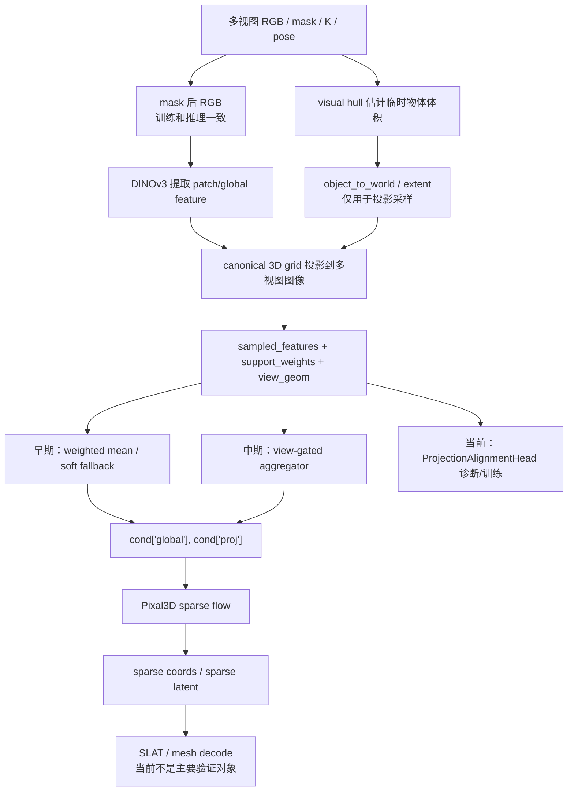
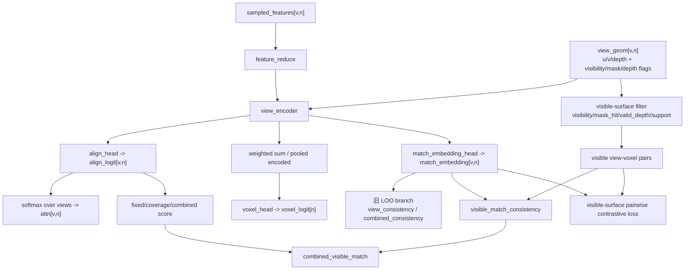

# 当前模型结构演变梳理

整理时间：`2026-06-15 UTC`  
项目目录：`/home/zjr/Tracker/pixal3d_multiview`  
主要依据：`pixal3d_multiview/outputs/五层测试流程报告/多视图稀疏结构五层测试报告.md`

## 0. 一页结论

当前这条线的目标是：输入真实世界多视图 `RGB + mask + camera pose`，先得到稳定的 canonical coarse sparse structure，再进入 Pixal3D/SLAT/mesh 解码，最终得到可给 CoarseModel 后续 `T_M2W / scale / pose / mesh refinement` 使用的粗 mesh。

当前尚未得到“可以直接接 sparse flow 并稳定提升 mesh”的最终 condition。模型结构已经从最开始的“把多视图特征平均投影进 Pixal3D sparse condition”，演化到现在的“先独立训练和诊断 2D-3D 对齐 head”。

这些结构修改的共同目的可以概括为一句话：

```text
让 cond["proj"] 从普通的多视角前景特征聚合，
变成对 image-pose wrong pairing 敏感的 2D-3D 条件。
```

实验结论也可以概括为一句话：

```text
cond["proj"] 层面的 adapter/head 已经能挖出一部分 pose-sensitive 信号，
但这个信号没有稳定传导到 sparse flow 的 coords 输出；
继续只在 cond["proj"] 上堆结构，边际收益已经很低。
```

核心原因是：直接训练 sparse flow 的 loss 会下降，但 sparse sampling 和 correct-vs-wrong pose 区分不稳定；独立 head 的 score 可以部分区分 wrong pairing，但接回 gate prior / sparse flow 后 sparse coords 没有稳定受益。这说明当前缺的不是又一个 MLP，而是更真实、更硬的 2D-3D surface correspondence 监督。

当前最重要的结构判断：

- `empty_policy=soft` 和 `global_fusion=mean` 是 Pixal3D 接口分布修正，应该保留作为基础经验。
- `view_gated_aggregator` 证明了多视角投影特征中有弱 pose 信号，但还不足以直接解决 sparse 生成。
- canonical `xyz` 容易让模型学到 shape/location shortcut，不应作为主要几何输入来证明 2D-3D 对齐。
- `uv_depth_only` 是当前更干净的对照设置：只保留投影到图像后的 `u/v/depth`，避免 canonical `xyz` shortcut。
- `ProjectionAlignmentHead` 证明 `DINO sampled feature + projected u/v/depth` 有可学习的 image-pose correspondence 信号。
- `fixed target set + coverage penalty` 修复了 `noise / large_noise` 这类 easy wrong pose，但不能解决 `reverse / cyclic_shift`。
- `leave-one-out consistency` 和 `pairwise contrastive` 有方向性，但正样本定义仍有噪声：同一个 voxel 在不同 view 中不一定对应同一个真实可见表面点。
- 最新代码已经把旧 `combined_consistency` 和新 `combined_visible_match` 分开：旧 LOO consistency 只保留作对照，新分支只在 visible-surface voxel 上计算 match consistency。
- 原版 Pixal3D sparse-stage native condition 在当前 exact sparse IoU 指标下也只有约 `0.05` 量级；这说明 sparse IoU 是苛刻诊断指标，但不改变当前结论：多视图 adapter 的瓶颈在 pose-sensitive correspondence 仍不够强。

当前下一步不应继续长训 sparse flow，而应继续围绕 **visible-surface match score** 做阈值和 ranking 目标消融。只有当 `reverse / cyclic_shift / cross_sample` 都稳定超过 70% correct win，才建议把 alignment/match score 接回 sparse condition。

## 1. 当前最终目标

不要把当前工作理解成“估计真实世界中的物体到世界坐标变换”。当前生成模型不需要、也不应该提前求 `T_M2W`。

真实目标是：

```text
手机/AR 前端传回：
  多视图 RGB
  多视图 mask
  多视图相机内参 K
  多视图相机外参 c2w/w2c

生成模型输出：
  canonical coarse sparse structure
  coarse mesh

后续 CoarseModel：
  用 coarse mesh 做 T_M2W / scale / pose 估计
  继续优化 mesh 几何细节
```

所以当前 `pixal3d_multiview` 的重点是：相机位姿是否能帮助第一步 coarse sparse / coarse mesh 更稳定，而不是替代 CoarseModel 的后处理。

## 2. 当前主 Pipeline



`visual hull` 在这里不是最终世界坐标，也不是 `T_M2W`。它只是为了在不知道真实物体坐标系的情况下，用 `mask + camera pose` 临时估计一个物体大致体积，让 canonical grid 可以投影到各个视图里采样 DINO feature。

## 3. 结构演变总表

| 阶段 | 结构变化 | 训练对象 | 想解决的问题 | 主要结论 | 当前状态 |
|---|---|---|---|---|---|
| 0 | Pixal3D 原版单视图 sparse condition | 无 | 明确原版接口 | 原版 sparse flow 期望单视图 `global + proj` 分布 | 作为 base/reference |
| 1 | 多视图 projection adapter | sparse flow / adapter | 多视图 RGB+pose 输入 Pixal3D sparse stage | 大量 projected feature 为 0，分布严重偏离原版 | 已修正，不再用旧版 |
| 2 | `empty_policy=soft` | adapter 逻辑 | 去掉大量 zero projected feature | zero ratio 从约 90% 到 0，proj 分布更接近 native Pixal3D | 保留为基础修正 |
| 3 | `global_fusion=mean` | adapter 逻辑 | 修正多视角 global token 数量膨胀 | global token 从 `V*5` 回到 5，更接近 Pixal3D 原版 | 保留为接口修正经验 |
| 4 | `soft + mean` 继续训练 sparse flow | sparse flow LoRA/proj 等 | 看新 condition 是否能直接提升 sparse | fixed loss 可降，但 sparse sampling 不稳定，pose 区分弱 | 不再作为单独主线 |
| 5 | geometry-only / visual hull baseline | 无 | 验证 mask+pose 几何信号本身是否有效 | 能区分 identity/noise，但对 reverse/cyclic 不强 | 作为诊断，不直接当最终方法 |
| 6 | 显式 geometry feature 加到 `cond['proj']` | sparse flow | 把 support/visibility/geometry 显式输入 sparse flow | 输入分布健康，但对 hard wrong pose 仍弱 | 不作为当前第一优先级 |
| 7 | ViewGatedAggregator | 新增 aggregator | 学 per-view feature 权重，替代简单平均 | 有弱 pose 信号，但 sparse 质量不稳定 | 作为中期结构保留参考 |
| 8 | `no_xyz` / `uv_depth_only` aggregator | aggregator | 避免 canonical xyz shortcut | `uv_depth_only ~= no_xyz`，有效信号主要来自 DINO + projected u/v/depth | 后续 head 默认用 `uv_depth_only` |
| 9 | GeometryAdapter | geometry adapter | 更强显式几何注入 | 对 easy wrong pose 有效，但 reverse/cyclic 仍弱 | 暂停 |
| 10 | Wrong-pose ranking sparse 训练 | sparse/adapter | 让 wrong pose loss 变差 | 可能破坏 correct recall，且不是最直接的 condition 层约束 | 暂停 |
| 11 | PoseConsistencyHead + logit prior | consistency head | 在 view aggregation 前过滤不可信 view | 能分 identity/noise，但 reverse/cyclic 仍弱 | 作为诊断经验 |
| 12 | ProjectionAlignmentHead | 独立 head | 不接 sparse，先验证 2D-3D 对齐信号 | 证明有可学习 signal，但原始 scoring 对 noise 有 bug | 继续演化 |
| 13 | Fixed target + coverage penalty | ProjectionAlignmentHead | 修复 wrong pose 只保留少量高分 support 的问题 | 修复 noise/large_noise，reverse/cyclic 仍接近随机 | 当前重要 baseline |
| 14 | Leave-one-out consistency | ProjectionAlignmentHead | 增强跨视图 feature 一致性 | reverse/cyclic 小幅改善，但 correct consistency 本身没变好 | 不足 |
| 15 | Match embedding + pairwise contrastive | ProjectionAlignmentHead | 显式拉近 correct view pair、拉远 wrong pair | negative 被拉远，但 positive 也被拉远，说明正样本噪声大 | 已推进到 visible-surface 版本 |
| 16 | Visible-surface clean match | ProjectionAlignmentHead | 只在可见表面 voxel 上训练/评估 match 一致性 | cyclic 明显改善，但 reverse/cross_sample 仍不足，combined 分数会稀释 match 信号 | 当前最新结构 |

## 4. 阶段 0：Pixal3D 原版结构

Pixal3D 原版 sparse stage 是单视图条件。它的 sparse flow 主要接收：

```text
cond["global"]  # DINO cls/register tokens
cond["proj"]    # Pixal3D 原版 ProjGrid 生成的 image-to-3D projected feature
```

原版 `proj` 是在 Pixal3D 假设的 canonical 相机/物体设置下，由单张图像投影到 3D grid 上的 feature。当前多视图工作最大的问题是：我们的输入是多张真实/AR-like 图像和相机位姿，接口语义和原版单视图不一样。

因此前面大量实验不是为了“重新发明 Pixal3D”，而是为了让多视图 condition 尽量接近 sparse flow 能理解的输入，同时引入真实 pose 约束。

## 5. 阶段 1-3：先修 Pixal3D 接口分布

### 5.1 旧 multiview adapter 的问题

早期多视图 projection adapter 会把 canonical grid 点投到各个视图中，如果某个点在 mask/visibility 中没有支持，就直接产生 0 feature。结果是：

```text
multiview_proj_zero_ratio_mean ~= 0.9049
native_first_proj_vs_multiview_proj_cos_mean ~= 0.0865
```

这说明输入到 Pixal3D sparse flow 的 `proj` 分布严重偏离原版。原版模型很少看到一大片全 0 projected feature。

### 5.2 `empty_policy=soft`

修改后，在低 support 或无 support 的 grid 点上使用 soft fallback feature，而不是直接置零。

结果：

```text
zero ratio: 0.9049 -> 0.0000
native-vs-multiview proj cosine: 0.0865 -> 0.9210
```

这个修改是必要的，但不是充分的。它解决的是“输入分布太坏”，不是“pose 约束足够强”。

### 5.3 `global_fusion=mean`

早期多视角 global token 直接 concat：

```text
8 views * 5 global tokens = 40 tokens
```

这和 Pixal3D 原版的 5 个 global token 不一致。`global_fusion=mean` 把多视角 global token 按视角平均，回到接近原版的形状：

```text
[1, 5, C]
```

这个修改也是接口兼容性修正，不是几何约束本身。

## 6. 阶段 4：直接训练 sparse flow 的问题

用 `soft + mean` 从旧 e6 checkpoint 小学习率迁移，或者从 Pixal3D 原始 sparse flow 直接短训，都会出现类似现象：

- fixed loss 可以下降；
- 但是 sparse sampling 的 IoU/recall/precision 不稳定；
- correct pose 相比 wrong pose 没有稳定优势；
- reverse/cyclic 这类“相机集合仍合理、只是图像-相机顺序错”的负样本很难拉开。

这说明只看 flow matching MSE 不够。模型可能学会适配新的 condition 分布，但没有真正把 pose-sensitive 2D-3D correspondence 用起来。

因此后续方向从“继续长训 sparse flow”转为“先把 condition 层的 pose-sensitive 信号诊断清楚”。

## 7. 阶段 5-6：Visual hull / geometry-only 的作用和局限

geometry-only baseline 用 `mask + camera pose` 直接构造 visual hull 或 geometry support，测试它是否能接近 target sparse。

结论：

- correct 明显好于 identity/noise/large_noise；
- 但 correct 和 shuffle/reverse/cyclic 的差距不够强；
- 说明 silhouette 几何知道“相机是否大体围绕物体”，但不稳定知道“哪张图对应哪一个相机位姿”。

这解释了为什么 visual hull 或 geometry support 可以作为先验，但不能单独解决多视角重建的 2D-3D 对齐问题。

## 8. 阶段 7-8：ViewGatedAggregator

### 8.1 结构

`ViewGatedAggregator` 的输入来自多视图投影采样：

```text
sampled_features[v,n]  # 第 v 个 view 在第 n 个 grid/voxel 上采到的 DINO feature
support_weights[v,n]   # mask/visibility/support 权重
view_geom[v,n]         # 投影几何信息
```

它先把每个 view 的 feature 降维，再拼接几何信息，用 MLP 预测 per-view gate logit，最后对 view 做 softmax：

```text
gate_logits[v,n]
attn[v,n] = softmax_v(gate_logits[:,n])
aggregated[n] = sum_v attn[v,n] * feature[v,n]
```

### 8.2 full geometry 的问题

早期 `view_geom` 包含：

```text
visibility / mask / support / u / v / depth / x / y / z
```

后续 geometry split ablation 发现，`geometry_only` 的判别力大部分来自 canonical `xyz`，而不是来自真正的多视图投影对应。这很危险，因为模型可能学的是数据集中物体 canonical shape/location 的 shortcut。

### 8.3 `no_xyz` 和 `uv_depth_only`

后续把 aggregator 几何输入改成：

```text
no_xyz:        去掉 x/y/z
uv_depth_only: 只保留 projected u/v/depth
```

结果：

```text
uv_depth_only ~= no_xyz
```

说明去掉 canonical `xyz` 后没有明显退化。当前更干净的选择是 `uv_depth_only`，因为它更直接表达“这个 voxel 投影到这个 view 的图像位置和深度”，避免 canonical shortcut。

### 8.4 ViewGatedAggregator 的当前判断

它证明了多视图投影 feature 中存在弱 pose 信号，但还不足以让 sparse sampling 稳定变好。它更适合作为后续 alignment/match score 接入 sparse flow 的位置，而不是当前最终方案。

## 9. 阶段 9-11：GeometryAdapter / wrong-pose ranking / PoseConsistencyHead

### 9.1 GeometryAdapter

思路：把 geometry support 作为显式 condition 加到 sparse stage。

结果：对 identity/noise/large_noise 这类 easy wrong pose 有帮助，但 reverse/cyclic 仍弱。

原因：reverse/cyclic 的 mask support 和 visual hull coverage 往往仍然合理，仅靠几何 support 不足以判断图像-相机对应关系错了。

### 9.2 Wrong-pose ranking sparse 训练

思路：训练时构造 wrong pose，让模型在 wrong pose 下 loss 变差。

风险：ranking 过强可能让模型学会破坏 wrong pose condition，同时牺牲 correct sparse recall。并且 sparse flow MSE 不是最直接的 view correspondence 监督。

当前状态：不是第一优先级。

### 9.3 PoseConsistencyHead + logit prior

思路：训练一个 head 给每个 view/voxel 的一致性打分，然后接入 view gate：

```text
gate_logits_new = gate_logits_old + alpha * consistency_logits
```

结果：能区分 identity/noise，但 reverse/cyclic 仍弱。诊断表明 head 的 score 更像在检测 support/self-consistency，而不是稳定检测 target-aware image-pose correspondence。

当前状态：作为经验保留，不作为当前主线。

## 10. 阶段 12：ProjectionAlignmentHead

为避免 sparse flow 的复杂性干扰判断，后续单独训练 `ProjectionAlignmentHead`，不接 sparse flow，不生成 mesh。

### 10.1 输入

```text
sampled_features: [V, N, C]
support_weights:  [V, N]
view_geom:        [V, N, 11]
target_soft:      [N]
```

当前 `view_geom` 11 维语义：

| index | meaning |
|---:|---|
| 0 | `visibility_weight` |
| 1 | `mask_value` |
| 2 | `in_image` |
| 3 | `valid_depth` |
| 4 | `mask_hit` |
| 5 | `u_norm` |
| 6 | `v_norm` |
| 7 | `depth_norm` |
| 8 | `x` |
| 9 | `y` |
| 10 | `z` |

当前更干净的实验默认使用：

```text
geom_mode = uv_depth_only
```

即只显式使用 `u_norm / v_norm / depth_norm`。

### 10.2 输出

```text
align_logit[v,n]   # view-v 对 voxel-n 的 2D-3D 对齐可信度
attn[v,n]          # softmax_v(align_logit[:,n])
voxel_logit[n]     # voxel-n 是否接近 target sparse structure
```

后续 pairwise 实验又增加：

```text
match_embedding[v,n]
```

### 10.3 初版结果

初版 `ProjectionAlignmentHead` 证明：

```text
DINO sampled feature + projected u/v/depth
确实包含可学习的 target/non-target 和 correct-vs-wrong 信号。
```

初版 scoring 主要看 head 输出的 `align_logit[v,n]`，并用当前 pose 下的 support/attention 作为权重做平均：

```text
support_score =
  weighted_mean(align_logit[v,n],
                weight = target_soft[n] * support_weight[v,n])

attention_score =
  weighted_mean(align_logit[v,n],
                weight = target_soft[n] * attn[v,n])
```

这里的问题是：wrong pose 如果只在少量 target voxel 上有 support，但这些少量位置的 `align_logit` 很高，平均分仍然可能虚高。也就是说，初版 score 没有惩罚“很多 target voxel 在 wrong pose 下根本没有 support”。

但 scoring 有一个明显问题：wrong pose 如果只保留少量高分 support voxel，平均 score 会被虚高，导致 noise/large_noise 有时高于 correct。

## 11. 阶段 13：Fixed target set + coverage penalty

为修复初版 scoring 的问题，ranking 改成在同一组 target voxel 上比较，并对 unsupported wrong pose 给惩罚。

核心 score：

```text
fixed_align
coverage_penalized = fixed_align - coverage_weight * missing_target_support
combined = coverage_penalized + voxel_weight * voxel
```

主要结果：

```text
val AUC: 0.6880 -> 0.6975
val gap: 0.0361 -> 0.0488
noise / large_noise 不再高于 correct
```

但：

```text
reverse / cyclic_shift1 / cyclic_shift2 仍然接近随机
```

这说明 coverage penalty 是必要的，但它解决的是 easy wrong pose，不解决真实困难的图像-相机错配。

## 12. 阶段 14：Leave-one-out view consistency

思路：如果 pose 正确，同一个 target voxel 在多个 view 采到的 feature 应该更一致。

使用：

```text
view_consistency[n] =
  sim(feature[v,n], mean(feature[other views,n]))

combined_consistency =
  combined + consistency_weight * view_consistency
```

结果：

```text
reverse win rate: 53.9% -> 60.9%
cyclic_shift1:    45.3% -> 52.3%
cyclic_shift2:    46.1% -> 49.2%
```

这是正向但很弱。训练日志显示 correct view consistency 本身没有变好，wrong consistency 也同步下降。所以它更像在做相对拉开，而没有学到稳定的 correct-view agreement。

## 13. 阶段 15：Match embedding + pairwise contrastive

为避免直接用 `encoded` 做 cosine，新增独立的：

```text
match_embedding_head
```

训练目标：

```text
positive:
  correct pose 下同一 target voxel 的不同 view embedding

negative:
  reverse / cyclic_shift / cross_sample 下同一 voxel 的 wrong view embedding
```

目标是：

```text
sim(correct_view_i, correct_view_j)
>
sim(correct_view_i, wrong_view_j)
```

结果：

```text
match_contrastive_loss: 1.0715 -> 0.9725
match_neg_sim:          0.9042 -> 0.8298
match_pos_sim:          0.9216 -> 0.8772
```

解释：

- negative 确实被拉远了；
- 但 positive 也被拉远了；
- 说明当前 positive pair 定义有噪声。

最可能原因：

```text
同一个 voxel 在不同 view 中，不一定对应同一个真实可见表面点。
```

例如：

- voxel 可能在物体内部；
- voxel 可能在背面；
- 投影落在 mask 内，但采样到的是前表面 feature；
- 不同 view 的同一 voxel 可能对应不同遮挡状态。

因此当前 `target_soft == 1 && support_views >= 3` 不足以定义可靠 positive pair。

## 14. 阶段 16：Visible-surface clean match

本阶段根据上一轮 pairwise 的问题，把 positive pair 从“所有 target voxel”进一步收窄到“可见表面 voxel”。

### 14.1 代码结构变化

新增/明确了三个东西：

```text
match_visible_view_mask
visible_surface_match_consistency_score
combined_visible_match
```

它们和旧 LOO consistency 是分开的：

```text
旧分支：
  view_consistency
  combined_consistency = combined + rank_consistency_score_weight * view_consistency

新分支：
  visible_match_consistency
  combined_visible_match = combined + rank_match_score_weight * visible_match_consistency
```

这次训练时关闭旧 LOO 目标：

```text
rank_score_type = combined
rank_consistency_score_weight = 0
consistency_rank_loss_weight = 0
consistency_positive_loss_weight = 0
match_contrastive_loss_weight = 0.5
match_visible_surface_only = 1
```

因此本阶段不会被旧 `combined_consistency` 拉回旧目标。

### 14.2 Visible-surface 筛选条件

普通 pairwise 只要求：

```text
target_soft >= threshold
support_views >= match_min_views
```

visible-surface 版本进一步要求每个 view-voxel pair 满足：

```text
support_weight >= match_min_support_weight
visibility_weight >= match_visibility_threshold
mask_value >= match_mask_value_threshold
mask_hit >= match_mask_hit_threshold
valid_depth == 1
```

这些字段来自 `view_geom`：

```text
0 visibility_weight
1 mask_value
3 valid_depth
4 mask_hit
```

当前实验参数：

```text
match_visibility_threshold = 0.3
match_min_support_weight = 0.05
match_min_views = 3
```

### 14.3 最新结果

运行目录：

```text
/home/zjr/Tracker/pixal3d_multiview/outputs/train_v9/projection_alignment_heads/projection_alignment_visible_surface_clean_from_fixed_001
```

Target/non-target：

| run | val AUC | val AP | target score | non-target score | gap |
|---|---:|---:|---:|---:|---:|
| fixedtarget_coverage_001 | 0.6975 | 0.7675 | 0.3594 | 0.3106 | 0.0488 |
| pairwise_match_from_fixed_001 | 0.6931 | 0.7655 | 0.4396 | 0.3725 | 0.0671 |
| visible_surface_clean_from_fixed_001 | 0.6938 | 0.7658 | 0.4408 | 0.3730 | 0.0678 |

Visible-surface match 训练统计：

| window | candidate voxels | visible voxels | visible views | pos sim | neg sim | match loss |
|---|---:|---:|---:|---:|---:|---:|
| first_128 | 34.0 | 24.8 | 3.68 | 0.9254 | 0.9080 | 1.0172 |
| last_128 | 33.5 | 24.5 | 3.69 | 0.8767 | 0.8260 | 0.9033 |

Correct-vs-wrong 核心结果：

| wrong pose | visible_match win | combined_visible win |
|---|---:|---:|
| reverse | 60.9% | 61.7% |
| cyclic_shift1 | 71.9% | 64.8% |
| cyclic_shift2 | 65.6% | 60.2% |
| cross_sample | 58.6% | 57.8% |
| identity | 89.1% | 100.0% |
| noise | 92.2% | 88.3% |
| large_noise | 99.2% | 95.3% |

### 14.4 当前判断

这一步确认了：

```text
visible-surface match score 比旧 LOO consistency 更适合处理 cyclic 类 image-pose mismatch。
```

尤其是：

```text
cyclic_shift1: 71.9%
cyclic_shift2: 65.6%
```

但还没有完全达标：

```text
reverse:      60.9%
cross_sample: 58.6%
```

同时 `combined_visible_match` 没有超过 `visible_match_consistency`，说明当前 `combined` 部分会稀释 visible match 信号。后续更应该单独优化 visible match score，而不是过早混入 combined。

## 15. 当前保留的结构和默认理解

### 15.1 保留

| 项 | 保留原因 |
|---|---|
| mask 后 RGB 输入 | 训练/推理一致，符合真实 AR 输入 |
| visual hull/object volume estimate | 用于临时投影体积估计，不是最终 `T_M2W` |
| DINOv3 sampled features | 当前最有用的图像语义来源 |
| projected `u/v/depth` | 比 canonical xyz 更干净，表达 pose-conditioned projection |
| `empty_policy=soft` | 避免 projected feature 大面积全 0 |
| fixed target set scoring | 保证 correct/wrong 在同一 target voxel 集合上比较 |
| coverage penalty | 对 unsupported wrong pose 给负证据 |
| ProjectionAlignmentHead | 当前最清楚的 2D-3D correspondence 诊断平台 |
| visible-surface match branch | 当前最有希望增强 cyclic/reverse image-pose correspondence 的分支 |

### 15.2 暂不作为主线

| 项 | 原因 |
|---|---|
| 只继续长训 sparse flow | fixed loss 降低不等于 sparse/mesh 变好 |
| 只调 `soft/mean/lr/step` | 已验证不能解决 pose-sensitive 约束 |
| 直接 visual hull hard filter | precision 可升，但 recall/IoU 损伤大 |
| canonical `xyz` 作为强输入 | 容易学 canonical shape prior shortcut |
| 加大 coverage penalty | 只会更强地区分 easy wrong pose，不解决 reverse/cyclic |
| 直接接当前 pairwise head 到 sparse flow | visible match 有进展，但 reverse/cross_sample 仍未达标 |

## 16. 当前最新模型结构状态

当前最新主线不是一个已经接入 sparse flow 的最终模型，而是一个独立诊断/训练模块：

```text
ProjectionAlignmentHead
```

它位于 sparse flow 之前，用于判断多视图投影条件是否具备足够 2D-3D 对齐信号。

当前结构可以理解为：



当前它还没有作为最终 gate 接入 sparse flow。理论上的接入位置是 `ViewGatedAggregator` 的 gate logits：

```text
gate_logits_new = gate_logits_old + alpha * alignment_or_match_logits
```

但只有当 visible-surface match 在 `reverse / cyclic / cross_sample` 上稳定超过 70% 后，才建议这么做。

## 17. 当前最好不要混淆的几个概念

### 17.1 fixed loss

`fixed loss` 是固定 `t/noise/sample` 后比较 checkpoint 和 base sparse flow 的 flow-matching MSE。它只能说明 denoising 目标是否更接近 target latent，不能直接说明 sparse coords 或 mesh 一定更好。

### 17.2 sparse sampling

`sparse sampling` 是真正从 sparse flow 采样 sparse coords，再和 target coords 比较 IoU/recall/precision。它比 fixed loss 更接近实际生成结果，但仍然只是 sparse stage，不是最终 mesh。

### 17.3 visual hull

当前 visual hull 是内部几何先验，用来估计物体大致体积和投影 support。它不是最终 mesh，也不是 `T_M2W`。

### 17.4 reverse / cyclic 比 identity/noise 更重要

`identity/noise/large_noise` 通常会明显破坏相机集合或 support，比较容易区分。

`reverse/cyclic_shift` 更接近真实难点：相机轨迹仍然合理，mask support 也可能合理，但图像和相机位姿的对应关系错了。因此后续评估不能只看 identity/noise。

## 18. 下一步建议结构

当前已经实现第一版 **visible-surface consistency filter**。下一步不是重新回到 sparse flow，而是继续做 visible match 的 score/loss 消融。

旧 pairwise positive 太宽：

```text
target_soft == 1
support_views >= 3
```

当前已改为：

```text
target_soft == 1
visibility_weight >= threshold
mask_hit == 1
valid_depth == 1
depth 与 front-depth map 一致
至少 3 个 view 真正看到该 surface 附近
```

训练/诊断已新增统计：

```text
match_candidate_voxels
match_visible_voxels
avg_visible_views
positive_pair_count
negative_pair_count
pos_sim
neg_sim
```

下一步建议：

```text
1. 训练时尝试 rank_score_type = combined_visible_match
2. old LOO consistency 继续关闭
3. 调 match_visibility_threshold / match_min_support_weight
4. 优先看 visible_match_consistency，不要只看 combined
```

判断是否进入 sparse flow 阶段的门槛：

```text
pos_sim 不再随训练下降，最好上升；
neg_sim 继续下降；
reverse/cyclic correct win rate 明显高于 70%；
target/non-target AUC 稳定超过 0.70；
coverage 相关 easy wrong pose 继续保持可分。
```

只有满足这些条件，才建议把 visible match score 接回 `ViewGatedAggregator` 或 sparse condition 中继续训练 sparse flow。

## 19. 当前读代码时的推荐入口

| 目的 | 文件 |
|---|---|
| 多视图推理主入口 | `pixal3d_multiview/run_multiview.py` |
| 多视图 Pixal3D pipeline | `pixal3d_multiview/pipeline.py` |
| 投影、visual hull、visibility | `pixal3d_multiview/multiview_projection.py` |
| sparse condition / projection adapter | `pixal3d_multiview/sparse_condition.py` |
| view-gated aggregator | `pixal3d_multiview/view_aggregator.py` |
| sparse flow 训练 | `pixal3d_multiview/train_sparse_multiview.py` |
| ProjectionAlignmentHead 结构 | `pixal3d_multiview/projection_alignment_head.py` |
| ProjectionAlignmentHead 训练 | `pixal3d_multiview/train_projection_alignment_head.py` |
| projection alignment 一键训练评估 | `pixal3d_multiview/scripts/run_projection_alignment_head_train_eval.sh` |
| 五层测试主报告 | `pixal3d_multiview/outputs/五层测试流程报告/多视图稀疏结构五层测试报告.md` |

## 20. 为什么继续只调 `cond["proj"]` 结构收益低：按修改轮次的完整证据链

本节专门回答当前最重要的问题：

```text
为什么说只在 cond["proj"] 层面继续加 adapter/head，边际收益已经很低？
```

先明确 sparse flow 看到的东西。训练时 sparse flow 不直接看到相机位姿，也不直接看到 visual hull。它看到的是：

```text
x_t:    noisy sparse latent
t:      diffusion/flow 时间
cond:
  global: DINO global tokens
  proj:   每个 3D grid/voxel 的 projected image feature
```

所以我们所有 adapter/head 的核心目标都是改造：

```text
RGB + mask + pose
  -> visual hull / projection / support / DINO sampled feature
  -> cond["proj"]
  -> sparse flow
```

如果这个方向有效，应该能看到一条稳定链路：

```text
wrong pairing 让 cond["proj"] 明显变坏
-> sparse flow fixed loss 明显变差
-> sparse sampling 中 correct IoU/recall 稳定高于 wrong pose
-> correct rank / win rate 在 reverse/cyclic/cross_sample 上稳定提升
```

实际实验多次断在后两步：`cond/head score` 有时变好，但 sparse coords 没有稳定变好。

### 20.1 修改 1：原始 multiview projection adapter

**结构目的**

最初目标是把多视图 `RGB + mask + pose` 接到 Pixal3D sparse stage：

```text
多视图 DINO patch feature
+ 相机投影
+ mask/support
-> z_proj / cond["proj"]
```

也就是把 Pixal3D 原版单视图 `proj` 条件替换成多视图投影条件。

**实验结果**

早期诊断发现 `cond["proj"]` 分布严重偏离 Pixal3D native sparse condition：

```text
multiview_proj_zero_ratio_mean ~= 0.9049
native_first_proj_vs_multiview_proj_cos_mean ~= 0.0865
```

**结论**

这个版本不是 pose 约束强弱的问题，而是输入分布已经坏了。大量 voxel 是全 0 projected feature，sparse flow 很难按 Pixal3D 原本方式使用条件。

### 20.2 修改 2：`empty_policy=soft`

**结构目的**

避免没有 support 的 voxel 直接变成全 0 feature，让 `cond["proj"]` 更接近 Pixal3D 原生 projected feature 分布。

**实验结果**

```text
zero ratio: 0.9049 -> 0.0000
native-vs-multiview proj cosine: 0.0865 -> 0.9210
```

**结论**

这是必要修复。它证明之前 adapter 的输入分布确实不健康。

但它没有证明 pose 约束变强。`soft fallback` 也会引入一个副作用：很多 voxel 虽然不再为 0，但 feature 来自 fallback/soft aggregation，不一定来自真实可见 surface，因此 pose 错配信号会被稀释。

### 20.3 修改 3：`global_fusion=mean`

**结构目的**

早期多视角 global token 是 concat：

```text
8 views * 5 tokens = 40 global tokens
```

Pixal3D 原版 sparse flow 习惯的是约 5 个 global tokens。`global_fusion=mean` 把它恢复成：

```text
[1, 5, C]
```

**实验结果**

global token 形状回到接近 Pixal3D native 分布。小样本 sparse sampling 偶尔显示 `mean + soft` 比旧 `concat + zero` 更合理。

**结论**

这也是接口兼容性修复。它能让 sparse flow 更容易接收多视角条件，但仍不是强几何约束。后续 fixed loss 仍显示 `correct / shuffle / identity` 拉不开。

### 20.4 修改 4：`soft + mean` 继续训练 sparse flow

**结构目的**

修复输入分布后，继续训练 sparse flow 或 proj 相关层，看模型是否能自动学会使用更健康的多视角 pose condition。

**实验结果**

fixed loss 可以下降，但 pose sensitivity 没有同步增强。典型 fixed loss 消融：

| 配置 | checkpoint loss mean | 相对 correct |
|---|---:|---:|
| correct | 0.210774 | 0.0000 |
| shuffle_pose | 0.210814 | +0.0002 |
| identity_pose | 0.209395 | -0.0065 |
| no_auto_volume | 0.212991 | +0.0105 |
| no_visibility_depth | 0.213996 | +0.0153 |

**结论**

如果 `cond["proj"]` 已经成为强 image-pose 条件，wrong pose 的 denoising loss 应该明显更差。但这里 `shuffle` 几乎不变，`identity` 甚至略低。因此 fixed loss 下降只能说明模型更会 denoise，不说明模型更依赖正确 pose。

### 20.5 修改 5：geometry-only / visual hull baseline

**结构目的**

在不接 DINO、不接 sparse flow 的情况下，单独测试 `mask + pose` 的几何约束能否接近 target sparse coords。

**实验结果**

| pose | topk_score IoU | vh_volume IoU | vh_surface IoU |
|---|---:|---:|---:|
| correct | 0.0843 | 0.0896 | 0.0386 |
| shuffle | 0.0786 | 0.0843 | 0.0428 |
| reverse | 0.0685 | 0.0700 | 0.0356 |
| noise | 0.0429 | 0.0363 | 0.0209 |
| identity | 0.0260 | 0.0167 | 0.0096 |

排序基本是：

```text
correct ~= shuffle > reverse > noise > identity / large_noise
```

**结论**

visual hull / support 能排斥明显错误的相机集合，但对同一轨迹内的 `shuffle / reverse / cyclic` 很弱。原因是这些 wrong pose 仍然来自同一个物体、同一圈相机轨迹，silhouette carve 出来的空间仍可能合理。

这说明后面即使把 geometry feature 加进 `cond["proj"]`，也很难只靠 silhouette/support 解决 image-pose pairing。

### 20.6 修改 6：显式 geometry feature 加到 `cond["proj"]`

**结构目的**

把 support/visibility/u/v/depth/xyz 等几何信息显式注入 `cond["proj"]`，让 sparse flow 不只看到 DINO feature，也看到投影几何。

**实验结果**

输入分布和 geometry support 统计更健康，对 `identity/noise/large_noise` 这类 easy wrong pose 有帮助。但 `reverse/cyclic` 仍然接近 correct。

**结论**

geometry feature 能告诉模型“这个 voxel 是否大体被 mask/visibility 支持”，但不能可靠告诉模型“这个 view 的这个像素是否真的对应同一个 3D surface point”。所以它是有用的辅助信息，不是充分的 pose-sensitive correspondence。

### 20.7 修改 7：`ViewGatedAggregator`

**结构目的**

原始多视图聚合是 support-weighted mean，不能学习“哪个 view 更可信”。`ViewGatedAggregator` 改为每个 voxel 对多视角做 learned softmax：

```text
sampled_features[v,n] + view_geom[v,n]
-> gate_logits[v,n]
-> attn[v,n] = softmax_v(gate_logits[:,n])
-> aggregated feature[n]
-> cond["proj"][n]
```

**实验结果**

它确实提升了 sparse sampling：

```text
base correct IoU 约 0.0094
view_gated correct IoU 约 0.0369 / 0.0405 量级
```

但同条件 wrong-pose sweep 不稳定：

| pose mode | IoU mean | recall mean | precision mean |
|---|---:|---:|---:|
| correct | 0.036889 | 0.065529 | 0.124711 |
| shuffle | 0.030310 | 0.046423 | 0.126284 |
| noise | 0.027560 | 0.039189 | 0.111859 |

逐样本看：

| 对比 | 指标 | mean delta | median delta | correct 胜出 |
|---|---|---:|---:|---:|
| correct vs shuffle | IoU | +0.006579 | -0.004015 | 1 / 9 |
| correct vs shuffle | recall | +0.019106 | -0.006984 | 2 / 9 |

**结论**

`ViewGatedAggregator` 学到了更好的多视角聚合，因此 sparse 质量能上升；但它没有稳定学到“正确 image-pose pairing 才应更好”。均值改善被少数样本拉动，不能证明 pose sensitivity 已经可靠。

### 20.8 修改 8：`no_xyz` / `uv_depth_only`

**结构目的**

检查 `ViewGatedAggregator` 是否依赖 canonical `x/y/z` shortcut。把 `view_geom` 从 full geometry 改成：

```text
no_xyz:        visibility/mask/support/u/v/depth
uv_depth_only: 只保留 u/v/depth
```

**实验结果**

64 个 val 样本 strong pose sweep：

| model | correct IoU | reverse IoU | cyclic1 IoU | cyclic2 IoU | correct IoU top1 |
|---|---:|---:|---:|---:|---:|
| no_xyz | 0.028804 | 0.026265 | 0.026894 | 0.026669 | 26 / 64 |
| uv_depth_only | 0.028634 | 0.026223 | 0.026856 | 0.026892 | 26 / 64 |

**结论**

`uv_depth_only ~= no_xyz`。说明有效信号主要来自 DINO sampled feature 和 projected `u/v/depth`，不是 canonical `xyz`。但也说明继续在 `xyz/no_xyz/uv_depth/support` 通道上调结构，已经很难产生质变。

### 20.9 修改 9：从 `view_gated_agg_s1200/step_900` 继续训练 sparse flow proj 层

**结构目的**

在已经较好的 view-gated checkpoint 上，小学习率继续训练 sparse flow 的 `proj` 相关层，看能否把 aggregator 学到的 pose signal 传给 sparse flow 主干。

**实验结果**

non-frozen 分支 fixed loss 下降，但 sparse 质量没有超过旧 best：

```text
旧 view_gated_agg_s1200/step_900 correct IoU    = 0.030658
本分支 final correct IoU                       = 0.028571

旧 step_900 correct - reverse IoU               = +0.003584
本分支 final correct - reverse IoU              = +0.001633
```

freeze aggregator 分支也类似：fixed loss 继续下降，但 sparse sampling 没超过旧 best。

**结论**

继续训练 sparse flow/proj 层更容易优化 denoising MSE，而不是稳定强化 pose-sensitive correspondence。甚至可能冲淡已有 aggregator 的弱 pose signal。

### 20.10 修改 10：`GeometryAdapter`

**结构目的**

比直接拼 geometry feature 更强：用 MLP 把 geometry/support 信息转成对 `cond["proj"]` 的 residual/adaptation。

**实验结果**

某些 checkpoint 成为 sparse best，说明显式 geometry 对 sparse density 有帮助。但 pose rank 仍不稳定，`correct - reverse` 可很小甚至为负。

**结论**

`GeometryAdapter` 可以改善“哪里像物体”的 sparse density，但不能稳定判断“图像和相机是否正确配对”。它仍然主要利用 support/visibility 这类 soft geometry。

### 20.11 修改 11：wrong-pose ranking 直接训练 sparse flow

**结构目的**

训练时同时构造 correct/wrong pose condition，要求 wrong pose 下 sparse flow loss 更差：

```text
loss = correct_mse + weight * relu(correct_mse + margin - wrong_mse)
```

**实验结果**

ranking 过强会有风险：可能强行破坏 wrong pose condition，同时牺牲 correct recall。实际结果没有稳定带来 sparse pose rank 改善。

**结论**

让 sparse flow 的 MSE 对 wrong pose 变差，不是最直接的 2D-3D 对齐监督。当前 sparse flow 主干有强 shape prior，wrong pose 的 MSE 未必会自然高很多。

### 20.12 修改 12：`PoseConsistencyHead` + gate-logit prior

**结构目的**

在 view aggregation 前训练一个 consistency head，输出每个 view/voxel 的可信度，然后修改 gate：

```text
gate_logits_new = gate_logits_old + alpha * consistency_logits
```

**实验结果**

它能区分 `identity/noise`，但 `reverse/cyclic` 仍弱。诊断显示 head score 更像在判断 sampled feature/support 是否自洽，而不是稳定判断 target-aware image-pose correspondence。

**结论**

这个方向证明“在 gate 前过滤 view”是合理接口，但旧 consistency 信号不够强，接回 sparse 也没有稳定收益。

### 20.13 修改 13：`ProjectionAlignmentHead`

**结构目的**

为了不被 sparse flow 主干干扰，单独训练一个 head 来判断 view-voxel 2D-3D 对齐，不直接生成 sparse coords：

```text
sampled_features[v,n]
+ view_geom[v,n]
-> align_logit[v,n]
-> attn[v,n]
-> voxel_logit[n]
```

**实验结果**

初版证明 `DINO sampled feature + u/v/depth` 有可学习 signal。但 scoring 有 bug/缺陷：wrong pose 如果只保留少量高分 support voxel，平均 score 会虚高，导致 `noise/large_noise` 有时异常高。

**结论**

投影 feature 里确实有 pose-sensitive 信息，但初版 score 不够严谨，必须固定比较 target voxel 集合并惩罚 coverage。

### 20.14 修改 14：fixed target set + coverage penalty

**结构目的**

让 correct/wrong 在同一组 target voxel 上比较，并对 wrong pose 缺少 support 的 target voxel 给惩罚：

```text
combined = fixed_align - coverage_weight * missing_support + voxel_weight * voxel_score
```

**实验结果**

```text
val AUC: 0.6880 -> 0.6975
gap:     0.0361 -> 0.0488
noise / large_noise 不再高于 correct
```

但 hard wrong pose 仍弱：

```text
reverse / cyclic_shift1 / cyclic_shift2 接近随机
```

**结论**

coverage penalty 修复的是 easy wrong pose；`reverse/cyclic` 的 support 仍可能合理，因此必须引入真正的跨视图 feature correspondence。

### 20.15 修改 15：leave-one-out view consistency

**结构目的**

如果 pose 正确，同一个 target voxel 在不同 view 的 feature 应更一致：

```text
sim(feature[v,n], mean(feature[other views,n]))
```

**实验结果**

| wrong pose | fixed/coverage combined | view consistency combined |
|---|---:|---:|
| reverse | 53.9% | 60.9% |
| cyclic_shift1 | 45.3% | 52.3% |
| cyclic_shift2 | 46.1% | 49.2% |

**结论**

方向是对的，但提升很弱。原因是同一个 voxel 在多视图里不一定对应同一个真实可见表面点，feature consistency 的 positive label 有噪声。

### 20.16 修改 16：match embedding + pairwise contrastive

**结构目的**

新增 `match_embedding_head`，显式训练：

```text
correct view pairs 更近
wrong reverse/cyclic/cross_sample pairs 更远
```

**实验结果**

```text
match_contrastive_loss: 1.0715 -> 0.9725
match_neg_sim:          0.9042 -> 0.8298
match_pos_sim:          0.9216 -> 0.8772
```

**结论**

negative 被拉远了，但 positive 也被拉远了。这是关键证据：当前 positive pair 定义不干净。仅凭 `target voxel + support views`，不能保证不同 view 采到的是同一个真实 surface point。

### 20.17 修改 17：visible-surface clean match

**结构目的**

把 pairwise positive 收窄到更可信的 visible-surface view-voxel pair：

```text
target_soft == 1
support_weight >= threshold
visibility_weight >= threshold
mask_hit == 1
valid_depth == 1
至少 3 个 view 可见
```

**实验结果**

| wrong pose | visible_match win | combined_visible win |
|---|---:|---:|
| reverse | 60.9% | 61.7% |
| cyclic_shift1 | 71.9% | 64.8% |
| cyclic_shift2 | 65.6% | 60.2% |
| cross_sample | 58.6% | 57.8% |
| identity | 89.1% | 100.0% |
| noise | 92.2% | 88.3% |
| large_noise | 99.2% | 95.3% |

**结论**

这是目前最有希望的 signal。它让 `cyclic_shift1` 首次达到 70% 以上。但 `reverse/cross_sample` 仍不足，`combined_visible_match` 还会稀释 visible match 信号。因此它证明“信号存在”，但还没达到可接入 sparse flow 的稳定程度。

### 20.18 修改 18：direct visible match-logit / match-attention / gate prior

**结构目的**

把 visible match 从“派生 consistency score”改成直接输出 per-view/per-voxel `match_logit`，并尝试：

```text
visible_match_logit 训练
match_attention loss
gate_logits_new = gate_logits_old + alpha * visible_match_logits
temperature / centering / alpha sweep
```

**实验结果**

direct visible match-logit 有信号：

| wrong pose | visible_match_consistency win | visible_match_logit win |
|---|---:|---:|
| reverse | 60%-62% 量级 | 60%-62% 量级 |
| cyclic_shift1 | 71%-73% 量级 | 70%-72% 量级 |
| cyclic_shift2 | 64%-66% 量级 | 64% 左右 |

但 gate prior 测试中，`alpha > 0` 没有稳定改善 reverse/cyclic/cross_sample，match-attn 训练后真正用于 gate prior 的 visible_match_logit 反而略降。

**结论**

这是“边际收益低”的直接证据：head 能在自己的 score 层面识别一部分 wrong pairing，但这个 score 作为 gate-logit prior 接回 `cond["proj"]` 后，不能稳定改善 sparse coords 或 pose rank。

### 20.19 补充对照：native Pixal3D sparse-stage 量级

**结构目的**

测试原版 Pixal3D sparse-stage native condition 在当前 exact sparse coords IoU 指标下是什么水平，避免把低 IoU 全归因于 multiview adapter。

**实验结果**

tiny 对照：

| family | condition | IoU | recall | precision | pred unique |
|---|---|---:|---:|---:|---:|
| native_pixal3d | native_crop_mask_f0_default | 0.050772 | 0.086672 | 0.121985 | 10616.0 |
| native_pixal3d | distance_near | 0.053697 | 0.096292 | 0.130553 | 10901.5 |
| native_pixal3d | distance_far | 0.048655 | 0.085560 | 0.162050 | 8312.5 |
| multiview_base | correct | 0.004506 | 0.004566 | 0.266971 | 250.0 |

**结论**

原版 sparse-stage 在当前 exact target coords IoU 下也只有约 `0.05` 量级，说明这个指标很苛刻；但 multiview base 不训练时更差，说明 adapter 仍是瓶颈。这个对照支持两点：

1. 不应把 `0.03-0.05` 的 sparse IoU 直接等同于最终 mesh 视觉质量；
2. 但 correct-vs-wrong pose 的稳定 rank 仍然必须改善，否则多视角 pose 条件没有被可靠使用。

### 20.20 总结：为什么边际收益已经低

把所有轮次放在一起看，结论很清楚：

| 修改类型 | 已验证收益 | 没解决的问题 |
|---|---|---|
| `soft/mean` 接口修正 | 修复 Pixal3D 输入分布 | 不形成强 pose 约束 |
| 继续训练 sparse flow | fixed loss 可下降 | sparse coords / pose rank 不稳定 |
| visual hull / geometry feature | 排斥 identity/noise | reverse/cyclic/shuffle 仍弱 |
| view-gated aggregator | sparse IoU 明显高于 base | correct-vs-shuffle/reverse 不稳定 |
| `no_xyz/uv_depth_only` | 去掉 canonical shortcut 后仍有信号 | 和 reverse/cyclic 差距仍小 |
| geometry adapter | correct sparse 局部改善 | pose rank 仍不稳 |
| sparse wrong-pose ranking | 方向合理 | 容易伤 recall，非直接 correspondence 监督 |
| consistency/match heads | score 层面有 pose-sensitive signal | 接回 gate/sparse 后收益不稳定 |
| visible-surface match | 当前最强 cyclic signal | reverse/cross_sample 仍不足，不能直接接 sparse |

因此当前不是“adapter/head 完全没用”，而是：

```text
adapter/head 已经把 cond["proj"] 里能挖出的软 pose signal 挖出了一部分；
但这个 signal 不够硬、不够密、不够 surface-aware；
sparse flow 仍可以依赖形状先验和前景语义，忽略或弱化 wrong pairing 的细节。
```

下一步如果继续做结构，应该建立在更强监督上，而不是继续叠 MLP：

```text
1. 数据构建阶段保存真实 render depth / normal / visible surface id；
2. 用真实可见表面点构造 view-level 2D-3D correspondence label；
3. 训练 alignment/match head 时用真实 surface correspondence，而不是 visual-hull support 近似；
4. 再把可靠 score 接回 ViewGatedAggregator 或 sparse flow；
5. 最后才评估 coarse mesh 和后续 CoarseModel。
```

## 21. 当前状态一句话

当前不是“已经训练出好 mesh 的阶段”，而是已经把问题定位到：

```text
已经初步构建 visible-surface 2D-3D correspondence 分支，
但 reverse/cross_sample 仍未达标，还不能接 sparse flow。
```

在这个信号验证通过前，继续调 sparse flow 学习率、训练步数或直接接 mesh 解码，收益都不稳定。
